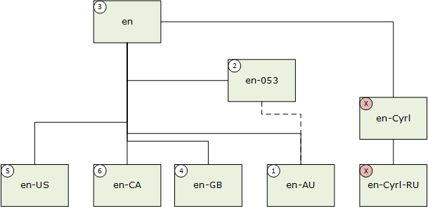

---

Description: The previous topic (How the Resource Management System matches and chooses resources) looks at qualifier-matching in general. This topic focuses on language-tag-matching in more detail.
title: How the Resource Management System matches language tags
template: detail.hbs
ms.date: 11/02/2017
ms.topic: article
keywords: windows 10, uwp, resource, image, asset, MRT, qualifier
ms.localizationpriority: medium
---

# How the Resource Management System matches language tags

The previous topic ([How the Resource Management System matches and chooses resources](how-rms-matches-and-chooses-resources.md)) looks at qualifier-matching in general. This topic focuses on language-tag-matching in more detail.

## Introduction

Resources with language tag qualifiers are compared and scored based on the app runtime language list. For definitions of the different language lists, see [Understand user profile languages and app manifest languages](../design/globalizing/manage-language-and-region.md). Matching for the first language in a list occurs before matching of the second language in a list, even for other regional variants. For example, a resource for en-GB is chosen over an fr-CA resource if the app runtime language is en-US. Only if there are no resources for a form of en is a resource for fr-CA chosen (note that the app's default language could not be set to any form of en in that case).

The scoring mechanism uses data that is included in the [BCP-47](https://tools.ietf.org/html/bcp47) subtag registry, and other data sources. It allows for a scoring gradient with different qualities of match and, when multiple candidates are available, it selects the candidate with the best-matching score.

So, you can tag language content in generic terms, but you can still specify specific content when needed. For example, your app might have many English strings that are common to both the United States, Britain, and other regions. Tagging these strings as "en" (English) saves space and localization overhead. When distinctions need to be made, such as in a string containing the word "color/colour", the United States and British versions can be tagged separately using both language and region subtags, as "en-US" and "en-GB", respectively.

## Language tags

Languages are identified using normalized, well-formed BCP-47 language tags. Subtag components are defined in the BCP-47 subtag registry. The normal structure for a BCP-47 language tag consists of one or more of the following subtag elements.

- Language subtag (required).
- Script subtag (which may be inferred using the default specified in the subtag registry).
- Region subtag (optional).
- Variant subtag (optional).

Additional subtag elements may be present, but they will have a negligible effect on language matching. There are no language ranges defined using the wild card ("*"), for example, "en-*".

## Matching two languages

Whenever Windows compares two languages it is typically done within the context of a larger process. It may be in the context of assessing multiple languages, such as when Windows generates the application language list (see [Understand user profile languages and app manifest languages](../design/globalizing/manage-language-and-region.md)). Windows does this by matching multiple languages from the user preferences to the languages specified in the app's manifest. The comparison might also be in the context of assessing language along with other qualifiers for a particular resource. One example is when Windows resolves a particular file resource to a particular resource context; with the user's home location or the device's current scale or dpi as other factors (besides language) that are factored into the resource selection.

When two language tags are compared, the comparison is assigned a score based on the nearness of the match.

| Match | Score | Example |
| ----- | ----- | ------- |
| Exact match | Highest | en-AU : en-AU |
| Variant match (language, script, region, variant) |  | en-AU-variant1 : en-AU-variant1-t-ja |
| Region match (language, script, region) |  | en-AU : en-AU-variant1 |
| Partial match (language, script) |  |  |
| - Macro region match |  | en-AU : en-053 |
| - Region-neutral match |  | en-AU : en |
| - Orthographic affinity match (limited support) |  | en-AU : en-GB |
| - Preferred region match |  | en-AU : en-US |
| - Any region match |  | en-AU : en-CA |
| Undetermined language (any language match) |  | en-AU : und |
| No match (script mismatch or primary language tag mismatch) | Lowest | en-AU : fr-FR |

### Exact match

The tags are exactly equal (all subtag elements match). A comparison may be promoted to this match type from a variant or region match. For example, en-US matches en-US.

### Variant match

The tags match on the language, script, region, and variant subtags, but they differ in some other respect.

### Region match

The tags match on the language, script, and region subtags, but they differ in some other respect. For example, de-DE-1996 matches de-DE, and en-US-x-Pirate matches en-US.

### Partial matches

The tags match on the language and script subtags, but they differ in the region or some other subtag. For example, en-US matches en, or en-US matches en-\*.

#### Macro region match

The tags match on language and script subtags; both tags have region subtags, one of which denotes a macro region that encompasses the other region. The macro region subtags are always numeric and are derived from the United Nations Statistics Division M.49 country and area codes. For details on encompassing relationships, see [Composition of macro geographic (continental) regions, geographical sub-regions, and selected economic and other groupings](https://unstats.un.org/unsd/methods/m49/m49regin.htm).

**Note** UN codes for "economic groupings" or "other groupings" are not supported in BCP-47.
 
**Note** A tag with the macro-region subtag "001" is considered equivalent to a region-neutral tag. For example, "es-001" and "es" are treated as synonymous.

#### Region-neutral match

The tags match on language and script subtags, and just one tag has a region tag. A parent match is preferred over other partial matches.

#### Orthographic affinity match

The tags match on language and script subtags, and the region subtags have orthographic affinity. Affinity relies on data maintained in Windows that defines language-specific affined regions, for example, "en-IE" and "en-GB".

#### Preferred region match

The tags match on language and script subtags, and one of the region subtags is the default region subtag for the language. For example, "fr-FR" is the default region for the "fr" subtag. So, fr-FR is a better match for fr-BE than is fr-CA. This relies on data maintained in Windows defining a default region for each language in which Windows is localized.

#### Sibling match

The tags match on language and script subtags, and both have region subtags, but no other relationship is defined between them. In the event of multiple sibling matches, the last enumerated sibling will be the winner, in the absence of a higher match.

### Undetermined language

A resource may be tagged as "und" to indicate that it matches any language. This tag may also be used with a script tag to filter matches based on script. For example, "und-Latn" will match any language tag that uses Latin script. See below for more details.

### Script mismatch

When the tags match only on the primary language tag but not the script, the pair is considered not to match and is scored below the level of a valid match.

### No match

Mismatching primary language subtags are scored below the level of a valid match. For example, zh-Hant does not match zh-Hans.

## Examples

A user language "zh-Hans-CN" (Chinese Simplified (China)) matches the following resources in the priority order shown. An X indicates no match.

1. Exact match; 2. & 3. Region match; 4. Parent match; 5. Sibling match.

When a language subtag has a Suppress-Script value defined in the BCP-47 subtag registry, corresponding matching occurs, taking on the value of the suppressed script code. For example, en-Latn-US matches en-US. In this next example the user language is "en-AU" (English (Australia)).

1. Exact match; 2. Macro region match; 3. Region-neutral match; 4. Orthographic affinity match; 5. Preferred region match; 6. Sibling match.

## Matching a language to a language list

At times, matching occurs as part of a bigger process of matching a single language to a list of languages. For example, there may be a match of a single language-based resource to an app's language list. The score of the match is weighted by the position of the first matching language in the list. The lower the language is in the list, the lower the score will be.

When the language list contains two or more regional variants having the same language and script subtags, comparisons for the first language tag are only scored for exact, variant, and region matches. Scoring partial matches is postponed to the last regional variant. This enables users to finely control the matching behavior for their language list. The matching behavior may include allowing an exact match for a secondary item in the list to be preferred over a partial match for the first item in the list, if there is a third item that matches the language and script of the first. Here's an example.

- Language list (in order): "pt-PT" (Portuguese (Portugal)), "en-US" (English (United States)), "pt-BR" (Portuguese (Brazil)).
- Resources: "en-US", "pt-BR".
- Resource with the higher score: "en-US".
- Description: The comparison starts with "pt-PT" but does not find an exact match. Due to the presence of "pt-BR" in the user's language list, partial matching is postponed to the comparison with "pt-BR". The next language comparison is "en-US", which has an exact match. So, the winning resource is "en-US".

OR

- Language list (in order): "es-MX" (Spanish (Mexico)), "es-HO" (Spanish (Honduras)).
- Resources: "en-ES", "es-HO".
- Resource with the higher score: "es-HO".

## Undetermined language ("und")

The language tag "und" may be used to specify a resource that will match any language in the absence of a better match. It can be considered similar to the BCP-47 language range "*" or "*-&lt;script&gt;". Here's an example.

- Language list: "en-US", "zh-Hans-CN".
- Resources: "zh-Hans-CN", "und".
- Resource with the higher score: "und".
- Description: The comparison starts with "en-US" but does not find a match based on "en" (partial or better). Since there is a resource tagged with "und", the matching algorithm uses that.

The tag "und" enables multiple languages to share a single resource and permits individual languages to be treated as exceptions. For example.

- Language list: "zh-Hans-CN", "en-US".
- Resources: "zh-Hans-CN", "und".
- Resource with the higher score: "zh-Hans-CN".
- Description: The comparison finds an exact match for the first item and so it doesn't check for the resource labeled "und".

You can use "und" with a script tag to filter resources by script. For example.

- Language list: "ru".
- Resources: "und-Latn", "und-Cyrl", "und-Arab".
- Resource with the higher score: "und-Cyrl".
- Description: The comparison doesn't find a match for "ru" (partial or better), and so matches the language tag "und". The suppress-script value "Cyrl" associated with the language tag "ru" matches the resource "und-Cyrl".

## Orthographic regional affinity

When two language tags with region subtag differences are matched, particular pairs of regions may have higher affinity to one another than to others. The only supported affined groups are for English ("en"). The region subtags "PH" (Philippines) and "LR" (Liberia) have orthographic affinity with the "US" region subtag. All other region subtags are affined with the "GB" (United Kingdom) region subtag. Therefore, when both "en-US" and "en-GB" resources are available, a language list of "en-HK" (English (Hong Kong SAR)) will get a higher score with "en-GB" resources than with "en-US" resources.

## Handling languages with many regional variants

Certain languages have large speaker communities in different regions that use different varieties of that language&mdash;languages such as English, French and Spanish, which are among those most often supported in multilingual apps. Regional differences can include differences in orthography (for instance, "color" versus "colour"), or dialect differences such as vocabulary (for instance, "truck" versus "lorry").

These languages with significant regional variants present certain challenges when making a world-ready app: "How many different regional variants should be supported?" "Which ones?" "What's the most cost-effective way to manage these regional variant assets for my app?" It's beyond the scope of this topic to answer all these questions. However, the language matching mechanisms in Windows do provide capabilities that can help you in handling regional variants.

Apps will often support only a single variety of any given language. Suppose an app has resources for just one variety of English that are expected to be used by English speakers regardless of what region they are from. In this case, the tag "en" without any region subtag would reflect that expectation. But apps might have historically used a tag such as "en-US" that includes a region subtag. In this case, that will also work: the app uses only one variety of English, and Windows handles matching a resource tagged for one regional variant with a user language preference for a different regional variant in an appropriate way.

If two or more regional varieties are going to be supported, however, a difference such as "en" versus "en-US" can have a significant impact on the user experience, and it becomes important to consider what region subtags to use.

Suppose you want to provide separate French localizations for French as used in Canada versus European French. For Canadian French, "fr-CA" can be used. For speakers from Europe, the localization will use French (France), and so "fr-FR" can be used for that. But what if a given user is from Belgium, with a language preference of "fr-BE"; which will they get? The region "BE" is different from both "FR" and "CA", suggesting an "any region" match for both. However, France happens to be the preferred region for French, and so the "fr-FR" will be considered the best match in this case.

Suppose you had first localized your app for only one variety of French, using French (France) strings but qualifying them generically as "fr", and then you want to add support for Canadian French. Probably only certain resources need to be re-translated for Canadian French. You can continue to use all the original assets keeping them qualified as "fr", and just add the small set of new assets using "fr-CA". If the user language preference is "fr-CA", then the "fr-CA" asset will have a higher matching score than the "fr" asset. But if the user language preference is for any other variety of French, then the region-neutral asset "fr" will be a better match than the "fr-CA" asset.

As another example, suppose you want to provide separate Spanish localizations for speakers from Spain versus speakers from Latin America. Suppose further that the translations for Latin America were provided from a vendor in Mexico. Should you use "es-ES" (Spain) and "es-MX" (Mexico) for two sets of resources? If you did, that could create problems for speakers from other Latin American regions such as Argentina or Colombia, since they would get the "es-ES" resources. In this case, there is a better alternative: you can use a macro region subtag, "es-419" to reflect that you intend the assets to be used for speakers from any part of Latin America or the Caribbean.

Region-neutral language tags and macro region subtags can be very effective if you want to support several regional varieties. To minimize the number of separate assets you need, you can qualify a given asset in a way that reflects the broadest coverage for which it is applicable. Then supplement a broadly-applicable asset with a more specific variant as needed. An asset with a region-neutral language qualifier will be used for users of any regional variety unless there is another asset with a more regionally-specific qualifier that applies to that user. For example, an "en" asset will match for an Australian English user, but an asset with "en-053" (English as used in Australia or New Zealand) will be a better match for that user, while an asset with "en-AU" will be the best possible match.

English needs special consideration. If an app adds localization for two English varieties, those will likely be for US English and for UK, or "international", English. As noted above, certain regions outside the US follow United States spelling conventions, and Windows language matching takes that into consideration. In this scenario, it is not recommended to use the region-neutral tag "en" for one of the variants; instead, use "en-GB" and "en-US". (If a given resource doesn’t require separate variants, however, "en" can be used.) If either "en-GB" or "en-US" is replaced by "en", then that will interfere with the orthographic regional affinity provided by Windows. If a third English localization is added, then use a specific or macro region subtag for the additional variants as needed (for example, "en-CA", "en-AU" or "en-053"), but continue to use "en-GB" and "en-US".

## Related topics

* [How the Resource Management System matches and chooses resources](how-rms-matches-and-chooses-resources.md)
* [BCP-47](https://tools.ietf.org/html/bcp47)
* [Understand user profile languages and app manifest languages](../design/globalizing/manage-language-and-region.md)
* [Composition of macro geographic (continental) regions, geographical sub-regions, and selected economic and other groupings](https://unstats.un.org/unsd/methods/m49/m49regin.htm)
