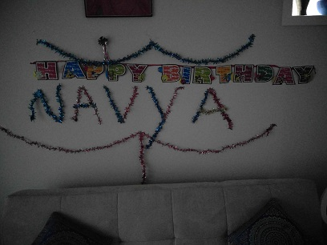
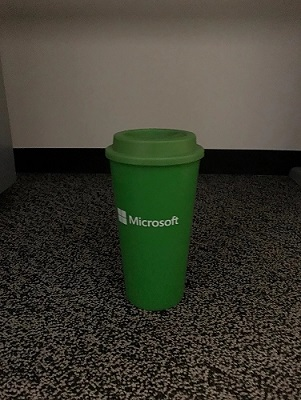

# Process bitmaps with the LowLightFusion API

Low-light images are difficult to capture with good image quality, especially on mobile devices with fixed aperture and sensor size. To compensate for low-lighting, devices may increase exposure time or sensor gain, which can lead to motion blur and increased noise in images. 

The [LowLightFusion class](/uwp/api/windows.media.core.lowlightfusion) improves the quality of low-light images by sampling pixel information from multiple frames in close temporal proximity, i.e., short burst images, to reduce noise and motion blur. This is useful capability to add to a photo editing app, for example.

This feature is also made available through the [AdvancedPhotoCapture class](/uwp/api/Windows.Media.Capture.AdvancedPhotoCapture), which applies the Low Light Fusion algorithm to a sequence of images directly after the images are captured, if needed. See [Low-light photo](./high-dynamic-range-hdr-photo-capture.md#low-light-photo-capture) capture to learn how to implement this feature.

## Prepare the images for processing

In this example, we'll demonstrate how to use the [LowLightFusion class](/uwp/api/windows.media.core.lowlightfusion), as well as the [FileOpenPicker](/uwp/api/Windows.Storage.Pickers.FileOpenPicker) to allow a user to select multiple images to perform Low Light Fusion on.

First, we'll need to determine how many images (also known as frames) the algorithm accepts, and create a list to hold these frames.

:::code language="csharp" source="~/../snippets-windows/windows-uwp/audio-video-camera/LowLightFusionSample/cs/MainPage.xaml.cs" id="SnippetGetMaxLLFFrames":::

Once we determine how many frames the Low Light Fusion algorithm accepts, we can use the [FileOpenPicker](/uwp/api/Windows.Storage.Pickers.FileOpenPicker) to allow the user to choose which images should be used in the algorithm.

:::code language="csharp" source="~/../snippets-windows/windows-uwp/audio-video-camera/LowLightFusionSample/cs/MainPage.xaml.cs" id="SnippetGetFrames":::

Now that we have the correct number of frames selected, we need to decode the frames into [SoftwareBitmaps](/uwp/api/Windows.Graphics.Imaging.SoftwareBitmap) and ensure that the SoftwareBitmaps are in the correct format for LowLightFusion.

:::code language="csharp" source="~/../snippets-windows/windows-uwp/audio-video-camera/LowLightFusionSample/cs/MainPage.xaml.cs" id="SnippetDecodeFrames":::

## Fuse the bitmaps into a single bitmap

Now that we have a correct number of frames in an acceptable format, we can use the **[FuseAsync](/uwp/api/windows.media.core.lowlightfusion.fuseasync)** method to apply the Low Light Fusion algorithm. Our result will be the processed image, with improved clarity, in the form of a SoftwareBitmap. 

:::code language="csharp" source="~/../snippets-windows/windows-uwp/audio-video-camera/LowLightFusionSample/cs/MainPage.xaml.cs" id="SnippetFuseFrames":::

Finally, we'll clean up the resulting SoftwareBitmap by encoding and saving it into a user friendly, "regular" image, similar to the input images that we started with.

:::code language="csharp" source="~/../snippets-windows/windows-uwp/audio-video-camera/LowLightFusionSample/cs/MainPage.xaml.cs" id="SnippetEncodeFrame":::

## Before and after

Here's an example of an input image and the resulting output image after applying the Low Light Fusion algorithm.

> [!div class="mx-tableFixed"] 
| Input Frame | Low Light Fusion Output | 
|-------------|-------------------------|
|  |  |

You can see from the input frame that the lighting and the clarity of the shadows surrounding the banner have been improved.

## Related topics 
[LowLightFusion Class](/uwp/api/windows.media.core.lowlightfusion)  
[LowLightFusionResult Class](/uwp/api/windows.media.core.lowlightfusionresult)
