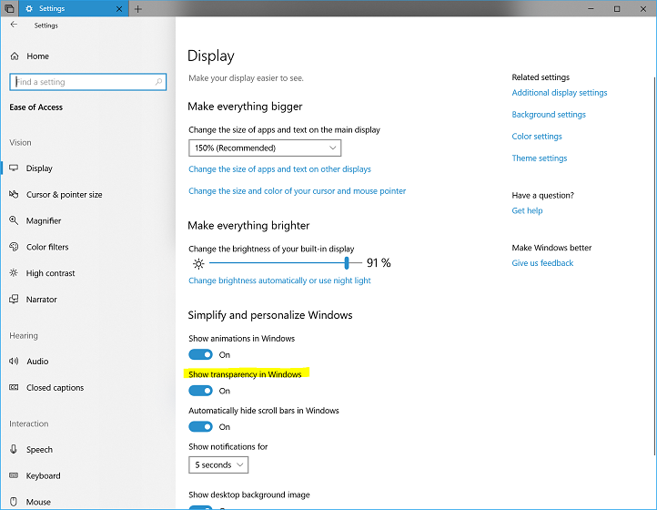

# Tailoring effects & experiences using Windows UI

Windows UI provides many beautiful effects, animations, and means for differentiation. However, meeting user expectations for performance and customizability is still a necessary part of creating successful applications. The Universal Windows Platform supports a large, diverse family of devices, which have different features and capabilities. In order to provide an inclusive experience for all your users, you need to ensure your applications scale across devices and respect user preferences. UI tailoring can provide an efficient way to leverage a device’s capabilities and ensure a pleasant and inclusive user experience.

UI tailoring is a broad category encompassing work for performant, beautiful UI with respect to the following areas:

- Respecting and adapting to user settings for effects
- Accommodating user settings for animations
- Optimizing UI for the given hardware capabilities

Here, we'll cover how to tailor your effects and animations with the Visual Layer in the areas above, but there are many other means to tailor your application to ensure a great end user experience. Guidance docs are available on how to [tailor your UI](../design/layout/screen-sizes-and-breakpoints-for-responsive-design.md) for various devices and [create responsive UI](../design/layout/responsive-design.md).

## User effects settings

Users may customize their Windows experience for a variety of reasons, which applications should respect and adapt to. One area end users can control is changing the types of effects they see used throughout their system.

### Transparency effects settings

One such effect setting users can customize is turning transparency effects on/off. This can be found in the Settings app under Personalization > Colors, or through Settings app > Ease of Access > Display.



When turned on, any effect that uses transparency will appear as expected. This applies to Acrylic, HostBackdropBrush, or any custom effect graph that is not fully opaque.

When turned off, acrylic material will automatically fall back to a solid color because XAML's acrylic brush has listened to this event by default. Here, we see the calculator app appropriately falling back to a solid color when transparency effects are not enabled:


However, for any custom effects the application needs to respond to the [UISettings.AdvancedEffectsEnabled](/uwp/api/windows.ui.viewmanagement.uisettings.advancedeffectsenabled) property or [AdvancedEffectsEnabledChanged](/uwp/api/windows.ui.viewmanagement.uisettings.advancedeffectsenabledchanged) event and switch out the effect/effect graph to use an effect that has no transparency. An example of this is below:

```cs
public MainPage()
{
   var uisettings = new UISettings();
   bool advancedEffects = uisettings.AdvancedEffectsEnabled;
   uisettings.AdvancedEffectsEnabledChanged += Uisettings_AdvancedEffectsEnabledChanged;
}

private void Uisettings_AdvancedEffectsEnabledChanged(UISettings sender, object args)
{
    // TODO respond to sender.AdvancedEffectsEnabled
}
```

## Animations settings

Similarly, applications should listen and respond to the [UISettings.AnimationsEnabled](/uwp/api/windows.ui.viewmanagement.uisettings.animationsenabled) property to ensure animations are turned on or off based on user settings in Settings > Ease of Access > Display.


```cs
public MainPage()
{
   var uisettings = new UISettings();
   bool animationsEnabled = uisettings.AnimationsEnabled;
   // TODO respond to animations settings
}

```

## Leveraging the capabilities API

By leveraging the [CompositionCapabilities](/uwp/api/windows.ui.composition.compositioncapabilities) APIs, you can detect which composition features are available and performant on given hardware and tailor the design to ensure end users get a performant and beautiful experience on any device. The APIs provide a means to check hardware system capabilities in order to implement graceful effect scaling across a variety of form factors. This makes it easy to appropriately tailor the application to create a beautiful and seamless end user experience.

This API provides methods and an event listener that can be used to make effect scaling decisions for the application UI. The feature detects how well the system can handle complex composition and rendering operations and then returns the information in an easy-to-consume model for developers to utilize.

### Using composition capabilities

The CompositionCapabilities functionality is already being leveraged for features like Acrylic material, where the material falls back to a more performant effect depending on the scenario and hardware.

The API can be added to existing code in a few easy steps.

1. Acquire the capabilities object in your application’s constructor.

    ```cs
    _capabilities = CompositionCapabilities.GetForCurrentView();
    ```

1. Register a capabilities changed event listener for your app.

    ```cs
    _capabilities.Changed += HandleCapabilitiesChanged;
    ```

1. Add content to the event callback method to handle various capabilities levels. This may or may not be similar to the next step below.
1. When using effects, check the capabilities object first. Consider using conditional checks or switch control statements, depending on how you want to tailor the effects.

    ```cs
    if (_capabilities.AreEffectsSupported())
    {
        // Add incremental effects updates here

        if (_capabilities.AreEffectsFast())
        {
            // Add more advanced effects here where applicable
        }
    }
    ```

Full example code can be found on the [Windows UI Github repo](https://github.com/microsoft/WindowsCompositionSamples/tree/master/SampleGallery/Samples/SDK 15063/CompCapabilities).

## Fast vs. slow effects

Based on feedback from the provided [AreEffectsSupported](/uwp/api/windows.ui.composition.compositioncapabilities.areeffectssupported) and [AreEffectsFast](/uwp/api/windows.ui.composition.compositioncapabilities.areeffectsfast) methods in the CompositionCapabilities API, the application can decide to swap expensive or unsupported effects for other effects of their choice that are optimized for the device. Some effects are known to consistently be more resource intensive than others and should be used sparingly, and other effects can be used more freely. For all effects, however, care should be used when chaining and animating as some scenarios or combinations may change the performance characteristics of the effect graph. Below are some rule of thumb performance characteristics for individual effects:

- Effects that are known to have high performance impact are as follows – Gaussian Blur, Shadow Mask, BackDropBrush, HostBackDropBrush, and Layer Visual. These are not recommended for low end devices [(feature level 9.1-9.3)](/windows/desktop/direct3d11/overviews-direct3d-11-devices-downlevel-intro), and should be used judiciously on high end devices.
- Effects with medium performance impact include Color Matrix, certain Blend Effect BlendModes (Luminosity, Color, Saturation, and Hue), SpotLight, SceneLightingEffect, and (depending on scenario) BorderEffect. These effects may work with certain scenarios on low end devices, but care should be used when chaining and animating. Recommend restricting use to two or less and animating on transitions only.
- All other effects have low performance impact and work in all reasonable scenarios when animating and chaining.

## Related articles

- [UWP Responsive Design Techniques](../design/layout/responsive-design.md)
- [UWP Device Tailoring](../design/layout/screen-sizes-and-breakpoints-for-responsive-design.md)