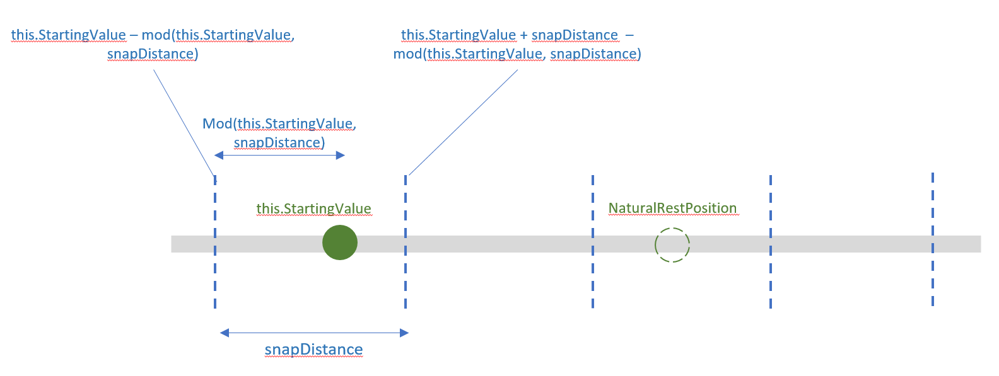

# Create snap points with inertia modifiers

In this article, we take a deeper dive into how to use an InteractionTracker’s InertiaModifier feature to create motion experiences that snap to a specified point.

## Prerequisites

Here, we assume that you're familiar with the concepts discussed in these articles:

- [Input-driven animations](input-driven-animations.md)
- [Custom manipulation experiences with InteractionTracker](interaction-tracker-manipulations.md)
- [Relation based animations](relation-animations.md)

## What are snap points and why are they useful?

When building custom manipulation experiences, sometimes it is helpful to create specialized _position points_ within the scrollable/zoomable canvas that InteractionTracker will always come to rest at. These are often called _snap points_.

Notice in the following example how the scrolling can leave the UI in an awkward position between the different images:


If you add snap points, when you stop scrolling between the images, they "snap" to a specified position. With snap points, it makes the experience of scrolling through images much cleaner and more responsive.


## InteractionTracker and InertiaModifiers

When building customized manipulation experiences with InteractionTracker, you can create snap point motion experiences by utilizing InertiaModifiers. InertiaModifiers are essentially a way for you to define where or how InteractionTracker reaches its destination when entering the Inertia state. You can apply InertiaModifiers to impact the X or Y position or Scale properties of InteractionTracker.

There are 3 types of InertiaModifiers:

- InteractionTrackerInertiaRestingValue – a way to modify the final resting position after an interaction or programmatic velocity. A predefined motion will take InteractionTracker to that position.
- InteractionTrackerInertiaMotion – a way to define a specific motion InteractionTracker will perform after an interaction or programmatic velocity. The final position will be derived from this motion.
- InteractionTrackerInertiaNaturalMotion – a way to define the final resting position after an interaction or programmatic velocity but with a physics based animation (NaturalMotionAnimation).

When entering Inertia, InteractionTracker evaluates each of the InertiaModifiers assigned to it and determines if any of them apply. This means you can create and assign multiple InertiaModifiers to an InteractionTracker, But, when defining each, you need to do the following:

1. Define the Condition – an Expression that defines the conditional statement when this specific InertiaModifier should take place. This often requires looking at InteractionTracker’s NaturalRestingPosition (destination given default Inertia).
1. Define the RestingValue/Motion/NaturalMotion – define the actual Resting Value Expression, Motion Expression or NaturalMotionAnimation that takes place when the condition is met.

> [!NOTE]
> The condition aspect of the InertiaModifiers are only evaluated once when InteractionTracker enters Inertia. However, only for InertiaMotion, the motion Expression is evaluated every frame for the modifier whose condition is true.

## Example

Now let’s look at how you can use InertiaModifiers to create some snap point experiences to recreate the scrolling canvas of images. In this example, each manipulation is meant to potentially move through a single image – this is often referred to as Single Mandatory Snap Points.

Let’s start by setting up InteractionTracker, the VisualInteractionSource and the Expression that will leverage the position of InteractionTracker.

```csharp
private void SetupInput()
{
    _tracker = InteractionTracker.Create(_compositor);
    _tracker.MinPosition = new Vector3(0f);
    _tracker.MaxPosition = new Vector3(3000f);

    _source = VisualInteractionSource.Create(_root);
    _source.ManipulationRedirectionMode =
        VisualInteractionSourceRedirectionMode.CapableTouchpadOnly;
    _source.PositionYSourceMode = InteractionSourceMode.EnabledWithInertia;
    _tracker.InteractionSources.Add(_source);

    var scrollExp = _compositor.CreateExpressionAnimation("-tracker.Position.Y");
    scrollExp.SetReferenceParameter("tracker", _tracker);
    ElementCompositionPreview.GetElementVisual(scrollPanel).StartAnimation("Offset.Y", scrollExp);
}
```

Next, because a Single Mandatory Snap Point behavior either will move the content up or down, you will need two different inertia modifiers: one that moves the Scrollable content up, and one that moves it down.

```csharp
// Snap-Point to move the content up
var snapUpModifier = InteractionTrackerInertiaRestingValue.Create(_compositor);
// Snap-Point to move the content down
var snapDownModifier = InteractionTrackerInertiaRestingValue.Create(_compositor);
```

Whether to snap up or down is determined based on where InteractionTracker naturally would land within relative to the snap distance – the distance between the snap locations. If past the halfway point, then snap down, otherwise snap up. (In this example, you store the snap distance in a PropertySet)

```csharp
// Is NaturalRestingPosition less than the halfway point between Snap Points?
snapUpModifier.Condition = _compositor.CreateExpressionAnimation(
"this.Target.NaturalRestingPosition.y < (this.StartingValue - " + 
"mod(this.StartingValue, prop.snapDistance) + prop.snapDistance / 2)");
snapUpModifier.Condition.SetReferenceParameter("prop", _propSet);
// Is NaturalRestingPosition greater than the halfway point between Snap Points?
snapDownModifier.Condition = _compositor.CreateExpressionAnimation(
"this.Target.NaturalRestingPosition.y >= (this.StartingValue - " + 
"mod(this.StartingValue, prop.snapDistance) + prop.snapDistance / 2)");
snapDownModifier.Condition.SetReferenceParameter("prop", _propSet);
```

This diagram gives a visual description to the logic that is happening:



Now you just need to define the Resting Values for each InertiaModifier: either move the position of InteractionTracker to the previous snap position or the next one.

```csharp
snapUpModifier.RestingValue = _compositor.CreateExpressionAnimation(
"this.StartingValue - mod(this.StartingValue, prop.snapDistance)");
snapUpModifier.RestingValue.SetReferenceParameter("prop", _propSet);
snapDownModifier.RestingValue = _compositor.CreateExpressionAnimation(
"this.StartingValue + prop.snapDistance - mod(this.StartingValue, " + 
"prop.snapDistance)");
snapDownModifier.RestingValue.SetReferenceParameter("prop", _propSet);
```

Finally, add the InertiaModifiers to InteractionTracker. Now when InteractionTracker enters it’s InertiaState, it will check the conditions of your InertiaModifiers to see if its position should be modified.

```csharp
var modifiers = new InteractionTrackerInertiaRestingValue[] { 
snapUpModifier, snapDownModifier };
_tracker.ConfigurePositionYInertiaModifiers(modifiers);
```