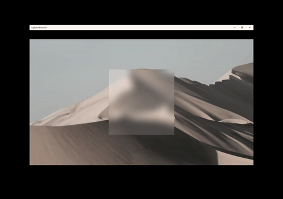

# Pointer-based animations

This article shows how to use the position of a pointer to create dynamic "stick to the cursor" experiences.

## Prerequisites

Here, we assume that you're familiar with the concepts discussed in these articles:

- [Input-driven animations](input-driven-animations.md)
- [Relation based animations](relation-animations.md)

## Why Create Pointer Position-Driven Experiences?

In the Fluent design language, touch is not the only way to interact with UI. Because UWP spans across multiple device form factors, end users interact with apps with other input modalities such as Mouse and Pen. Using position data from these other input modalities provides an opportunity to make end users feel even more connected with your app.

Pointer position-driven experiences let you leverage the on-screen position of a Pointer input modality to create additional motion and UI experiences for your app. These experiences often can provide additional context and feedback to end users about the behavior and structure of the UI. The experience is no longer a one-way stream, but rather starts to become a two-way stream where the end user provides input with their input modality and the app UI can respond back.

Some examples include:

- Animating the position of a Spotlight to follow the cursor

    

- Rotating an image based on the position of a pointer

    

## Using PointerPositionPropertySet

You can create these experiences by using the PointerPositionPropertySet. This PropertySet gets created for a UIElement to maintain the position of the pointer while the UIElement is positively hit-tested. The position value is relative to the coordinate space of the UIElement (a position of <0,0> is the top left corner of the UIElement). You can then leverage this property set in an Animation to drive the motion of another property.

For each of the different Pointer Input Modalities, there are a number of input states the input could be in where the position changes: Hover, Pressed, Pressed & Moved. The PointerPositionPropertySet only maintains the position of the pointer in the Hover, Pressed and Pressed and Moved states for Moues and Pen.

General steps to get started:

1. Identify the UIElement, you wish to have the position of the pointer tracked in.
1. Access the PointerPositionPropertySet via ElementCompositionPreview.
    - Pass UIElement into the ElementCompositionPreview.GetPointerPositionPropertySet method.
1. Create an ExpressionAnimation that references the Position property in the PropertySet.
    - Don’t forget to set your reference parameter!
1. Target a CompositionObject’s property with the ExpressionAnimation.

> [!NOTE]
> It is recommended that you assign the PropertySet returned from the GetPointerPositionPropertySet method to a class variable. This ensures that the property set does not get cleaned up by Garbage Collection and thus does not have any effect on the ExpressionAnimation it is referenced in. ExpressionAnimations do not maintain a strong reference to any of the objects used in the equation.

## Example

Let’s take a look at an example where we leverage the Hover position of a Mouse and Pen input modality to dynamically rotate an image.


The image is a UIElement, so let’s first get a reference to the PointerPositionPropertySet

```csharp
_pointerPositionPropSet = ElementCompositionPreview.GetPointerPositionPropertySet(UIElement element);
```

In this sample, you have two Expressions at play:

- An Expression where the image rotates based on far the pointer is from the center of the image. The further away, the more rotation.
- An Expression where the rotation axis changes based on the position of the pointer. You want the rotation axis to be perpendicular to the vector of the position.

Let’s define the two Expressions, one that targets the RotationAngle property and the other the RotationAxis property. You reference the PointerPositionPropertySet like any other PropertySet.

In this example, you are building Expressions using the ExpressionBuilder classes.

```csharp
// || DEFINE THE EXPRESSION FOR THE ROTATION ANGLE ||
var hoverPosition = _pointerPositionPropSet.GetSpecializedReference
<PointerPositionPropertySetReferenceNode>().Position;
var angleExpressionNode =
EF.Conditional(
 hoverPosition == new Vector3(0, 0, 0),
 ExpressionValues.CurrentValue.CreateScalarCurrentValue(),
 35 * ((EF.Clamp(EF.Distance(center, hoverPosition), 0, distanceToCenter) % distanceToCenter) / distanceToCenter));
_tiltVisual.StartAnimation("RotationAngleInDegrees", angleExpressionNode);

// || DEFINE THE EXPRESSION FOR THE ROTATION AXIS ||
var axisAngleExpressionNode = EF.Vector3(
-(hoverPosition.Y - center.Y) * EF.Conditional(hoverPosition.Y == center.Y, 0, 1),
 (hoverPosition.X - center.X) * EF.Conditional(hoverPosition.X == center.X, 0, 1),
 0);
_tiltVisual.StartAnimation("RotationAxis", axisAngleExpressionNode);
```