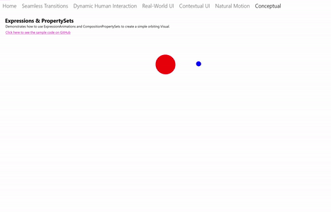

# Relation based animations

This article provides a brief overview of how to make relation-based animations using Composition ExpressionAnimations.

## Dynamic Relation-based Experiences

When building out motion experiences in an app, there are times when the motion is not time-based, but rather dependent on a property on another object. KeyFrameAnimations are not able to express these types of motion experiences very easily. In these specific instances, motion no longer needs to be discrete and pre-defined. Instead, the motion can dynamically adapt based on its relationship to other object properties. For example, you can animate the opacity of an object based on its horizontal position. Other examples include motion experiences like Sticky Headers and Parallax.

These types of motion experiences let you create UI that feels more connected, instead of feeling singular and independent. To the user, this gives the impression of a dynamic UI experience.




## Using ExpressionAnimations

To create relation-based motion experiences, you use the ExpressionAnimation type. ExpressionAnimations (or Expressions for short), are a new type of animation that let you express a mathematical relationship – a relationship that the system uses to calculate the value of an animating property every frame. Put another way, Expressions are simply a mathematical equation that defines the desired value of an animating property per frame. Expressions are a very versatile component that can be used across a wide variety of scenarios, including:

- Relative Size, Offset animations.
- Sticky Headers, Parallax with ScrollViewer. (See [Enhance existing ScrollViewer experiences](scroll-input-animations.md).)
- Snap Points with InertiaModifiers and InteractionTracker. (See [Create snap points with inertia modifiers](inertia-modifiers.md).)

When working with ExpressionAnimations, there are a couple of things worth mentioning up front:

- Never Ending – unlike its KeyFrameAnimation sibling, Expressions don’t have a finite duration. Because Expressions are mathematical relationships, they are animations that are constantly "running". You have the option to stop these animations if you choose.
- Running, but not always evaluating – performance is always a concern with animations that are constantly running. No need to worry though, the system is smart enough that the Expression will only re-evaluate if any of its inputs or parameters have changed.
- Resolving to the right object type – Because Expressions are mathematical relationships, it is important to make sure that the equation that defines the Expression resolves to the same type of the property being targeted by the animation. For example, if animating Offset, your Expression should resolve to a Vector3 type.

### Components of an Expression

When building the mathematical relationship of an Expression, there are several core components:

- Parameters – values representing constant values or references to other Composition objects.
- Mathematical Operators – the typical mathematical operators plus(+), minus(-), multiply(*), divide(/) that join together parameters to form an equation. Also included are conditional operators such as greater than(>), equal(==), ternary operator (condition ? ifTrue : ifFalse), etc.
- Mathematical Functions – mathematical functions/shortcuts based on System.Numerics. For a full list of supported functions, see [ExpressionAnimation](/uwp/api/Windows.UI.Composition.ExpressionAnimation).

Expressions also support a set of keywords – special phrases that have distinct meaning only within the ExpressionAnimation system. These are listed (along with the full list of math functions) in the [ExpressionAnimation](/uwp/api/Windows.UI.Composition.ExpressionAnimation) documentation.

### Creating Expressions with ExpressionBuilder

There are two options for building Expressions in their UWP app:

1. Building the equation as a string via the official, public API.
1. Building the equation in a type-safe object model via the open source ExpressionBuilder tool. See the [Github source and documentation](https://github.com/microsoft/WindowsCompositionSamples/tree/master/ExpressionBuilder).

For the sake of this document, we will define our Expressions using ExpressionBuilder.

### Parameters

Parameters make up the core of an Expression. There are two types of parameters:

- Constants: these are parameters representing typed System.Numeric variables. These parameters get their values assigned once when the animation is started.
- References: these are parameters representing references to CompositionObjects – these parameters continuously get their values updated after an animation is started.

In general, References are the main aspect for how an Expression’s output can dynamically change. As these references change, the output of the Expression changes as a result. If you create your Expression with Strings or use them in a templating scenario (using your Expression to target multiple CompositionObjects), you will need to name and set the values of your parameters. See the Example section for more info.

### Working with KeyFrameAnimations

Expressions can also be used with KeyFrameAnimations. In these instances, you want to use an Expression to define the value of a KeyFrame at a time spot – these types KeyFrames are called ExpressionKeyFrames.

```csharp
KeyFrameAnimation.InsertExpressionKeyFrame(Single, String)
KeyFrameAnimation.InsertExpressionKeyFrame(Single, ExpressionNode)
```

However, unlike ExpressionAnimations, ExpressionKeyFrames are evaluated only once when the KeyFrameAnimation is started. Keep in mind, you do not pass in an ExpressionAnimation as the value of the KeyFrame, rather a string (or an ExpressionNode, if you're using ExpressionBuilder).

## Example

Let's now walk through an example of using Expressions, specifically the PropertySet sample from the Windows UI Sample Gallery. We'll look at the Expression managing the orbit motion behavior of the blue ball.


There are three components at play for the total experience:

1. A KeyFrameAnimation, animating the Y Offset of the red ball.
1. A PropertySet with a **Rotation** property that helps drives the orbit, animated by another KeyFrameAnimation.
1. An ExpressionAnimation that drives the Offset of the blue ball referencing the Red Ball Offset and the Rotation property to maintain a perfect orbit.

We’ll be focusing on the ExpressionAnimation defined in #3. We will also be using the ExpressionBuilder classes to construct this Expression. A copy of the code used to build this experience via Strings is listed at the end.

In this equation, there are two properties you need to reference from the PropertySet; one is a centerpoint offset and the other is the rotation.

```
var propSetCenterPoint =
_propertySet.GetReference().GetVector3Property("CenterPointOffset");

// This rotation value will animate via KFA from 0 -> 360 degrees
var propSetRotation = _propertySet.GetReference().GetScalarProperty("Rotation");
```

Next, you need to define the Vector3 component that accounts for the actual orbiting rotation.

```
var orbitRotation = EF.Vector3(
    EF.Cos(EF.ToRadians(propSetRotation)) * 150,
    EF.Sin(EF.ToRadians(propSetRotation)) * 75, 0);
```

> [!NOTE]
> `EF` is a shorthand “using” notation to define ExpressionBuilder.ExpressionFunctions.

Finally, combine these components together and reference the position of the Red Ball to define the mathematical relationship.

```
var orbitExpression = redSprite.GetReference().Offset + propSetCenterPoint + orbitRotation;
blueSprite.StartAnimation("Offset", orbitExpression);
```

In a hypothetical situation, what if you wanted to use this same Expression but with two other Visuals, meaning 2 sets of orbiting circles. With CompositionAnimations, you can re-use the animation and target multiple CompositionObjects. The only thing you need to change when you use this Expression for the additional orbit case is the reference to the Visual. We call this templating.

In this case, you modify the Expression you built earlier. Rather than "getting" a reference to the CompositionObject, you create a reference with a name and then assign different values:

```
var orbitExpression = ExpressionValues.Reference.CreateVisualReference("orbitRoundVisual");
orbitExpression.SetReferenceParameter("orbitRoundVisual", redSprite);
blueSprite.StartAnimation("Offset", orbitExpression);
// Later on … use same Expression to assign to another orbiting Visual
orbitExpression.SetReferenceParameter("orbitRoundVisual", yellowSprite);
greenSprite.StartAnimation("Offset", orbitExpression);
```

Here is the code if you defined your Expression with Strings via the public API.

```
ExpressionAnimation expressionAnimation =
compositor.CreateExpressionAnimation("visual.Offset + " +
"propertySet.CenterPointOffset + " +
"Vector3(cos(ToRadians(propertySet.Rotation)) * 150," + "sin(ToRadians(propertySet.Rotation)) * 75, 0)");
 var propSetCenterPoint = _propertySet.GetReference().GetVector3Property("CenterPointOffset");
 var propSetRotation = _propertySet.GetReference().GetScalarProperty("Rotation");
expressionAnimation.SetReferenceParameter("propertySet", _propertySet);
expressionAnimation.SetReferenceParameter("visual", redSprite);
```