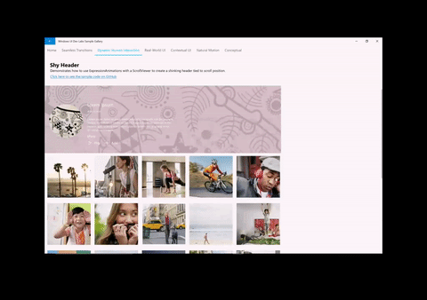

# Enhance existing ScrollViewer experiences

This article explains how to use a XAML ScrollViewer and ExpressionAnimations to create dynamic input-driven motion experiences.

## Prerequisites

Here, we assume that you're familiar with the concepts discussed in these articles:

- [Input-driven animations](input-driven-animations.md)
- [Relation based animations](relation-animations.md)

## Why build on top of ScrollViewer?

Typically, you use the existing XAML ScrollViewer to create a scrollable and zoomable surface for your app content. With the introduction of the Fluent Design language, you should now also be focusing on how to use the act of scrolling or zooming a surface to drive other motion experiences. For example, using scrolling to drive a blur animation of a background or drive the position of a "sticky header".

In these scenarios, you are leveraging the behavior or manipulation experiences like Scrolling and zooming to make other parts of your app more dynamic. These in turn enable the app to feel more cohesive, making the experiences more memorable in the eyes of end users. By making the app UI more memorable, end users will engage with the app more frequently and for longer periods.

## What can you build on top of ScrollViewer?

You can leverage the position of a ScrollViewer to build a number of dynamic experiences:

- Parallax – use the position of a ScrollViewer to move background or foreground content at a relative rate to the scroll position.
- StickyHeaders – use the position of a ScrollViewer to animate and "stick" a header to a position
- Input-Driven Effects – use the position of a Scrollviewer to animate a Composition Effect such as Blur.

In general, by referencing the position of a ScrollViewer with an ExpressionAnimation, you are able to create an animation that dynamically changes relative the scroll amount.




## Using ScrollManipulationPropertySet

To create these dynamic experiences using a XAML ScrollViewer, you must be able to reference the scroll position in an animation. This is done by accessing a CompositionPropertySet off of the XAML ScrollViewer called the ScrollManipulationPropertySet.
The ScrollManipulationPropertySet contains a single Vector3 property called Translation that provides access to the scroll position of the ScrollViewer. You can then reference this like any other CompositionPropertySet in your ExpressionAnimation.

General Steps to getting started:

1. Access the ScrollManipulationPropertySet via ElementCompositionPreview.
    - `ElementCompositionPreview.GetScrollManipulationPropertySet(ScrollViewer scroller)`
1. Create an ExpressionAnimation that references the Translation property from the PropertySet.
    - Don’t forget to set the Reference Parameter!
1. Target a CompositionObject’s property with the ExpressionAnimation.

> [!NOTE]
> It is recommended that you assign the PropertySet returned from the GetScrollManipulationPropertySet method to a class variable. This ensures that the property set does not get cleaned up by Garbage Collection and thus does not have any effect on the ExpressionAnimation it is referenced in. ExpressionAnimations do not maintain a strong reference to any of the objects used in the equation.

## Example

Let's take a look at how the Parallax sample shown above is put together. For reference, all the source code for the app is found in the [Window UI Dev Labs repo on GitHub](https://github.com/microsoft/WindowsCompositionSamples).

The first thing is to get a reference to the ScrollManipulationPropertySet.

```csharp
_scrollProperties =
    ElementCompositionPreview.GetScrollViewerManipulationPropertySet(myScrollViewer);
```

The next step is to create the ExpressionAnimation that defines an equation that utilizes the scroll Position of the ScrollViewer.

```csharp
_parallaxExpression = compositor.CreateExpressionAnimation();
_parallaxExpression.SetScalarParameter("StartOffset", 0.0f);
_parallaxExpression.SetScalarParameter("ParallaxValue", 0.5f);
_parallaxExpression.SetScalarParameter("ItemHeight", 0.0f);
_parallaxExpression.SetReferenceParameter("ScrollManipulation", _scrollProperties);
_parallaxExpression.Expression = "(ScrollManipulation.Translation.Y + StartOffset - (0.5 * ItemHeight)) * ParallaxValue - (ScrollManipulation.Translation.Y + StartOffset - (0.5 * ItemHeight))";
```

> [!NOTE]
> You can also utilize ExpressionBuilder helper classes to construct this same Expression without the need for Strings:

> ```csharp
> var scrollPropSet = _scrollProperties.GetSpecializedReference<ManipulationPropertySetReferenceNode>();
> var parallaxValue = 0.5f;
> var parallax = (scrollPropSet.Translation.Y + startOffset);
> _parallaxExpression = parallax * parallaxValue - parallax;
> ```

Finally, you take this ExpressionAnimation and target the Visual that you want to parallax. In this case, it is the image for each of the items in the list.

```csharp
Visual visual = ElementCompositionPreview.GetElementVisual(image);
visual.StartAnimation("Offset.Y", _parallaxExpression);
```