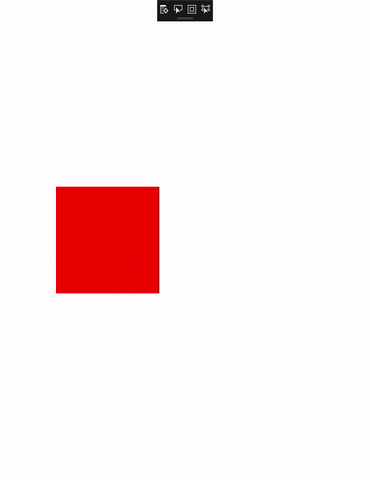

# Time based animations

When a component in, or an entire user experience changes, end users often observe it in two ways: over time or instantaneously. On the Windows platform, the former is preferred over the latter -  user experiences that instantly change often confuse and surprise end users because they are not able to follow what happened. The end user then perceives the experience as jarring and unnatural.

Instead, you can change your UI over time to guide the end user through, or notify them of changes to the experience. On the Windows platform, this is done by using time-based animations, also known as KeyFrameAnimations. KeyFrameAnimations let you change a UI over time and control each aspect of the animation, including how and when it starts, and how it reaches its end state. For example, animating an object to a new position over 300 milliseconds is more pleasant than instantly "teleporting" it there. When using animations instead of instantaneous changes, the net result is a more pleasant and appealing experience.

## Types of time based Animations

There are two categories of time-based animations you can use to build beautiful user experiences on Windows:

**Explicit Animations** – as the name signifies, you explicitly start the animation to make updates.
**Implicit Animations** – these animations are kicked off by the system on your behalf when a condition is met.

For this article, we will discuss how to create and use _explicit_ time-based animations with KeyFrameAnimations.

For both explicit and implicit time based animations, there are different types, corresponding to the different types of properties of CompositionObjects you can animate.

- ColorKeyFrameAnimation
- QuaternionKeyFrameAnimation
- ScalarKeyFrameAnimation
- Vector2KeyFrameAnimation
- Vector3KeyFrameAnimation
- Vector4KeyFrameAnimation

## Create time based animations with KeyFrameAnimations

Before describing how to create explicit time-based animations with KeyFrameAnimations, let’s go over a few concepts.

- KeyFrames – These are the individual "snapshots" that an animation will animate through.
  - Defined as key & value pairs. The key represents the progress between 0 and 1, aka where in the animation lifetime this “snapshot” takes places. The other parameter represents the property value at this time.
- KeyFrameAnimation Properties – customization options you can apply to meet the needs of the UI.
  - DelayTime – time before an animation starts after StartAnimation is called.
  - Duration – duration of the animation.
  - IterationBehavior – count or infinite repeat behavior for an animation.
  - IterationCount – number of finite times a KeyFrame Animation will repeat.
  - KeyFrame Count – read of how many KeyFrames in a particular KeyFrame Animation.
  - StopBehavior – specifies the behavior of an animating property value when StopAnimation is called.
  - Direction – specifies the direction of the animation for playback.
- Animation Group – starting multiple animations at the same time.
  - Often used when wanting to animate multiple properties at the same time.

For more info, see [CompositionAnimationGroup](https://docs.microsoft.com/uwp/api/windows.ui.composition.compositionanimationgroup).

With these concepts in mind, let’s talk through the general formula for constructing a KeyFrameAnimation:

1. Identify the CompositionObject and its respective property that you need to animate.
1. Create a KeyFrameAnimation Type template of the compositor that matches the type of property you want to animate.
1. Using the animation template, start adding KeyFrames and defining properties of the animation.
    - At least one KeyFrame is required (the 100% or 1f keyframe).
    - It is recommended to define a duration as well.
1. Once you are ready to run this animation then call StartAnimation(…) on the CompositionObject, targeting the property which you want to animate. Specifically:
    - `Visual.StartAnimation("targetProperty", CompositionAnimation animation);`
    - `Visual.StartAnimationGroup(AnimationGroup animationGroup);`
1. If you have a running animation and you will like to stop the Animation or Animation Group you can use these APIs:
    - `Visual.StopAnimation("targetProperty");`
    - `Visual.StopAnimationGroup(AnimationGroup AnimationGroup);`

Let’s take a look an example to see this formula in action.

## Example

In this example, you want to animate the offset of a visual from <0,0,0> to <20,20,20> over 1 seconds. In addition, you want to see the visual animate between these positions 10 times.



You first start by identifying the CompositionObject and property you want to animate. In this case, the red square is represented by a Composition Visual named `redSquare`. You start your animation from this object.

Next, because you want to animate the Offset property, you need to create a Vector3KeyFrameAnimation (Offset is of type Vector3). You also define the corresponding KeyFrames for the KeyFrameAnimation.

```csharp
    Vector3KeyFrameAnimation animation = compositor.CreateVector3KeyFrameAnimation();
    animation.InsertKeyFrame(1f, new Vector3(200f, 0f, 0f));
```

Then we will define the properties of the KeyFrameAnimation to describe it’s duration along with the behavior to animate between the two positions (current and <200,0,0>) 10 times.

```csharp
    animation.Duration = TimeSpan.FromSeconds(2);
    animation.Direction = Windows.UI.Composition.AnimationDirection.Alternate;
    // Run animation for 10 times
    animation.IterationCount = 10;
```

Finally, in order to run an animation, you need to start it on a property of a CompositionObject.

```csharp
redVisual.StartAnimation("Offset.X", animation);
```

Here's the full code.

```csharp
private void AnimateSquare(Compositor compositor, SpriteVisual redSquare)
{ 
    Vector3KeyFrameAnimation animation = compositor.CreateVector3KeyFrameAnimation();
    animation.InsertKeyFrame(1f, new Vector3(200f, 0f, 0f));
    animation.Duration = TimeSpan.FromSeconds(2);
    animation.Direction = Windows.UI.Composition.AnimationDirection.Alternate;
    // Run animation for 10 times
    animation.IterationCount = 10;
    visual.StartAnimation("Offset.X", animation);
} 
```
