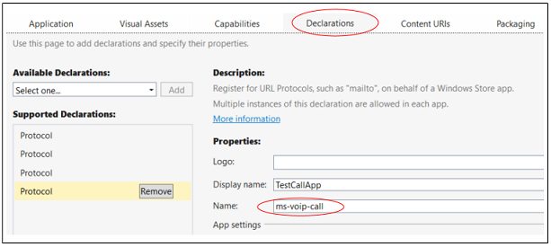

# Connect your app to actions on a contact card

Your app can appear next to actions on a contact card or mini contact card. Users can choose your app to perform an action such as open a profile page, place a call, or send a message.


To get started, find existing contacts or create new ones. Next, create an *annotation* and a few package manifest entries to describe which actions your app supports. Then, write code that perform the actions.

For a more complete sample, see [Contact Card Integration Sample](https://github.com/Microsoft/Windows-universal-samples/tree/master/Samples/ContactCardIntegration).

## Find or create a contact

If your app helps people connect with others, search Windows for contacts and then annotate them. If your app manages contacts, you can add them to a Windows contact list and then annotate them.

### Find a contact

Find contacts by using a name, email address, or phone number.

```cs
ContactStore contactStore = await ContactManager.RequestStoreAsync();

IReadOnlyList<Contact> contacts = null;

contacts = await contactStore.FindContactsAsync(emailAddress);

Contact contact = contacts[0];
```

### Create a contact

If your app is more like an address book, create contacts and then add them to a contact list.

```cs
Contact contact = new Contact();
contact.FirstName = "TestContact";

ContactEmail email = new ContactEmail();
email.Address = "TestContact@contoso.com";
email.Kind = ContactEmailKind.Other;
contact.Emails.Add(email);

ContactPhone phone = new ContactPhone();
phone.Number = "4255550101";
phone.Kind = ContactPhoneKind.Mobile;
contact.Phones.Add(phone);

ContactStore store = await
    ContactManager.RequestStoreAsync(ContactStoreAccessType.AppContactsReadWrite);

ContactList contactList;

IReadOnlyList<ContactList> contactLists = await store.FindContactListsAsync();

if (0 == contactLists.Count)
    contactList = await store.CreateContactListAsync("TestContactList");
else
    contactList = contactLists[0];

await contactList.SaveContactAsync(contact);

```

## Tag each contact with an annotation

Tag each contact with a list of actions (operations) that your app can perform (for example: video calls and messaging).

Then, associate the ID of a contact to an ID that your app uses internally to identify that user.

```cs
ContactAnnotationStore annotationStore = await
   ContactManager.RequestAnnotationStoreAsync(ContactAnnotationStoreAccessType.AppAnnotationsReadWrite);

ContactAnnotationList annotationList;

IReadOnlyList<ContactAnnotationList> annotationLists = await annotationStore.FindAnnotationListsAsync();
if (0 == annotationLists.Count)
    annotationList = await annotationStore.CreateAnnotationListAsync();
else
    annotationList = annotationLists[0];

ContactAnnotation annotation = new ContactAnnotation();
annotation.ContactId = contact.Id;
annotation.RemoteId = "user22";

annotation.SupportedOperations = ContactAnnotationOperations.Message |
  ContactAnnotationOperations.AudioCall |
  ContactAnnotationOperations.VideoCall |
 ContactAnnotationOperations.ContactProfile;

await annotationList.TrySaveAnnotationAsync(annotation);
```

## Register for each operation

In your package manifest, register for each operation that you listed in your annotation.

Register by adding protocol handlers to the ``Extensions`` element of the manifest.

```xml
<Extensions>
  <uap:Extension Category="windows.protocol">
    <uap:Protocol Name="ms-contact-profile">
      <uap:DisplayName>TestProfileApp</uap:DisplayName>
    </uap:Protocol>
  </uap:Extension>
  <uap:Extension Category="windows.protocol">
    <uap:Protocol Name="ms-ipmessaging">
      <uap:DisplayName>TestMsgApp</uap:DisplayName>
    </uap:Protocol>
  </uap:Extension>
  <uap:Extension Category="windows.protocol">
    <uap:Protocol Name="ms-voip-video">
      <uap:DisplayName>TestVideoApp</uap:DisplayName>
    </uap:Protocol>
  </uap:Extension>
  <uap:Extension Category="windows.protocol">
    <uap:Protocol Name="ms-voip-call">
      <uap:DisplayName>TestCallApp</uap:DisplayName>
    </uap:Protocol>
  </uap:Extension>
</Extensions>
```
You can also add these in the **Declarations** tab of the manifest designer in Visual Studio.



## Find your app next to actions in a contact card

Open the People app. Your app appears next to each action (operation) that you specified in your annotation and package manifest.


If users choose your app for an action, it appears as the default app for that action the next time users open a contact card.

## Find your app next to actions in a mini contact card

In mini contact cards, your app appears in tabs that represent actions.


Apps such as the **Mail** app open mini contact cards. Your app can open them too. This code shows you how to do that.

```cs
public async void OpenContactCard(object sender, RoutedEventArgs e)
{
    // Get the selection rect of the button pressed to show contact card.
    FrameworkElement element = (FrameworkElement)sender;

    Windows.UI.Xaml.Media.GeneralTransform buttonTransform = element.TransformToVisual(null);
    Windows.Foundation.Point point = buttonTransform.TransformPoint(new Windows.Foundation.Point());
    Windows.Foundation.Rect rect =
        new Windows.Foundation.Rect(point, new Windows.Foundation.Size(element.ActualWidth, element.ActualHeight));

   // helper method to find a contact just for illustrative purposes.
    Contact contact = await findContact("contoso@contoso.com");

    ContactManager.ShowContactCard(contact, rect, Windows.UI.Popups.Placement.Default);

}
```

To see more examples with mini contact cards, see [Contact cards sample](https://github.com/Microsoft/Windows-universal-samples/tree/master/Samples/ContactCards).

Just like the contact card, each tab remembers the app that the user last used so it's easy for them to return to your app.

## Perform operations when users select your app in a contact card

Override the [Application.OnActivated](/uwp/api/windows.ui.xaml.application.onactivated) method  in your **App.cs** file and navigate users to a page in your app. The [Contact Card Integration Sample](https://github.com/Microsoft/Windows-universal-samples/tree/master/Samples/ContactCardIntegration) shows one way to do that.

In the code behind file of the page, override the [Page.OnNavigatedTo](/uwp/api/windows.ui.xaml.controls.page.onnavigatedto) method. The contact card passes this method the name of operation and the ID of the user.

To start a video or audio call, see this sample: [VoIP sample](https://github.com/Microsoft/Windows-universal-samples/tree/master/Samples/VoIP). You'll find the complete API in the [WIndows.ApplicationModel.Calls](/uwp/api/windows.applicationmodel.calls) namespace.

To facilitate messaging, see the [Windows.ApplicationModel.Chat](/uwp/api/windows.applicationmodel.chat) namespace.

You can also start another app. That's what this code does.

```cs
protected override async void OnNavigatedTo(NavigationEventArgs e)
{
    base.OnNavigatedTo(e);

    var args = e.Parameter as ProtocolActivatedEventArgs;
    // Display the result of the protocol activation if we got here as a result of being activated for a protocol.

    if (args != null)
    {
        var options = new Windows.System.LauncherOptions();
        options.DisplayApplicationPicker = true;

        options.TargetApplicationPackageFamilyName = "ContosoApp";

        string launchString = args.uri.Scheme + ":" + args.uri.Query;
        var launchUri = new Uri(launchString);
        await Windows.System.Launcher.LaunchUriAsync(launchUri, options);
    }
}
```

The ```args.uri.scheme``` property contains the name of the operation, and the ```args.uri.Query``` property contains the ID of the user.