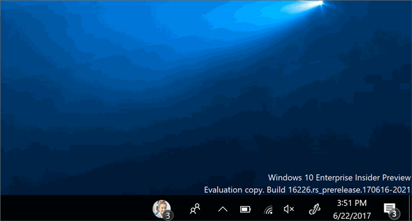
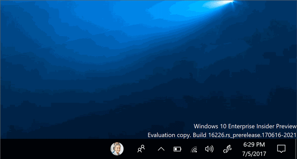

# My People notifications

> [!IMPORTANT]
> **PRERELEASE | Requires Fall Creators Update**: You must target [Insider SDK 16225](https://www.microsoft.com/en-us/software-download/windowsinsiderpreviewSDK) and be running [Insider build 16226](https://blogs.windows.com/windowsexperience/2017/06/21/announcing-windows-10-insider-preview-build-16226-pc/) or higher to use the My People APIs.

My People notifications are a new kind of gesture that put people first. They provide a new way for users to connect with the people they care about through quick, lightweight expressive gestures.



## Requirements

+ Windows 10 and Microsoft Visual Studio 2017. For installation details, see [Get set up with Visual Studio](https://docs.microsoft.com/en-us/windows/uwp/get-started/get-set-up).
+ Basic knowledge of C# or a similar object-oriented programming language. To get started with C#, see [Create a "Hello, world" app](https://docs.microsoft.com/en-us/windows/uwp/get-started/create-a-hello-world-app-xaml-universal).

## How it works

As an alternative to generic toast notifications, application developers can now send notifications through the My People feature, to provide a more personal experience to users. This is a new kind of toast, sent from a contact pinned to the user's taskbar. When the notification is received, the` sender’s contact picture will animate in the taskbar and a sound will play, signaling that a My People notification is starting. Then the animation or image specified in the payload will be displayed for 6 seconds (if the payload is an animation that lasts less than 6 seconds, it will loop until 6 seconds have passed).

## Supported asset types

+ GIF
+ Static Image (JPEG, PNG)
+ Spritesheet (vertical only)

> [!NOTE]
> A spritesheet is an animation derived from a static image (JPEG or PNG). Individual frames are arranged vertically, such that the first frame is on top (you can specify a different starting frame in the toast payload). Each frame must have the same height, which the program loops through to create an animated sequence (like a flipbook with all the pages laid out vertically). Shown below is an example of a spritesheet.


## Notification parameters
My People notifications use the [toast notification](../controls-and-patterns/tiles-and-notifications-adaptive-interactive-toasts.md) framework in Windows 10, and require an additional binding node in the toast payload. This means notifications through My People must have two bindings instead of one. This second binding must include the following parameter:

```xml
experienceType=”shoulderTap”
```

This indicates that the toast should be treated as a My People notifications.

The image node inside the binding should include the following parameters:

+ **src**
    + The URI of the asset. This can either be either HTTP/HTTPS web URI, an msappx URI, or a path to a local asset.
+ **spritesheet-src**
    + The URI of the asset. This can either be either HTTP/HTTPS web URI, an msappx URI, or a path to a local asset. Only required for spritesheet animations.
+ **spritesheet-height**
    + The frame height (in pixels). Only required for spritesheet animations.
+ **spritesheet-fps**
    + Frames per second. Only required for spritesheet animations.
+ **spritesheet-startingFrame**
    + The frame number to begin the animation. Only used for spritesheet animations, and defaults to 0 if not provided.
+ **alt**
    + Alt text string used for screen reader narration.

> [!NOTE]
> Even if you're using a spritesheet, you should still specify a static image in the "src" parameter as a fall-back in case the animation fails to display.

In addition, the top-level toast node must include the **hint-people** parameter to indicate the sending contact. This parameter can have any the following values:

+ **Email address** 
    + E.g. mailto:johndoe@mydomain.com
+ **Telephone number** 
    + E.g. tel:888-888-8888
+ **Remote ID** 
    + E.g. remoteid:1234

> [!NOTE]
> If your app uses the [ContactStore APIs](https://docs.microsoft.com/en-us/uwp/api/windows.applicationmodel.contacts.contactstore) and uses the [StoredContact.RemoteId](https://docs.microsoft.com/en-us/uwp/api/Windows.Phone.PersonalInformation.StoredContact#Windows_Phone_PersonalInformation_StoredContact_RemoteId) property to link contacts stored on the phone with contacts stored remotely, it is essential that the value for the RemoteId property is both stable and unique. This means that the remote ID must consistently identify a single user account and should contain a unique tag to guarantee that it does not conflict with the remote IDs of other contacts on the phone, including contacts that are owned by other apps.
> If the remote IDs used by your app are not guaranteed to be stable and unique, you can use the RemoteIdHelper class shown later in this topic in order to add a unique tag to all of your remote IDs before you add them to the system. Or you can choose to not use the RemoteId property at all and instead you create a custom extended property in which to store remote IDs for your contacts.

In addition to the second binding and payload, you MUST include another payload in the first binding for the fallback toast (which the notification will use if it is forced to revert to a regular toast). This is explained in more detail in the final section.

## Creating the notification
You can create a My People notification template just like you would a [toast notification](../controls-and-patterns/tiles-and-notifications-adaptive-interactive-toasts.md).

Here's an example of how to create a My People notification using a static image:

```xml
<toast hint-people="mailto:johndoe@mydomain.com">
    <visual lang="en-US">
        <binding template="ToastGeneric">
            <text hint-style="body">Toast fallback</text>
            <text>Add your fallback toast content here</text>
        </binding>
        <binding template="ToastGeneric" experienceType="shoulderTap">
            <image id="2" src="<https://docs.microsoft.com/en-us/windows/uwp/contacts-and-calendar/images/shoulder-tap-static-payload.png>"/>
        </binding>
    </visual>
</toast>
```

If you start the notification, it should look like this:



Next we'll show how to create a notification using an animated spritesheet. This spritesheet has a frame-height of 80 pixels, which we'll animate at 25 frames per second. We set the starting frame to 15, and provide it with a static fallback image in the “src” parameter. The fallback image is used if the spritesheet animation fails to display.

```xml
<toast hint-people="mailto:johndoe@mydomain.com">
    <visual lang="en-US">
        <binding template="ToastGeneric">
            <text hint-style="body">Toast fallback</text>
            <text>Add your fallback toast content here</text>
        </binding>
        <binding template="ToastGeneric" experienceType="shoulderTap">
            <image src='<https://docs.microsoft.com/en-us/windows/uwp/contacts-and-calendar/images/shoulder-tap-pizza-static.png>'
                spritesheet-src='<https://docs.microsoft.com/en-us/windows/uwp/contacts-and-calendar/images/shoulder-tap-pizza-spritesheet.png>'
                spritesheet-height='80' spritesheet-fps='25' spritesheet-startingFrame='15'/>
        </binding>
    </visual>
</toast>
```

If you start the notification, it should look like this:


## Starting the notification
To start a My People notification, we need to convert the toast template into an [XmlDocument](https://msdn.microsoft.com/en-us/library/windows/apps/windows.data.xml.dom.xmldocument.aspx) object. Assuming you defined the toast in an XML file (here named "content.xml"), you can use this code C# to start it:

```CSharp
string xmlText = File.ReadAllText("content.xml");
XmlDocument xmlContent = new XmlDocument();
xmlContent.LoadXml(xmlText);
```

You can then use this code to create and send the toast:

```CSharp
ToastNotification notification = new ToastNotification(xmlContent);
ToastNotificationManager.CreateToastNotifier().Show(notification);
```

## Falling back to toast
There are some cases when a notification coded as a My People notification will instead display as a regular toast. A My People notification will fall back to toast under the following conditions:

+ The notification fails to display
+ My People notifications are not enabled by the recipient
+ The sender’s contact is not pinned to the receiver’s taskbar

If a My People notification falls back to toast, the second My-People-specific binding is ignored, and only the first binding is used to display the toast. This means that, as stated before, a fallback payload must be provided in the first toast binding.

## See also
+ [Adding My People support](my-people-support.md)
+ [Adaptive toast notifications](../controls-and-patterns/tiles-and-notifications-adaptive-interactive-toasts.md)
+ [ToastNotification Class](https://docs.microsoft.com/en-us/uwp/api/windows.ui.notifications.toastnotification)