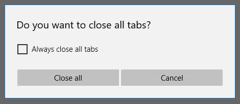
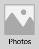

# Buttons
<link rel="stylesheet" href="https://az835927.vo.msecnd.net/sites/uwp/Resources/css/custom.css"> 

A button gives the user a way to trigger an immediate action.


<div class="important-apis" >
<b>Important APIs</b><br/>
<ul>
<li>[**Button class**](https://msdn.microsoft.com/library/windows/apps/windows.ui.xaml.controls.button.aspx)</li>
<li>[**RepeatButton class**](https://msdn.microsoft.com/library/windows/apps/windows.ui.xaml.controls.primitives.repeatbutton.aspx)</li>
<li>[**Click event**](https://msdn.microsoft.com/library/windows/apps/windows.ui.xaml.controls.primitives.buttonbase.click.aspx)</li>
<li> </li>
<li> </li>
<li> </li>
</ul>
</div>

## Is this the right control?

A button lets the user initiate an immediate action, such as submitting a form.

Don't use a button when the action is to navigate to another page; use a link instead. See [Hyperlinks](hyperlinks.md) for more info.
    
> Exception: For wizard navigation, use buttons labeled "Back" and "Next". For other types of backwards navigation or navigation to an upper level, use a back button.

## Example

This example uses two buttons, Close all and Cancel, in a dialog in the Microsoft Edge browser. 



## Create a button

This example shows a button that responds to a click. 

Create the button in XAML.

```xaml
<Button Content="Submit" Click="SubmitButton_Click"/>
```

Or create the button in code.

```csharp
Button submitButton = new Button();
submitButton.Content = "Submit";
submitButton.Click += SubmitButton_Click;

// Add the button to a parent container in the visual tree.
stackPanel1.Children.Add(submitButton);
```

Handle the Click event.

```csharp
private async void SubmitButton_Click(object sender, RoutedEventArgs e)
{
    // Call app specific code to submit form. For example:
    // form.Submit();
    Windows.UI.Popups.MessageDialog messageDialog = 
        new Windows.UI.Popups.MessageDialog("Thank you for your submission.");
    await messageDialog.ShowAsync();
}
```

### Button interaction

When you tap a Button with a finger or stylus, or press a left mouse button while the pointer is over it, the button raises the [**Click**](https://msdn.microsoft.com/library/windows/apps/windows.ui.xaml.controls.primitives.buttonbase.click.aspx) event. If a button has keyboard focus, pressing the Enter key or the Spacebar key also raises the Click event.

You generally can't handle low-level [**PointerPressed**](https://msdn.microsoft.com/library/windows/apps/windows.ui.xaml.uielement.pointerpressed.aspx) events on a Button because it has the Click behavior instead. For more info, see [Events and routed events overview](https://msdn.microsoft.com/library/windows/apps/mt185584.aspx).

You can change how a button raises the Click event by changing the [**ClickMode**](https://msdn.microsoft.com/library/windows/apps/windows.ui.xaml.controls.primitives.buttonbase.clickmode.aspx) property. The default ClickMode value is **Release**. If ClickMode is **Hover**, the Click event can't be raised with the keyboard or touch. 


### Button content

Button is a [**ContentControl**](https://msdn.microsoft.com/library/windows/apps/xaml/windows.ui.xaml.controls.contentcontrol.aspx). Its XAML content property is [**Content**](https://msdn.microsoft.com/library/windows/apps/xaml/windows.ui.xaml.controls.contentcontrol.content.aspx), which enables a syntax like this for XAML: `<Button>A button's content</Button>`. You can set any object as the button's content. If the content is a [UIElement](https://msdn.microsoft.com/library/windows/apps/xaml/windows.ui.xaml.uielement.aspx), it is rendered in the button. If the content is another type of object, its string representation is shown in the button.

Here, a **StackPanel** that contains an image of an Orange and text is set as the content of a button.

```xaml
<Button Click="Button_Click" 
        Background="#FF0D6AA3" 
        Height="100" Width="80">
    <StackPanel>
        <Image Source="Assets/Slices.png" Height="62"/>
        <TextBlock Text="Orange"  Foreground="White"
                   HorizontalAlignment="Center"/>
    </StackPanel>
</Button>
```

The button looks like this.



## Create a repeat button

A [**RepeatButton**](https://msdn.microsoft.com/library/windows/apps/windows.ui.xaml.controls.primitives.repeatbutton.aspx) is a button that raises [**Click**](https://msdn.microsoft.com/library/windows/apps/windows.ui.xaml.controls.primitives.buttonbase.click.aspx) events repeatedly from the time it's pressed until it's released. Set the [**Delay**](https://msdn.microsoft.com/library/windows/apps/windows.ui.xaml.controls.primitives.repeatbutton.delay.aspx) property to specify the time that the RepeatButton waits after it is pressed before it starts repeating the click action. Set the [**Interval**](https://msdn.microsoft.com/library/windows/apps/windows.ui.xaml.controls.primitives.repeatbutton.interval.aspx) property to specify the time between repetitions of the click action. Times for both properties are specified in milliseconds.

The following example shows two RepeatButton controls whose respective Click events are used to increase and decrease the value shown in a text block.

```xaml
<StackPanel>
    <RepeatButton Width="100" Delay="500" Interval="100" Click="Increase_Click">Increase</RepeatButton>
    <RepeatButton Width="100" Delay="500" Interval="100" Click="Decrease_Click">Decrease</RepeatButton>
    <TextBlock x:Name="clickTextBlock" Text="Number of Clicks:" />
</StackPanel>
```

```csharp
private static int _clicks = 0;
private void Increase_Click(object sender, RoutedEventArgs e)
{
    _clicks += 1;
    clickTextBlock.Text = "Number of Clicks: " + _clicks;
}

private void Decrease_Click(object sender, RoutedEventArgs e)
{
    if(_clicks > 0)
    {
        _clicks -= 1;
        clickTextBlock.Text = "Number of Clicks: " + _clicks;
    }
}
```

## Recommendations

-   Make sure the purpose and state of a button are clear to the user.
-   Use a concise, specific, self-explanatory text that clearly describes the action that the button performs. Usually button text content is a single word, a verb.
-   When there are multiple buttons for the same decision (such as in a confirmation dialog), present the commit buttons in this order: 
	-   OK/[Do it]/Yes
	-   [Don't do it]/No
	-   Cancel

	(where [Do it] and [Don't do it] are specific responses to the main instruction.)

-   If the button's text content is dynamic, for example, it is localized, consider how the button will resize and what will happen to controls around it.
-   For command buttons with text content, use a minimum button width.
-   Avoid narrow, short, or tall command buttons with text content.
-   Use the default font unless your brand guidelines tell you to use something different.
-   For an action that needs to be available across multiple pages within your app, instead of duplicating a button on multiple pages, consider using a [bottom app bar](app-bars.md).
-   Expose only one or two buttons to the user at a time, for example, Accept and Cancel. If you need to expose more actions to the user, consider using [checkboxes](checkbox.md) or [radio buttons](radio-button.md) from which the user can select actions, with a single command button to trigger those actions.
-   Use the default command button to indicate the most common or recommended action.
-   Consider customizing your buttons. A button's shape is rectangular by default, but you can customize the visuals that make up the button's appearance. A button's content is usually text—for example, Accept or Cancel—but you could replace the text with an icon, or use an icon plus text.
-   Make sure that as the user interacts with a button, the button changes state and appearance to provide feedback to the user. Normal, pressed, and disabled are examples of button states.
-   Trigger the button's action when the user taps or presses the button. Usually the action is triggered when the user releases the button, but you also can set a button's action to trigger when a finger first presses it.
-   Don't use a command button to set state.
-   Don't change button text while the app is running; for example, don't change the text of a button that says "Next" to "Continue".
-   Don't swap the default submit, reset, and button styles.
-   Don't put too much content inside a button. Make the content concise and easy to understand (nothing more than a picture and some text).

## Back buttons
The back button is a system-provided UI element that enables backward navigation through either the back stack or navigation history of the user. You don't have to create your own back button, but you might have to do some work to enable a good backwards navigation experience. For more info, see [History and backwards navigation](../layout/navigation-history-and-backwards-navigation.md)

## Get the sample code
*   [XAML UI basics sample](https://github.com/Microsoft/Windows-universal-samples/blob/master/Samples/XamlUIBasics)<br/>
    See all of the XAML controls in an interactive format.


## Related articles

- [Radio buttons](radio-button.md)
- [Toggle switches](toggles.md)
- [Check boxes](checkbox.md)
- [**Button class**](https://msdn.microsoft.com/library/windows/apps/windows.ui.xaml.controls.button.aspx)


