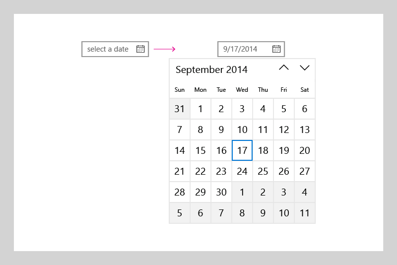
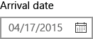

# Calendar date picker

<link rel="stylesheet" href="https://az835927.vo.msecnd.net/sites/uwp/Resources/css/custom.css"> 

The calendar date picker is a drop down control that’s optimized for picking a single date from a calendar view where contextual information like the day of the week or fullness of the calendar is important. You can modify the calendar to provide additional context or to limit available dates.

> **Important APIs**: [CalendarDatePicker class](https://msdn.microsoft.com/library/windows/apps/xaml/windows.ui.xaml.controls.calendardatepicker.aspx), [Date property](https://msdn.microsoft.com/library/windows/apps/xaml/windows.ui.xaml.controls.calendardatepicker.date.aspx), [DateChanged event](https://msdn.microsoft.com/library/windows/apps/xaml/windows.ui.xaml.controls.calendardatepicker.datechanged.aspx)


## Is this the right control?
Use a **calendar date picker** to let a user pick a single date from a contextual calendar view. Use it for things like choosing an appointment or departure date.

To let a user pick a known date, such as a date of birth, where the context of the calendar is not important, consider using a [date picker](date-picker.md).

For more info about choosing the right control, see the [Date and time controls](date-and-time.md) article.

## Examples

The entry point displays placeholder text if a date has not been set; otherwise, it displays the chosen date. When the user selects the entry point, a calendar view expands for the user to make a date selection. The calendar view overlays other UI; it doesn't push other UI out of the way.



## Create a date picker

```xaml
<CalendarDatePicker x:Name="arrivalCalendarDatePicker" Header="Arrival date"/>
```

```csharp
CalendarDatePicker arrivalCalendarDatePicker = new CalendarDatePicker();
arrivalCalendarDatePicker.Header = "Arrival date";
```

The resulting calendar date picker looks like this:



The calendar date picker has an internal [CalendarView](https://msdn.microsoft.com/library/windows/apps/xaml/windows.ui.xaml.controls.calendarview.aspx) for picking a date. A subset of CalendarView properties, like [IsTodayHighlighted](https://msdn.microsoft.com/library/windows/apps/xaml/windows.ui.xaml.controls.calendardatepicker.istodayhighlighted.aspx) and [FirstDayOfWeek](https://msdn.microsoft.com/library/windows/apps/xaml/windows.ui.xaml.controls.calendardatepicker.firstdayofweek.aspx), exist on CalendarDatePicker and are forwarded to the internal CalendarView to let you modify it. 

However, you can't change the [SelectionMode](https://msdn.microsoft.com/library/windows/apps/xaml/windows.ui.xaml.controls.calendarview.selectionmode.aspx) of the internal CalendarView to allow multiple selection. If you need to let a user pick multiple dates or need a calendar to be always visible, consider using a calendar view instead of a calendar date picker. See the [Calendar view](calendar-view.md) article for more info on how you can modify the calendar display.

### Selecting dates

Use the [Date](https://msdn.microsoft.com/library/windows/apps/xaml/windows.ui.xaml.controls.calendardatepicker.date.aspx) property to get or set the selected date. By default, the Date property is **null**. When a user selects a date in the calendar view, this property is updated. A user can clear the date by clicking the selected date in the calendar view to deselect it. 

You can set the date in your code like this.

```csharp
myCalendarDatePicker.Date = new DateTime(1977, 1, 5);
```

When you set the Date in code, the value is constrained by the [MinDate](https://msdn.microsoft.com/library/windows/apps/xaml/windows.ui.xaml.controls.calendardatepicker.mindate.aspx) and [MaxDate](https://msdn.microsoft.com/library/windows/apps/xaml/windows.ui.xaml.controls.calendardatepicker.maxdate.aspx) properties.
- If **Date** is smaller than **MinDate**, the value is set to **MinDate**.
- If **Date** is greater than **MaxDate**, the value is set to **MaxDate**.

You can handle the [DateChanged](https://msdn.microsoft.com/library/windows/apps/xaml/windows.ui.xaml.controls.calendardatepicker.datechanged.aspx) event to be notified when the Date value has changed.

> [!NOTE]
For important info about date values, see [DateTime and Calendar values](date-and-time.md#datetime-and-calendar-values) in the Date and time controls article.

### Setting a header and placeholder text

You can add a [Header](https://msdn.microsoft.com/library/windows/apps/xaml/windows.ui.xaml.controls.calendardatepicker.header.aspx) (or label) and [PlaceholderText](https://msdn.microsoft.com/library/windows/apps/xaml/windows.ui.xaml.controls.calendardatepicker.placeholdertext.aspx) (or watermark) to the calendar date picker to give the user an indication of what it's used for. To customize the look of the header, you can set the [HeaderTemplate](https://msdn.microsoft.com/library/windows/apps/xaml/windows.ui.xaml.controls.calendardatepicker.headertemplate.aspx) property instead of Header.

The default placeholder text is "select a date". You can remove this by setting the PlaceholderText property to an empty string, or you can provide custom text as shown here.

```xaml
<CalendarDatePicker x:Name="arrivalCalendarDatePicker" Header="Arrival date" 
                    PlaceholderText="Choose your arrival date"/>
```

## Get the sample code
* [XAML UI basics sample](https://github.com/Microsoft/Windows-universal-samples/blob/master/Samples/XamlUIBasics)


## Related articles

- [Date and time controls](date-and-time.md)
- [Calendar view](calendar-view.md)
- [Date picker](date-picker.md)
- [Time picker](time-picker.md)
