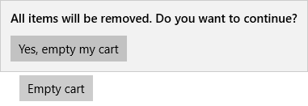

# Dialogs and flyouts

<link rel="stylesheet" href="https://az835927.vo.msecnd.net/sites/uwp/Resources/css/custom.css"> 

Dialogs and flyouts are transient UI elements that appear when something happens that requires notification, approval, or additional information from the user.

<div class="important-apis" >
<b>Important APIs</b><br/>
<ul>
<li>[ContentDialog class](https://msdn.microsoft.com/library/windows/apps/windows.ui.xaml.controls.contentdialog.aspx)</li>
<li>[Flyout class](https://msdn.microsoft.com/library/windows/apps/dn279496)</li>
</ul>
</div>


<div class="side-by-side">
<div class="side-by-side-content">
  <div class="side-by-side-content-left">
   <p><b>Dialogs</b> <br/><br/>
    </p>
<p>Dialogs are modal UI overlays that provide contextual app information. Dialogs block interactions with the app window until being explicitly dismissed. They often request some kind of action from the user.   
</p><br/>

  </div>
  <div class="side-by-side-content-right">
   <p><b>Flyouts</b> <br/><br/>
   </p>
<p>A flyout is a lightweight contextual popup that displays UI related to what the user is doing. It includes placement and sizing logic, and can be used to reveal a hidden control, show more detail about an item, or ask the user to confirm an action. 
</p><p>Unlike a dialog, a flyout can be quickly dismissed by tapping or clicking somewhere outside the flyout, pressing the Escape key or Back button, resizing the app window, or changing the device's orientation.
</p><br/>

  </div>
</div>
</div>

## Is this the right control?

* Use dialogs and flyouts to notify users of important information or to request confirmation or additional info before an action can be completed. 
* Don't use a flyout instead of [tooltip](tooltips.md) or [context menu](menus.md). Use a tooltip to show a short description that hides after a specified time. Use a context menu for contextual actions related to a UI element, such as copy and paste.  


Dialogs and flyouts make sure that users are aware of important information, but they also disrupt the user experience. Because dialogs are modal (blocking), they interrupt users, preventing them from doing anything else until they interact with the dialog. Flyouts provide a less jarring experience, but displaying too many flyouts can be distracting. 

Consider the importance of the information you want to share: is it important enough to interrupt the user? Also consider how frequently the information needs to be shown; if you're showing a dialog or notification every few minutes, you might want to allocate space for this info in the primary UI instead. For example, in a chat client, rather than showing a flyout every time a friend logs in, you might display a list of friends who are online at the moment and highlight friends as they log on. 

Flyouts and dialogs are frequently used to confirm an action (such as deleting a file) before executing it. If you expect the user to perform a particular action frequently, consider providing a way for the user to undo the action if it was a mistake, rather than forcing users to confirm the action every time. 


## Dialogs vs. flyouts

Once you've determined that you want to use a dialog or flyout, you need to choose which one to use. 

Given that dialogs block interactions and flyouts do not, dialogs should be reserved for situations where you want the user to drop everything to focus on a specific bit of information or answer a question. Flyouts, on the other hand, can be used when you want to call attention to something, but it's ok if the user wants to ignore it. 

<div class="side-by-side">
<div class="side-by-side-content">
  <div class="side-by-side-content-left">
   <p><b>Use a dialog for...</b> <br/>
<ul>
<li>Expressing important information that the user **must** read and acknowledge before proceeding. Examples include:
<ul>
  <li>When the user's security might be compromised</li>
  <li>When the user is about to permanently alter a valuable asset</li>
  <li>When the user is about to delete a valuable asset</li>
  <li>To confirm an in-app purchase</li>
</ul>

</li>
<li>Error messages that apply to the overall app context, such as a connectivity error.</li>
<li>Questions, when the app needs to ask the user a blocking question, such as when the app can't choose on the user's behalf. A blocking question can't be ignored or postponed, and should offer the user well-defined choices.</li>
</ul> 
</p>
  </div>
  <div class="side-by-side-content-right">
   <p><b>Use a flyout for...</b> <br/>
<ul>
<li>Collecting additional information needed before an action can be completed.</li>
<li>Displaying info that's only relevant some of the time. For example, in a photo gallery app, when the user clicks an image thumbnail, you might use a flyout to display a large version of the image.</li>
<li>Warnings and confirmations, including ones related to potentially destructive actions.</li>
<li>Displaying more information, such as details or longer descriptions of an item on the page.</li>
</ul></p>
  </div>
</div>
</div>

<div class="microsoft-internal-note">
Light dismiss controls trap keyboard and gamepad focus inside the transient UI until dismissed. To provide a visual cue for this behavior, light dismiss controls on Xbox will draw an overlay that dims the visibility of out of scope UI. This behavior can be modified with the new `LightDismissOverlayMode` property. By default, transient UIs will draw the light dismiss overlay on Xbox but not other device families, but apps can choose to force the overlay to be always **On** or always **Off**.

```xaml
<MenuFlyout LightDismissOverlayMode="Off">
```
</div>

## Dialogs
### General guidelines

d-   Clearly identify the issue or the user's objective in the first line of the dialog's text.
-   The dialog title is the main instruction and is optional.
    -   Use a short title to explain what people need to do with the dialog. Long titles do not wrap and are truncated.
    -   If you're using the dialog to deliver a simple message, error or question, you can optionally omit the title. Rely on the content text to deliver that core information.
    -   Make sure that the title relates directly to the button choices.
-   The dialog content contains the descriptive text and is required.
    -   Present the message, error, or blocking question as simply as possible.
    -   If a dialog title is used, use the content area to provide more detail or define terminology. Don't repeat the title with slightly different wording.
-   At least one dialog button must appear.
    -   Buttons are the only mechanism for users to dismiss the dialog.
    -   Use buttons with text that identifies specific responses to the main instruction or content. An example is, "Do you want to allow AppName to access your location?", followed by "Allow" and "Block" buttons. Specific responses can be understood more quickly, resulting in efficient decision making.	- Present the commit buttons in this order: 
		-   OK/[Do it]/Yes
		-   [Don't do it]/No
		-   Cancel
		
		(where [Do it] and [Don't do it] are specific responses to the main instruction.)
   
-   Error dialogs display the error message in the dialog box, along with any pertinent information. The only button used in an error dialog should be “Close” or a similar action.
-   Don't use dialogs for errors that are contextual to a specific place on the page, such as validation errors (in password fields, for example), use the app's canvas itself to show inline errors.

### Confirmation dialogs (OK/Cancel)
A confirmation dialog gives users the chance to confirm that they want to perform an action. They can affirm the action, or choose to cancel.  
A typical confirmation dialog has two buttons: an affirmation ("OK") button and a cancel button.  

<ul>
    <li>
        <p>In general, the affirmation button should be on the left (the primary button) and the cancel button (the secondary button) should be on the right.</p>
         
        
    </li>
    <li>As noted in the general recommendations section, use buttons with text that identifies specific responses to the main instruction or content.
    </li>
</ul>

> Some platforms put the affirmation button on the right instead of the left. So why do we recommend putting it on the left?  If you assume that the majority of users are right-handed and they hold their phone with that hand, it's actually more comfortable to press the affirmation button when it's on the left, because the button is more likely to be within the user's thumb-arc. Buttons on the right-side of the screen require the user to pull their thumb inward into a less-comfortable position.

### Create a dialog
To create a dialog, you use the [ContentDialog class](https://msdn.microsoft.com/library/windows/apps/windows.ui.xaml.controls.contentdialog.aspx). You can create a dialog in code or markup. Although its usually easier to define UI elements in XAML, in the case of a simple dialog, it's actually easier to just use code. This example creates a dialog to notify the user that there's no WiFi connection, and then uses the [ShowAsync](https://msdn.microsoft.com/en-us/library/windows/apps/windows.ui.xaml.controls.contentdialog.showasync.aspx) method to display it.

```csharp
private async void displayNoWifiDialog()
{
    ContentDialog noWifiDialog = new ContentDialog()
    {
        Title = "No wifi connection",
        Content = "Check connection and try again",
        PrimaryButtonText = "Ok"
    };

    ContentDialogResult result = await noWifiDialog.ShowAsync();
}
```

When the user clicks a dialog button, the [ShowAsync](https://msdn.microsoft.com/en-us/library/windows/apps/windows.ui.xaml.controls.contentdialog.showasync.aspx) method returns a [ContentDialogResult](https://msdn.microsoft.com/en-us/library/windows/apps/windows.ui.xaml.controls.contentdialogresult.aspx) to let you know which button the user clicks. 

The dialog in this example asks a question and uses the returned [ContentDialogResult](https://msdn.microsoft.com/en-us/library/windows/apps/windows.ui.xaml.controls.contentdialogresult.aspx) to determine the user's response. 

```csharp
private async void displayDeleteFileDialog()
{
    ContentDialog deleteFileDialog = new ContentDialog()
    {
        Title = "Delete file permanently?",
        Content = "If you delete this file, you won't be able to recover it. Do you want to delete it?",
        PrimaryButtonText = "Delete",
        SecondaryButtonText = "Cancel"
    };

    ContentDialogResult result = await deleteFileDialog.ShowAsync();
    
    // Delete the file if the user clicked the primary button. 
    /// Otherwise, do nothing. 
    if (result == ContentDialogResult.Primary)
    {
        // Delete the file. 
    }
}
```

## Flyouts
###  Create a flyout

A flyout is an open-ended container that can show arbitrary UI as its content. 

<div class="microsoft-internal-note">
This includes flyouts and context menus, which can be nested inside other flyouts.
</div>

Flyouts are attached to specific controls. You can use the [Placement](https://msdn.microsoft.com/en-us/library/windows/apps/windows.ui.xaml.controls.primitives.flyoutbase.placement.aspx) property to specify where flyout appears: Top, Left, Bottom, Right, or Full. If you select the [Full placement mode](https://msdn.microsoft.com/en-us/library/windows/apps/windows.ui.xaml.controls.primitives.flyoutplacementmode.aspx), the app stretches the flyout and centers it inside the app window. When visible, they should be anchored to the invoking object and specify their preferred relative position to the object: Top, Left, Bottom, or Right. Flyout also has a Full placement mode which attempts to stretch the flyout and center it inside the app window. Some controls, such as [Button](https://msdn.microsoft.com/library/windows/apps/windows.ui.xaml.controls.button.aspx), provide a [Flyout](https://msdn.microsoft.com/library/windows/apps/windows.ui.xaml.controls.button.flyout.aspx) property that you can use to associate a flyout. 

This example creates a simple flyout that displays some text when the button is pressed. 
````xaml
<Button Content="Click me">
  <Button.Flyout>
     <Flyout>
        <TextBlock Text="This is a flyout!"/>
     </Flyout>
  </Button.Flyout>
</Button>
````

If the control doesn't have a flyout property, you can use the [FlyoutBase.AttachedFlyout](https://msdn.microsoft.com/en-us/library/windows/apps/windows.ui.xaml.controls.primitives.flyoutbase.attachedflyout.aspx) attached property instead. When you do this, you also need to call the [FlyoutBase.ShowAttachedFlyout](https://msdn.microsoft.com/en-us/library/windows/apps/windows.ui.xaml.controls.primitives.flyoutbase.showattachedflyout) method to show the flyout. 

This example adds a simple flyout to an image. When the user taps the image, the app shows the flyout. 

````xaml
<Image Source="Assets/cliff.jpg" Width="50" Height="50" 
  Margin="10" Tapped="Image_Tapped">
  <FlyoutBase.AttachedFlyout>
    <Flyout>
      <TextBlock TextWrapping="Wrap" Text="This is some text in a flyout."  />
    </Flyout>        
  </FlyoutBase.AttachedFlyout>
</Image>
````

````csharp
private void Image_Tapped(object sender, TappedRoutedEventArgs e)
{
    FlyoutBase.ShowAttachedFlyout((FrameworkElement)sender);
}
````

The previous examples defined their flyouts inline. You can also define a flyout as a static resource and then use it with multiple elements. This example creates a more complicated flyout that displays a larger version of an image when its thumbnail is tapped. 

````xaml
<!-- Declare the shared flyout as a resource. -->
<Page.Resources>
    <Flyout x:Key="ImagePreviewFlyout" Placement="Right">
        <!-- The flyout's DataContext must be the Image Source 
             of the image the flyout is attached to. -->
        <Image Source="{Binding Path=Source}" 
            MaxHeight="400" MaxWidth="400" Stretch="Uniform"/>
        <Flyout.FlyoutPresenterStyle>
            <Style TargetType="FlyoutPresenter">
                <Setter Property="ScrollViewer.ZoomMode" Value="Enabled"/>
                <Setter Property="Background" Value="Black"/>
                <Setter Property="BorderBrush" Value="Gray"/>
                <Setter Property="BorderThickness" Value="5"/>
                <Setter Property="MinHeight" Value="300"/>
                <Setter Property="MinWidth" Value="300"/>
            </Style>
        </Flyout.FlyoutPresenterStyle>
    </Flyout>
</Page.Resources>
````

````xaml
<!-- Assign the flyout to each element that shares it. -->
<StackPanel>
    <Image Source="Assets/cliff.jpg" Width="50" Height="50" 
           Margin="10" Tapped="Image_Tapped" 
           FlyoutBase.AttachedFlyout="{StaticResource ImagePreviewFlyout}"
           DataContext="{Binding RelativeSource={RelativeSource Mode=Self}}"/>
    <Image Source="Assets/grapes.jpg" Width="50" Height="50" 
           Margin="10" Tapped="Image_Tapped" 
           FlyoutBase.AttachedFlyout="{StaticResource ImagePreviewFlyout}"
           DataContext="{Binding RelativeSource={RelativeSource Mode=Self}}"/>
    <Image Source="Assets/rainier.jpg" Width="50" Height="50" 
           Margin="10" Tapped="Image_Tapped" 
           FlyoutBase.AttachedFlyout="{StaticResource ImagePreviewFlyout}"
           DataContext="{Binding RelativeSource={RelativeSource Mode=Self}}"/>
</StackPanel>
````

````csharp
private void Image_Tapped(object sender, TappedRoutedEventArgs e)
{
    FlyoutBase.ShowAttachedFlyout((FrameworkElement)sender);  
}
````

### Style a flyout
To style a Flyout, modify its [FlyoutPresenterStyle](https://msdn.microsoft.com/library/windows/apps/windows.ui.xaml.controls.flyout.flyoutpresenterstyle.aspx). This example shows a paragraph of wrapping text and makes the text block accessible to a screen reader.

````xaml
<Flyout>
  <Flyout.FlyoutPresenterStyle>
    <Style TargetType="FlyoutPresenter">
      <Setter Property="ScrollViewer.HorizontalScrollMode" Value="Disabled"/>
      <Setter Property="ScrollViewer.HorizontalScrollBarVisibility" Value="Disabled"/>
      <Setter Property="IsTabStop" Value="True"/>
      <Setter Property="TabNavigation" Value="Cycle"/>
    </Style>
  </Flyout.FlyoutPresenterStyle>
  <TextBlock Style="{StaticResource BodyTextBlockStyle}" Text="Lorem ipsum dolor sit amet, consectetur adipiscing elit, sed do eiusmod tempor incididunt ut labore et dolore magna aliqua. Ut enim ad minim veniam, quis nostrud exercitation ullamco laboris nisi ut aliquip ex ea commodo consequat."/>
</Flyout>
````

## Get the samples
*   [XAML UI basics](https://github.com/Microsoft/Windows-universal-samples/blob/master/Samples/XamlUIBasics)<br/>
    See all of the XAML controls in an interactive format.

## Related articles
- [Tooltips](tooltips.md)
- [Menus and context menu](menus.md)
- [**Flyout class**](https://msdn.microsoft.com/library/windows/apps/dn279496)
- [**ContentDialog class**](https://msdn.microsoft.com/library/windows/apps/windows.ui.xaml.controls.contentdialog.aspx)
