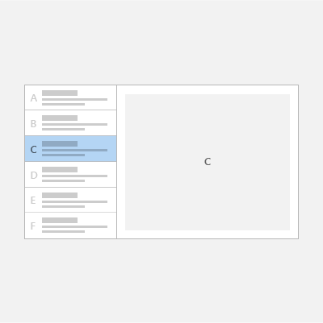

# Master/details pattern

<link rel="stylesheet" href="https://az835927.vo.msecnd.net/sites/uwp/Resources/css/custom.css"> 

The master/details pattern has a master pane (usually with a [list view](lists.md)) and a details pane for content. When an item in the master list is selected, the details pane is updated. This pattern is frequently used for email and address books.

> **Important APIs**: [ListView class](https://docs.microsoft.com/en-us/uwp/api/Windows.UI.Xaml.Controls.ListView), [SplitView class](https://docs.microsoft.com/en-us/uwp/api/windows.ui.xaml.controls.splitview)

## Is this the right pattern?

The master/details pattern works well if you want to:

-   Build an email app, address book, or any app that is based on a list-details layout.
-   Locate and prioritize a large collection of content.
-   Allow the quick addition and removal of items from a list while working back-and-forth between contexts.

## Choose the right style

When implementing the master/details pattern, we recommend that you use either the stacked style or the side-by-side style, based on the amount of available screen space.

| Available window width | Recommended style |
|------------------------|-------------------|
| 320 epx-719 epx        | Stacked           |
| 720 epx or wider       | Side-by-side      |

 
## Stacked style

In the stacked style, only one pane is visible at a time: the master or the details.

The user starts at the master pane and "drills down" to the details pane by selecting an item in the master list. To the user, it appears as though the master and details views exist on two separate pages.

### Create a stacked master/details pattern

One way to create the stacked master/details pattern is to use separate pages for the master pane and the details pane. Place the list view that provides the master list on one page, and the content element for the details pane on a separate page.

For the master pane, a [list view](lists.md) control works well for presenting lists that can contain images and text.

For the details pane, use the content element that makes the most sense. If you have a lot of separate fields, consider using a grid layout to arrange elements into a form.

## Side-by-side style

In the side-by-side style, the master pane and details pane are visible at the same time.

The list in the master pane has a selection visual to indicate the currently selected item. Selecting a new item in the master list updates the details pane.

### Create a side-by-side master/details pattern

For the master pane, a [list view](lists.md) control works well for presenting lists that can contain images and text.

For the details pane, use the content element that makes the most sense. If you have a lot of separate fields, consider using a grid layout to arrange elements into a form.

## Get the code samples

For sample code that shows the master/details pattern, see these samples: 

- [Customer orders database sample](https://github.com/Microsoft/Windows-appsample-customers-orders-database) 
- [ListView and GridView sample](http://go.microsoft.com/fwlink/p/?LinkId=619900)
- [RSS Reader sample](https://github.com/Microsoft/Windows-appsample-rssreader)

## Related articles

- [Lists](lists.md)
- [Search](search.md)
- [App and command bars](app-bars.md)
- [ListView class](https://docs.microsoft.com/en-us/uwp/api/Windows.UI.Xaml.Controls.ListView)
