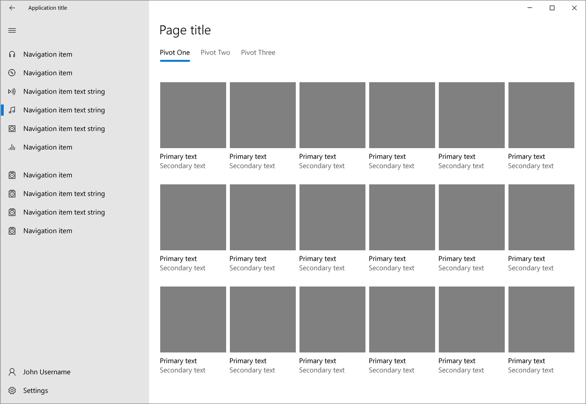
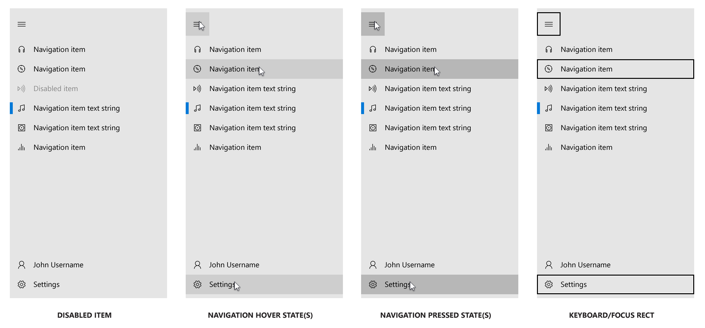
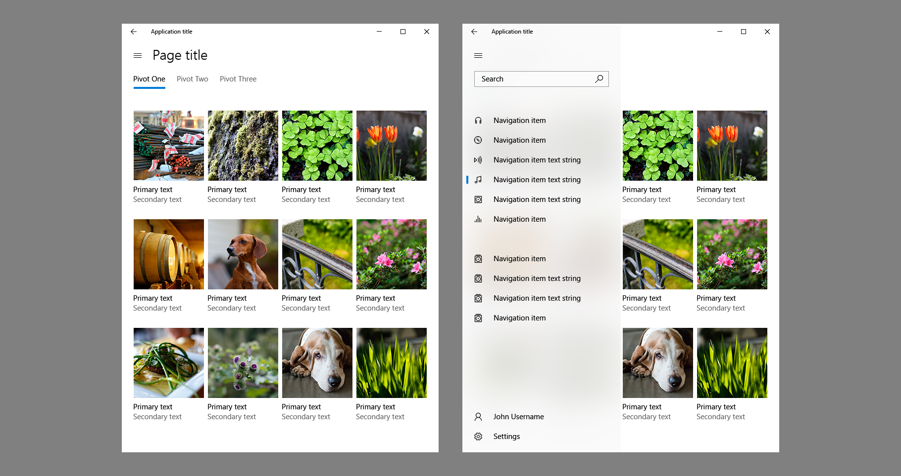
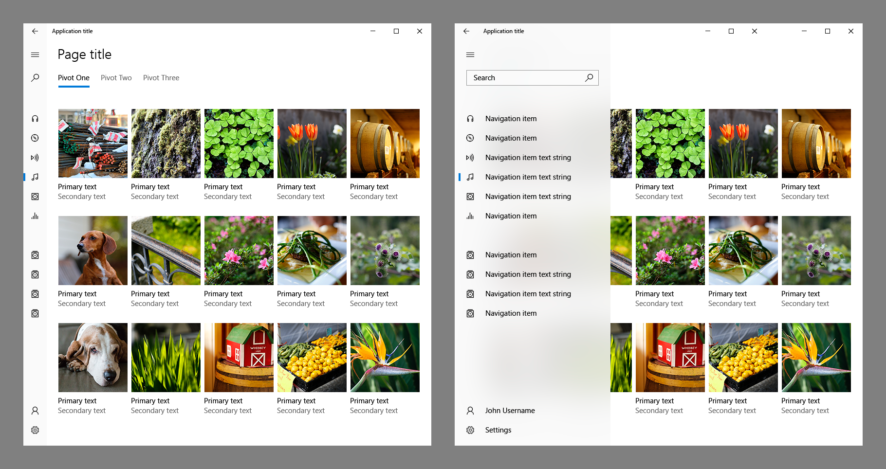
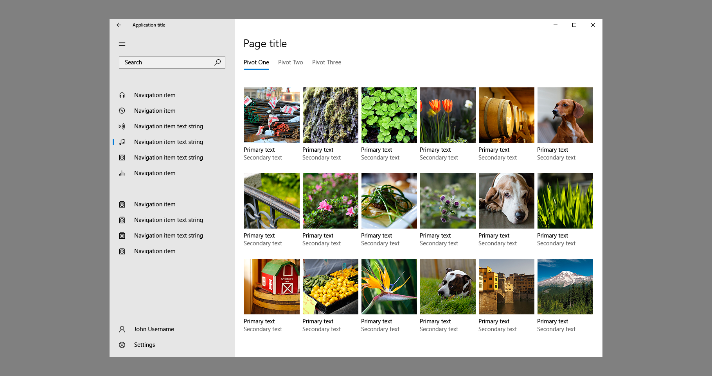

# Navigation view

<link rel="stylesheet" href="https://az835927.vo.msecnd.net/sites/uwp/Resources/css/custom.css">

> [!IMPORTANT]
> This article describes functionality that hasn’t been released yet and may be substantially modified before it's commercially released. Microsoft makes no warranties, express or implied, with respect to the information provided here.

The navigation view control provides a common vertical layout for top-level areas of your app via a collapsible navigation menu. This control is designed to implement the nav pane, or hamburger menu, pattern and automatically adapts its layout to different window sizes.

> **Important APIs**: [NavigationView class](https://docs.microsoft.com/uwp/api/windows.ui.xaml.controls.navigationview), [NavigationViewMenuItem class](https://docs.microsoft.com/uwp/api/windows.ui.xaml.controls.navigationmenuitem), [NavigationViewDisplayMode enumeration](https://docs.microsoft.com/uwp/api/windows.ui.xaml.controls.navigationviewdisplaymode)




## Is this the right control?

NavigationView works well for:

-  Apps with many top-level navigation items that are of similar type. For example, a sports app with categories like Football, Baseball, Basketball, Soccer, and so on.
-  Providing a consistent navigational experience across apps. The pane should include only navigational elements, not actions.
-  A medium-to-high number (5-10) of top-level navigational categories.
-  Preserving screen real estate.
-  Navigation items that might be infrequently accessed.

Navigation view is just one of several navigation elements you can use; to learn more about navigation patterns and other navigation elements, see the [Navigation design basics for Universal Windows Platform (UWP) apps](../layout/navigation-basics.md).

For a code sample of how to build the nav pane pattern using SplitView and ListView, download the [XAML Navigation solution](https://github.com/Microsoft/Windows-universal-samples/tree/dev/Samples/XamlNavigation) from GitHub.

## NavigationView parts
The control is broadly subdivided into three sections - a pane for navigation on the left, and header and content areas on the right.


### Pane

The navigation pane can contain
-  Navigation items, in the form of NavigationMenuItem, for navigating to specific pages
-  Separators, in the form of NavigationMenuItemSeparator, for grouping navigation items
-  An entry point for [app settings](../app-settings/app-settings-and-data.md)
-  Free-form content in the pane’s footer

The built-in navigation ("hamburger") button lets users open and close the pane.

### Header

The header area is visually aligned with the navigation button and has a fixed height. It holds the page title of the selected nav category. The header is docked to the top of the page and acts as a scroll clipping point for the content area.

The header must be visible when navigation view is in Minimal mode. You may choose to hide the header in other modes, which are used on larger window widths. To do so, set the `AlwaysShowHeader` property to False.

### Content

The content area is where most of the information for the selected nav category is displayed. It can contain one or more elements and is a good area for additional sub-level navigation such as [Pivot](tabs-pivot.md).

We recommend 12px margins on your content’s sides when NavigationView is in Minimal mode and 24px margins otherwise.

## Visual style
<div class="microsoft-internal-note">
Redlines for this control are available on [UNI](http://uni/DesignDepot.FrontEnd/#/ProductNav/3050/2/dv/?t=Windows%7CControls%7CNavigationView&f=RS2).<br/><br/>
</div>

Navigation items have support for selected, disabled, pointer over, pressed, and focused visual states.



When hardware and software requirements are met, NavigationView automatically uses the new [Acrylic material](../style/acrylic.md) and [Reveal lights](../style/reveal.md) in its pane.


## NavigationView modes
The navigation view can be open or closed, and has three display mode options when it’s open:
-  **Minimal**
   Only the hamburger button remains fixed while the pane shows and hides as needed.
-  **Compact**
   The pane always shows as a narrow sliver which can be opened to full width.
-  **Expanded**
   The pane stays open alongside the content.

By default, the system automatically selects the best mode based on the amount of screen space available to the control. (You can override this setting — see the next section for details.)

### Minimal



-  When closed, the pane is hidden by default, with only the nav button visible.
-  Provides on-demand navigation that conserves screen real estate. Ideal for apps on phones and phablets.
-  Pressing the nav button opens and closes the pane, which draws as an overlay above the header and content. Content does not reflow.
-  When open, the pane is transient and can be closed with a light dismiss gesture such as making a selection, pressing the back button, or tapping outside the pane.
-  The selected item becomes visible when the pane’s overlay opens.
-  When requirements are met, the open pane’s background is [in-app acrylic](../style/acrylic.md#acrylic-blend-types).
-  NavigationView is in Minimal mode when its overall width is less than or equal to 640px.

### Compact



-  When closed, a vertical sliver of the pane showing only icons and the nav button is visible.
-  Provide some indication of the selected location while using a small amount of screen real-estate.
-  This mode is better suited for medium screens like tablets and [10-foot experiences](../input-and-devices/designing-for-tv.md).
-  Pressing the nav button opens and closes the pane, which draws as an overlay above the header and content. Content does not reflow.
-  The Header is not required and can be hidden to give Content more vertical space.
-  The selected item shows a visual indicator to highlight where the user is in the navigation tree.
-  When requirements are met, the open pane’s background is [in-app acrylic](../style/acrylic.md#acrylic-blend-types).
-  NavigationView is in Compact mode when its overall width is between 641px and 1008px.

### Expanded



-  By default, the pane remains open. This mode is better suited for larger screens.
-  The pane draws side-by-side with the header and content, which reflows within its available space.
-  The Header is not required and can be hidden to give Content more vertical space.
-  The selected item shows a visual indicator to highlight where the user is in the navigation tree.
-  When requirements are met, the pane’s background is painted using [background acrylic](../style/acrylic.md#acrylic-blend-types).
-  NavigationView is in Expanded mode when its overall width is greater than 1007px.

## Overriding the default responsive behavior

The navigation view automatically changes its display mode based on the amount of screen space available to it.
[!NOTE] NavigationView should serve as the root container of your app, this control is designed to span the full width and height of the app window.
If you want to change that behavior, you can also use the `CompactModeThresholdWidth` and `ExpandedModeThreasholdWidth` properties to override the widths at which the navigation view changes display modes. Consider the following scenarios that illustrate when you might want to customize the display mode behavior.

-  **Frequent navigation**
   If you expect users to navigate between app areas somewhat frequently, consider keeping the pane in view at narrower window widths. A music app with Songs / Albums / Artists navigation areas may opt for a 280px pane width and remain in Expanded mode while the app window is wider than 560px.
```xaml
<NavigationView OpenPaneLength=”280” CompactModeThresholdWidth="560" ExpandedModeThresholdWidth=”560”/>
```
-	 **Rare navigation**
   If you expect users to navigate between app areas very infrequently, consider keeping the pane hidden at wider window widths. A calculator app with multiple layouts may opt to remain in Minimal mode even when the app is maximized on a 1080p display.
```xaml
<NavigationView CompactModeThresholdWidth=”1920” ExpandedModeThresholdWidth=”1920”/>
```
-	 **Icon disambiguation**
   If your app’s navigation areas don’t lend themselves to meaningful icons, avoid using Compact mode. An image viewing app with Collections / Albums / Folders navigation areas may opt for showing NavigationView in Minimal mode at narrow and medium widths, and in Expanded mode at wide width.
```xaml
<NavigationView CompactModeThresholdWidth=”1010”/>
```

## Interaction

When users tap on a navigation category in the Pane, NavigationView will show that item as selected and will raise an Invoked event. Your app is responsible for updating the Header and Content with appropriate information in response to this user interaction. In addition, we recommend programmatically moving focus from the navigation item to the content. By setting initial focus on load, you streamline the user flow and minimize the expected number of keyboard focus moves.

## How to use NavigationView

The following is a simple example of how you can incorporate NavigationView into your app.

```xaml
<Page
    x:Class="NavigationViewSample.MainPage"
    xmlns="http://schemas.microsoft.com/winfx/2006/xaml/presentation"
    xmlns:x="http://schemas.microsoft.com/winfx/2006/xaml"
    xmlns:local="using:NavigationViewSample"
    xmlns:controls="using:Windows.UI.Xaml.Controls"
    xmlns:d="http://schemas.microsoft.com/expression/blend/2008"
    xmlns:mc="http://schemas.openxmlformats.org/markup-compatibility/2006"
    mc:Ignorable="d">

    <NavigationView x:Name="NavView"
                    SettingsInvoked="NavView_SettingsInvoked"
                    Loaded="NavView_Loaded">
    <!-- Load NavigationMenuItems in NavView_Loaded. -->

        <NavigationView.HeaderTemplate>
            <DataTemplate>
                <Grid>
                    <Grid.ColumnDefinitions>
                        <ColumnDefinition Width="Auto"/>
                        <ColumnDefinition/>
                    </Grid.ColumnDefinitions>
                    <TextBlock Style="{StaticResource TitleTextBlockStyle}"
                           FontSize="28"
                           VerticalAlignment="Center"
                           Margin="12,0"
                           Text="Welcome"/>
                    <CommandBar Grid.Column="1"
                            HorizontalAlignment="Right"
                            DefaultLabelPosition="Right"
                            Background="{ThemeResource SystemControlBackgroundAltHighBrush}">
                        <AppBarButton Label="Refresh" Icon="Refresh"/>
                        <AppBarButton Label="Import" Icon="Import"/>
                    </CommandBar>
                </Grid>
            </DataTemplate>
        </NavigationView.HeaderTemplate>

        <NavigationView.PaneFooter>
            <HyperlinkButton x:Name="MoreInfoBtn"
                             Content="More info"
                             Click="More_Click"
                             Margin="12,0"/>
        </NavigationView.PaneFooter>

        <Frame x:Name="ContentFrame">
            <Frame.ContentTransitions>
                <TransitionCollection>
                    <NavigationThemeTransition/>
                </TransitionCollection>
            </Frame.ContentTransitions>
        </Frame>

    </NavigationView>
</Page>
```

```csharp
private void NavView_Loaded(object sender, RoutedEventArgs e)
{
    NavView.MenuItems.Add(new NavigationMenuItem()
        { Text = "Apps", Icon = new SymbolIcon(Symbol.AllApps), Tag = "apps" });
    NavView.MenuItems.Add(new NavigationMenuItem()
        { Text = "Games", Icon = new SymbolIcon(Symbol.Video), Tag = "games" });
    NavView.MenuItems.Add(new NavigationMenuItem()
        { Text = "Music", Icon = new SymbolIcon(Symbol.Audio), Tag = "music" });
    NavView.MenuItems.Add(new NavigationMenuItemSeparator());
    NavView.MenuItems.Add(new NavigationMenuItem()
        { Text = "My content", Icon = new SymbolIcon(Symbol.Folder), Tag = "content" });

    foreach (var nmi in NavView.MenuItems)
    {
        if (nmi is NavigationMenuItem)
        {
            (nmi as NavigationMenuItem).Invoked += Nav_Invoked;
        }
    }
}

private void Nav_Invoked(NavigationMenuItem sender, object args)
{
    switch (sender.Tag.ToString())
    {
        case "apps":
            ContentFrame.Navigate(typeof(AppsPage));
            break;

        case "games":
            ContentFrame.Navigate(typeof(GamesPage));
            break;

        case "music":
            ContentFrame.Navigate(typeof(MusicPage));
            break;

        case "content":
            ContentFrame.Navigate(typeof(MyContentPage));
            break;
    }
}

private void NavView_SettingsInvoked(NavigationView sender, object args)
{
    ContentFrame.Navigate(typeof(SettingsPage));
}
```

## Navigation

NavigationView does not automatically show the back button in your app’s title bar nor add content to the back stack. The control does not automatically respond to software or hardware back button presses. Please see the [history and backwards navigation](../layout/navigation-history-and-backwards-navigation.md) section for more information about this topic and how to add support for navigation to your app.


## Related topics

* [NavigationView class](https://docs.microsoft.com/uwp/api/windows.ui.xaml.controls.navigationview)
* [Master/details](master-details.md)
* [Pivot control](tabs-pivot.md)
* [Navigation basics](../layout/navigation-basics.md)
 

 
