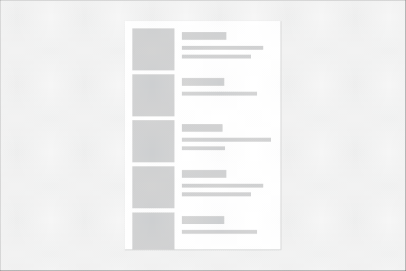
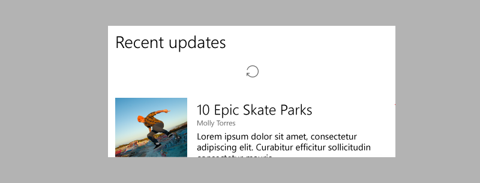
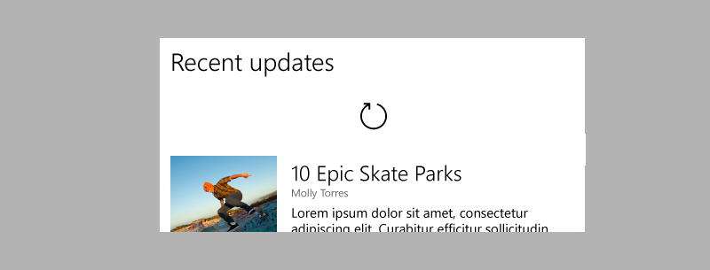
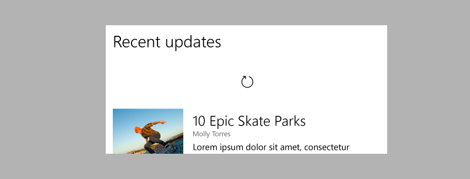
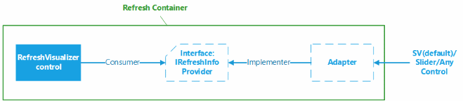

# Pull to refresh

<link rel="stylesheet" href="https://az835927.vo.msecnd.net/sites/uwp/Resources/css/custom.css">

Pull-to-refresh lets a user pull down on a list of data using touch in order to retrieve more data. Pull-to-refresh is widely used on devices with a touch screen. You can use the APIs shown here to implement pull-to-refresh in your app.

>This article describes functionality that hasn’t been released yet: the pull to refresh will be available in RS3 and later builds. Feature names (such as "pull to refresh"), terminology, and functionality are not final.



<div class="microsoft-internal-note">
<iframe width=640 height=360 src='https://microsoft.sharepoint.com/portals/hub/_layouts/15/VideoEmbedHost.aspx?chId=552c725c%2De353%2D4118%2Dbd2b%2Dc2d0584c9848&amp;vId=b48d3a99%2D5e51%2D43c9%2Db9ae%2Ddd7d6e278f09&amp;width=640&amp;height=360&amp;autoPlay=false&amp;showInfo=true' allowfullscreen></iframe>
</div>

## Is this the right control?

Use pull-to-refresh when you have a list or grid of data that the user might want to refresh regularly, and your app is likely to be running on touch-first devices.

The **RefreshContainer** control works only with touch. However, you should use the **RefreshVisualizer** and **IRefreshInfoProvider** APIs to implement refresh using a refresh button or other UI.

## Refresh visualization

The default refresh visualization is a circular progress ring that is used to communicate when a refresh will happen and the progress of the refresh after it is initiated.

The refresh visualization has 4 states. The distance the user needs to pull down on a list to initiate a refresh is called the *threshold*. The states for the progress ring are determined by the pull state as it relates to this threshold.

**Pre-threshold**



The first state is pre-threshold where the icon is displayed as disabled (60% opacity). In addition, the icon spins one full rotation with the scroll action.


**At threshold**



The second state is when the threshold is reached. At this point the icon switches to 100% opacity and pulses in size up to 150% and then back to 100% size.


**Post-threshold**



The third state is post threshold where the icon is 100% in both size and opacity. During this state the icon continues to move down with the scroll action but no longer spins.


**Refreshing**

The fourth state is for an initiated refresh where the icon settles back to the threshold location and spins for the duration of the refresh. This spinning is used to show progress of the refresh and is replaced by the animation of the incoming content.


## Implement pull-to-refresh

Two new controls and a new interface have been introduced to enable pull-to-refresh functionality.

- **RefreshVisualizer**

    RefreshVisualizer encapsulates the refresh visualization explained in the previous section.

- **RefreshContainer**

    RefreshContainer is a ContentControl that provides a wrapper for the pull-to-refresh experience.

- **IRefreshInfoProvider**

    An adapter is provided to turn a ScrollViewer into an IRefreshInfoProvider. To provide pull-to-refresh behavior for any other control or scrollable surface, you need to implement or adapt to the IRefreshInfoProvider interface.


 

The main control is the **RefreshContainer**, which you place as a wrapper around the content that is pulled on to trigger a refresh. RefreshContainer works only with touch, so we recommend that you also have a refresh button available for users who don't have a touch interface. You can position the refresh button at a suitable location in the app, either on the appbar or at a location close to the surface being ‘refreshed’.

### Using a ScrollViewer in a RefreshContainer

This example shows how to use pull-to-refresh with a scroll viewer.

```xaml
<StackPanel Background="{ThemeResource ApplicationPageBackgroundThemeBrush}" Margin="100">
    <Button x:Name="RefreshButton" Content="Refresh"/>
    <winui:RefreshContainer x:Name="RefreshContainer" RefreshVisualizerLocation="Top">
        <ScrollViewer Width="500" Height="500"
                      VerticalScrollMode="Enabled"
                      VerticalScrollBarVisibility="Auto"
                      HorizontalScrollBarVisibility="Auto"/>
        </ScrollViwer>
    </winui:RefreshContainer>
</StackPanel>
```

### Adding pull-to-refresh to a ListView

This example shows how to use pull-to-refresh with a list view.

```xaml
<StackPanel Background="{ThemeResource ApplicationPageBackgroundThemeBrush}" Margin="100">
    <Button x:Name="RefreshButton" Content="Refresh"/>
    <winui:RefreshContainer x:Name="RefreshContainer" RefreshVisualizerLocation="Top">
        <ListView x:Name="lv" Width="400" Height="500"
            <!--populate list view with items -->
        </ListView>
    </winui:RefreshContainer>
</StackPanel>
```

```csharp
 public MainPage()
 {
     InitializeComponent();
     RefreshCompletionDeferral = null;
     Loaded += OnMainPageLoaded;
     RefreshButton.Click += RefreshButtonClick;
}

private void RefreshButtonClick(object sender, RoutedEventArgs e)
{
    RefreshContainer.RefreshRequested();
}

private void OnMainPageLoaded (object sender, object e)
{           
    Loaded -= OnMainPageLoaded;
    RefreshContainer.RefreshVisualizer.RefreshRequested += RefreshVisualizer_RefreshRequested;
    RefreshContainer.RefreshVisualizer.RefreshStatusChanged += RefreshVisualizer_RefreshStatusChanged;
}

private void RefreshVisualizer_RefreshStatusChanged(object sender, RefreshStatusChangedEventArgs e)
{
    // App responds to visual status changes.
}

private void RefreshVisualizer_RefreshRequested(RefreshVisualizer sender, RefreshRequestedEventArgs e)
{
    // App responds to a request by performing a refresh and using our deferral object.
    RefreshCompletionDeferral = e.GetDeferral();

    // Do some async operation to refresh the content
       ...
}

// When async operation is done use the Deferral object.
Private void AsyncOpDone()
{
    // Mark the completion of the asynchronous data refresh
    RefreshCompletionDeferral.Complete();
}

private Deferral RefreshCompletionDeferral
{
    get;
    set;
}

```

## Related articles

- [Touch interactions](../input-and-devices/touch-interactions.md)
- [List view and grid view](listview-and-gridview.md)
