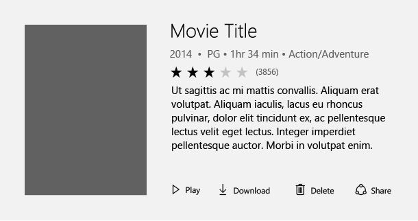

# Ratings Control

Allowing users to easily view and set ratings that reflect degrees of satisfaction with content and services is a critical app scenario.  The ratings control allows your users to do this with touch, pen, mouse, gamepad and keyboard. Use the ratings control to let your users rate movies, music and books with high quality interaction and animation. The ratings control has several great features that provide flexibility and customization.

>This article describes functionality that hasn’t been released yet: the ratings control will be available in RS3 and later builds. Feature names (such as "ratings control"), terminology, and functionality are not final.


## Key Scenarios and Features
In this article, we describe some key scenarios that the ratings control supports. Each scenario includes an example to provide context, and code that shows how to achieve the scenario.

### Editable Rating with Placeholder Value

Perhaps the most common way to use the ratings control is to display an average rating while still allowing the user to enter their own rating value. In this scenario, the ratings control is initially set to reflect the average satisfaction rating of all users of a particular service or type of content (such as a music, videos, books, etc.). It remains in this state until a user interacts with the control with the goal of individually rating an item. This interaction changes the state of the ratings control to reflect the user's personal satisfaction rating.

#### Initial Average Rating State


#### Representation of User Rating Once Set


```XAML
<RatingsControl x:Name=”MyRatings” ValueChanged="RatingChanged"/>
```

```csharp
private void RatingChanged(RatingsControl sender, object e)
{
    if (sender.Value == null)
    {
        MyRatings.Caption = “(“ + SomeWebService.HowManyPreviousRatings() + “)”;
    }

    else
    {
        MyRatings.Caption = “Your rating”;
    }
}
```
### Read Only Rating Mode

Often times, you would like to show ratings of secondary content, such as that displayed in recommended content or when displaying a list of comments and their corresponding ratings. In this case, the user shouldn’t be able to edit the rating, so you can make the control read-only.
The read only mode is also the recommended way of using the ratings control when it is used in very large virtualized lists of content, for both UI design and performance reasons.


To do this you would do the following:

```XAML
<StackPanel Orientation="Horizontal" Height="60">
    <Image Height="40" Width="40" Source="facebook.png" />   
    <StackPanel>
        <TextBlock Text="Facebook" FontSize="20" />

        <RatingsControl PlaceholderValue="6.2"
                    ItemWidth="{ThemeResources RatingsControlItemCompactWidth}"
                    IsReadOnly="True"
                    ItemSpacing="{ThemeResources RatingsControlItemCompactSpacing}" />
    </StackPanel>
</StackPanel>
```

## Additional Functionality

The ratings control has many additional features which can be used. Details for using these features can be found in our MSDN reference documentation.
Here is a non-comprehensive list of additional functionality:
-   Great long list performance
-   Compact sizing for tight UI scenarios
-   Continuous value fill and rating
-   Spacing customization
-   Disable growth animations
-   Customization of the number of stars


<div class=”microsoft-internal-note”>
<p>
<p>
Note: The [Rating Control Redlines](https://msdn.microsoft.com/library/windows/apps/xaml/windows.ui.xaml.controls.datepicker.date.aspx) are a good resource if you'd like to learn more.
</div>
