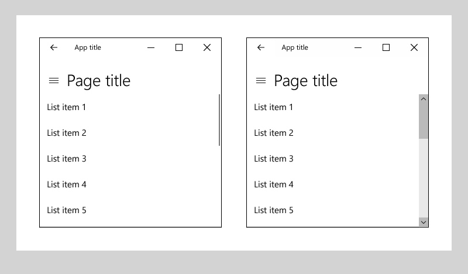

# Scroll bars

<link rel="stylesheet" href="https://az835927.vo.msecnd.net/sites/uwp/Resources/css/custom.css"> 

Panning and scrolling allows users to reach content that extends beyond the bounds of the screen.

A scroll viewer control is composed of as much content as will fit in the viewport, and either one or two scroll bars. Touch gestures can be used to pan and zoom (the scroll bars fade in only during manipulation), and the pointer can be used to scroll. The flick gesture pans with inertia.

**Note**  Windows has two scroller visualizations, which are based on the user's input mode: scroll indicators when using touch or gamepad; and interactive scroll bars for other input devices including mouse, keyboard, and pen.


<div class="microsoft-internal-note">
See complete redlines in [Design Depot](http://designdepot/DesignDepot.FrontEnd/#/ML/Dashboard/1805)
</div>

<div class="important-apis" >
<b>Important APIs</b><br/>
<ul>
<li>[**ScrollViewer class**](https://msdn.microsoft.com/library/windows/apps/br209527)</li>
<li>[**ScrollBar class**](https://msdn.microsoft.com/library/windows/apps/windows.ui.xaml.controls.primitives.scrollbar.aspx)</li>
</ul>
</div>


## Examples

A [**ScrollViewer**](https://msdn.microsoft.com/library/windows/apps/xaml/windows.ui.xaml.controls.scrollviewer.aspx) enables content to be displayed in a smaller area than its actual size. When the content of the scroll viewer is not entirely visible, the scroll viewer displays scrollbars that the user can use to move the content area that is visible. The area that includes all of the content of the scroll viewer is the *extent*. The visible area of the content is the *viewport*.



## Create a scroll viewer
To add vertical scrolling to your page, wrap the page content in a scroll viewer.

```xaml
<Page
    x:Class="App1.MainPage"
    xmlns="http://schemas.microsoft.com/winfx/2006/xaml/presentation"
    xmlns:x="http://schemas.microsoft.com/winfx/2006/xaml"
    xmlns:local="using:App1">

    <ScrollViewer>
        <StackPanel>
            <TextBlock Text="My Page Title" Style="{StaticResource TitleTextBlockStyle}"/>
            <!-- more page content -->
        </StackPanel>
    </ScrollViewer>
</Page>
```
This XAML shows how to place an image in a scroll viewer and enable zooming.

```xaml
<ScrollViewer ZoomMode="Enabled" MaxZoomFactor="10"
              HorizontalScrollMode="Enabled" HorizontalScrollBarVisibility="Visible"
              Height="200" Width="200">
    <Image Source="Assets/Logo.png" Height="400" Width="400"/>
</ScrollViewer>
```

## ScrollViewer in a control template

It's typical for a ScrollViewer control to exist as a composite part of other controls. A ScrollViewer part, along with the [**ScrollContentPresenter**](https://msdn.microsoft.com/library/windows/apps/xaml/windows.ui.xaml.controls.scrollcontentpresenter.aspx) class for support, will display a viewport along with scrollbars only when the host control's layout space is being constrained smaller than the expanded content size. This is often the case for lists, so [**ListView**](https://msdn.microsoft.com/library/windows/apps/xaml/windows.ui.xaml.controls.listview.aspx) and [**GridView**](https://msdn.microsoft.com/library/windows/apps/xaml/windows.ui.xaml.controls.gridview.aspx) templates always include a ScrollViewer. [**TextBox**](https://msdn.microsoft.com/library/windows/apps/xaml/windows.ui.xaml.controls.textbox.aspx) and [**RichEditBox**](https://msdn.microsoft.com/library/windows/apps/xaml/windows.ui.xaml.controls.richeditbox.aspx) also include a ScrollViewer in their templates.

When a **ScrollViewer** part exists in a control, the host control often has built-in event handling for certain input events and manipulations that enable the content to scroll. For example, a GridView interprets a swipe gesture and this causes the content to scroll horizontally. The input events and raw manipulations that the host control receives are considered handled by the control, and lower-level events such as [**PointerPressed**](https://msdn.microsoft.com/library/windows/apps/xaml/windows.ui.xaml.uielement.pointerpressed.aspx) won't be raised and won't bubble to any parent containers either. You can change some of the built-in control handling by overriding a control class and the **On*** virtual methods for events, or by retemplating the control. But in either case it's not trivial to reproduce the original default behavior, which is typically there so that the control reacts in expected ways to events and to a user's input actions and gestures. So you should consider whether you really need that input event to fire. You might want to investigate whether there are other input events or gestures that are not being handled by the control, and use those in your app or control interaction design.

To make it possible for controls that include a ScrollViewer to influence some of the behavior and properties that are from within the ScrollViewer part, ScrollViewer defines a number of XAML attached properties that can be set in styles and used in template bindings. For more info about attached properties, see [Attached properties overview](../xaml-platform/attached-properties-overview.md).

**ScrollViewer XAML attached properties**

ScrollViewer defines the following XAML attached properties:
- [ScrollViewer.BringIntoViewOnFocusChange](https://msdn.microsoft.com/library/windows/apps/xaml/windows.ui.xaml.controls.scrollviewer.bringintoviewonfocuschange.aspx)
- [ScrollViewer.HorizontalScrollBarVisibility](https://msdn.microsoft.com/library/windows/apps/xaml/windows.ui.xaml.controls.scrollviewer.horizontalscrollbarvisibility.aspx)
- [ScrollViewer.HorizontalScrollMode](https://msdn.microsoft.com/library/windows/apps/xaml/windows.ui.xaml.controls.scrollviewer.horizontalscrollmode.aspx)
- [ScrollViewer.IsDeferredScrollingEnabled](https://msdn.microsoft.com/library/windows/apps/xaml/windows.ui.xaml.controls.scrollviewer.isdeferredscrollingenabled.aspx)
- [ScrollViewer.IsHorizontalRailEnabled](https://msdn.microsoft.com/library/windows/apps/xaml/windows.ui.xaml.controls.scrollviewer.ishorizontalrailenabled.aspx)
- [ScrollViewer.IsHorizontalScrollChainingEnabled](https://msdn.microsoft.com/library/windows/apps/xaml/windows.ui.xaml.controls.scrollviewer.ishorizontalscrollchainingenabled.aspx)
- [ScrollViewer.IsScrollInertiaEnabled](https://msdn.microsoft.com/library/windows/apps/xaml/windows.ui.xaml.controls.scrollviewer.isscrollinertiaenabled.aspx)
- [ScrollViewer.IsVerticalRailEnabled](https://msdn.microsoft.com/library/windows/apps/xaml/windows.ui.xaml.controls.scrollviewer.isverticalrailenabled.aspx)
- [ScrollViewer.IsVerticalScrollChainingEnabled](https://msdn.microsoft.com/library/windows/apps/xaml/windows.ui.xaml.controls.scrollviewer.isverticalscrollchainingenabled.aspx)
- [ScrollViewer.IsZoomChainingEnabled](https://msdn.microsoft.com/library/windows/apps/xaml/windows.ui.xaml.controls.scrollviewer.iszoominertiaenabled.aspx)
- [ScrollViewer.IsZoomInertiaEnabled](https://msdn.microsoft.com/library/windows/apps/xaml/windows.ui.xaml.controls.scrollviewer.iszoominertiaenabled.aspx)
- [ScrollViewer.VerticalScrollBarVisibility](https://msdn.microsoft.com/library/windows/apps/xaml/windows.ui.xaml.controls.scrollviewer.verticalscrollbarvisibilityproperty.aspx)
- [ScrollViewer.VerticalScrollMode](https://msdn.microsoft.com/library/windows/apps/xaml/windows.ui.xaml.controls.scrollviewer.verticalscrollmode.aspx)
- [ScrollViewer.ZoomMode](https://msdn.microsoft.com/library/windows/apps/xaml/windows.ui.xaml.controls.scrollviewer.zoommode.aspx)

These XAML attached properties are intended for cases where the ScrollViewer is implicit, such as when the ScrollViewer exists in the default template for a ListView or GridView, and you want to be able to influence the scrolling behavior of the control without accessing template parts.

For example, here's how to make the vertical scroll bars always visible for a ListView's built in scroll viewer.
```xaml
<ListView ScrollViewer.VerticalScrollBarVisibility="Visible"/>
```

For cases where a ScrollViewer is explicit in your XAML, as is shown in the example code, you don't need to use attached property syntax. Just use attribute syntax, for example `<ScrollViewer VerticalScrollBarVisibility="Visible"/>`.


## Do's and don'ts

-   Whenever possible, design for vertical scrolling rather than horizontal.
-   Use one-axis panning for content regions that extend beyond one viewport boundary (vertical or horizontal). Use two-axis panning for content regions that extend beyond both viewport boundaries (vertical and horizontal).
-   Use the built-in scroll functionality in the list view, grid view, combo box, list box, text input box, and hub controls. With those controls, if there are too many items to show all at once, the user is able to scroll either horizontally or vertically over the list of items.
-   If you want the user to pan in both directions around a larger area, and possibly to zoom, too, for example, if you want to allow the user to pan and zoom over a full-sized image (rather than an image sized to fit the screen) then place the image inside a scroll viewer.
-   If the user will scroll through a long passage of text, configure the scroll viewer to scroll vertically only.
-   Use a scroll viewer to contain one object only. Note that the one object can be a layout panel, in turn containing any number of objects of its own.
-   Don't place a [Pivot](tabs-pivot.md) control inside a scroll viewer to avoid conflicts with pivot's scrolling logic.

## Related topics

**For developers (XAML)**
* [**ScrollViewer class**](https://msdn.microsoft.com/library/windows/apps/br209527)
