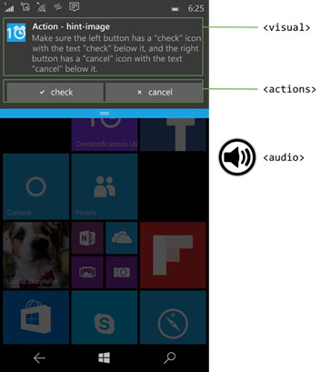
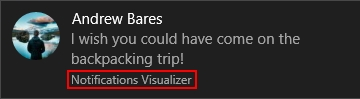
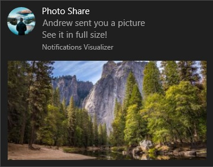
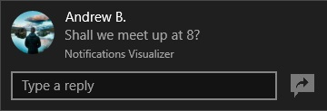

# Adaptive and interactive toast notifications

<link rel="stylesheet" href="https://az835927.vo.msecnd.net/sites/uwp/Resources/css/custom.css">

Adaptive and interactive toast notifications let you create flexible pop-up notifications with more content, optional inline images, and optional user interaction.

The adaptive and interactive toast notifications model has these updates over the legacy toast template catalog:

-   The option to include buttons and inputs on the notifications.
-   Three different activation types for the main toast notification and for each action.
-   The option to create a notification for certain scenarios, including alarms, reminders, and incoming calls.

**Note**   To see the legacy templates from Windows 8.1 and Windows Phone 8.1, see the [legacy toast template catalog](https://msdn.microsoft.com/library/windows/apps/hh761494).


## Getting started

**Install Notifications library.** If you'd like to use C# instead of XML to generate notifications, install the NuGet package named [Microsoft.Toolkit.Uwp.Notifications](https://www.nuget.org/packages/Microsoft.Toolkit.Uwp.Notifications/) (search for "notifications uwp"). The C# samples provided in this article use version 1.0.0 of the NuGet package.

**Install Notifications Visualizer.** This free UWP app helps you design interactive toast notifications by providing an instant visual preview of your toast as you edit it, similar to Visual Studio's XAML editor/design view. You can read [this blog post](http://blogs.msdn.com/b/tiles_and_toasts/archive/2015/09/22/introducing-notifications-visualizer-for-windows-10.aspx) for more information, and you can download Notifications Visualizer [here](https://www.microsoft.com/store/apps/notifications-visualizer/9nblggh5xsl1).


## Toast notification structure


Toast notifications are constructed using XML, which would typically contain these key elements:

-   &lt;visual&gt; covers the content available for the users to visually see, including text and images
-   &lt;actions&gt; contains buttons/inputs the developer wants to add inside the notification
-   &lt;audio&gt; specifies the sound played when the notification pops

Here's a code example:

```XML
<toast launch="app-defined-string">
  <visual>
    <binding template="ToastGeneric">
      <text>Sample</text>
      <text>This is a simple toast notification example</text>
      <image placement="AppLogoOverride" src="oneAlarm.png" />
    </binding>
  </visual>
  <actions>
    <action content="check" arguments="check" imageUri="check.png" />
    <action content="cancel" arguments="cancel" />
  </actions>
  <audio src="ms-winsoundevent:Notification.Reminder"/>
</toast>
```

```CSharp
ToastContent content = new ToastContent()
{
    Launch = "app-defined-string",
 
    Visual = new ToastVisual()
    {
        BindingGeneric = new ToastBindingGeneric()
        {
            Children =
            {
                new AdaptiveText()
                {
                    Text = "Sample"
                },
 
                new AdaptiveText()
                {
                    Text = "This is a simple toast notification example"
                }
            },
 
            AppLogoOverride = new ToastGenericAppLogo()
            {
                Source = "oneAlarm.png"
            }
        }
    },
 
    Actions = new ToastActionsCustom()
    {
        Buttons =
        {
            new ToastButton("check", "check")
            {
                ImageUri = "check.png"
            },
 
            new ToastButton("cancel", "cancel")
            {
                ImageUri = "cancel.png"
            }
        }
    },
 
    Audio = new ToastAudio()
    {
        Src = new Uri("ms-winsoundevent:Notification.Reminder")
    }
};
```

Next we need to convert the toast into an [XmlDocument](https://msdn.microsoft.com/en-us/library/windows/apps/windows.data.xml.dom.xmldocument.aspx) object. If you defined the toast in an XML file (here named "content.xml"), use this code:

```CSharp
string xmlText = File.ReadAllText("content.xml");
XmlDocument xmlContent = new XmlDocument();
xmlContent.LoadXml(xmlText);
```

Or, if you defined the toast template in C#, use this:

```CSharp
XmlDocument xmlContent = content.GetXml();
```

Regardless of how you create the XMLDocument, you can then use this code to create and send the toast:

```CSharp
ToastNotification notification = new ToastNotification(xmlContent);
ToastNotificationManager.CreateToastNotifier().Show(notification);
```

To see a complete app that shows toast notifications in action, see the [Quickstart on Sending a local toast notifications](https://github.com/WindowsNotifications/quickstart-sending-local-toast-win10).

Here is a visual representation of the structure:



### Visual

Inside the visual element, you must have exactly one binding element that contains the visual content of the toast.

Tile notifications in Universal Windows Platform (UWP) apps support multiple templates that are based on different tile sizes. Toast notifications, however, have only one template name: **ToastGeneric**. Having just the one template name means:

-   You can change the toast content, such as adding another line of text, adding an inline image, or changing the thumbnail image from displaying the app icon to something else, and do any of these things without worrying about changing the entire template or creating an invalid payload due to a mismatch between the template name and the content.
-   You can use the same code to cons truct the same payload for the **toast notification** that targets to deliver to different types of Microsoft Windows devices, including phones, tablets, PCs, and Xbox One. Each of these devices will accept the notification and display it to the user under their UI policies with the appropriate visual affordances and interaction model.

For all attributes supported in the visual section and its child elements, see the Schema section below. For more examples, see the XML examples section below.

Your app's identity is conveyed via your app icon. However, if you use appLogoOverride, we will display your app name beneath your lines of text.

| Normal toast                                                                              | Toast with appLogoOverride                                                          |
| ----------------------------------------------------------------------------------------- | ----------------------------------------------------------------------------------- |
|  |  |

### Actions

In UWP apps, you can add buttons and other inputs to your toast notifications, which lets users do more outside of the app. These actions are specified under the &lt;actions&gt; element, of which there are two types that you can specify:

-   &lt;action&gt; This appears as a button on desktop and mobile devices. You can specify up to five custom or system actions inside a toast notification.
-   &lt;input&gt; This allows users to provide input, such as quick replying to a message, or selecting an option from a drop-down menu.

Both &lt;action&gt; and &lt;input&gt; are adaptive within the Windows family of devices. For example, on mobile or desktop devices, an &lt;action&gt; to a user is a button on which to tap/click. A text &lt;input&gt; is a box in which users can input text using either a physical keyboard or an on-screen keyboard. These elements will also adapt to future interaction scenarios, such as an action announced by voice or a text input taken by dictation.

When an action is taken by the user, you can do one of the following by specifying the [**ActivationType**](https://msdn.microsoft.com/library/windows/desktop/dn408447) attribute inside the &lt;action&gt; element:

-   Activating the app in the foreground, with an action-specific argument that can be used to navigate to a specific page/context.
-   Activating the app's background task without affecting the user.
-   Activating another app via protocol launch.
-   Specify a system action to perform. The current available system actions are snoozing and dismissing scheduled alarm/reminder, which will be further explained in a section below.

For all attributes supported in the visual section and its child elements, see the Schema section below. For more examples, see the XML examples section below.

### Audio

Custom audio has always been supported by Mobile, and is supported in Desktop Version 1511 (build 10586) or newer. Custom audio can be referenced via the following paths:

-   ms-appx:///
-   ms-appdata:///

Alternatively, you can pick from the [list of ms-winsoundevents](https://msdn.microsoft.com/library/windows/apps/br230842), which have always been supported on both platforms.

See the [audio schema page](https://msdn.microsoft.com/library/windows/apps/br230842) for information on audio in toast notifications. To learn how to send a toast using custom audio, [see this blog post](https://blogs.msdn.microsoft.com/tiles_and_toasts/2016/06/18/quickstart-sending-a-toast-notification-with-custom-audio/).

## Alarms, reminders, and incoming calls


You can use toast notifications for alarms, reminders, and incoming calls. These special toasts have an appearance that's consistent with standard toasts, though special toasts feature some custom, scenario-based UI and patterns:

-   A reminder toast notification will stay on screen until the user dismisses it or takes action. On Windows Mobile, the reminder toast notifications will also show up pre-expanded.
-   In addition to sharing the above behaviors with reminder notifications, alarm notifications also automatically play looping audio.
-   Incoming call notifications are displayed full screen on Windows Mobile devices. This is done by specifying the scenario attribute inside the root element of a toast notification – &lt;toast&gt;:
    &lt;toast scenario=" { default | alarm | reminder | incomingCall } " &gt;

## XML examples


**Note**  The toast notification screenshots for these examples were taken from an app on desktop. On mobile devices, a toast notification may be collapsed when it pops up, with a grabber at the bottom of the toast to expand it.

 

**Notification with rich visual contents**

This example shows how you can have multiple lines of text, an optional small image to override the application logo, and an optional inline image thumbnail.

```XML
<toast launch="app-defined-string">
  <visual>
    <binding template="ToastGeneric">
      <text>Photo Share</text>
      <text>Andrew sent you a picture</text>
      <text>See it in full size!</text>
      <image src="https://unsplash.it/360/180?image=1043" />
      <image placement="appLogoOverride" src="https://unsplash.it/64?image=883" hint-crop="circle" />
    </binding>
  </visual>
</toast>
```

```CSharp
ToastContent content = new ToastContent()
{
    Launch = "app-defined-string",
 
    Visual = new ToastVisual()
    {
        BindingGeneric = new ToastBindingGeneric()
        {
            Children =
            {
                new AdaptiveText()
                {
                    Text = "Photo Share"
                },
 
                new AdaptiveText()
                {
                    Text = "Andrew sent you a picture"
                },
 
                new AdaptiveText()
                {
                    Text = "See it in full size!"
                },
 
                new AdaptiveImage()
                {
                    Source = "https://unsplash.it/360/180?image=1043"
                }
            },
 
            AppLogoOverride = new ToastGenericAppLogo()
            {
                Source = "https://unsplash.it/64?image=883",
                HintCrop = ToastGenericAppLogoCrop.Circle
            }
        }
    }
};
```



 

**Notification with actions**

This example creates a notification with two possible response actions.

```XML
<toast launch="app-defined-string">
  <visual>
    <binding template="ToastGeneric">
      <text>Microsoft Company Store</text>
      <text>New Halo game is back in stock!</text>
    </binding>
  </visual>
  <actions>
    <action activationType="foreground" content="See more details" arguments="details"/>
    <action activationType="background" content="Remind me later" arguments="later"/>
  </actions>
</toast>
```

```CSharp
ToastContent content = new ToastContent()
{
    Launch = "app-defined-string",
 
    Visual = new ToastVisual()
    {
        BindingGeneric = new ToastBindingGeneric()
        {
            Children =
            {
                new AdaptiveText()
                {
                    Text = "Microsoft Company Store"
                },
 
                new AdaptiveText()
                {
                    Text = "New Halo game is back in stock!"
                }
            }
        }
    },
 
    Actions = new ToastActionsCustom()
    {
        Buttons =
        {
            new ToastButton("See more details", "details"),
 
            new ToastButton("Remind me later", "later")
            {
                ActivationType = ToastActivationType.Background
            }
        }
    }
};
```


**Notification with text input and actions, example 1**

This example creates a notification that accepts text input, along with two resonse actions.

```XML
<toast launch="developer-defined-string">
  <visual>
    <binding template="ToastGeneric">
      <text>Andrew B.</text>
      <text>Shall we meet up at 8?</text>
      <image placement="appLogoOverride" src="https://unsplash.it/64?image=883" hint-crop="circle" />
    </binding>
  </visual>
  <actions>
    <input id="message" type="text" placeHolderContent="Type a reply" />
    <action activationType="background" content="Reply" arguments="reply" />
    <action activationType="foreground" content="Video call" arguments="video" />
  </actions>
</toast>
```

```CSharp
ToastContent content = new ToastContent()
{
    Launch = "app-defined-string",
 
    Visual = new ToastVisual()
    {
        BindingGeneric = new ToastBindingGeneric()
        {
            Children =
            {
                new AdaptiveText()
                {
                    Text = "Andrew B."
                },
 
                new AdaptiveText()
                {
                    Text = "Shall we meet up at 8?"
                }
            },
 
            AppLogoOverride = new ToastGenericAppLogo()
            {
                Source = "https://unsplash.it/64?image=883",
                HintCrop = ToastGenericAppLogoCrop.Circle
            }
        }
    },
 
    Actions = new ToastActionsCustom()
    {
        Inputs =
        {
            new ToastTextBox("message")
            {
                PlaceholderContent = "Type a reply"
            }
        },
 
        Buttons =
        {
            new ToastButton("Reply", "reply")
            {
                ActivationType = ToastActivationType.Background
            },
 
            new ToastButton("Video call", "video")
            {
                ActivationType = ToastActivationType.Foreground
            }
        }
    }
};
```


 

**Notification with text input and actions, example 2**

This example creates a notification that accepts text input and a single action.

```XML
<toast launch="developer-defined-string">
  <visual>
    <binding template="ToastGeneric">
      <text>Andrew B.</text>
      <text>Shall we meet up at 8?</text>
      <image placement="appLogoOverride" src="https://unsplash.it/64?image=883" hint-crop="circle" />
    </binding>
  </visual>
  <actions>
    <input id="message" type="text" placeHolderContent="Type a reply" />
    <action activationType="background" content="Reply" arguments="reply" hint-inputId="message" imageUri="Assets/Icons/send.png"/>
  </actions>
</toast>
```

```CSharp
ToastContent content = new ToastContent()
{
    Launch = "app-defined-string",
 
    Visual = new ToastVisual()
    {
        BindingGeneric = new ToastBindingGeneric()
        {
            Children =
            {
                new AdaptiveText()
                {
                    Text = "Andrew B."
                },
 
                new AdaptiveText()
                {
                    Text = "Shall we meet up at 8?"
                }
            },
 
            AppLogoOverride = new ToastGenericAppLogo()
            {
                Source = "https://unsplash.it/64?image=883",
                HintCrop = ToastGenericAppLogoCrop.Circle
            }
        }
    },
 
    Actions = new ToastActionsCustom()
    {
        Inputs =
        {
            new ToastTextBox("message")
            {
                PlaceholderContent = "Type a reply"
            }
        },
 
        Buttons =
        {
            new ToastButton("Reply", "reply")
            {
                TextBoxId = "message",
                ImageUri = "Assets/Icons/send.png",
                ActivationType = ToastActivationType.Background
            }
        }
    }
};
```



 

**Notification with selection input and actions**

This example creates a notification with a drop-down selection menu, and two possible actions.

```XML
<toast launch="developer-defined-string">
  <visual>
    <binding template="ToastGeneric">
      <text>Spicy Heaven</text>
      <text>When do you plan to come in tomorrow?</text>
    </binding>
  </visual>
  <actions>
    <input id="time" type="selection" defaultInput="2" >
      <selection id="1" content="Breakfast" />
      <selection id="2" content="Lunch" />
      <selection id="3" content="Dinner" />
    </input>
    <action activationType="background" content="Reserve" arguments="reserve" />
    <action activationType="foreground" content="Call Restaurant" arguments="call" />
  </actions>
</toast>
```

```CSharp
ToastContent content = new ToastContent()
{
    Launch = "app-defined-string",
 
    Visual = new ToastVisual()
    {
        BindingGeneric = new ToastBindingGeneric()
        {
            Children =
            {
                new AdaptiveText()
                {
                    Text = "Spicy Heaven"
                },
 
                new AdaptiveText()
                {
                    Text = "When do you plan to come in tomorrow?"
                }
            }
        }
    },
 
    Actions = new ToastActionsCustom()
    {
        Inputs =
        {
            new ToastSelectionBox("time")
            {
                DefaultSelectionBoxItemId = "2",
                Items =
                {
                    new ToastSelectionBoxItem("1", "Breakfast"),
                    new ToastSelectionBoxItem("2", "Lunch"),
                    new ToastSelectionBoxItem("3", "Dinner")
                }
            }
        },
 
        Buttons =
        {
            new ToastButton("Reserve", "reserve")
            {
                ActivationType = ToastActivationType.Background
            },
 
            new ToastButton("Call Restaurant", "call")
            {
                ActivationType = ToastActivationType.Foreground
            }
        }
    }
};
```


 

**Reminder notification**

Using a selection menu and two actions as in the previous example, we can create a reminder notification:

```XML
<toast scenario="reminder" launch="action=viewEvent&amp;eventId=1983">
   
  <visual>
    <binding template="ToastGeneric">
      <text>Adaptive Tiles Meeting</text>
      <text>Conf Room 2001 / Building 135</text>
      <text>10:00 AM - 10:30 AM</text>
    </binding>
  </visual>
 
  <actions>
     
    <input id="snoozeTime" type="selection" defaultInput="15">
      <selection id="1" content="1 minute"/>
      <selection id="15" content="15 minutes"/>
      <selection id="60" content="1 hour"/>
      <selection id="240" content="4 hours"/>
      <selection id="1440" content="1 day"/>
    </input>
 
    <action activationType="system" arguments="snooze" hint-inputId="snoozeTime" content="" />
 
    <action activationType="system" arguments="dismiss" content=""/>
     
  </actions>
   
</toast>
```

```CSharp
ToastContent content = new ToastContent()
{
    Launch = "action=viewEvent&eventId=1983",
    Scenario = ToastScenario.Reminder,
 
    Visual = new ToastVisual()
    {
        BindingGeneric = new ToastBindingGeneric()
        {
            Children =
            {
                new AdaptiveText()
                {
                    Text = "Adaptive Tiles Meeting"
                },
 
                new AdaptiveText()
                {
                    Text = "Conf Room 2001 / Building 135"
                },
 
                new AdaptiveText()
                {
                    Text = "10:00 AM - 10:30 AM"
                }
            }
        }
    },
 
    Actions = new ToastActionsCustom()
    {
        Inputs =
        {
            new ToastSelectionBox("snoozeTime")
            {
                DefaultSelectionBoxItemId = "15",
                Items =
                {
                    new ToastSelectionBoxItem("5", "5 minutes"),
                    new ToastSelectionBoxItem("15", "15 minutes"),
                    new ToastSelectionBoxItem("60", "1 hour"),
                    new ToastSelectionBoxItem("240", "4 hours"),
                    new ToastSelectionBoxItem("1440", "1 day")
                }
            }
        },
 
        Buttons =
        {
            new ToastButtonSnooze()
            {
                SelectionBoxId = "snoozeTime"
            },
 
            new ToastButtonDismiss()
        }
    }
};
```


 

## Handling activation (foreground and background)

To learn how to handle toast activations (the user clicking on your toast or buttons on the toast), see [Quicstart: Sending a local toast notification and handling activation](https://blogs.msdn.microsoft.com/tiles_and_toasts/2015/07/08/quickstart-sending-a-local-toast-notification-and-handling-activations-from-it-windows-10/).


## Schemas: &lt;visual&gt; and &lt;audio&gt;


In the following XML schemas, a "?" suffix means that an attribute is optional.

```
<toast launch? duration? activationType? scenario? >
  <visual lang? baseUri? addImageQuery? >
    <binding template? lang? baseUri? addImageQuery? >
      <text lang? hint-maxLines? >content</text>
      <image src placement? alt? addImageQuery? hint-crop? />
      <group>
        <subgroup hint-weight? hint-textStacking? >
          <text />
          <image />
        </subgroup>
      </group>
    </binding>
  </visual>
  <audio src? loop? silent? />
</toast>
```

```
ToastContent content = new ToastContent()
{
    Launch = ?,
    Duration = ?,
    ActivationType = ?,
    Scenario = ?,
 
    Visual = new ToastVisual()
    {
        Language = ?,
        BaseUri = ?,
        AddImageQuery = ?,
        BindingGeneric = new ToastBindingGeneric()
        {
            Children =
            {
                new AdaptiveText()
                {
                    Text = ?,
                    Language = ?,
                    HintMaxLines = ?
                },
 
                new AdaptiveGroup()
                {
                    Children =
                    {
                        new AdaptiveSubgroup()
                        {
                            HintWeight = ?,
                            HintTextStacking = ?,
                            Children =
                            {
                                new AdaptiveText(),
                                new AdaptiveImage()
                            }
                        }
                    }
                },
 
                new AdaptiveImage()
                {
                    Source = ?,
                    AddImageQuery = ?,
                    AlternateText = ?,
                    HintCrop = ?
                }
            }
        }
    },
 
    Audio = new ToastAudio()
    {
        Src = ?,
        Loop = ?,
        Silent = ?
    }
};
```

**Attributes in &lt;toast&gt;**

launch?

-   launch? = string
-   This is an optional attribute.
-   A string that is passed to the application when it is activated by the toast.
-   Depending on the value of activationType, this value can be received by the app in the foreground, inside the background task, or by another app that's protocol launched from the original app.
-   The format and contents of this string are defined by the app for its own use.
-   When the user taps or clicks the toast to launch its associated app, the launch string provides the context to the app that allows it to show the user a view relevant to the toast content, rather than launching in its default way.
-   If the activation is happened because user clicked on an action, instead of the body of the toast, the developer retrieves back the "arguments" pre-defined in that &lt;action&gt; tag, instead of "launch" pre-defined in the &lt;toast&gt; tag.

duration?

-   duration? = "short|long"
-   This is an optional attribute. Default value is "short".
-   This is only here for specific scenarios and appCompat. You don't need this for the alarm scenario anymore.
-   We don't recommend using this property.

activationType?

-   activationType? = "foreground | background | protocol | system"
-   This is an optional attribute.
-   The default value is "foreground".

scenario?

-   scenario? = "default | alarm | reminder | incomingCall"
-   This is an optional attribute, default value is "default".
-   You do not need this unless your scenario is to pop an alarm, reminder, or incoming call.
-   Do not use this just for keeping your notification persistent on screen.

**Attributes in &lt;visual&gt;**

lang?

-   See [this element schema article](https://msdn.microsoft.com/library/windows/apps/br230847) for details on this optional attribute.

baseUri?

-   See [this element schema article](https://msdn.microsoft.com/library/windows/apps/br230847) for details on this optional attribute.

addImageQuery?

-   See [this element schema article](https://msdn.microsoft.com/library/windows/apps/br230847) for details on this optional attribute.

**Attributes in &lt;binding&gt;**

template?

-   \[Important\] template? = "ToastGeneric"
-   If you are using any of the new adaptive and interactive notification features, please make sure you start using "ToastGeneric" template instead of the legacy template.
-   Using the legacy templates with the new actions might work now, but that is not the intended use case, and we cannot guarantee that will continue working.

lang?

-   See [this element schema article](https://msdn.microsoft.com/library/windows/apps/br230847) for details on this optional attribute.

baseUri?

-   See [this element schema article](https://msdn.microsoft.com/library/windows/apps/br230847) for details on this optional attribute.

addImageQuery?

-   See [this element schema article](https://msdn.microsoft.com/library/windows/apps/br230847) for details on this optional attribute.

**Attributes in &lt;text&gt;**

lang?

-   See [this element schema article](https://msdn.microsoft.com/library/windows/apps/br230847) for details on this optional attribute.

**Attributes in &lt;image&gt;**

src

-   See [this element schema article](https://msdn.microsoft.com/library/windows/apps/br230844) for details on this required attribute.

placement?

-   placement? = "inline" | "appLogoOverride"
-   This attribute is optional.
-   This specifies where this image will be displayed.
-   "inline" means inside the toast body, below the text; "appLogoOverride" means replace the application icon (that shows up on the top left corner of the toast).
-   You can have up to one image for each placement value.

alt?

-   See [this element schema article](https://msdn.microsoft.com/library/windows/apps/br230844) for details on this optional attribute.

addImageQuery?

-   See [this element schema article](https://msdn.microsoft.com/library/windows/apps/br230844) for details on this optional attribute.

hint-crop?

-   hint-crop? = "none" | "circle"
-   This attribute is optional.
-   "none" is the default value which means no cropping.
-   "circle" crops the image to a circular shape. Use this for profile images of a contact, images of a person, and so on.

**Attributes in &lt;audio&gt;**

src?

-   See [this element schema article](https://msdn.microsoft.com/library/windows/apps/br230842) for details on this optional attribute.

loop?

-   See [this element schema article](https://msdn.microsoft.com/library/windows/apps/br230842) for details on this optional attribute.

silent?

-   See [this element schema article](https://msdn.microsoft.com/library/windows/apps/br230842) for details on this optional attribute.

## Schemas: &lt;action&gt;


In the following XML schemas, a "?" suffix means that an attribute is optional.

```
<toast>
  <visual>
  </visual>
  <audio />
  <actions>
    <input id type title? placeHolderContent? defaultInput? >
      <selection id content />
    </input>
    <action content arguments activationType? imageUri? hint-inputId />
  </actions>
</toast>
```

```
ToastContent content = new ToastContent()
{
    Visual = ...
 
    Actions = new ToastActionsCustom()
    {
        Inputs =
        {
            new ToastSelectionBox("id")
            {
                Title = ?
                DefaultSelectionBoxItemId = ?,
                Items =
                {
                    new ToastSelectionBoxItem("id", "content")
                }
            },
 
            new ToastTextBox("id")
            {
                Title = ?,
                PlaceholderContent = ?,
                DefaultInput = ?
            }
        },
 
        Buttons =
        {
            new ToastButton("content", "args")
            {
                ActivationType = ?,
                ImageUri = ?,
                TextBoxId = ?
            },
 
            new ToastButtonSnooze("content")
            {
                SelectionBoxId = "snoozeTime"
            },
 
            new ToastButtonDismiss("content")
        }
    }
};
```

**Attributes in &lt;input&gt;**

id

-   id = string
-   This attribute is required.
-   The id attribute is required and is used by developers to retrieve user inputs once the app is activated (in the foreground or background).

type

-   type = "text | selection"
-   This attribute is required.
-   It is used to specify a text input or input from a list of pre-defined selections.
-   On mobile and desktop, this is to specify whether you want a textbox input or a listbox input.

title?

-   title? = string
-   The title attribute is optional and is for developers to specify a title for the input for shells to render when there is affordance.
-   For mobile and desktop, this title will be displayed above the input.

placeHolderContent?

-   placeHolderContent? = string
-   The placeHolderContent attribute is optional and is the grey-out hint text for text input type. This attribute is ignored when the input type is not "text".

defaultInput?

-   defaultInput? = string
-   The defaultInput attribute is optional and is used to provide a default input value.
-   If the input type is "text", this will be treated as a string input.
-   If the input type is "selection", this is expected to be the id of one of the available selections inside this input's elements.

**Attributes in &lt;selection&gt;**

id

-   This attribute is required. It's used to identify user selections. The id is returned to your app.

content

-   This attribute is required. It provides the string to display for this selection element.

**Attributes in &lt;action&gt;**

content

-   content = string
-   The content attribute is required. It provides the text string displayed on the button.

arguments

-   arguments = string
-   The arguments attribute it required. It describes the app-defined data that the app can later retrieve once it is activated from user taking this action.

activationType?

-   activationType? = "foreground | background | protocol | system"
-   The activationType attribute is optional and its default value is "foreground".
-   It describes the kind of activation this action will cause: foreground, background, or launching another app via protocol launch, or invoking a system action.

imageUri?

-   imageUri? = string
-   imageUri is optional and is used to provide an image icon for this action to display inside the button alone with the text content.

hint-inputId

-   hint-inputId = string
-   The hint-inpudId attribute is required. It's specifically used for the quick reply scenario.
-   The value needs to be the id of the input element desired to be associated with.
-   In mobile and desktop, this will put the button right next to the input box.

## Attributes for system-handled actions


The system can handle actions for snoozing and dismissing notifications if you don't want your app to handle the snoozing/rescheduling of notifications as a background task. System-handled actions can be combined (or individually specified), but we don't recommend implementing a snooze action without a dismiss action.

System commands combo: SnoozeAndDismiss

```
<toast>
  <visual>
  </visual>
  <actions hint-systemCommands="SnoozeAndDismiss" />
</toast>
```

```
ToastContent content = new ToastContent()
{
    Visual = ...
 
    Actions = new ToastActionsSnoozeAndDismiss()
};
```

Individual system-handled actions

```
<toast>
  <visual>
  </visual>
  <actions>
  <input id="snoozeTime" type="selection" defaultInput="10">
    <selection id="5" content="5 minutes" />
    <selection id="10" content="10 minutes" />
    <selection id="20" content="20 minutes" />
    <selection id="30" content="30 minutes" />
    <selection id="60" content="1 hour" />
  </input>
  <action activationType="system" arguments="snooze" hint-inputId="snoozeTime" content=""/>
  <action activationType="system" arguments="dismiss" content=""/>
  </actions>
</toast>
```

```
ToastContent content = new ToastContent()
{
    Visual = ...
 
    Actions = new ToastActionsCustom()
    {
        Inputs =
        {
            new ToastSelectionBox("snoozeTime")
            {
                DefaultSelectionBoxItemId = "15",
                Items =
                {
                    new ToastSelectionBoxItem("5", "5 minutes"),
                    new ToastSelectionBoxItem("10", "10 minutes"),
                    new ToastSelectionBoxItem("20", "20 minutes"),
                    new ToastSelectionBoxItem("30", "30 minutes"),
                    new ToastSelectionBoxItem("60", "1 hour")
                }
            }
        },
 
        Buttons =
        {
            new ToastButtonSnooze()
            {
                SelectionBoxId = "snoozeTime"
            },
 
            new ToastButtonDismiss()
        }
    }
};
```

To construct individual snooze and dismiss actions, do the following:

-   Specify activationType = "system"
-   Specify arguments = "snooze" | "dismiss"
-   Specify content:
    -   If you want localized strings of "snooze" and "dismiss" to be displayed on the actions, specify content to be an empty string: &lt;action content = ""/&gt;
    -   If you want a customized string, just provide its value: &lt;action content="Remind me later" /&gt;
-   Specify input:
    -   If you don't want the user to select a snooze interval and instead just want your notification to snooze only once for a system-defined time interval (that is consistent across the OS), then don't construct any &lt;input&gt; at all.
    -   If you want to provide snooze interval selections:
        -   Specify hint-inputId in the snooze action
        -   Match the id of the input with the hint-inputId of the snooze action: &lt;input id="snoozeTime"&gt;&lt;/input&gt;&lt;action hint-inputId="snoozeTime"/&gt;
        -   Specify selection id to be a nonNegativeInteger which represents snooze interval in minutes: &lt;selection id="240" /&gt; means snoozing for 4 hours
        -   Make sure that the value of defaultInput in &lt;input&gt; matches with one of the ids of the &lt;selection&gt; children elements
        -   Provide up to (but no more than) 5 &lt;selection&gt; values

 

 
## Related topics

* [Quickstart: Send a local toast and handle activation](http://blogs.msdn.com/b/tiles_and_toasts/archive/2015/07/08/quickstart-sending-a-local-toast-notification-and-handling-activations-from-it-windows-10.aspx)
* [Notifications library on GitHub](https://github.com/Microsoft/UWPCommunityToolkit/tree/dev/Notifications)