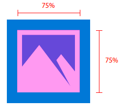

# Guidelines for tile and icon assets

<link rel="stylesheet" href="https://az835927.vo.msecnd.net/sites/uwp/Resources/css/custom.css"> 


App icon assets, which appear in a variety of forms throughout the Windows 10 operating system, are the calling cards for your Universal Windows Platform (UWP) app. These guidelines detail where app icon assets appear in the system, and provide in-depth design tips on how to create the most polished icons.


## Adaptive scaling


First, a brief overview on adaptive scaling to better understand how scaling works with assets. Windows 10 introduces an evolution of the existing scaling model. In addition to scaling vector content, there is a unified set of scale factors that provides a consistent size for UI elements across a variety of screen sizes and display resolutions. The scale factors are also compatible with the scale factors of other operating systems such as iOS and Android, which makes it easier to share assets between these platforms.

The Store picks the assets to download based in part of the DPI of the device. Only the assets that best match the device are downloaded.

## Tile elements


The basic components of a Start tile consist of a back plate, an icon, a branding bar, margins, and an app title:


The branding bar at the bottom of a tile is where the app name, badging, and counter (if used) appear:


The height of the branding bar is based on the scale factor of the device on which it appears:

| Scale factor | Pixels |
|--------------|--------|
| 100%         | 32     |
| 125%         | 40     |
| 150%         | 48     |
| 200%         | 64     |
| 400%         | 128    |

 

The system sets tile margins and cannot be modified. Most content appears inside the margins, as seen in this example:


Margin width is based on the scale factor of the device on which it appears:

| Scale factor | Pixels |
|--------------|--------|
| 100%         | 8      |
| 125%         | 10     |
| 150%         | 12     |
| 200%         | 16     |
| 400%         | 32     |

 

## Tile assets


Each tile asset is the same size as the tile on which it is placed. You can brand your app's tiles with two different representations of an asset:

1. An icon or logo centered with padding. This lets the back plate color show through:


2. A full-bleed, branded tile without padding:


For consistency across devices, each tile size (small, medium, wide, and large) has its own sizing relationship. In order to achieve a consistent icon placement across tiles, we recommend a few basic padding guidelines for the following tile sizes. The area where the two purple overlays intersect represents the ideal footprint for an icon. Although icons won't always fit inside the footprint, the visual volume of an icon should be roughly equivalent to the provided examples.

Small tile sizing:


Medium tile sizing:


Wide tile sizing:


Large tile sizing:


In this example, the icon is too large for the tile:


In this example, the icon is too small for the tile:


The following padding ratios are optimal for horizontally or vertically oriented icons.

For small tiles, limit the icon width and height to 66% of the tile size:


For medium tiles, limit the icon width to 66% and height to 50% of tile size. This prevents overlapping of elements in the branding bar:


For wide tiles, limit the icon width to 66% and height to 50% of tile size. This prevents overlapping of elements in the branding bar:


For large tiles, limit the icon width and height to 50% of tile size:


Some icons are designed to be horizontally or vertically oriented, while others have more complex shapes that prevent them from fitting squarely within the target dimensions. Icons that appear to be centered can be weighted to one side. In this case, parts of an icon may hang outside the recommended footprint, provided it occupies the same visual weight as a squarely fitted icon:


With full-bleed assets, take into account elements that interact within the margins and edges of the tiles. Maintain margins of at least 16% of the height or width of the tile. This percentage represents double the width of the margins at the smallest tile sizes:


In this example, margins are too tight:


## Tile assets in list views


Tiles can also appear in a list view. Sizing guidelines for tile assets that appear in list views are a bit different than tile assets previously outlined. This section details those sizing specifics.


Limit icon width and height to 75% of the tile size:



For vertical and horizontal icon formats, limit width and height to 75% of the tile size:


For full bleed artwork of important brand elements, maintain margins of at least 12.5%:


In this example, the icon is too big inside its tile:


In this example, the icon is too small inside its tile:


## Target-based assets


Target-based assets are for icons and tiles that appear on the Windows taskbar, task view, ALT+TAB, snap-assist, and the lower-right corner of Start tiles. You don't have to add padding to these assets; Windows adds padding if needed. These assets should account for a minimum footprint of 16 pixels. Here's an example of these assets as they appear in icons on the Windows taskbar:


Although these UI will use a target-based asset on top of a colored backplate by default, you may use a target-based unplated asset as well. Unplated assets should be created with the possibility that they may appear on various background colors:


These are size recommendations for target-based assets, at 100% scale:


**Iconic template app assets**

The iconic template (also known as the "IconWithBadge" template) lets you display a small image in the center of the tile. Windows 10 supports the template on both phone and tablet/desktop. (Learn about creating iconic tiles in the [Special tile templates article](tiles-and-notifications-special-tile-templates-catalog.md).)

Apps that use the iconic template, such as Messaging, Phone, and Store, have target-based assets that can feature a badge (with the live counter). As with other target-based assets, no padding is needed. Iconic assets aren't part of the app manifest, but are part of a live tile payload. Assets are scaled to fit and centered within a 3:2 ratio container:


For square assets, automatic centering within the container occurs:


For non-square assets, automatic horizontal/vertical centering and snapping to the width/height of the container occurs:


## Splash screen assets


The splash screen image can be given either as a direct path to an image file or as a resource. By using a resource reference, you can supply images of different scales so that Windows can choose the best size for the device and screen resolution. You can also supply high contrast images for accessibility and localized images to match different UI languages.

If you open "Package.appxmanifest" in a text editor, the [**SplashScreen**](https://msdn.microsoft.com/library/windows/apps/br211467) element appears as a child of the [**VisualElements**](https://msdn.microsoft.com/library/windows/apps/br211471) element. The default splash screen markup in the manifest file looks like this in a text editor:

```XML
<uap:SplashScreen Image="Assets\SplashScreen.png" /></code></pre></td>
</tr>
</tbody>
</table>
```

The splash screen asset is centered by whichever device it appears on:


## High-contrast assets


High-contrast mode makes use of separate sets of assets for high-contrast white (white background with black text) and high-contrast black (black background with white text). If you don't provide high-contrast assets for your app, standard assets will be used.

If your app's standard assets provide an acceptable viewing experience when rendered on a black-and-white background, then your app should look at least satisfactory in high-contrast mode. If your standard assets don't afford an acceptable viewing experience when rendered on a black-and-white background, consider specifically including high-contrast assets. These examples illustrate the two types of high-contrast assets:


If you decide to provide high-contrast assets, you need to include both sets—both white-on-black and black-on-white. When including these assets in your package, you could create a "contrast-black" folder for white-on-black assets, and a "contrast-white" folder for black-on-white assets.

## Asset size tables


At a bare minimum, we strongly recommend that you provide assets for the 100, 200, and 400 scale factors. Providing assets for all scale factors will provide the optimal user experience.

**Scale-based assets**

| Category             | Element name      | At 100% scale | At 125% scale | At 150% scale | At 200% scale | At 400% scale |
|----------------------|-------------------|---------------|---------------|---------------|---------------|---------------|
| Small                | Square71x71Logo   | 71x71         | 89x89         | 107x107       | 142x142       | 284x284       |
| Medium               | Square150x150Logo | 150x150       | 188x188       | 225x225       | 300x300       | 600x600       |
| Wide                 | Square310x150Logo | 310x150       | 388x188       | 465x225       | 620x300       | 1240x600      |
| Large (desktop only) | Square310x310Logo | 310x310       | 388x388       | 465x465       | 620x620       | 1240x1240     |
| App list (icon)      | Square44x44Logo   | 44x44         | 55x55         | 66x66         | 88x88         | 176x176       |
| Splash screen        | SplashScreen      | 620x300       | 775x375       | 930x450       | 1240x600      | 2480x1200     |

 

**File name examples for scale-based assets**

| Category             | Element name      | At 100% scale                  | At 125% scale                  | At 150% scale                  |
|----------------------|-------------------|--------------------------------|--------------------------------|--------------------------------|
| Small                | Square71x71Logo   | AppNameSmallTile.scale-100.png | AppNameSmallTile.scale-125.png | AppNameSmallTile.scale-150.png |
| Medium               | Square150x150Logo | AppNameMedTile.scale-100.png   | AppNameMedTile.scale-125.png   | AppNameMedTile.scale-150.png   |
| Wide                 | Square310x150Logo | AppNameWideTile.scale-100.png  | AppNameWideTile.scale-125.png  | AppNameWideTile.scale-150.png  |
| Large (desktop only) | Square310x310Logo | AppNameLargeTile.scale-100.png | AppNameLargeTile.scale-125.png | AppNameLargeTile.scale-150.png |
| App list (icon)      | Square44x44Logo   | AppNameLargeTile.scale-100.png | AppNameLargeTile.scale-125.png | AppNameLargeTile.scale-150.png |
| Splash screen        | SplashScreen      | SplashScreen.scale-100.png     | SplashScreen.scale-125.png     | SplashScreen.scale-150.png     |

 

| Category             | Element name      | At 200% scale                  | At 400% scale                  |
|----------------------|-------------------|--------------------------------|--------------------------------|
| Small                | Square71x71Logo   | AppNameSmallTile.scale-200.png | AppNameSmallTile.scale-400.png |
| Medium               | Square150x150Logo | AppNameMedTile.scale-200.png   | AppNameMedTile.scale-400.png   |
| Wide                 | Square310x150Logo | AppNameWideTile.scale-200.png  | AppNameWideTile.scale-400.png  |
| Large (desktop only) | Square310x310Logo | AppNameLargeTile.scale-200.png | AppNameLargeTile.scale-400.png |
| App list (icon)      | Square44x44Logo   | AppNameLargeTile.scale-200.png | AppNameLargeTile.scale-400.png |
| Splash screen        | SplashScreen      | SplashScreen.scale-200.png     | SplashScreen.scale-400.png     |

 

**Target-based assets**

Target-based assets are used across multiple scale factors. The element name for target-based assets is **Square44x44Logo**. We strongly recommend submitting the following assets as a bare minimum:

16x16, 24x24, 32x32, 48x48, 256x256

The following table lists all target-based asset sizes and corresponding file name examples:

| Asset size | File name example                 |
|------------|-----------------------------------|
| 16x16\*    | AppNameAppList.targetsize-16.png  |
| 24x24\*    | AppNameAppList.targetsize-24.png  |
| 32x32\*    | AppNameAppList.targetsize-32.png  |
| 48x48\*    | AppNameAppList.targetsize-48.png  |
| 256x256\*  | AppNameAppList.targetsize-256.png |
| 20x20      | AppNameAppList.targetsize-20.png  |
| 30x30      | AppNameAppList.targetsize-30.png  |
| 36x36      | AppNameAppList.targetsize-36.png  |
| 40x40      | AppNameAppList.targetsize-40.png  |
| 60x60      | AppNameAppList.targetsize-60.png  |
| 64x64      | AppNameAppList.targetsize-64.png  |
| 72x72      | AppNameAppList.targetsize-72.png  |
| 80x80      | AppNameAppList.targetsize-80.png  |
| 96x96      | AppNameAppList.targetsize-96.png  |

 

\* Submit these asset sizes as a baseline

## Asset types


Listed here are all asset types, their uses, and recommended file names.

**Tile assets**

-   Centered assets are generally used on the Start to showcase your app.
-   File name format: \*Tile.scale-\*.PNG
-   Impacted apps: Every UWP app
-   Uses:
    -   Default Start tiles (desktop and mobile)
    -   Action center (desktop and mobile)
    -   Task switcher (mobile)
    -   Share picker (mobile)
    -   Picker (mobile)
    -   Store

**Scalable list assets with plate**

-   These assets are used on surfaces that request scale factors. Assets either get plated by the system or come with their own background color if the app includes that.
-   File name format: \*AppList.scale-\*.PNG
-   Impacted apps: Every UWP app
-   Uses:
    -   Start all apps list (desktop)
    -   Start most-frequently used list (desktop)
    -   Task manager (desktop)
    -   Cortana search results
    -   Start all apps list (mobile)
    -   Settings

**Target-size list assets with plate**

-   These are fixed asset sizes that don't scale with plateaus. Mostly used for legacy experiences. Assets are checked by the system.
-   File name format: \*AppList.targetsize-\*.PNG
-   Impacted apps: Every UWP app
-   Uses:
    -   Start jump list (desktop)
    -   Start lower corner of tile (desktop)
    -   Shortcuts (desktop)
    -   Control Panel (desktop)

**Target-size list assets without plate**

-   These are assets that don't get plated or scaled by the system.
-   File name format: \*AppList.targetsize-\*\_altform-unplated.PNG
-   Impacted apps: Every UWP app
-   Uses:
    -   Taskbar and taskbar thumbnail (desktop)
    -   Taskbar jumplist
    -   Task view
    -   ALT+TAB

**File extension assets**

-   These are assets specific to file extensions. They appear next to Win32-style file association icons in File Explorer and must be theme-agnostic. Sizing is different on desktop and mobile platforms.
-   File name format: \*LogoExtensions.targetsize-\*.PNG
-   Impacted apps: Music, Video, Photos, Microsoft Edge, Microsoft Office
-   Uses:
    -   File Explorer
    -   Cortana
    -   Various UI surfaces (desktop)

**Splash screen**

-   The asset that appears on your app's splash screen. Automatically scales on both desktop and mobile platforms.
-   File name format: \*SplashScreen.screen-100.PNG
-   Impacted apps: Every UWP app
-   Uses:
    -   App's splash screen

**Iconic tile assets**

-   These are assets for apps that make use of the iconic template.
-   File name format: Not applicable
-   Impacted apps: Messaging, Phone, Store, more
-   Uses:
    -   Iconic tile


## Related topics


* [Special tile templates](tiles-and-notifications-special-tile-templates-catalog.md)
 

 


