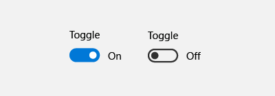
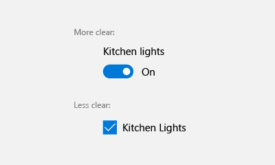

---
author: Jwmsft
Description: The toggle switch represents a physical switch that allows users to turn things on or off.
title: Guidelines for toggle switch controls
ms.assetid: 753CFEA4-80D3-474C-B4A9-555F872A3DEF
label: Toggle switches
template: detail.hbs
ms.author: jimwalk
ms.date: 02/08/2017
ms.topic: article
ms.prod: windows
ms.technology: uwp
keywords: windows 10, uwp
---
# Toggle switches
<link rel="stylesheet" href="https://az835927.vo.msecnd.net/sites/uwp/Resources/css/custom.css"> 


The toggle switch represents a physical switch that allows users to turn things on or off. Use **ToggleSwitch** controls to present users with exactly two mutually exclusive options (like on/off), where choosing an option results in an immediate action.

<div class="important-apis" >
<b>Important APIs</b><br/>
<ul>
<li>[**ToggleSwitch class**](https://msdn.microsoft.com/library/windows/apps/windows.ui.xaml.controls.toggleswitch.aspx)</li>
<li>[**IsOn property**](https://msdn.microsoft.com/library/windows/apps/windows.ui.xaml.controls.toggleswitch.ison.aspx)</li>
<li>[**Toggled event**](https://msdn.microsoft.com/library/windows/apps/windows.ui.xaml.controls.toggleswitch.toggled.aspx)</li>
</ul>
</div>

## Is this the right control?

Use a toggle switch for binary operations that take effect right after the user flips the toggle switch. For example, use a toggle switch to turn services or hardware components on or off, such as WiFi:



If a physical switch would work for the action, a toggle switch is probably the best control to use.

After the user toggles the switch on or off, we recommend that the corresponding action is immediately performed.

### Choosing between toggle switch and check box

For some actions, either a toggle switch or a check box might work. To decide which control would work better, follow these tips:

-   Use a toggle switch for binary settings when changes become effective immediately after the user changes them.

    

    In the above example, it's clear with the toggle switch that the wireless is set to "On." But with the checkbox, the user needs to think about whether the wireless is on now or whether they need to check the box to turn wireless on.

-   Use a checkbox when the user has to perform extra steps for changes to be effective. For example, if the user must click a "submit" or "next" button to apply changes, use a check box.

    

-   Use check boxes or a [list box](lists.md) when the user can select multiple items:

    

## Examples

Toggle switches in the general settings of the News app.



Toggle switches in the start menu settings in Windows.



## Create a toggle switch

Here's how to create a simple toggle switch. This XAML creates the WiFi toggle switch shown previously.

```xaml
<ToggleSwitch x:Name="wiFiToggle" Header="Wifi"/>
```
Here's how to create the same toggle switch in code.

```csharp
ToggleSwitch wiFiToggle = new ToggleSwitch();
wiFiToggle.Header = "WiFi";

// Add the toggle switch to a parent container in the visual tree.
stackPanel1.Children.Add(wiFiToggle);
```

### IsOn

The switch can be either on or off. Use the [**IsOn**](https://msdn.microsoft.com/library/windows/apps/windows.ui.xaml.controls.toggleswitch.ison.aspx) property to determine the state of the switch. When the switch is used to control the state of another binary property, you can use a binding as shown here.

```
<StackPanel Orientation="Horizontal">
    <ToggleSwitch x:Name="ToggleSwitch1" IsOn="True"/>
    <ProgressRing IsActive="{x:Bind ToggleSwitch1.IsOn, Mode=OneWay}" Width="130"/>
</StackPanel>
```

### Toggled

In other cases, you can handle the [**Toggled**](https://msdn.microsoft.com/library/windows/apps/windows.ui.xaml.controls.toggleswitch.toggled.aspx) event to respond to changes in the state.

This example shows how to add a Toggled event handler in XAML and in code. The Toggled event is handled to turn a progress ring on or off, and change its visibility.

```xaml
<ToggleSwitch x:Name="toggleSwitch1" IsOn="True" 
              Toggled="ToggleSwitch_Toggled"/>
```

Here's how to create the same toggle switch in code.

```csharp
// Create a new toggle switch and add a Toggled event handler.
ToggleSwitch toggleSwitch1 = new ToggleSwitch();
toggleSwitch1.Toggled += ToggleSwitch_Toggled;

// Add the toggle switch to a parent container in the visual tree.
stackPanel1.Children.Add(toggleSwitch1);
```

Here's the handler for the Toggled event.

```csharp
private void ToggleSwitch_Toggled(object sender, RoutedEventArgs e)
{
    ToggleSwitch toggleSwitch = sender as ToggleSwitch;
    if (toggleSwitch != null)
    {
        if (toggleSwitch.IsOn == true)
        {
            progress1.IsActive = true;
            progress1.Visibility = Visibility.Visible;
        }
        else
        {
            progress1.IsActive = false;
            progress1.Visibility = Visibility.Collapsed;
        }
    }
}
```

### On/Off labels

By default, the toggle switch includes literal On and Off labels, which are localized automatically. You can replace these labels by setting the [**OnContent**](https://msdn.microsoft.com/library/windows/apps/windows.ui.xaml.controls.toggleswitch.oncontent.aspx), and [**OffContent**](https://msdn.microsoft.com/library/windows/apps/windows.ui.xaml.controls.toggleswitch.offcontent.aspx) properties.

This example replaces the On/Off labels with Show/Hide labels.  

```xaml
<ToggleSwitch x:Name="imageToggle" Header="Show images"
              OffContent="Show" OnContent="Hide" 
              Toggled="ToggleSwitch_Toggled"/>
```

You can also use more complex content by setting the [**OnContentTemplate**](https://msdn.microsoft.com/library/windows/apps/windows.ui.xaml.controls.toggleswitch.oncontenttemplate.aspx) and [**OffContentTemplate**](https://msdn.microsoft.com/library/windows/apps/windows.ui.xaml.controls.toggleswitch.offcontenttemplate.aspx) properties.

## Recommendations

-   Replace the On and Off labels when there are more specific labels for the setting. If there are short (3-4 characters) labels that represent binary opposites that are more appropriate for a particular setting, use those. For example, you could use "Show/Hide" if the setting is "Show images." Using more specific labels can help when localizing the UI.
-   Avoid replacing the On and Off labels unless you must; stick with the default labels unless the situation calls for custom ones.
-   Labels should be no more than 4 characters long.

## Related articles

- [**ToggleSwitch class**](https://msdn.microsoft.com/library/windows/apps/hh701411)
- [Radio buttons](radio-button.md)
- [Toggle switches](toggles.md)
- [Check boxes](checkbox.md)