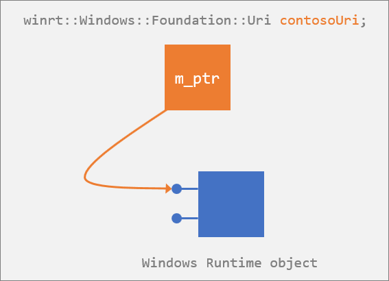

# Consume APIs with [C++/WinRT](/windows/uwp/cpp-and-winrt-apis/intro-to-using-cpp-with-winrt)
This topic shows how to consume C++/WinRT APIs, whether they're part of Windows, implemented by a third-party component vendor, or implemented by yourself.

## If the API is in a Windows namespace
This is the most common case in which you'll consume a Windows Runtime API. For every type in a Windows namespace defined in metadata, C++/WinRT defines a C++-friendly equivalent (called the *projected type*). A projected type has the same fully-qualified name as the Windows type, but it's placed in the C++ **winrt** namespace using C++ syntax. For example, [**Windows::Foundation::Uri**](/uwp/api/windows.foundation.uri) is projected into C++/WinRT as **winrt::Windows::Foundation::Uri**.

Here's a simple code example.

```cppwinrt
#include <winrt/Windows.Foundation.h>

using namespace winrt;
using namespace Windows::Foundation;

int main()
{
    winrt::init_apartment();
    Uri contosoUri{ L"http://www.contoso.com" };
    Uri combinedUri = contosoUri.CombineUri(L"products");
}
```

The included header `winrt/Windows.Foundation.h` is part of the SDK, found inside the folder `%WindowsSdkDir%Include<WindowsTargetPlatformVersion>\cppwinrt\winrt\`. The headers in that folder contain Windows namespace types projected into C++/WinRT. In this example, `winrt/Windows.Foundation.h` contains **winrt::Windows::Foundation::Uri**, which is the projected type for the runtime class [**Windows::Foundation::Uri**](/uwp/api/windows.foundation.uri).

> [!TIP]
> Whenever you want to use a type from a Windows namespace, include the C++/WinRT header corresponding to that namespace. The `using namespace` directives are optional, but convenient.

In the code example above, after initializing C++/WinRT, we stack-allocate a value of the **winrt::Windows::Foundation::Uri** projected type via one of its publicly documented constructors ([**Uri(String)**](/uwp/api/windows.foundation.uri#Windows_Foundation_Uri__ctor_System_String_), in this example). For this, the most common use case, that's typically all you have to do. Once you have a C++/WinRT projected type value, you can treat it as if it were an instance of the actual Windows Runtime type, since it has all the same members.

In fact, that projected value is a proxy; it's essentially just a smart pointer to a backing object. The projected value's constructor(s) call [**RoActivateInstance**](https://msdn.microsoft.com/library/br224646) to create an instance of the backing Windows Runtime class (**Windows.Foundation.Uri**, in this case), and store that object's default interface inside the new projected value. As illustrated below, your calls to to the projected value's members actually delegate, via the smart pointer, to the backing object; which is where state changes occur.



When the `contosoUri` value falls out of scope, it destructs, and releases its reference to the default interface. If that reference is the last reference to the backing Windows Runtime **Windows.Foundation.Uri** object, the backing object destructs as well.

> [!TIP]
> A *projected type* is a wrapper over a runtime class for purposes of consuming its APIs. A *projected interface* is a wrapper over a Windows Runtime interface.

## C++/WinRT projection headers
To consume Windows namespace APIs from C++/WinRT, you include headers from the `%WindowsSdkDir%Include<WindowsTargetPlatformVersion>\cppwinrt\winrt` folder. It's common for a type in a subordinate namespace to reference types in its immediate parent namespace. Consequently, each C++/WinRT projection header automatically includes its parent namespace header file; so you don't *need* to explicitly include it. Although, if you do, there will be no error.

For example, for the [**Windows::Security::Cryptography::Certificates**](/uwp/api/windows.security.cryptography.certificates) namespace, the equivalent C++/WinRT type definitions reside in `winrt/Windows.Security.Cryptography.Certificates.h`. Types in **Windows::Security::Cryptography::Certificates** require types in the parent **Windows::Security::Cryptography** namespace; and types in that namespace could require types in its own parent, **Windows::Security**.

So, when you include `winrt/Windows.Security.Cryptography.Certificates.h`, that file in turn includes `winrt/Windows.Security.Cryptography.h`; and `winrt/Windows.Security.Cryptography.h` includes `winrt/Windows.Security.h`. That's where the trail stops, since there is no `winrt/Windows.h`. This transitive inclusion process stops at the second-level namespace.

This process transitively includes the header files that provide the necessary *declarations* and *implementations* for the classes defined in parent namespaces.

A member of a type in one namespace can reference one or more types in other, unrelated, namespaces. In order for the compiler to compile these member definitions successfully, the compiler needs to see the type declarations for the closure of all these types. Consequently, each C++/WinRT projection header includes the namespace headers it needs to *declare* any dependent types. Unlike for parent namespaces, this process does *not* pull in the *implementations* for referenced types.

> [!IMPORTANT]
> When you want to actually *use* a type (instantiate, call methods, etc.) declared in an unrelated namespace, you must include the appropriate namespace header file for that type. Only *declarations*, not *implementations*, are automatically included.

For example, if you only include `winrt/Windows.Security.Cryptography.Certificates.h`, then that causes declarations to be pulled in from these namespaces (and so on, transitively).

- Windows.Foundation
- Windows.Foundation.Collections
- Windows.Networking
- Windows.Storage.Streams
- Windows.Security.Cryptography

In other words, some APIs are forward-declared in a header that you've included. But their definitions are in a header that you haven't yet included. So, if you then call [**Windows::Foundation::Uri::RawUri**](/uwp/api/windows.foundation.uri.rawuri), then you'll receive a linker error indicating that the member is undefined. The solution is to explicitly `#include <winrt/Windows.Foundation.h>`. In general, when you see a linker error such as this, include the header named for the API's namespace, and rebuild.

## Accessing members via the object, via an interface, or via the ABI
With the C++/WinRT projection, the runtime representation of a Windows Runtime class is no more than the underlying ABI interfaces. But, for your convenience, you can code against classes in the way that their author intended. For example, you can call the **ToString** method of a [**Uri**](/uwp/api/windows.foundation.uri) as if that were a method of the class (in fact, under the covers, it's a method on the separate **IStringable** interface).

```cppwinrt
Uri contosoUri{ L"http://www.contoso.com" };
WINRT_ASSERT(contosoUri.ToString() == L"http://www.contoso.com/"); // QueryInterface is called at this point.
```

This convenience is achieved via a query for the appropriate interface. But you're always in control. You can opt to give away a little of that convenience for a little performance by retrieving the IStringable interface yourself and using it directly. In the code example below, you obtain an actual IStringable interface pointer at run time (via a one-time query). After that, your call to **ToString** is direct, and avoids any further call to **QueryInterface**.

```cppwinrt
IStringable stringable = contosoUri; // One-off QueryInterface.
WINRT_ASSERT(stringable.ToString() == L"http://www.contoso.com/");
```

You might choose this technique if you know you'll be calling several methods on the same interface.

Incidentally, if you do want to access members at the ABI level then you can. The code example below shows how, and there are more details and code examples in [Interop between C++/WinRT and the ABI](interop-winrt-abi.md).

```cppwinrt
int port = contosoUri.Port(); // Access the Port "property" accessor via C++/WinRT.

winrt::com_ptr<ABI::Windows::Foundation::IUriRuntimeClass> abiUri = contosoUri.as<ABI::Windows::Foundation::IUriRuntimeClass>();
HRESULT hr = abiUri->get_Port(&port); // Access the get_Port ABI function.
```

## Delayed initialization
Even the default constructor of a projected type causes a backing Windows Runtime object to be created. If you want to construct a variable of a projected type without it in turn constructing a Windows Runtime object (so that you can delay that work until later), then you can. Declare your variable or field using the projected type's special C++/WinRT `nullptr_t` constructor.

```cppwinrt
#include <winrt/Windows.Storage.Streams.h>
using namespace winrt::Windows::Storage::Streams;

struct Sample
{
    void DelayedInit()
    {
        // Allocate the actual buffer.
        m_gamerPicBuffer = Buffer(MAX_IMAGE_SIZE);
    }

private:
    Buffer m_gamerPicBuffer{ nullptr };
};
```

All constructors on the projected type *except* the `nullptr_t` constructor cause a backing Windows Runtime object to be created. The `nullptr_t` constructor is essentially a no-op. It expects the projected object to be initialized at a subsequent time. So, whether a runtime class has a default constructor or not, you can use this technique for efficient delayed initialization.

## If the API is implemented in a Windows Runtime component
This section applies whether you authored the component yourself, or it came from a vendor.

> [!NOTE]
> For info about installing and using the C++/WinRT Visual Studio Extension (VSIX) (which provides project template support, as well as C++/WinRT MSBuild properties and targets) see [Visual Studio support for C++/WinRT, and the VSIX](intro-to-using-cpp-with-winrt.md#visual-studio-support-for-cwinrt-and-the-vsix).

In your application project, reference the Windows Runtime component's Windows Runtime metadata (`.winmd`) file, and build. During the build, the `cppwinrt.exe` tool generates a standard C++ library that fully describes&mdash;or *projects*&mdash;the API surface for the component. In other words, the generated library contains the projected types for the component.

Then, just as for a Windows namespace type, you include a header and construct the projected type via one of its constructors. Your application project's startup code registers the runtime class, and the projected type's constructor calls [**RoActivateInstance**](https://msdn.microsoft.com/library/br224646) to activate the runtime class from the referenced component.

```cppwinrt
#include <winrt/BankAccountWRC.h>

struct App : implements<App, IFrameworkViewSource, IFrameworkView>
{
    BankAccountWRC::BankAccount bankAccount;
    ...
};
```

For more details, code, and a walkthrough of consuming APIs implemented in a Windows Runtime component, see [Author events in C++/WinRT](author-events.md#create-a-core-app-bankaccountcoreapp-to-test-the-windows-runtime-component).

## If the API is implemented in the consuming project
A type that's consumed from XAML UI must be a runtime class, even if it's in the same project as the XAML.

For this scenario, you generate a projected type from the runtime class's Windows Runtime metadata (`.winmd`). Again, you include a header, but this time you construct the projected type via its `nullptr` constructor. That constructor doesn't perform any initialization, so you must next assign a value to the instance via the [**winrt::make**](/uwp/cpp-ref-for-winrt/make) helper function, passing any necessary constructor arguments. A runtime class implemented in the same project as the consuming code doesn't need to be registered, nor instantiated via Windows Runtime/COM activation.

```cppwinrt
// MainPage.h
...
struct MainPage : MainPageT<MainPage>
{
    ...
    private:
        Bookstore::BookstoreViewModel m_mainViewModel{ nullptr };
        ...
    };
}
...
// MainPage.cpp
...
#include "BookstoreViewModel.h"

MainPage::MainPage()
{
    m_mainViewModel = make<Bookstore::implementation::BookstoreViewModel>();
    ...
}
```

For more details, code, and a walkthrough of consuming a runtime class implemented in the consuming project, see [XAML controls; bind to a C++/WinRT property](binding-property.md#add-a-property-of-type-bookstoreviewmodel-to-mainpage).

## Instantiating and returning projected types and interfaces
Here's an example of what projected types and interfaces might look like in your consuming project.

```cppwinrt
struct MyRuntimeClass : MyProject::IMyRuntimeClass, impl::require<MyRuntimeClass,
    Windows::Foundation::IStringable, Windows::Foundation::IClosable>
```

**MyRuntimeClass** is a projected type; projected interfaces include **IMyRuntimeClass**, **IStringable**, and **IClosable**. This topic has shown the different ways in which you can instantiate a projected type. Here's a reminder and summary, using **MyRuntimeClass** as an example.

```cppwinrt
// The runtime class is implemented in another compilation unit (it's either a Windows API,
// or it's implemented in a second- or third-party component).
MyProject::MyRuntimeClass myrc1;

// The runtime class is implemented in the same compilation unit.
MyProject::MyRuntimeClass myrc2{ nullptr };
myrc2 = winrt::make<MyProject::implementation::MyRuntimeClass>();
```

- You can access the members of all of the interfaces of a projected type.
- You can return a projected type to a caller.
- Projected types and interfaces derive from [**winrt::Windows::Foundation::IUnknown**](/uwp/cpp-ref-for-winrt/windows-foundation-iunknown). So, you can call [**IUnknown::as**](/uwp/cpp-ref-for-winrt/windows-foundation-iunknown#iunknownas-function) on a projected type or interface to query for other projected interfaces, which you can also either use or return to a caller. The **as** member function works like [**QueryInterface**](https://msdn.microsoft.com/library/windows/desktop/ms682521).

```cppwinrt
void f(MyProject::MyRuntimeClass const& myrc)
{
    myrc.ToString();
    myrc.Close();
    IClosable iclosable = myrc.as<IClosable>();
    iclosable.Close();
}
```

## Activation factories
The convenient, direct way to create a C++/WinRT object is as follows.

```cppwinrt
using namespace winrt::Windows::Globalization::NumberFormatting;
...
CurrencyFormatter currency{ L"USD" };
```

But there may be times that you'll want to create the activation factory yourself, and then create objects from it at your convenience. Here are some examples showing you how, using the [**winrt::get_activation_factory**](/uwp/cpp-ref-for-winrt/get-activation-factory) function template.

```cppwinrt
using namespace winrt::Windows::Globalization::NumberFormatting;
...
auto factory = winrt::get_activation_factory<CurrencyFormatter, ICurrencyFormatterFactory>();
CurrencyFormatter currency = factory.CreateCurrencyFormatterCode(L"USD");
```

```cppwinrt
using namespace winrt::Windows::Foundation;
...
auto factory = winrt::get_activation_factory<Uri, IUriRuntimeClassFactory>();
Uri account = factory.CreateUri(L"http://www.contoso.com");
```

The classes in the two examples above are types from a Windows namespace. In this next example, **BankAccountWRC::BankAccount** is a custom type implemented in a Windows Runtime Component.

```cppwinrt
auto factory = winrt::get_activation_factory<BankAccountWRC::BankAccount>();
BankAccountWRC::BankAccount account = factory.ActivateInstance<BankAccountWRC::BankAccount>();
```

## Important APIs
* [QueryInterface](https://msdn.microsoft.com/library/windows/desktop/ms682521)
* [RoActivateInstance](https://msdn.microsoft.com/library/br224646)
* [Windows::Foundation::Uri](/uwp/api/windows.foundation.uri)
* [winrt::get_activation_factory function template](/uwp/cpp-ref-for-winrt/get-activation-factory)
* [winrt::make function template](/uwp/cpp-ref-for-winrt/make)
* [winrt::Windows::Foundation::IUnknown](/uwp/cpp-ref-for-winrt/windows-foundation-iunknown)

## Related topics
* [Author events in C++/WinRT](author-events.md#create-a-core-app-bankaccountcoreapp-to-test-the-windows-runtime-component)
* [Interop between C++/WinRT and the ABI](interop-winrt-abi.md)
* [Introduction to C++/WinRT](intro-to-using-cpp-with-winrt.md)
* [XAML controls; bind to a C++/WinRT property](binding-property.md#add-a-property-of-type-bookstoreviewmodel-to-mainpage)
