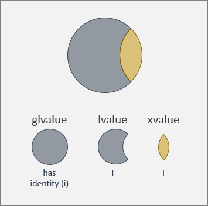
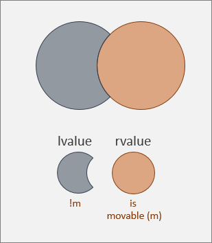
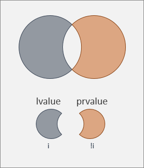
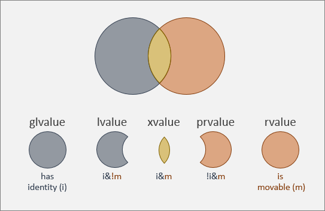

# Value categories
This topic describes the various categories of values that exist in C++. You will doubtless have heard of *lvalues* and *rvalues*, but there are other kinds, too. Every expression in C++ yields a value that belongs to one of the categories discussed in this topic. There are aspects of the C++ language, its facilies, and rules, that demand a proper understanding of value categories.

## An lvalue has identity
What does it mean for a value to have *identity*? If you have (or you can take) the memory address of a value, then the value has identity. That way, you can do more than compare the contents of values: you can compare or distinguish them by identity.

An *lvalue* has identity. It's now a matter of only historical interest that the "l" in "lvalue" is an abbreviation of "left" (as in, the left-hand-side of an assignment). In C++, an lvalue can appear on the left *or* on the right of an assignment. The "l" in "lvalues", then, doesn't actually help you to comprehend nor define what they are. You need only to understand that what we call an lvalue is a value that has identity.

Now, while it's a true statement that lvalues have identity, so do xvalues. We'll go a little more into what an *xvalue* is later in this topic (although, a full treatment of them is not in scope here). For now, just be aware that there is a value category called glvalue, for "generalized lvalue". The superset of glvalues contains both lvalues (also known as "classic lvalues") and xvalues. So, while "an lvalue has identity" is true, the complete set of things that have identity is the set of glvalues, as shown in this illustration.

## An rvalue is movable; an lvalue is not
But there are values that are not glvalues. Consequently, there are values that you *can't* obtain a memory address for (or you can't rely on it to be valid). Which sounds like a disadvantage. But in fact the advantage of a value like that is that you can *move* it (which is generally cheap), rather than copy it (which is generally expensive). Moving a value means that it's no longer in the place it used to be. So, trying to access it in the place it used to be is something to be avoided. A discussion of when and *how* to move a value is out of scope for this topic. For this topic, we just need to know that a value that is movable is known as an *rvalue*.

The "r" in "rvalue" is an abbreviation of "right" (as in, the right-hand-side of an assignment). But you can use rvalues, and references to rvalues, outside of assignments. The "r" in "rvalues", then, is not the thing to focus on. You need only to understand that what we call an rvalue is a value that is movable.

An lvalue, conversely, isn't movable, as shown in this illustration. You can't move an lvalue because, if you could, then it'd be unsafe (or even disastrous) to continue to access it afterward. Remember, you have its identity.

You can't move an lvalue. But there *is* a kind of glvalue (the set of things with identity) that you can move&mdash;if you know what you're doing&mdash;and that's the xvalue. We'll revisit this idea one more time below, when we look at the complete picture of value categories.

## An lvalue has identity; a prvalue does not
At this stage, we know what has identity. And we know what's movable and what isn't. But we haven't yet named the set of values that *don't* have identity. That set is known as the *prvalue*, or "pure rvalue".

## The complete picture of value categories
It only remains to combine the info and illustrations above into a single, big picture.

- A glvalue (generalized lvalue) has identity.
- An lvalue (a kind of glvalue) has identity, but isn't movable. These are typically read-write values that you pass around by reference or by const reference, or by value if copying is cheap.
- An xvalue (a kind of glvalue, but also a kind of rvalue) has identity, and is also movable. This might be an erstwhile lvalue that you've decided to move because copying is expensive, and you'll be careful not to access it afterward. The way you turn an lvalue into an xvalue, and the reasons for moving one, will have to wait for another topic. But you can think of the "x" in "xvalue" as meaning "expert" if that helps.
- A prvalue (pure rvalue; a kind of rvalue) does not have identity, but is movable. These are typically literals, temporaries, return values&mdash;anything that's the result of evaluating an expression (an expression that's not a glvalue), or anything returned by value from a function.
- An rvalue is movable.
