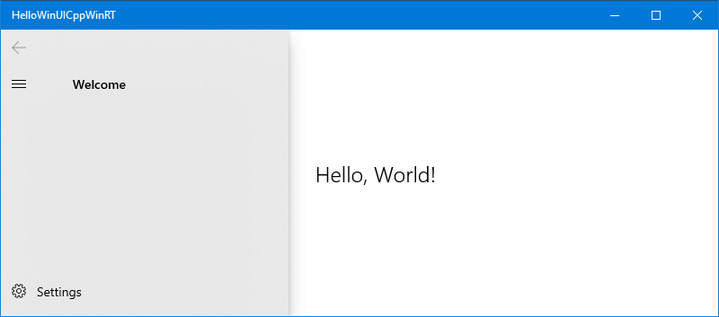

# A simple C++/WinRT Windows UI Library example

This topic walks you through the process of adding simple support for the [Windows UI (WinUI) Library](https://github.com/Microsoft/microsoft-ui-xaml) to your C++/WinRT project. Incidentally, the Windows UI Library is itself written in C++/WinRT.

> [!NOTE]
> The Windows UI (WinUI) Library toolkit is available as NuGet packages that you can add to any existing or new project using Visual Studio, as we'll see in this topic. For more background, setup, and support info, see [Getting started with the Windows UI Library](/uwp/toolkits/winui/getting-started).

## Create a Blank App (HelloWinUICppWinRT)

In Visual Studio, create a new project using the **Blank App (C++/WinRT)** project template. Make sure that you're using the **(C++/WinRT)** template, and not the **(Universal Windows)** one.

Set the name of the new project to *HelloWinUICppWinRT*, and (so that your folder structure will match the walkthrough) uncheck **Place solution and project in the same directory**.

## Install the Microsoft.UI.Xaml NuGet package

Click **Project** \> **Manage NuGet Packages...** \> **Browse**, type or paste **Microsoft.UI.Xaml** in the search box, select the item in search results, and then click **Install** to install the package into your project (you'll also see a license agreement prompt). Be careful to install only the **Microsoft.UI.Xaml** package, and not **Microsoft.UI.Xaml.Core.Direct**.

## Declare WinUI application resources

Open `App.xaml` and paste the following markup between the existing opening and closing **Application** tags.

```xaml
<Application.Resources>
    <XamlControlsResources xmlns="using:Microsoft.UI.Xaml.Controls"/>
</Application.Resources>
```

## Add a WinUI control to MainPage

Next, open `MainPage.xaml`. In the existing opening **Page** tag there are some xml namespace declarations. Add the xml namespace declaration `xmlns:muxc="using:Microsoft.UI.Xaml.Controls"`. Then, paste the following markup between the existing opening and closing **Page** tags, overwriting the existing **StackPanel** element.

```xaml
<muxc:NavigationView PaneTitle="Welcome">
    <TextBlock Text="Hello, World!" VerticalAlignment="Center" HorizontalAlignment="Center" Style="{StaticResource TitleTextBlockStyle}"/>
</muxc:NavigationView>
```

## Edit pch.h, as necessary

When you add a NuGet package to a C++/WinRT project (such as the **Microsoft.UI.Xaml** package, which you added earlier), and build the project, the tooling generates a set of projection header files in your project's `\Generated Files\winrt` folder. If you've followed along with the walkthrough, you'll now have a `\HelloWinUICppWinRT\HelloWinUICppWinRT\Generated Files\winrt` folder. To bring those headers files into your project, so that references to those new types resolve, you can go into your precompiled header file (typically `pch.h`) and include them.

You need to include only the headers that correspond to the types that you use. But here's an example that includes all of the generated header files for the **Microsoft.UI.Xaml** package.

```cppwinrt
// pch.h
...
#include "winrt/Microsoft.UI.Xaml.Automation.Peers.h"
#include "winrt/Microsoft.UI.Xaml.Controls.h"
#include "winrt/Microsoft.UI.Xaml.Controls.Primitives.h"
#include "winrt/Microsoft.UI.Xaml.Media.h"
#include "winrt/Microsoft.UI.Xaml.XamlTypeInfo.h"
...
```

## Edit MainPage.cpp

In `MainPage.cpp`, delete the code inside your implementation of **MainPage::ClickHandler**, since *myButton* is no longer in the XAML markup.

You can now build and run the project.



## Related topics
* [Getting started with the Windows UI Library](/uwp/toolkits/winui/getting-started)