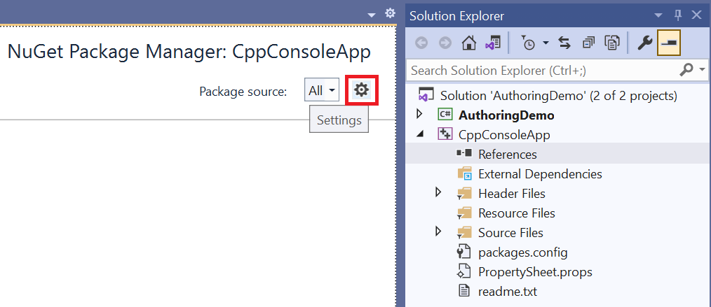
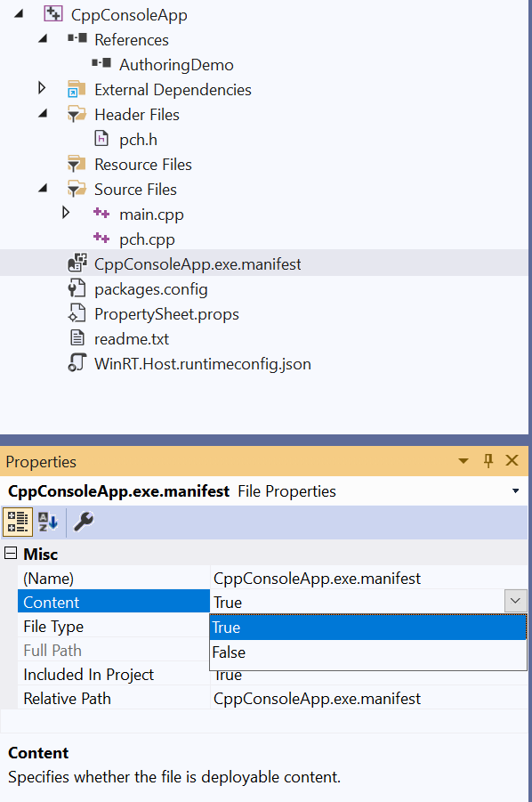
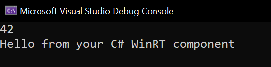

# Walkthrough: Create a C#/WinRT component and consume it from C++/WinRT

> [!NOTE]
> The C#/WinRT authoring support described in this article is currently in preview as of C#/WinRT version 1.1.4. As of this release, it is intended to be used only for early feedback and evaluation.

C#/WinRT enables .NET 5+ developers to author their own Windows Runtime components in C# using a class library project. Authored components can be consumed in native desktop applications as a package reference or as a project reference with a few modifications.

This walkthrough demonstrates how to create a simple Windows Runtime component using C#/WinRT, distribute the component as a NuGet package, and consume the component from a C++/WinRT console application. For the full sample that provides the code for this article, see the [C#/WinRT authoring sample](https://github.com/microsoft/CsWinRT/tree/master/src/Samples/AuthoringDemo). For more details about authoring, see [Authoring components](https://github.com/microsoft/CsWinRT/blob/master/docs/authoring.md).

While authoring your runtime component, follow the guidelines and type restrictions outlined in [this article.](../winrt-components/creating-windows-runtime-components-in-csharp-and-visual-basic.md) Internally, the Windows Runtime types in your component can use any .NET functionality that's allowed in a UWP app. For more info, see [.NET for UWP apps](/dotnet/api/index?view=dotnet-uwp-10.0&preserve-view=true). Externally, the members of your type can expose only Windows Runtime types for their parameters and return values.

> [!NOTE]
> There are some Windows Runtime types that are [mapped to .NET types](../winrt-components/net-framework-mappings-of-windows-runtime-types.md). These .NET types can be used in the public interface of your Windows Runtime component, and will appear to users of the component as the corresponding Windows Runtime types.

## Prerequisites

This walkthrough requires the following tools and components:

- Visual Studio 2019
- .NET 5.0 SDK
- [C++/WinRT VSIX](https://marketplace.visualstudio.com/items?itemName=CppWinRTTeam.cppwinrt101804264) for C++/WinRT project templates

## Create a simple Windows Runtime Component using C#/WinRT

Begin by creating a new project in Visual Studio 2019. Select the **Class Library (.NET Core)** project template and name it **AuthoringDemo**. You will need to make the following additions and modifications to the project:

1. Update the `TargetFramework` in the **AuthoringDemo.csproj** file and add the following elements to the `PropertyGroup`:

    ```xml
    <PropertyGroup>
        <TargetFramework>net5.0-windows10.0.19041.0</TargetFramework>
        <Platforms>x64</Platforms>
    </PropertyGroup>
    ```

    For the `TargetFramework` element, you can use one of the following [target framework monikers](/windows/apps/desktop/modernize/desktop-to-uwp-enhance#net-5-use-the-target-framework-moniker-option).
    - **net5.0-windows10.0.17763.0**
    - **net5.0-windows10.0.18362.0**
    - **net5.0-windows10.0.19041.0**

2. Install the latest version of the [C#/WinRT NuGet package](https://www.nuget.org/packages/Microsoft.Windows.CsWinRT/1.1.2-prerelease.210208.6).

    a. In Solution Explorer, right click on the project node and select **Manage NuGet Packages**.

    b. Search for the **Microsoft.Windows.CsWinRT** NuGet package and install the latest version. This walkthrough uses C#/WinRT version 1.1.4.

3. Add a new `PropertyGroup` element that sets several C#/WinRT properties.

    ```xml
    <PropertyGroup>   
        <CsWinRTComponent>true</CsWinRTComponent>
        <CsWinRTWindowsMetadata>10.0.19041.0</CsWinRTWindowsMetadata>
    </PropertyGroup>
      ```

      Here are some details about the properties in this example. For a full list of C#/WinRT project properties, refer to the [C#/WinRT NuGet documentation.](https://github.com/microsoft/CsWinRT/blob/master/nuget/readme.md)

    - The `CsWinRTComponent` property specifies that your project is a Windows Runtime component, so that a WinMD file is generated for the component.
    - The `CsWinRTWindowsMetadata` property provides a source for Windows Metadata. This is required as of version 1.1.1.

4. You can author your runtime classes using library **(.cs)** class files. Right click on the **Class1.cs** file and rename it to **Example.cs**. Add the following code to this file, which adds a public property and method to the runtime class. Remember to mark any classes you want to expose in the runtime component **public**.

    ```csharp
    namespace AuthoringDemo
    {
        public sealed class Example
        {
            public int SampleProperty { get; set; }

            public static string SayHello()
            {
                return "Hello from your C# WinRT component";
            }
        }
    }
    ```

5. You can now build the project to generate the metadata file for your component. Right click on the project in **Solution Explorer** and click **Build**. You will see the generated **AuthoringDemo.winmd** file in the in the **Solution Explorer** under **Generated Files** folder, and also in your build output folder.

## Generate a NuGet package for the component

Next, generate a NuGet package for the component. When you generate the package, C#/WinRT configures the component and hosting assemblies in the package for consumption from native applications.

There are several ways to generate the NuGet package:

* If you want to generate a NuGet package every time you build the project, add the following property to the **AuthoringDemo** project file and then rebuild the project.

    ```xml
    <PropertyGroup>
        <GeneratePackageOnBuild>true</GeneratePackageOnBuild>
    </PropertyGroup>
    ```

* Alternatively, you can generate a NuGet package by right clicking the **AuthoringDemo** project in **Solution Explorer** and selecting **Pack**.

When you build the package, the **Build** window should indicate that the NuGet package `AuthoringDemo.1.0.0.nupkg` was successfully created.

## Consume the component in C++/WinRT

C#/WinRT authored Windows Runtime components can be consumed from native applications with a few modifications. The following steps demonstrate how to call the authored component above in a native console application. 

1. Add a new **C++/WinRT Console Application** project to your solution. Note that this project can also be part of a different solution if you choose so.

    a. In **Solution Explorer**, right click your solution node and click **Add** -> **New Project**.

    b. In the **Add New Project dialog box**, search for the **C++/WinRT Console Application** project template. Select the template and click **Next**.

    c. Name the new project **CppConsoleApp** and click **Create**.

2. Add a reference to the AuthoringDemo component, either as a NuGet package or a project reference.

    - **Option 1 (Package reference)**:  

        a. Right click the **CppConsoleApp** project and select **Manage NuGet packages**. You may need to configure your package sources to add a reference to the AuthoringDemo NuGet package. To do this, click the **Settings** icon in NuGet Package Manager and add a package source to the appropriate path.

        

        b. After configuring your package sources, search for the **AuthoringDemo** package and click **Install**.

        

    - **Option 2 (Project reference)**:
        
        a. Right click the **CppConsoleApp** project and select **Add** -> **Reference**. Under the **Projects** node, add a reference to the **AuthoringDemo** project. As of this preview, you will also need to add a file reference to **AuthoringDemo.winmd** from the **Browse** node. The generated winmd file can be found in the output directory of the **AuthoringDemo** project.

3. To assist with hosting the component, you will need to add a manifest file for activatable class registrations. For more details about managed component hosting, see [Managed component hosting](https://github.com/microsoft/CsWinRT/blob/master/docs/hosting.md).

    a. To add the manifest file, again right click on the project and choose **Add -> New Item**. Search for the **Text File** template and name it **CppConsoleApp.exe.manifest**. Paste the following contents:

    ```xml
    <?xml version="1.0" encoding="utf-8"?>
    <assembly manifestVersion="1.0" xmlns="urn:schemas-microsoft-com:asm.v1">
        <assemblyIdentity version="1.0.0.0" name="CppConsoleApp"/>
        <file name="WinRT.Host.dll">
            <activatableClass
                name="AuthoringDemo.Example"
                threadingModel="both"
                xmlns="urn:schemas-microsoft-com:winrt.v1" />
        </file>
    </assembly>
    ```

    The manifest file is required for non-packaged applications. In this file, specify your runtime classes using activatable class registrations entries as shown above.

    b. Modify the project to include the manifest file in the output when deploying the project. Click the **CppConsoleApp.exe.manifest** file in **Solution Explorer** and set the **Content** property to **True**. Here is an example of what this looks like.

     

5. Open **pch.h** under the project's Header Files, and add the following line of code to include your component.

    ```cpp
    #include <winrt/AuthoringDemo.h>
    ```

6. Open **main.cpp** under the project's Source Files, and replace it with the following contents.

    ```cpp
    #include "pch.h"
    #include "iostream"

    using namespace winrt;
    using namespace Windows::Foundation;

    int main()
    {
        init_apartment();

        AuthoringDemo::Example ex;
        ex.SampleProperty(42);
        std::wcout << ex.SampleProperty() << std::endl;
        std::wcout << ex.SayHello().c_str() << std::endl;
    }
    ```

7. Build and run the **CppConsoleApp** project. You should now see the output below.

    

## Related topics

- [Sample code](https://github.com/microsoft/CsWinRT/tree/master/src/Samples/AuthoringDemo)
- [Authoring components](https://github.com/microsoft/CsWinRT/blob/master/docs/authoring.md)
- [Managed component hosting](https://github.com/microsoft/CsWinRT/blob/master/docs/hosting.md)
