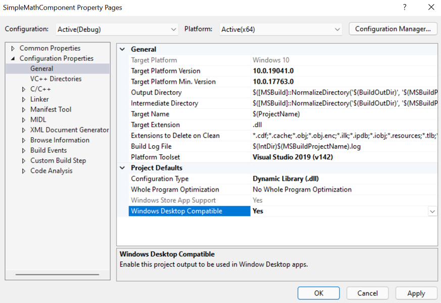

# Make a C# projection from a C++/WinRT component, distribute as a NuGet for .NET 5+ apps

In this topic, we walk through using [C#/WinRT](/windows/uwp/csharp-winrt/) to generate a C# .NET 5 projection (or interop) assembly from a C++/WinRT Windows Runtime component, and distribute it as a NuGet package for .NET 5+ applications.

In .NET 5 and later, consumption of Windows metadata (WinMD) files is no longer supported (see [Built-in support for WinRT is removed from .NET](/dotnet/core/compatibility/interop/5.0/built-in-support-for-winrt-removed)). Instead, the C#/WinRT tool can be used to generate a projection assembly for any WinMD file, which then enables consumption of WinRT components from .NET 5+ applications. A projection assembly is also known as an interop assembly. This walkthrough shows you how to do the following:

* Use the [C#/WinRT package](https://www.nuget.org/packages/Microsoft.Windows.CsWinRT/) to generate a C# projection from a C++/WinRT component.
* Distribute the component, along with the projection assembly, as a NuGet package.
* Consume the NuGet package from a .NET 5 console application.

## Prerequisites

This walkthrough and the corresponding sample require the following tools and components:

* [Visual Studio 16.8](https://visualstudio.microsoft.com/downloads/) (or later) with the Universal Windows Platform development workload installed. In **Installation Details** > **Universal Windows Platform development**, check the **C++ (v14x) Universal Windows Platform tools** option.
* [.NET 5.0 SDK](https://dotnet.microsoft.com/download/dotnet/5.0).
* [C++/WinRT VSIX extension](https://marketplace.visualstudio.com/items?itemName=CppWinRTTeam.cppwinrt101804264), which gives you C++/WinRT project templates in Visual Studio.

Also, you'll need to download or clone the sample code for this topic from the [C#/WinRT projection sample](https://github.com/microsoft/CsWinRT/tree/master/src/Samples/Net5ProjectionSample) on GitHub. Visit the [CsWinRT](https://github.com/microsoft/CsWinRT), and click the green **Code** button to get the `git clone` url. Be sure to read the [README.md](https://github.com/microsoft/CsWinRT/blob/master/src/Samples/Net5ProjectionSample/README.md) file for the sample.

## Create a simple C++/WinRT Windows Runtime component

To follow this walkthrough, you must first have a C++/WinRT Windows Runtime component (WRC) from which to generate the C# projection assembly.

This walkthrough uses the **SimpleMathComponent** WRC from the [C#/WinRT projection sample](https://github.com/microsoft/CsWinRT/tree/master/src/Samples/Net5ProjectionSample) on GitHub, which you downloaded or cloned. **SimpleMathComponent** was created from the **Windows Runtime Component (C++/WinRT)** Visual Studio project template (which comes with the [C++/WinRT VSIX extension](../cpp-and-winrt-apis/intro-to-using-cpp-with-winrt.md#visual-studio-support-for-cwinrt-xaml-the-vsix-extension-and-the-nuget-package)).

To open the **SimpleMathComponent** project in Visual Studio, open the `\Samples\Net5ProjectionSample\CppWinRTComponentProjectionSample.sln` file in your copy or clone of the repo.

The code in this project provides the functionality for the basic math operations shown in the header file below.

```cpp
// SimpleMath.h
...
namespace winrt::SimpleMathComponent::implementation
{
    struct SimpleMath: SimpleMathT<SimpleMath>
    {
        SimpleMath() = default;
        double add(double firstNumber, double secondNumber);
        double subtract(double firstNumber, double secondNumber);
        double multiply(double firstNumber, double secondNumber);
        double divide(double firstNumber, double secondNumber);
    };
}
```

You can confirm that the **Windows Desktop Compatible** property is set to *Yes* for the **SimpleMathComponent** C++/WinRT Windows Runtime component project. To do that, in the project properties for **SimpleMathComponent**, under **Configuration Properties** > **General** > **Project Defaults**, set the property **Windows Desktop Compatible** to *Yes*. That ensures that the correct runtime binaries are loaded for consuming .NET desktop apps.



For more detailed steps about creating a C++/WinRT component and generating a WinMD file, see [Windows Runtime components with C++/WinRT](/windows/uwp/winrt-components/create-a-windows-runtime-component-in-cppwinrt).

> [!NOTE]
> If you're implementing [IInspectable::GetRuntimeClassName](/windows/win32/api/inspectable/nf-inspectable-iinspectable-getruntimeclassname) in your component, then it **must** return a valid WinRT class name. Because C#/WinRT uses the class name string for interop, an incorrect runtime class name will raise an **InvalidCastException**.

## Add a projection project to the component solution

First, with the **CppWinRTComponentProjectionSample** solution still open in Visual Studio, remove the **SimpleMathProjection** project from that solution. Then delete from your file system the **SimpleMathProjection** folder (or rename it if you prefer). Those steps are necessary so that you can follow this walkthrough step by step.

1. Add a new C# library project to your solution.
    
    1. In **Solution Explorer**, right-click your solution node and click **Add** > **New Project**. 
    2. In the **Add a new project** dialog box, type **Class Library** in the search box. Choose **C#** from the language list, and then choose **Windows** from the platform list. Choose the C# project template that's called simply **Class Library** (with no prefixes nor suffixes), and click **Next**.
    3. Name the new project *SimpleMathProjection*, and click **Next**.
    4. On the **Additional information** page, select **.NET 5.0 (Current)**, and then choose **Create**.

2. Delete the stub **Class1.cs** file from the project.

3. Use the steps below to install the [C#/WinRT NuGet package](https://www.nuget.org/packages/Microsoft.Windows.CsWinRT).

    1. In **Solution Explorer**, right-click your **SimpleMathProjection** project and select **Manage NuGet Packages**.
    2. In the **Browse** tab, type or paste **Microsoft.Windows.CsWinRT** in the search box, select the item with the latest version in search results, and then click Install to install the package for that project.

    If upon installing the package there are errors, then see [Common errors and troubleshooting](/windows/uwp/csharp-winrt/#common-errors-and-troubleshooting).

4. Add a project reference to the **SimpleMathComponent** project. In **Solution Explorer**, right-click the **Dependencies** node under the **SimpleMathProjection** project, select **Add Project Reference**, and select the **SimpleMathComponent** project > **OK**.

Don't try to build the project yet. We'll be doing that in a later step.

So far, your **Solution Explorer** should look similar to this.


## Build projects out of source

For the **CppWinRTComponentProjectionSample** solution in the [C#/WinRT projection sample](https://github.com/microsoft/CsWinRT/tree/master/src/Samples/Net5ProjectionSample) (which you downloaded or cloned from GitHub), the build output location is configured with the **Directory.Build.props** file to build *out of source*. This means that files from the build output are generated outside the source folder. We recommend that you build out of source when you use the C#/WinRT tool. That prevents the C# compiler from inadvertently picking up all *\*.cs* files under the project root directory, which can cause duplicate type errors (for example when compiling for multiple configurations and/or platforms).

Even though this is already configured for the **CppWinRTComponentProjectionSample** solution, follow the steps below to get practice in doing the configuration for yourself.

To configure your solution to build out of source:

1. With the **CppWinRTComponentProjectionSample** solution still open, right-click on the solution node, and select **Add** > **New Item**. Select the **XML File** item, and name it **Directory.Build.props**. Click **Yes** to overwrite the existing file.

2. Replace the contents of **Directory.Build.props** with the configuration below.

   ```xml
   <Project>
     <PropertyGroup>
       <BuildOutDir>$([MSBuild]::NormalizeDirectory('$(SolutionDir)', '_build', '$(Platform)', '$(Configuration)'))</BuildOutDir>
       <OutDir>$([MSBuild]::NormalizeDirectory('$(BuildOutDir)', '$(MSBuildProjectName)', 'bin'))</OutDir>
       <IntDir>$([MSBuild]::NormalizeDirectory('$(BuildOutDir)', '$(MSBuildProjectName)', 'obj'))</IntDir>
     </PropertyGroup>
   </Project>
   ```

## Edit the project file to execute C#/WinRT

Before you can invoke the `cswinrt.exe` tool to generate the projection assembly, you must first edit the project file to specify a few project properties.

1. In **Solution Explorer**, double-click the **SimpleMathProjection** node to open the project file in the editor.

2. Update the `TargetFramework` element to target a specific Windows SDK version. This adds assembly dependencies that are necessary for the interop and projection support. This sample targets the Windows 10 SDK version **net5.0-windows10.0.19041.0** (also known as Windows 10, version 2004). To allow referencing applications to support earlier Windows 10 SDK versions, you can also set the `TargetPlatformMinimumVersion` property.

    ```xml
    <PropertyGroup>
      <TargetFramework>net5.0-windows10.0.19041.0</TargetFramework>
      <Platforms>x64</Platforms>
    </PropertyGroup>
    ```

    > [!NOTE]
    > For this walkthrough and the related sample code, the solution and all projects are configured to build for **x64** and **Debug**. You can choose to build for any other .NET-supported platform, but you will need to adjust the [NuGet spec properties](#create-a-nuget-package-with-the-projection) accordingly.

3. Add a second `PropertyGroup` element (immediately after the first) that sets several C#/WinRT properties.

    ```xml
    <PropertyGroup>
      <CsWinRTIncludes>SimpleMathComponent</CsWinRTIncludes>
      <CsWinRTGeneratedFilesDir>$(OutDir)</CsWinRTGeneratedFilesDir>
    </PropertyGroup>
    ```

    Here are some details about the settings in this example:

    - The `CsWinRTIncludes` property specifies which namespaces to project.
    - The `CsWinRTGeneratedFilesDir` property sets the output directory in which the projection source files are generated. This property is set to `OutDir`, defined in **Directory.Build.props** from the section above.

5. Save the **SimpleMathProjection.csproj** file.

The solution will now build.

## Create a NuGet package with the projection

To distribute the projection assembly for .NET 5+ application developers, you can automatically create a NuGet package when building the solution by adding some additional project properties. For .NET 5+ targets, the NuGet package needs to include the projection assembly and the implementation assembly from the component.

1. Add a NuGet spec (.nuspec) file to the **SimpleMathProjection** project.

    1. In **Solution Explorer**, right-click the **SimpleMathProjection** node, choose **Add** > **New Folder**, and name the folder **nuget**. 
    2. Right-click the **nuget** folder, choose **Add** > **New Item**, choose the **XML file**, and name it **SimpleMathProjection.nuspec**. 

2. Add the following property group to **SimpleMathProjection.csproj** to automatically generate the package. These properties specify the `NuspecFile` and the directory to generate the NuGet package.

    ```xml
    <PropertyGroup>
      <GeneratedNugetDir>.\nuget\</GeneratedNugetDir>
      <NuspecFile>$(GeneratedNugetDir)SimpleMathProjection.nuspec</NuspecFile>
      <OutputPath>$(GeneratedNugetDir)</OutputPath>
      <GeneratePackageOnBuild>true</GeneratePackageOnBuild>
    </PropertyGroup>
    ```

    > [!NOTE]
    > If you prefer generating a package separately, you can also choose to run the **nuget.exe** tool from the command line. For more information about creating a NuGet package, see [Create a package using the nuget.exe CLI](/nuget/create-packages/creating-a-package).

3. Open the **SimpleMathProjection.nuspec** file to edit the package creation properties. Below is an example NuGet spec for distributing the projection assembly from the C++/WinRT component. Note that **SimpleMathProjection.dll** is specified instead of **SimpleMathComponent.winmd** for the target `lib\net5.0-windows10.0.19041.0\SimpleMathProjection.dll`. This behavior is new in .NET 5 and enabled by C#/WinRT. The implementation assembly, **SimpleMathComponent.dll**, must also be deployed and will be loaded at runtime.

    ```xml
    <?xml version="1.0" encoding="utf-8"?>
    <package xmlns="http://schemas.microsoft.com/packaging/2012/06/nuspec.xsd">
      <metadata>
        <id>SimpleMathComponent</id>
        <version>0.1.0-prerelease</version>
        <authors>Contoso Math Inc.</authors>
        <description>A simple component with basic math operations</description>
        <dependencies>
          <group targetFramework=".NETCoreApp3.0" />
          <group targetFramework="UAP10.0" />
          <group targetFramework=".NETFramework4.6" />
          <group targetFramework="net5.0-windows10.0.19041.0" />
        </dependencies>
      </metadata>
      <files>
        <!--Support .NET Core 3, UAP, .NET Framework 4.6, .NET 5, C++ -->
        <!--Architecture-netural assemblies-->
        <file src="..\..\_build\x64\Debug\SimpleMathComponent\bin\SimpleMathComponent\SimpleMathComponent.winmd" target="lib\netcoreapp3.0\SimpleMathComponent.winmd" />
        <file src="..\..\_build\x64\Debug\SimpleMathComponent\bin\SimpleMathComponent\SimpleMathComponent.winmd" target="lib\uap10.0\SimpleMathComponent.winmd" />
        <file src="..\..\_build\x64\Debug\SimpleMathComponent\bin\SimpleMathComponent\SimpleMathComponent.winmd" target="lib\net46\SimpleMathComponent.winmd" />
        <file src="..\..\_build\x64\Debug\SimpleMathProjection\bin\SimpleMathProjection.dll" target="lib\net5.0-windows10.0.19041.0\SimpleMathProjection.dll" />
        <!--Architecture-specific implementation DLLs should be copied into RID-relative folders-->
        <file src="..\..\_build\x64\Debug\SimpleMathComponent\bin\SimpleMathComponent\SimpleMathComponent.dll" target="runtimes\win10-x64\native\SimpleMathComponent.dll" />
      </files>
    </package>
    ```

    > [!NOTE]
    > **SimpleMathComponent.dll**, the implementation assembly for the component, is architecture-specific. If building for other platforms (e.g., x86 or ARM64), you must first build **SimpleMathComponent** for the desired platforms and add targets for the appropriate [RID-relative folder](/nuget/create-packages/supporting-multiple-target-frameworks#architecture-specific-folders). The projection assembly **SimpleMathProjection.dll** and the component **SimpleMathComponent.winmd** are both architecture-neutral.

## Build the solution to generate the projection and NuGet package

Before building the solution, make sure to check the **Configuration Manager** settings in Visual Studio, under **Build** > **Configuration Manager**. For this walkthrough, set the **Configuration** to **Debug** and **Platform** to **x64**, for both projects and the solution.

At this point you can now build the solution: right-click on your solution node and select **Build Solution**. This will first build the **SimpleMathComponent** project and then the **SimpleMathProjection** project. The component WinMD and implementation assembly (**SimpleMathComponent.winmd** and **SimpleMathComponent.dll**), the projection source files, and the projection assembly (**SimpleMathProjection.dll**), will all be generated under the **_build** output directory. You will also be able to see the the generated NuGet package, **SimpleMathComponent0.1.0-prerelease.nupkg**, under the **nuget** folder.


## Reference the NuGet package in a C# .NET 5 console application

To consume **SimpleMathComponent** from .NET 5 projects, you can simply add a reference to the newly created NuGet package in your application. The following steps demonstrate how to do this by creating a simple Console app in a separate solution.

1. Create a new solution with a C# **Console Application** project.

    1. In Visual Studio, select **File** > **New** > **Project**.
    2. In the **Add New Project dialog box**, search for the **Console Application** project template. Select the template and click **Next**.
    3. Name the new project **SampleConsoleApp** and click **Create**. Creating this project in a new solution allows you to restore the **SimpleMathComponent** NuGet package separately.

2. In **Solution Explorer**, double-click the **SampleConsoleApp** node to open the **SampleConsoleApp.csproj** project file, and update the `TargetFramework` and `Platform` properties as shown in the following example.

    ```xml
    <PropertyGroup>
      <TargetFramework>net5.0-windows10.0.19041.0</TargetFramework>
      <Platform>x64</Platform>
    </PropertyGroup>
    ```

3. Add the **SimpleMathComponent** NuGet package to the **SampleConsoleApp** project. To restore the **SimpleMathComponent** NuGet when building the project, you can use the `RestoreSources` property with the path to the **nuget** folder in your component solution.

    ```xml
    <PropertyGroup>
      <RestoreSources>
        https://api.nuget.org/v3/index.json;
        ../../CppWinRTProjectionSample/SimpleMathProjection/nuget
      </RestoreSources>
    </PropertyGroup>

    <ItemGroup>
      <PackageReference Include="SimpleMathComponent" Version="0.1.0-prerelease" />
    </ItemGroup>
    ```

    Note that for this walkthrough, the `RestoreSources` path for the **SimpleMathComponent** package assumes that both solution files are in the same directory. You may need to update the path accordingly. Alternatively, you can [add a local NuGet package feed](/nuget/consume-packages/install-use-packages-visual-studio#package-sources) to your solution.

4. Edit the **Program.cs** file to use the functionality provided by **SimpleMathComponent**.

    ```csharp
    static void Main(string[] args)
    {
        var x = new SimpleMathComponent.SimpleMath();
        Console.WriteLine("Adding 5.5 + 6.5 ...");
        Console.WriteLine(x.add(5.5, 6.5).ToString());
    }
    ```

5. Build and run the console app. You should see the output below.

    

## Resources

- [Full code sample for this walkthrough](https://github.com/microsoft/CsWinRT/tree/master/src/Samples/Net5ProjectionSample)
- [C#/WinRT NuGet documentation](https://github.com/microsoft/CsWinRT/blob/master/nuget/readme.md)
- [NuGet.exe documentation](/nuget/create-packages/creating-a-package)
