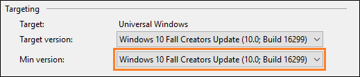

# Use a MongoDB database
This article contains the steps required to enable working with a MongoDB database from a UWP app. It also contains a small code snippet showing how you can interact with the database in code.

## Set up your solution

To connect your app directly to a MongoDB database, ensure that the minimum version of your project targets the Fall Creators update (Build 16299).  You can find that information in the properties page of your UWP project.



Open the **Package Manager Console** (View -> Other Windows -> Package Manager Console). Use the command **Install-Package MongoDB.Driver** to install the driver for MongoDB. This will allow you to programmatically access MongoDB databases.

## Test your connection using sample code
The following sample code gets a collection from a remote MongoDB client, then adds a new document to that collection. Then it uses MongoDB APIs to retrieve the new size of the collection as well as the inserted document, and prints them out. Note that the IP address and database names will need to be customized.

```csharp
var client = new MongoClient("mongodb://10.xxx.xx.xxx:xxx");
IMongoDatabase database = client.GetDatabase("foo");
IMongoCollection<BsonDocument> collection = database.GetCollection<BsonDocument>("bar");
BsonDocument document = new BsonDocument
{
     { "name","MongoDB"},
     { "type","Database"},
     { "count",1},
     { "info",new BsonDocument { { "x", 203 }, { "y", 102 } }}
};
collection.InsertOne(document);
long count = collection.CountDocuments(document);
Debug.WriteLine(count);
IFindFluent<BsonDocument, BsonDocument> document1 = collection.Find(document);
Debug.WriteLine(document1.ToString());
```
