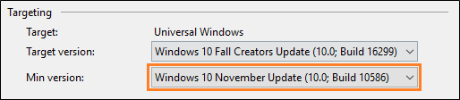
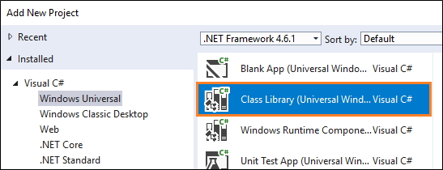
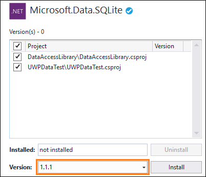
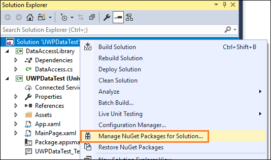
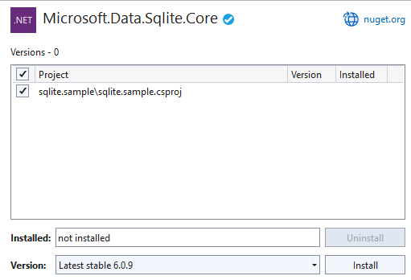
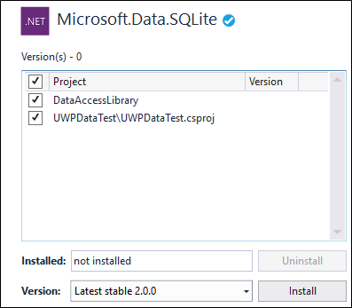
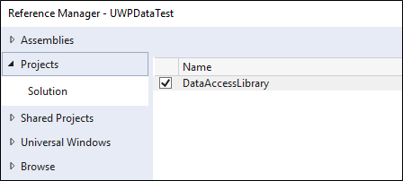

# Use a SQLite database in a UWP app
You can use SQLite to store and retrieve data in a light-weight database on the user's device. This guide shows you how.

## Some benefits of using SQLite for local storage

:heavy_check_mark: SQLite is light-weight and self-contained. It's a code library without any other dependencies. There's nothing to configure.

:heavy_check_mark: There's no database server. The client and the server run in the same process.

:heavy_check_mark: SQLite is in the public domain so you can freely use and distribute it with your app.

:heavy_check_mark: SQLite works across platforms and architectures.

You can read more about SQLite [here](https://sqlite.org/about.html).

## Choose an abstraction layer

We recommend that you use either the Entity Framework Core or the open-source [SQLite library](https://github.com/aspnet/Microsoft.Data.Sqlite/) built by Microsoft.

### Entity Framework Core

Entity Framework (EF) is an object-relational mapper that you can use to work with relational data by using domain-specific objects. If you've already used this framework to work with data in other .NET apps, you can migrate that code to a UWP app and it will work with appropriate changes to the connection string.

To try it out, see [Getting started with EF Core on Universal Windows Platform (UWP) with a New Database](/ef/core/get-started/uwp/getting-started).

### SQLite library

The [Microsoft.Data.Sqlite](/dotnet/api/microsoft.data.sqlite?view=msdata-sqlite-2.0.0) library implements the interfaces in the [System.Data.Common](/dotnet/api/system.data.common) namespace. Microsoft actively maintains these implementations, and they provide an intuitive wrapper around the low-level native SQLite API.

The rest of this guide helps you to use this library.

## Set up your solution to use the Microsoft.Data.SQlite library

We'll start with a basic UWP project, add a class library, and then install the appropriate Nuget packages.

The type of class library that you add to your solution,  and the specific packages that you install depends on the minimum version of the Windows SDK that your app targets. You can find that information in the properties page of your UWP project.



Use one of the following sections depending on the minimum version of the Windows SDK that your UWP project targets.

### The minimum version of your project does not target the Fall Creators Update

If you're using Visual Studio 2015, click **Help**->**About Microsoft Visual Studio**. Then in the list of installed programs, make sure that you have NuGet package manager version of **3.5** or higher. If your version number is lower than that, install a later version of NuGet [here](https://www.nuget.org/downloads). On that page, you'll find all of the versions of Nuget listed beneath the **Visual Studio 2015** heading.

Next, add class library to your solution. You don't have to use a class library to contain your data access code, but we'll use one our example. We'll name the library **DataAccessLibrary** and we'll name the class in the library to **DataAccess**.



Right-click the solution, and then click **Manage NuGet Packages for Solution**.


If you're using Visual Studio 2015, Choose the **Installed** tab, and make sure that the version number of the **Microsoft.NETCore.UniversalWindowsPlatform** package is **5.2.2** or higher.


If it isn't, update the package to a newer version.

Choose the **Browse** tab, and search for the **Microsoft.Data.SQLite** package. Install version **1.1.1** (or lower) of that package.



Move onto the [Add and retrieve data in a SQLite database](#add-and-retrieve-data-in-a-sqlite-database) section of this guide.

### The minimum version of your project targets the Fall Creators Update

There's a couple of benefits to raising the minimum version of your UWP project to the Fall Creators update.

First off, you can use .NET Standard 2.0 libraries instead of regular class libraries. That means that you can share your data access code with any other .NET-based app such as a WPF, Windows Forms, Android, iOS, or ASP.NET app.

Secondly, your app does not have to package SQLite libraries. Instead, your app can use the version of SQLite that comes installed with Windows. This helps you in a few ways.

:heavy_check_mark: Reduces the size of your application because you don't have to download the SQLite binary, and then package it as part of your application.

:heavy_check_mark: Prevents you from having to push a new version of your app to users in the event that SQLite publishes critical fixes to bugs and security vulnerabilities in SQLite. The Windows version of SQLite is maintained by Microsoft in coordination with SQLite.org.

:heavy_check_mark: App load time has the potential to be faster because most likely, the SDK version of SQLite will already be loaded into memory.

Lets start by adding a .NET Standard 2.0 class library to your solution. It's not necessary that you use a class library to contain your data access code, but we'll use one our example. We'll name the library **DataAccessLibrary** and we'll name the class in the library to **DataAccess**.


Right-click the solution, and then click **Manage NuGet Packages for Solution**.



> [!NOTE]
> If you want your .NET Standard class library to be able to access app folders and image assets of your UWP app, you will need to mark it as **EmbeddedResource** and **CopyAlways** in its **properties**.

At this point, you have a choice. You can use the version of SQLite that is included with Windows or if you have some reason to use a specific version of SQLite, you can include the SQLite library in your package.

Let's start with how you use the version of SQLite that included with Windows.

#### To use the version of SQLite that is installed with Windows

Choose the **Browse** tab, and search for the **Microsoft.Data.SQLite.core** package, and then install it.



Search for the **SQLitePCLRaw.bundle_winsqlite3** package, and then install it only to the UWP project in your solution.


#### To include SQLite with your app

You don't have to do this. But if you have a reason to include a specific version of SQLite with your app, choose the **Browse** tab, and search for the **Microsoft.Data.SQLite** package. Install version **2.0** (or lower) of that package.




## Add and retrieve data in a SQLite database

We'll do these things:

:one: Prepare the data access class.

:two: Initialize the SQLite database.

:three: Insert data into the SQLite database.

:four: Retrieve data from the SQLite database.

:five: Add a basic user interface.

### Prepare the data access class

From your UWP project, add a reference to the **DataAccessLibrary** project in your solution.



Add the following ``using`` statement to the **App.xaml.cs** and **MainPage.xaml.cs** files in your UWP project.

```csharp
using DataAccessLibrary;
```

Open the **DataAccess** class in your **DataAccessLibrary** solution and make that class static.

>[!NOTE]
>While our example will place data access code in a static class, it's just a design choice and is completely optional.

```csharp
namespace DataAccessLibrary
{
    public static class DataAccess
    {

    }
}

```

Add the following using statements to the top of this file.

```csharp
using Microsoft.Data.Sqlite;
using System.Collections.Generic;
```


### Initialize the SQLite database

Add a method to the **DataAccess** class that initializes the SQLite database.

```csharp
public async static void InitializeDatabase()
{ 
     await ApplicationData.Current.LocalFolder.CreateFileAsync("sqliteSample.db", CreationCollisionOption.OpenIfExists);
     string dbpath = Path.Combine(ApplicationData.Current.LocalFolder.Path, "sqliteSample.db");
     using (SqliteConnection db =
        new SqliteConnection($"Filename={dbpath}"))
    {
        db.Open();

        String tableCommand = "CREATE TABLE IF NOT " +
            "EXISTS MyTable (Primary_Key INTEGER PRIMARY KEY, " +
            "Text_Entry NVARCHAR(2048) NULL)";

        SqliteCommand createTable = new SqliteCommand(tableCommand, db);

        createTable.ExecuteReader();
    }
}
```

This code creates the SQLite database and stores it in the application's local data store.

In this example, we name the database ``sqlliteSample.db`` but you can use whatever name you want as long as you use that name in all [SqliteConnection](/dotnet/api/microsoft.data.sqlite.sqliteconnection?view=msdata-sqlite-2.0.0) objects that you instantiate.

In the constructor of the **App.xaml.cs** file of your UWP project, call the ``InitializeDatabase`` method of the **DataAccess** class.

```csharp
public App()
{
    this.InitializeComponent();
    this.Suspending += OnSuspending;

    DataAccess.InitializeDatabase();

}
```


### Insert data into the SQLite database

Add a method to the **DataAccess** class that inserts data into the SQLite database. This code uses parameters in the query to prevent SQL injection attacks.

```csharp
public static void AddData(string inputText)
{
    string dbpath = Path.Combine(ApplicationData.Current.LocalFolder.Path, "sqliteSample.db");
    using (SqliteConnection db =
      new SqliteConnection($"Filename={dbpath}"))
    {
        db.Open();

        SqliteCommand insertCommand = new SqliteCommand();
        insertCommand.Connection = db;

        // Use parameterized query to prevent SQL injection attacks
        insertCommand.CommandText = "INSERT INTO MyTable VALUES (NULL, @Entry);";
        insertCommand.Parameters.AddWithValue("@Entry", inputText);

        insertCommand.ExecuteReader();

        db.Close();
    }

}
```


### Retrieve data from the SQLite database

Add a method that gets rows of data from a SQLite database.

```csharp
public static List<String> GetData()
{
    List<String> entries = new List<string>();

   string dbpath = Path.Combine(ApplicationData.Current.LocalFolder.Path, "sqliteSample.db");
   using (SqliteConnection db =
      new SqliteConnection($"Filename={dbpath}"))
    {
        db.Open();

        SqliteCommand selectCommand = new SqliteCommand
            ("SELECT Text_Entry from MyTable", db);

        SqliteDataReader query = selectCommand.ExecuteReader();

        while (query.Read())
        {
            entries.Add(query.GetString(0));
        }

        db.Close();
    }

    return entries;
}
```

The [Read](/dotnet/api/microsoft.data.sqlite.sqlitedatareader.read?view=msdata-sqlite-2.0.0#Microsoft_Data_Sqlite_SqliteDataReader_Read) method advances through the rows of returned data. It returns **true** if there are rows left, otherwise it returns **false**.

The [GetString](/dotnet/api/microsoft.data.sqlite.sqlitedatareader.getstring?view=msdata-sqlite-2.0.0#Microsoft_Data_Sqlite_SqliteDataReader_GetString_System_Int32_) method returns the value of the specified column as a string. It accepts an integer value that represents the zero-based column ordinal of the data that you want. You can use similar methods such as [GetDataTime](/dotnet/api/microsoft.data.sqlite.sqlitedatareader.getdatetime?view=msdata-sqlite-2.0.0#Microsoft_Data_Sqlite_SqliteDataReader_GetDateTime_System_Int32_) and [GetBoolean](/dotnet/api/microsoft.data.sqlite.sqlitedatareader.getboolean?view=msdata-sqlite-2.0.0#Microsoft_Data_Sqlite_SqliteDataReader_GetBoolean_System_Int32_). Choose a method based on what type of data the column contains.

The ordinal parameter isn't as important in this example because we are selecting all of the entries in a single column. However, if multiple columns are part of your query, use the ordinal value to obtain the column you want to pull data from.

## Add a basic user interface

In the **MainPage.xaml** file of the UWP project, add the following XAML.

```xml
<Grid Background="{ThemeResource ApplicationPageBackgroundThemeBrush}">
    <StackPanel>
        <TextBox Name="Input_Box"></TextBox>
        <Button Click="AddData">Add</Button>
        <ListView Name="Output">
            <ListView.ItemTemplate>
                <DataTemplate>
                    <TextBlock Text="{Binding}"/>
                </DataTemplate>
            </ListView.ItemTemplate>
        </ListView>
    </StackPanel>
</Grid>
```

This basic user interface gives the user a ``TextBox`` that they can use to type a string that we'll add to the SQLite database. We'll connect the ``Button`` in this UI to an event handler that will retrieve data from the SQLite database and then show that data in the ``ListView``.

In the **MainPage.xaml.cs** file, add the following handler. This is the method that we associated with the ``Click`` event of the ``Button`` in the UI.

```csharp
private void AddData(object sender, RoutedEventArgs e)
{
    DataAccess.AddData(Input_Box.Text);

    Output.ItemsSource = DataAccess.GetData();
}
```

That's it. Explore the [Microsoft.Data.Sqlite](/dotnet/api/microsoft.data.sqlite?view=msdata-sqlite-2.0.0) to see what other things you can do with your SQLite database. Check out the links below to learn about other ways to use data in your UWP app.

## Next steps

**Connect your app directly to a SQL Server database**

See [Use a SQL Server database in a UWP app](sql-server-databases.md).

**Share code between different apps across different platforms**

See [Share code between desktop and UWP](../porting/desktop-to-uwp-migrate.md).

**Add master detail pages with Azure SQL back ends**

See [Customer Orders Database sample](https://github.com/Microsoft/Windows-appsample-customers-orders-database).