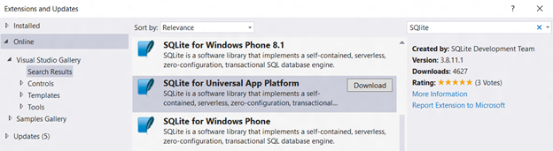
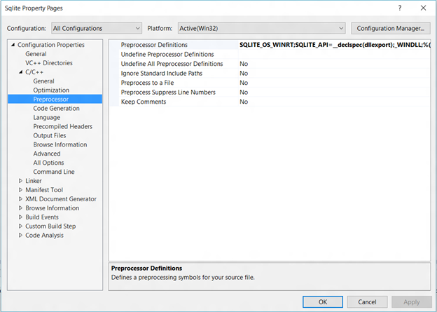

# SQLite databases

\[ Updated for UWP apps on Windows 10. For Windows 8.x articles, see the [archive](http://go.microsoft.com/fwlink/p/?linkid=619132) \]

SQLite is a server-less, embedded database engine. This article explains how to use the SQLite library included in the SDK, package your own SQLite library in a Universal Windows app, or build it from the source.

## What SQLite is and when to use it

SQLite is an open source, embedded, server-less database. Over the years it has emerged as the dominant device side technology for data storage on many platforms and devices. Universal Windows Platform (UWP) supports and recommends SQLite for local storage across all Windows 10 device families.

SQLite is best suited for phone apps, embedded applications for Windows 10 IoT Core (IoT Core), and as a cache for enterprise relations database server (RDBS) data. It will satisfy most local data access needs unless they entail heavy concurrent writes, or a big data scale—scenarios unlikely for most apps.

In media playback and gaming applications, SQLite can also be used as a file format to store catalogues or other assets, such as levels of a game, that can be downloaded as-is from a web server.

## Adding SQLite to a UWP app project

There are three ways of adding SQLite to a UWP project.

1.  [Using the SDK SQLite](#using-the-sdk-sqlite)
2.  [Including SQLite in the App Package](#including-sqlite-in-the-app-package)
3.  [Building SQLite from source in Visual Studio](#building-sqlite-from-source-in-visual-studio)

### Using the SDK SQLite

You may wish to use the SQLite library included in the UWP SDK to reduce the size of your application package, and rely on the platform to update the library periodically. Using the SDK SQLite might also lead to performance advantages such as faster launch times given the SQLite library is highly likely to already be loaded in memory for use by system components.

To reference the SDK SQLite, include the following header in your project. The header also contains the version of SQLite supported in the platform.

`#include <winsqlite/winsqlite3.h>`

Configure the project to link to winsqlite3.lib. In **Solution Explorer**, right-click your project and select **Properties** &gt; **Linker** &gt; **Input**, then add winsqlite3.lib to **Additional Dependencies**.

### Including SQLite in the App Package

Sometimes, you might wish to package your own library instead of using the SDK version, for example, you might wish to use a particular version of it in your cross-platform clients that is different from the version of SQLite included in the SDK.

Install the SQLite library on the Universal Windows Platform Visual Studio extension available from SQLite.org, or through the Extensions and Updates tool.

Once the extension is installed, reference the following header file in your code.

`#include <sqlite3.h>`

### Building SQLite from source in Visual Studio

Sometimes you might wish to compile your own SQLite binary to use [various compiler options](http://www.sqlite.org/compile.html) to reduce the file size, performance tune the library, or tailor the feature set to your application. SQLite provides options for platform configuration, setting default parameter values, setting size limits, controlling operating characteristics, enabling features normally turned off, disabling features normally turned on, omitting features, enabling analysis and debugging, and managing memory allocation behavior on Windows.

*Adding source to a Visual Studio project*

The SQLite source code is available for download at the [SQLite.org download page](https://www.sqlite.org/download.html). Add this file to the Visual Studio project of the application you wish to use SQLite in.

*Configure Preprocessors*

Always use SQLITE\_OS\_WINRT and SQLITE\_API=\_\_declspec(dllexport) in addition to any other [compile time options](http://www.sqlite.org/compile.html).

## Managing a SQLite Database

SQLite databases can be created, updated, and deleted with the SQLite C APIs. Details of the SQLite C API can be found at the SQLite.org [Introduction To The SQLite C/C++ Interface](http://www.sqlite.org/cintro.html) page.

To gain sound understanding of how SQLite works, work backwards from the main task of the SQL database which is to evaluate SQL statements. There are two objects to keep in mind:

-   [The database connection handle](https://www.sqlite.org/c3ref/sqlite3.html)
-   [The prepared statement object](https://www.sqlite.org/c3ref/stmt.html)

There are six interfaces to perform database operations on these objects:

-   [sqlite3\_open()](https://web.archive.org/web/20141228070025/http:/www.sqlite.org/c3ref/open.html)
-   [sqlite3\_prepare()](https://web.archive.org/web/20141228070025/http:/www.sqlite.org/c3ref/prepare.html)
-   [sqlite3\_step()](https://web.archive.org/web/20141228070025/http:/www.sqlite.org/c3ref/step.html)
-   [sqlite3\_column()](https://web.archive.org/web/20141228070025/http:/www.sqlite.org/c3ref/column_blob.html)
-   [sqlite3\_finalize()](https://web.archive.org/web/20141228070025/http:/www.sqlite.org/c3ref/finalize.html)
-   [sqlite3\_close()](https://web.archive.org/web/20141228070025/http:/www.sqlite.org/c3ref/close.html)

 

 
