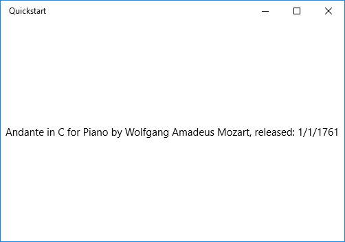
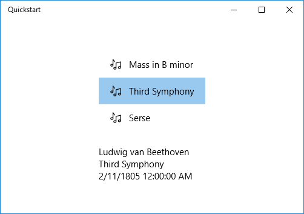
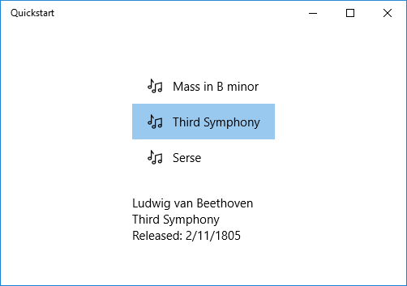

# Data binding overview

This topic shows you how to bind a control (or other UI element) to a single item or bind an items control to a collection of items in a Universal Windows Platform (UWP) app. In addition, we show how to control the rendering of items, implement a details view based on a selection, and convert data for display. For more detailed info, see [Data binding in depth](data-binding-in-depth.md).

## Prerequisites

This topic assumes that you know how to create a basic UWP app. For instructions on creating your first UWP app, see [Get started with Windows apps](../get-started/index.md).

## Create the project

Create a new **Blank Application (Windows Universal)** project. Name it "Quickstart".

## Binding to a single item

Every binding consists of a binding target and a binding source. Typically, the target is a property of a control or other UI element, and the source is a property of a class instance (a data model, or a view model). This example shows how to bind a control to a single item. The target is the **Text** property of a **TextBlock**. The source is an instance of a simple class named **Recording** that represents an audio recording. Let's look at the class first.

If you're using C# or C++/CX, then add a new class to your project, and name the class **Recording**.

If you're using [C++/WinRT](../cpp-and-winrt-apis/intro-to-using-cpp-with-winrt.md), then add new **Midl File (.idl)** items to the project, named as shown in the C++/WinRT code example listing below. Replace the contents of those new files with the [MIDL 3.0](/uwp/midl-3/intro) code shown in the listing, build the project to generate `Recording.h` and `.cpp` and `RecordingViewModel.h` and `.cpp`, and then add code to the generated files to match the listing. For more info about those generated files and how to copy them into your project, see [XAML controls; bind to a C++/WinRT property](../cpp-and-winrt-apis/binding-property.md).

```csharp
namespace Quickstart
{
    public class Recording
    {
        public string ArtistName { get; set; }
        public string CompositionName { get; set; }
        public DateTime ReleaseDateTime { get; set; }
        public Recording()
        {
            this.ArtistName = "Wolfgang Amadeus Mozart";
            this.CompositionName = "Andante in C for Piano";
            this.ReleaseDateTime = new DateTime(1761, 1, 1);
        }
        public string OneLineSummary
        {
            get
            {
                return $"{this.CompositionName} by {this.ArtistName}, released: "
                    + this.ReleaseDateTime.ToString("d");
            }
        }
    }
    public class RecordingViewModel
    {
        private Recording defaultRecording = new Recording();
        public Recording DefaultRecording { get { return this.defaultRecording; } }
    }
}
```

```cppwinrt
// Recording.idl
namespace Quickstart
{
    runtimeclass Recording
    {
        Recording(String artistName, String compositionName, Windows.Globalization.Calendar releaseDateTime);
        String ArtistName{ get; };
        String CompositionName{ get; };
        Windows.Globalization.Calendar ReleaseDateTime{ get; };
        String OneLineSummary{ get; };
    }
}

// RecordingViewModel.idl
import "Recording.idl";

namespace Quickstart
{
    runtimeclass RecordingViewModel
    {
        RecordingViewModel();
        Quickstart.Recording DefaultRecording{ get; };
    }
}

// Recording.h
// Add these fields:
...
#include <sstream>
...
private:
    std::wstring m_artistName;
    std::wstring m_compositionName;
    Windows::Globalization::Calendar m_releaseDateTime;
...

// Recording.cpp
// Implement like this:
...
Recording::Recording(hstring const& artistName, hstring const& compositionName, Windows::Globalization::Calendar const& releaseDateTime) :
    m_artistName{ artistName.c_str() },
    m_compositionName{ compositionName.c_str() },
    m_releaseDateTime{ releaseDateTime } {}

hstring Recording::ArtistName(){ return hstring{ m_artistName }; }
hstring Recording::CompositionName(){ return hstring{ m_compositionName }; }
Windows::Globalization::Calendar Recording::ReleaseDateTime(){ return m_releaseDateTime; }

hstring Recording::OneLineSummary()
{
    std::wstringstream wstringstream;
    wstringstream << m_compositionName.c_str();
    wstringstream << L" by " << m_artistName.c_str();
    wstringstream << L", released: " << m_releaseDateTime.MonthAsNumericString().c_str();
    wstringstream << L"/" << m_releaseDateTime.DayAsString().c_str();
    wstringstream << L"/" << m_releaseDateTime.YearAsString().c_str();
    return hstring{ wstringstream.str().c_str() };
}
...

// RecordingViewModel.h
// Add this field:
...
#include "Recording.h"
...
private:
    Quickstart::Recording m_defaultRecording{ nullptr };
...

// RecordingViewModel.cpp
// Implement like this:
...
Quickstart::Recording RecordingViewModel::DefaultRecording()
{
    Windows::Globalization::Calendar releaseDateTime;
    releaseDateTime.Year(1761);
    releaseDateTime.Month(1);
    releaseDateTime.Day(1);
    m_defaultRecording = winrt::make<Recording>(L"Wolfgang Amadeus Mozart", L"Andante in C for Piano", releaseDateTime);
    return m_defaultRecording;
}
...
```

```cppcx
// Recording.h
#include <sstream>
namespace Quickstart
{
    public ref class Recording sealed
    {
    private:
        Platform::String^ artistName;
        Platform::String^ compositionName;
        Windows::Globalization::Calendar^ releaseDateTime;
    public:
        Recording(Platform::String^ artistName, Platform::String^ compositionName,
            Windows::Globalization::Calendar^ releaseDateTime) :
            artistName{ artistName },
            compositionName{ compositionName },
            releaseDateTime{ releaseDateTime } {}
        property Platform::String^ ArtistName
        {
            Platform::String^ get() { return this->artistName; }
        }
        property Platform::String^ CompositionName
        {
            Platform::String^ get() { return this->compositionName; }
        }
        property Windows::Globalization::Calendar^ ReleaseDateTime
        {
            Windows::Globalization::Calendar^ get() { return this->releaseDateTime; }
        }
        property Platform::String^ OneLineSummary
        {
            Platform::String^ get()
            {
                std::wstringstream wstringstream;
                wstringstream << this->CompositionName->Data();
                wstringstream << L" by " << this->ArtistName->Data();
                wstringstream << L", released: " << this->ReleaseDateTime->MonthAsNumericString()->Data();
                wstringstream << L"/" << this->ReleaseDateTime->DayAsString()->Data();
                wstringstream << L"/" << this->ReleaseDateTime->YearAsString()->Data();
                return ref new Platform::String(wstringstream.str().c_str());
            }
        }
    };
    public ref class RecordingViewModel sealed
    {
    private:
        Recording ^ defaultRecording;
    public:
        RecordingViewModel()
        {
            Windows::Globalization::Calendar^ releaseDateTime = ref new Windows::Globalization::Calendar();
            releaseDateTime->Year = 1761;
            releaseDateTime->Month = 1;
            releaseDateTime->Day = 1;
            this->defaultRecording = ref new Recording{ L"Wolfgang Amadeus Mozart", L"Andante in C for Piano", releaseDateTime };
        }
        property Recording^ DefaultRecording
        {
            Recording^ get() { return this->defaultRecording; };
        }
    };
}

// Recording.cpp
#include "pch.h"
#include "Recording.h"
```

Next, expose the binding source class from the class that represents your page of markup. We do that by adding a property of type **RecordingViewModel** to **MainPage**.

If you're using [C++/WinRT](../cpp-and-winrt-apis/intro-to-using-cpp-with-winrt.md), then first update `MainPage.idl`. Build the project to regenerate `MainPage.h` and `.cpp`, and merge the changes in those generated files into the ones in your project.

```csharp
namespace Quickstart
{
    public sealed partial class MainPage : Page
    {
        public MainPage()
        {
            this.InitializeComponent();
            this.ViewModel = new RecordingViewModel();
        }
        public RecordingViewModel ViewModel{ get; set; }
    }
}
```

```cppwinrt
// MainPage.idl
// Add this property:
import "RecordingViewModel.idl";
...
RecordingViewModel ViewModel{ get; };
...

// MainPage.h
// Add this property and this field:
...
#include "RecordingViewModel.h"
...
    Quickstart::RecordingViewModel ViewModel();

private:
    Quickstart::RecordingViewModel m_viewModel{ nullptr };
...

// MainPage.cpp
// Implement like this:
...
MainPage::MainPage()
{
    InitializeComponent();
    m_viewModel = winrt::make<RecordingViewModel>();
}
Quickstart::RecordingViewModel MainPage::ViewModel()
{
    return m_viewModel;
}
...
```

```cppcx
// MainPage.h
...
#include "Recording.h"

namespace Quickstart
{
    public ref class MainPage sealed
    {
    private:
        RecordingViewModel ^ viewModel;
    public:
        MainPage();

        property RecordingViewModel^ ViewModel
        {
            RecordingViewModel^ get() { return this->viewModel; };
        }
    };
}

// MainPage.cpp
...
MainPage::MainPage()
{
    InitializeComponent();
    this->viewModel = ref new RecordingViewModel();
}
```

The last piece is to bind a **TextBlock** to the **ViewModel.DefaultRecording.OneLiner** property.

```xml
<Page x:Class="Quickstart.MainPage" ... >
    <Grid Background="{ThemeResource ApplicationPageBackgroundThemeBrush}">
        <TextBlock Text="{x:Bind ViewModel.DefaultRecording.OneLineSummary}"
    HorizontalAlignment="Center"
    VerticalAlignment="Center"/>
    </Grid>
</Page>
```

If you're using [C++/WinRT](../cpp-and-winrt-apis/intro-to-using-cpp-with-winrt.md), then you'll need to remove the **MainPage::ClickHandler** function in order for the project to build.

Here's the result.



## Binding to a collection of items

A common scenario is to bind to a collection of business objects. In C# and Visual Basic, the generic [**ObservableCollection&lt;T&gt;**](/dotnet/api/system.collections.objectmodel.observablecollection-1) class is a good collection choice for data binding, because it implements the [**INotifyPropertyChanged**](/dotnet/api/system.componentmodel.inotifypropertychanged) and [**INotifyCollectionChanged**](/dotnet/api/system.collections.specialized.inotifycollectionchanged) interfaces. These interfaces provide change notification to bindings when items are added or removed or a property of the list itself changes. If you want your bound controls to update with changes to properties of objects in the collection, the business object should also implement **INotifyPropertyChanged**. For more info, see [Data binding in depth](data-binding-in-depth.md).

If you're using [C++/WinRT](../cpp-and-winrt-apis/intro-to-using-cpp-with-winrt.md), then you can learn more about binding to an observable collection in [XAML items controls; bind to a C++/WinRT collection](../cpp-and-winrt-apis/binding-collection.md). If you read that topic first, then the intent of the C++/WinRT code listing shown below will be clearer.

This next example binds a [**ListView**](/uwp/api/Windows.UI.Xaml.Controls.ListView) to a collection of `Recording` objects. Let's start by adding the collection to our view model. Just add these new members to the **RecordingViewModel** class.

```csharp
public class RecordingViewModel
{
    ...
    private ObservableCollection<Recording> recordings = new ObservableCollection<Recording>();
    public ObservableCollection<Recording> Recordings{ get{ return this.recordings; } }
    public RecordingViewModel()
    {
        this.recordings.Add(new Recording(){ ArtistName = "Johann Sebastian Bach",
            CompositionName = "Mass in B minor", ReleaseDateTime = new DateTime(1748, 7, 8) });
        this.recordings.Add(new Recording(){ ArtistName = "Ludwig van Beethoven",
            CompositionName = "Third Symphony", ReleaseDateTime = new DateTime(1805, 2, 11) });
        this.recordings.Add(new Recording(){ ArtistName = "George Frideric Handel",
            CompositionName = "Serse", ReleaseDateTime = new DateTime(1737, 12, 3) });
    }
}
```

```cppwinrt
// RecordingViewModel.idl
// Add this property:
...
#include <winrt/Windows.Foundation.Collections.h>
...
Windows.Foundation.Collections.IVector<IInspectable> Recordings{ get; };
...

// RecordingViewModel.h
// Change the constructor declaration, and add this property and this field:
...
    RecordingViewModel();
    Windows::Foundation::Collections::IVector<Windows::Foundation::IInspectable> Recordings();

private:
    Windows::Foundation::Collections::IVector<Windows::Foundation::IInspectable> m_recordings;
...

// RecordingViewModel.cpp
// Update/add implementations like this:
...
RecordingViewModel::RecordingViewModel()
{
    std::vector<Windows::Foundation::IInspectable> recordings;

    Windows::Globalization::Calendar releaseDateTime;
    releaseDateTime.Month(7); releaseDateTime.Day(8); releaseDateTime.Year(1748);
    recordings.push_back(winrt::make<Recording>(L"Johann Sebastian Bach", L"Mass in B minor", releaseDateTime));

    releaseDateTime = Windows::Globalization::Calendar{};
    releaseDateTime.Month(11); releaseDateTime.Day(2); releaseDateTime.Year(1805);
    recordings.push_back(winrt::make<Recording>(L"Ludwig van Beethoven", L"Third Symphony", releaseDateTime));

    releaseDateTime = Windows::Globalization::Calendar{};
    releaseDateTime.Month(3); releaseDateTime.Day(12); releaseDateTime.Year(1737);
    recordings.push_back(winrt::make<Recording>(L"George Frideric Handel", L"Serse", releaseDateTime));

    m_recordings = winrt::single_threaded_observable_vector<Windows::Foundation::IInspectable>(std::move(recordings));
}

Windows::Foundation::Collections::IVector<Windows::Foundation::IInspectable> RecordingViewModel::Recordings() { return m_recordings; }
...
```

```cppcx
// Recording.h
...
public ref class RecordingViewModel sealed
{
private:
    ...
    Windows::Foundation::Collections::IVector<Recording^>^ recordings;
public:
    RecordingViewModel()
    {
        ...
        releaseDateTime = ref new Windows::Globalization::Calendar();
        releaseDateTime->Year = 1748;
        releaseDateTime->Month = 7;
        releaseDateTime->Day = 8;
        Recording^ recording = ref new Recording{ L"Johann Sebastian Bach", L"Mass in B minor", releaseDateTime };
        this->Recordings->Append(recording);
        releaseDateTime = ref new Windows::Globalization::Calendar();
        releaseDateTime->Year = 1805;
        releaseDateTime->Month = 2;
        releaseDateTime->Day = 11;
        recording = ref new Recording{ L"Ludwig van Beethoven", L"Third Symphony", releaseDateTime };
        this->Recordings->Append(recording);
        releaseDateTime = ref new Windows::Globalization::Calendar();
        releaseDateTime->Year = 1737;
        releaseDateTime->Month = 12;
        releaseDateTime->Day = 3;
        recording = ref new Recording{ L"George Frideric Handel", L"Serse", releaseDateTime };
        this->Recordings->Append(recording);
    }
    ...
    property Windows::Foundation::Collections::IVector<Recording^>^ Recordings
    {
        Windows::Foundation::Collections::IVector<Recording^>^ get()
        {
            if (this->recordings == nullptr)
            {
                this->recordings = ref new Platform::Collections::Vector<Recording^>();
            }
            return this->recordings;
        };
    }
};
```

And then bind a [**ListView**](/uwp/api/Windows.UI.Xaml.Controls.ListView) to the **ViewModel.Recordings** property.

```xml
<Page x:Class="Quickstart.MainPage" ... >
    <Grid Background="{ThemeResource ApplicationPageBackgroundThemeBrush}">
        <ListView ItemsSource="{x:Bind ViewModel.Recordings}"
        HorizontalAlignment="Center" VerticalAlignment="Center"/>
    </Grid>
</Page>
```

We haven't yet provided a data template for the **Recording** class, so the best the UI framework can do is to call [**ToString**](/dotnet/api/system.object.tostring#System_Object_ToString) for each item in the [**ListView**](/uwp/api/Windows.UI.Xaml.Controls.ListView). The default implementation of **ToString** is to return the type name.


To remedy this, we can either override [**ToString**](/dotnet/api/system.object.tostring#System_Object_ToString) to return the value of **OneLineSummary**, or we can provide a data template. The data template option is a more usual solution, and a more flexible one. You specify a data template by using the [**ContentTemplate**](/uwp/api/windows.ui.xaml.controls.contentcontrol.contenttemplate) property of a content control or the [**ItemTemplate**](/uwp/api/windows.ui.xaml.controls.itemscontrol.itemtemplate) property of an items control. Here are two ways we could design a data template for **Recording** together with an illustration of the result.

```xml
<ListView ItemsSource="{x:Bind ViewModel.Recordings}"
HorizontalAlignment="Center" VerticalAlignment="Center">
    <ListView.ItemTemplate>
        <DataTemplate x:DataType="local:Recording">
            <TextBlock Text="{x:Bind OneLineSummary}"/>
        </DataTemplate>
    </ListView.ItemTemplate>
</ListView>
```


```xml
<ListView ItemsSource="{x:Bind ViewModel.Recordings}"
HorizontalAlignment="Center" VerticalAlignment="Center">
    <ListView.ItemTemplate>
        <DataTemplate x:DataType="local:Recording">
            <StackPanel Orientation="Horizontal" Margin="6">
                <SymbolIcon Symbol="Audio" Margin="0,0,12,0"/>
                <StackPanel>
                    <TextBlock Text="{x:Bind ArtistName}" FontWeight="Bold"/>
                    <TextBlock Text="{x:Bind CompositionName}"/>
                </StackPanel>
            </StackPanel>
        </DataTemplate>
    </ListView.ItemTemplate>
</ListView>
```


For more information about XAML syntax, see [Create a UI with XAML](../design/basics/xaml-basics-ui.md). For more information about control layout, see [Define layouts with XAML](../design/layout/layouts-with-xaml.md).

## Adding a details view

You can choose to display all the details of **Recording** objects in [**ListView**](/uwp/api/Windows.UI.Xaml.Controls.ListView) items. But that takes up a lot of space. Instead, you can show just enough data in the item to identify it and then, when the user makes a selection, you can display all the details of the selected item in a separate piece of UI known as the details view. This arrangement is also known as a master/details view, or a list/details view.

There are two ways to go about this. You can bind the details view to the [**SelectedItem**](/uwp/api/windows.ui.xaml.controls.primitives.selector.selecteditem) property of the [**ListView**](/uwp/api/Windows.UI.Xaml.Controls.ListView). Or you can use a [**CollectionViewSource**](/uwp/api/Windows.UI.Xaml.Data.CollectionViewSource), in which case you bind both the **ListView** and the details view to the **CollectionViewSource** (doing so takes care of the currently-selected item for you). Both techniques are shown below, and they both give the same results (shown in the illustration).

> [!NOTE]
> So far in this topic we've only used the [{x:Bind} markup extension](../xaml-platform/x-bind-markup-extension.md), but both of the techniques we'll show below require the more flexible (but less performant) [{Binding} markup extension](../xaml-platform/binding-markup-extension.md).

If you're using C++/WinRT or Visual C++ component extensions (C++/CX) then, to use the [{Binding}](../xaml-platform/binding-markup-extension.md) markup extension, you'll need to add the [**BindableAttribute**](/uwp/api/Windows.UI.Xaml.Data.BindableAttribute) attribute to any runtime class that you want to bind to. To use [{x:Bind}](../xaml-platform/x-bind-markup-extension.md), you don't need that attribute.

> [!IMPORTANT]
> If you're using [C++/WinRT](../cpp-and-winrt-apis/intro-to-using-cpp-with-winrt.md), then the [**BindableAttribute**](/uwp/api/Windows.UI.Xaml.Data.BindableAttribute) attribute is available if you've installed the Windows SDK version 10.0.17763.0 (Windows 10, version 1809), or later. Without that attribute, you'll need to implement the [ICustomPropertyProvider](/uwp/api/windows.ui.xaml.data.icustompropertyprovider) and [ICustomProperty](/uwp/api/windows.ui.xaml.data.icustomproperty) interfaces in order to be able to use the [{Binding}](../xaml-platform/binding-markup-extension.md) markup extension.

First, here's the [**SelectedItem**](/uwp/api/windows.ui.xaml.controls.primitives.selector.selecteditem) technique.

```csharp
// No code changes necessary for C#.
```

```cppwinrt
// Recording.idl
// Add this attribute:
...
[Windows.UI.Xaml.Data.Bindable]
runtimeclass Recording
...
```

```cppcx
[Windows::UI::Xaml::Data::Bindable]
public ref class Recording sealed
{
    ...
};
```

The only other change necessary is to the markup.

```xml
<Page x:Class="Quickstart.MainPage" ... >
    <Grid Background="{ThemeResource ApplicationPageBackgroundThemeBrush}">
        <StackPanel HorizontalAlignment="Center" VerticalAlignment="Center">
            <ListView x:Name="recordingsListView" ItemsSource="{x:Bind ViewModel.Recordings}">
                <ListView.ItemTemplate>
                    <DataTemplate x:DataType="local:Recording">
                        <StackPanel Orientation="Horizontal" Margin="6">
                            <SymbolIcon Symbol="Audio" Margin="0,0,12,0"/>
                            <StackPanel>
                                <TextBlock Text="{x:Bind CompositionName}"/>
                            </StackPanel>
                        </StackPanel>
                    </DataTemplate>
                </ListView.ItemTemplate>
            </ListView>
            <StackPanel DataContext="{Binding SelectedItem, ElementName=recordingsListView}"
            Margin="0,24,0,0">
                <TextBlock Text="{Binding ArtistName}"/>
                <TextBlock Text="{Binding CompositionName}"/>
                <TextBlock Text="{Binding ReleaseDateTime}"/>
            </StackPanel>
        </StackPanel>
    </Grid>
</Page>
```

For the [**CollectionViewSource**](/uwp/api/Windows.UI.Xaml.Data.CollectionViewSource) technique, first add a **CollectionViewSource** as a page resource.

```xml
<Page.Resources>
    <CollectionViewSource x:Name="RecordingsCollection" Source="{x:Bind ViewModel.Recordings}"/>
</Page.Resources>
```

And then adjust the bindings on the [**ListView**](/uwp/api/Windows.UI.Xaml.Controls.ListView) (which no longer needs to be named) and on the details view to use the [**CollectionViewSource**](/uwp/api/Windows.UI.Xaml.Data.CollectionViewSource). Note that by binding the details view directly to the **CollectionViewSource**, you're implying that you want to bind to the current item in bindings where the path cannot be found on the collection itself. There's no need to specify the **CurrentItem** property as the path for the binding, although you can do that if there's any ambiguity).

```xml
...
<ListView ItemsSource="{Binding Source={StaticResource RecordingsCollection}}">
...
<StackPanel DataContext="{Binding Source={StaticResource RecordingsCollection}}" ...>
...
```

And here's the identical result in each case.

> [!NOTE]
> If you're using C++, then your UI won't look exactly like the illustration below: the rendering of the **ReleaseDateTime** property is different. See the following section for more discussion of this.



## Formatting or converting data values for display

There is an issue with the rendering above. The **ReleaseDateTime** property is not just a date, it's a [**DateTime**](/uwp/api/windows.foundation.datetime) (if you're using C++, then it's a [**Calendar**](/uwp/api/windows.globalization.calendar)). So, in C#, it's being displayed with more precision than we need. And in C++ it's being rendered as a type name. One solution is to add a string property to the **Recording** class that returns the equivalent of `this.ReleaseDateTime.ToString("d")`. Naming that property **ReleaseDate** would indicate that it returns a date, and not a date-and-time. Naming it **ReleaseDateAsString** would further indicate that it returns a string.

A more flexible solution is to use something known as a value converter. Here's an example of how to author your own value converter. If you're using C#, then add the code below to your `Recording.cs` source code file. If you're using C++/WinRT, then add a new **Midl File (.idl)** item to the project, named as shown in the C++/WinRT code example listing below, build the project to generate `StringFormatter.h` and `.cpp`, add those files to your project, and then paste the code listings into them. Also add `#include "StringFormatter.h"` to `MainPage.h`.

```csharp
public class StringFormatter : Windows.UI.Xaml.Data.IValueConverter
{
    // This converts the value object to the string to display.
    // This will work with most simple types.
    public object Convert(object value, Type targetType,
        object parameter, string language)
    {
        // Retrieve the format string and use it to format the value.
        string formatString = parameter as string;
        if (!string.IsNullOrEmpty(formatString))
        {
            return string.Format(formatString, value);
        }

        // If the format string is null or empty, simply
        // call ToString() on the value.
        return value.ToString();
    }

    // No need to implement converting back on a one-way binding
    public object ConvertBack(object value, Type targetType,
        object parameter, string language)
    {
        throw new NotImplementedException();
    }
}
```

```cppwinrt
// StringFormatter.idl
namespace Quickstart
{
    runtimeclass StringFormatter : [default] Windows.UI.Xaml.Data.IValueConverter
    {
        StringFormatter();
    }
}

// StringFormatter.h
#pragma once

#include "StringFormatter.g.h"
#include <sstream>

namespace winrt::Quickstart::implementation
{
    struct StringFormatter : StringFormatterT<StringFormatter>
    {
        StringFormatter() = default;

        Windows::Foundation::IInspectable Convert(Windows::Foundation::IInspectable const& value, Windows::UI::Xaml::Interop::TypeName const& targetType, Windows::Foundation::IInspectable const& parameter, hstring const& language);
        Windows::Foundation::IInspectable ConvertBack(Windows::Foundation::IInspectable const& value, Windows::UI::Xaml::Interop::TypeName const& targetType, Windows::Foundation::IInspectable const& parameter, hstring const& language);
    };
}

namespace winrt::Quickstart::factory_implementation
{
    struct StringFormatter : StringFormatterT<StringFormatter, implementation::StringFormatter>
    {
    };
}

// StringFormatter.cpp
#include "pch.h"
#include "StringFormatter.h"
#include "StringFormatter.g.cpp"

namespace winrt::Quickstart::implementation
{
    Windows::Foundation::IInspectable StringFormatter::Convert(Windows::Foundation::IInspectable const& value, Windows::UI::Xaml::Interop::TypeName const& /* targetType */, Windows::Foundation::IInspectable const& /* parameter */, hstring const& /* language */)
    {
        // Retrieve the value as a Calendar.
        Windows::Globalization::Calendar valueAsCalendar{ value.as<Windows::Globalization::Calendar>() };

        std::wstringstream wstringstream;
        wstringstream << L"Released: ";
        wstringstream << valueAsCalendar.MonthAsNumericString().c_str();
        wstringstream << L"/" << valueAsCalendar.DayAsString().c_str();
        wstringstream << L"/" << valueAsCalendar.YearAsString().c_str();
        return winrt::box_value(hstring{ wstringstream.str().c_str() });
    }

    Windows::Foundation::IInspectable StringFormatter::ConvertBack(Windows::Foundation::IInspectable const& /* value */, Windows::UI::Xaml::Interop::TypeName const& /* targetType */, Windows::Foundation::IInspectable const& /* parameter */, hstring const& /* language */)
    {
        throw hresult_not_implemented();
    }
}
```

```cppcx
...
public ref class StringFormatter sealed : Windows::UI::Xaml::Data::IValueConverter
{
public:
    virtual Platform::Object^ Convert(Platform::Object^ value, TypeName targetType, Platform::Object^ parameter, Platform::String^ language)
    {
        // Retrieve the value as a Calendar.
        Windows::Globalization::Calendar^ valueAsCalendar = dynamic_cast<Windows::Globalization::Calendar^>(value);

        std::wstringstream wstringstream;
        wstringstream << L"Released: ";
        wstringstream << valueAsCalendar->MonthAsNumericString()->Data();
        wstringstream << L"/" << valueAsCalendar->DayAsString()->Data();
        wstringstream << L"/" << valueAsCalendar->YearAsString()->Data();
        return ref new Platform::String(wstringstream.str().c_str());
    }

    // No need to implement converting back on a one-way binding
    virtual Platform::Object^ ConvertBack(Platform::Object^ value, TypeName targetType, Platform::Object^ parameter, Platform::String^ language)
    {
        throw ref new Platform::NotImplementedException();
    }
};
...
```

> [!NOTE]
> For the C++/WinRT code listing above, in `StringFormatter.idl`, we use the [default attribute](/windows/desktop/midl/default) to declare **IValueConverter** as the default interface. In the listing, **StringFormatter** has only a constructor, and no methods, so no default interface is generated for it. The `default` attribute is optimal if you won't be adding instance members to **StringFormatter**, because no QueryInterface will be required to call the **IValueConverter** methods. Alternatively, you can prompt a default **IStringFormatter** interface to be generated, and you do that by annotating the runtime class itself with the [default_interface attribute](/uwp/midl-3/predefined-attributes#the-default_interface-attribute). That option is optimal if you add instance members to **StringFormatter** that are called more often than the methods of **IValueConverter** are, because then no QueryInterface will be required to call the instance members.

Now we can add an instance of **StringFormatter** as a page resource and use it in the binding of the **TextBlock** that displays the **ReleaseDateTime** property.

```xml
<Page.Resources>
    <local:StringFormatter x:Key="StringFormatterValueConverter"/>
</Page.Resources>
...
<TextBlock Text="{Binding ReleaseDateTime,
    Converter={StaticResource StringFormatterValueConverter},
    ConverterParameter=Released: \{0:d\}}"/>
...
```

As you can see above, for formatting flexibility we use the markup to pass a format string into the converter by way of the converter parameter. In the code examples shown in this topic, only the C# value converter makes use of that parameter. But you could easily pass a C++-style format string as the converter parameter, and use that in your value converter with a formatting function such as **wprintf** or **swprintf**.

Here's the result.



> [!NOTE]
> Starting in Windows 10, version 1607, the XAML framework provides a built-in Boolean-to-Visibility converter. The converter maps **true** to the **Visibility.Visible** enumeration value and **false** to **Visibility.Collapsed** so you can bind a Visibility property to a Boolean without creating a converter. To use the built in converter, your app's minimum target SDK version must be 14393 or later. You can't use it when your app targets earlier versions of Windows 10. For more info about target versions, see [Version-adaptive code](../debug-test-perf/version-adaptive-code.md).

## See also
* [Data binding](index.md)