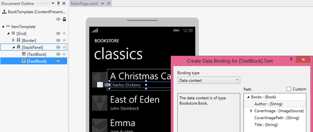
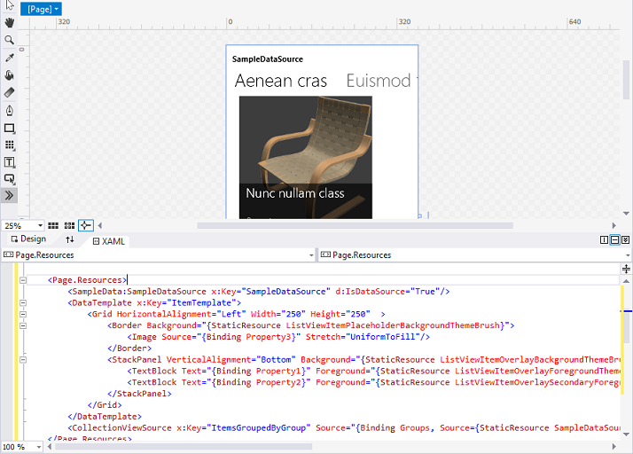

---

ms.assetid: 089660A2-7CAE-4911-9994-F619C5D22287
title: Sample data on the design surface, and for prototyping
description: It may be impossible or undesirable (perhaps for reasons of privacy or performance) for your app to display live data on the design surface in Microsoft Visual Studio or Blend for Visual Studio.

ms.date: 02/08/2017
ms.topic: article


keywords: windows 10, uwp
ms.localizationpriority: medium
---
Sample data on the design surface, and for prototyping
=============================================================================================


**Note**  The degree to which you need sample data—and how much it will help you—depends on whether your bindings use the [{Binding} markup extension](../xaml-platform/binding-markup-extension.md) or the [{x:Bind} markup extension](../xaml-platform/x-bind-markup-extension.md). The techniques described in this topic are based on the use of a [**DataContext**](/uwp/api/windows.ui.xaml.frameworkelement.datacontext), so they're only appropriate for **{Binding}**. But if you're using **{x:Bind}** then your bindings at least show placeholder values on the design surface (even for items controls), so you don't have quite the same need for sample data.

It may be impossible or undesirable (perhaps for reasons of privacy or performance) for your app to display live data on the design surface in Microsoft Visual Studio or Blend for Visual Studio. In order to have your controls populated with data (so that you can work on your app's layout, templates, and other visual properties), there are various ways in which you can use design-time sample data. Sample data can also be really useful and time-saving if you're building a sketch (or prototype) app. You can use sample data in your sketch or prototype at run-time to illustrate your ideas without going as far as connecting to real, live data.

**Sample apps that demonstrate {Binding}**

-   Download the [Bookstore1](https://codeload.github.com/MicrosoftDocs/windows-topic-specific-samples/zip/Bookstore1Universal_10) app.
-   Download the [Bookstore2](https://codeload.github.com/MicrosoftDocs/windows-topic-specific-samples/zip/Bookstore2Universal_10) app.


> [!NOTE]
> Screenshots in this article were taken from a previous version of Visual Studio. They might not precisely match your development experience if you are using Visual Studio 2019.

Setting DataContext in markup
-----------------------------

It's a fairly common developer practice to use imperative code (in code-behind) to set a page or user control's [**DataContext**](/uwp/api/windows.ui.xaml.frameworkelement.datacontext) to a view model instance.

``` csharp
public MainPage()
{
    InitializeComponent();
    this.DataContext = new BookstoreViewModel();
}
```

But if you do that then your page isn't as "designable" as it could be. The reason is that when your XAML page is opened in Visual Studio or Blend for Visual Studio, the imperative code that assigns the **DataContext** value is never run (in fact, none of your code-behind is executed). The XAML tools do of course parse your markup and instantiate any objects declared in it, but they don't actually instantiate your page's type itself. The result is that you won't see any data in your controls or in the **Create Data Binding** dialog, and your page will be more challenging to style and to lay out.


The first remedy to try is to comment out that **DataContext** assignment and set the **DataContext** in your page markup instead. That way, your live data shows up at design-time as well as at run-time. To do this, first open your XAML page. Then, in the **Document Outline** window, click the root designable element (usually with the label **\[Page\]**) to select it. In the **Properties** window, find the **DataContext** property (inside the Common category), and modify it. Select your view model type from the **Select Object** dialog box, and then click **OK**.


Here's what the resulting markup looks like.

``` xaml
<Page ... >
    <Page.DataContext>
        <local:BookstoreViewModel/>
    </Page.DataContext>
```

And here’s what the design surface looks like now that your bindings can resolve. Notice that the **Path** picker in the **Create Data Binding** dialog is now populated, based on the **DataContext** type and the properties that you can bind to.



The **Create Data Binding** dialog only needs a type to work from, but the bindings need the properties to be initialized with values. If you don't want to reach out to your cloud service at design-time (due to performance, paying for data transfer, privacy issues, that kind of thing) then your initialization code can check to see whether your app is running in a design tool (such as Visual Studio or Blend for Visual Studio) and in that case load sample data for use at design-time only.

``` csharp
if (Windows.ApplicationModel.DesignMode.DesignModeEnabled)
{
    // Load design-time books.
}
else
{
    // Load books from a cloud service.
}
```

You could use a view model locator if you need to pass parameters to your initialization code. A view model locator is a class that you can put into app resources. It has a property that exposes the view model, and your page's **DataContext** binds to that property. Another pattern that the locator or the view model can use is dependency injection, which can construct a design-time or a run-time data provider (each of which implements a common interface), as applicable.

"Sample data from class", and design-time attributes
---------------------------------------------------------------------------------------

If for whatever reason none of the options in the previous section work for you then you still have plenty of design-time data options available via XAML tools features and design-time attributes. One good option is the **Create Sample Data from Class** feature in Blend for Visual Studio. You can find that command on one of the buttons at the top of the **Data** panel.

All you need to do is to specify a class for the command to use. The command then does two important things for you. First, it generates a XAML file that contains sample data suitable for hydrating an instance of your chosen class and all of its members, recursively (in fact, the tooling works equally well with XAML or JSON files). Second, it populates the **Data** panel with the schema of your chosen class. You can then drag members from the **Data** panel onto the design surface to perform various tasks. Depending on what you drag and where you drop it, you can add bindings to existing controls (using **{Binding}**), or create new controls and bind them at the same time. In either case, the operation also sets a design-time data context (**d:DataContext**) for you (if one is not already set) on the layout root of your page. That design-time data context uses the **d:DesignData** attribute to get its sample data from the XAML file that was generated (which, by the way, you are free to find in your project and edit so that it contains the sample data you want).

``` xaml
<Page ...
    xmlns:d="http://schemas.microsoft.com/expression/blend/2008"
    xmlns:mc="http://schemas.openxmlformats.org/markup-compatibility/2006"
    mc:Ignorable="d">
    <Grid ... d:DataContext="{d:DesignData /SampleData/RecordingViewModelSampleData.xaml}"/>
        <ListView ItemsSource="{Binding Recordings}" ... />
        ...
    </Grid>
</Page>
```

The various xmlns declarations mean that attributes with the **d:** prefix are interpreted only at design-time and are ignored at run-time. So the **d:DataContext** attribute only affects the value of the [**DataContext**](/uwp/api/windows.ui.xaml.frameworkelement.datacontext) property at design-time; it has no effect at run-time. You can even set both **d:DataContext** and **DataContext** in markup if you like. **d:DataContext** will override at design-time, and **DataContext** will override at run-time. These same override rules apply to all design-time and run-time attributes.

The **d:DataContext** attribute, and all other design-time attributes, are documented in the [Design-Time Attributes](/previous-versions/windows/silverlight/dotnet-windows-silverlight/ff602277(v=vs.95)) topic, which is still valid for Universal Windows Platform (UWP) apps.

[**CollectionViewSource**](/uwp/api/Windows.UI.Xaml.Data.CollectionViewSource) doesn't have a **DataContext** property, but it does have a **Source** property. Consequently, there's a **d:Source** property that you can use to set design-time-only sample data on a **CollectionViewSource**.

``` xaml
    <Page.Resources>
        <CollectionViewSource x:Name="RecordingsCollection" Source="{Binding Recordings}"
            d:Source="{d:DesignData /SampleData/RecordingsSampleData.xaml}"/>
    </Page.Resources>

    ...

        <ListView ItemsSource="{Binding Source={StaticResource RecordingsCollection}}" ... />
    ...
```

For this to work, you would have a class named `Recordings : ObservableCollection<Recording>`, and you would edit the sample data XAML file so that it contains only a **Recordings** object (with **Recording** objects inside that), as shown here.

``` xml
<Quickstart:Recordings xmlns:Quickstart="using:Quickstart">
    <Quickstart:Recording ArtistName="Mollis massa" CompositionName="Cubilia metus"
        OneLineSummary="Morbi adipiscing sed" ReleaseDateTime="01/01/1800 15:53:17"/>
    <Quickstart:Recording ArtistName="Vulputate nunc" CompositionName="Parturient vestibulum"
        OneLineSummary="Dapibus praesent netus amet vestibulum" ReleaseDateTime="01/01/1800 15:53:17"/>
    <Quickstart:Recording ArtistName="Phasellus accumsan" CompositionName="Sit bibendum"
        OneLineSummary="Vestibulum egestas montes dictumst" ReleaseDateTime="01/01/1800 15:53:17"/>
</Quickstart:Recordings>
```

If you use a JSON sample data file instead of XAML, you must set the **Type** property.

``` xaml
    d:Source="{d:DesignData /SampleData/RecordingsSampleData.json, Type=local:Recordings}"
```

So far, we've been using **d:DesignData** to load design-time sample data from a XAML or JSON file. An alternative to that is the **d:DesignInstance** markup extension, which indicates that the design-time source is based on the class specified by the **Type** property. Here's an example.

``` xaml
    <CollectionViewSource x:Name="RecordingsCollection" Source="{Binding Recordings}"
        d:Source="{d:DesignInstance Type=local:Recordings, IsDesignTimeCreatable=True}"/>
```

The **IsDesignTimeCreatable** property indicates that the design tool should actually create an instance of the class, which implies that the class has a public default constructor, and that it populates itself with data (either real or sample). If you don't set **IsDesignTimeCreatable** (or if you set it to **False**) then you won't get sample data displayed on the design surface. All the design tool does in that case is to parse the class for its bindable properties and display these in the **Data** panel and in the **Create Data Binding** dialog.

Sample data for prototyping
--------------------------------------------------------

For prototyping, you want sample data at both design-time and at run-time. For that use case, Blend for Visual Studio has the **New Sample Data** feature. You can find that command on one of the buttons at the top of the **Data** panel.

Instead of specifying a class, you can actually design the schema of your sample data source right in the **Data** panel. You can also edit sample data values in the **Data** panel: there's no need to open and edit a file (although, you can still do that if you prefer).

The **New Sample Data** feature uses [**DataContext**](/uwp/api/windows.ui.xaml.frameworkelement.datacontext), and not **d:DataContext**, so that the sample data is available when you run your sketch or prototype as well as while you're designing it. And the **Data** panel really speeds up your designing and binding tasks. For example, simply dragging a collection property from the **Data** panel onto the design surface generates a data-bound items control and the necessary templates, all ready to build and run.

