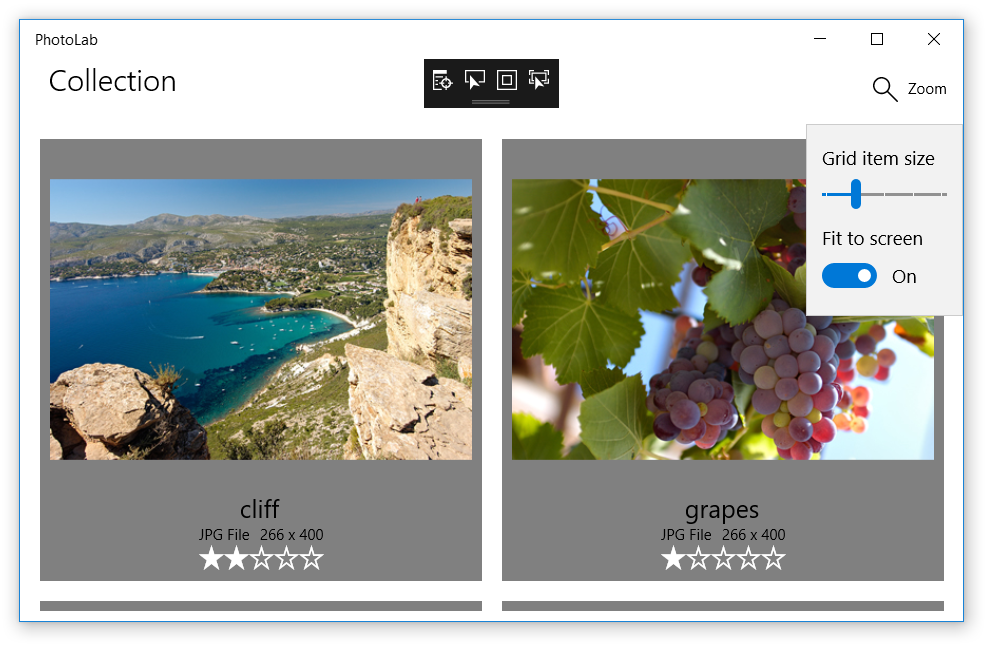
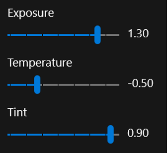

# Tutorial: Create data bindings

Suppose you've designed and implemented a nice looking UI filled with placeholder images, "lorem ipsum" boilerplate text, and controls that don't do anything yet. Next, you'll want to connect it to real data and transform it from a design prototype into a living app.

In this tutorial, you'll learn how to replace your boilerplate with data bindings and create other direct links between your UI and your data. You'll also learn how to format or convert your data for display, and keep your UI and data in sync. When you complete this tutorial, you'll be able to improve the simplicity and organization of the XAML and C# code, making it easier to maintain and extend.

You'll start with a simplified version of the PhotoLab sample. This starter version includes the complete data layer plus the basic XAML page layouts, and leaves out many features to make the code easier to browse around in. This tutorial doesn't build up to the complete app, so be sure to check out the final version to see features such as custom animations and adaptive layouts. You can find the final version in the root folder of the [Windows-appsample-photo-lab](https://github.com/Microsoft/Windows-appsample-photo-lab) repo.

The PhotoLab sample app has two pages. The _main page_ displays a photo gallery view, along with some information about each image file.


The *details page* displays a single photo after it has been selected. A flyout editing menu allows the photo to be altered, renamed, and saved.


## Prerequisites

+ Visual Studio 2019: [Download Visual Studio 2019](https://visualstudio.microsoft.com/downloads/) (The Community edition is free.)
+ Windows 10 SDK (10.0.17763.0 or later):  [Download the latest Windows SDK (free)](https://developer.microsoft.com/windows/downloads/windows-10-sdk)
+ Windows 10, Version 1809 or later

## Part 0: Get the starter code from GitHub

For this tutorial, you'll start with a simplified version of the PhotoLab sample.

1. Go to the GitHub page for the sample: [https://github.com/Microsoft/Windows-appsample-photo-lab](https://github.com/Microsoft/Windows-appsample-photo-lab).
2. Next, you'll need to clone or download the sample. Select the **Clone or download** button. A sub-menu appears.
    

    **If you're not familiar with GitHub:**

    a. Select **Download ZIP** and save the file locally. This downloads a .zip file that contains all the project files you need.

    b. Extract the file. Use File Explorer to browse to the .zip file that you just downloaded, right-click it, and select **Extract All...**.

    c. Browse to your local copy of the sample, and go to the `Windows-appsample-photo-lab-master\xaml-basics-starting-points\data-binding` directory.

    **If you are familiar with GitHub:**

    a. Clone the master branch of the repo locally.

    b. Browse to the `Windows-appsample-photo-lab\xaml-basics-starting-points\data-binding` directory.

3. Double-click `Photolab.sln` to open the solution in Visual Studio.

## Part 1: Replace the placeholders

Here, you create one-time bindings in data-template XAML to display real images and image metadata instead of placeholder content.

One-time bindings are for read-only, unchanging data, which means they are high performance and easy to create, letting you display large data sets in `GridView` and `ListView` controls.

### Replace the placeholders with one-time bindings

1. Open the `xaml-basics-starting-points\data-binding` folder and launch the `PhotoLab.sln` file in Visual Studio.

2. Make sure your **Solution Platform** is set to x86 or x64, not ARM, and then run the app. This shows the state of the app with UI placeholders, before bindings have been added.

    

3. Open MainPage.xaml and search for a `DataTemplate` named **ImageGridView_DefaultItemTemplate**. You'll update this template to use data bindings.

    **Before:**

    ```xaml
    <DataTemplate x:Key="ImageGridView_DefaultItemTemplate">
    ```

    The `x:Key` value is used by the `ImageGridView` to select this template for displaying data objects.

4. Add an `x:DataType` value to the template.

    **After:**

    ```xaml
    <DataTemplate x:Key="ImageGridView_DefaultItemTemplate"
                  x:DataType="local:ImageFileInfo">
    ```

    `x:DataType` indicates which type this is a template for. In this case, it's a template for the `ImageFileInfo` class (where `local:` indicates the local namespace, as defined in an xmlns declaration near the top of the file).

    `x:DataType` is required when using `x:Bind` expressions in a data template, as described next.

5. In the `DataTemplate`, find the `Image` element named `ItemImage` and replace its `Source` value as shown.

    **Before:**

    ```xaml
    <Image x:Name="ItemImage"
           Source="/Assets/StoreLogo.png"
           Stretch="Uniform" />
    ```

    **After:**

    ```xaml
    <Image x:Name="ItemImage"
           Source="{x:Bind ImageSource}"
           Stretch="Uniform" />
    ```

    `x:Name` identifies a XAML element so you can refer to it elsewhere in the XAML and in the code-behind.

    `x:Bind` expressions supply a value to a UI property by getting the value from a **data-object** property. In templates, the property indicated is a property of whatever the `x:DataType` has been set to. So in this case, the data source is the `ImageFileInfo.ImageSource` property.

    > [!NOTE]
    > The `x:Bind` value also lets the editor know about the data type, so you can use IntelliSense instead of typing in the property name in an `x:Bind` expression. Try it on the code you just pasted in: place the cursor just after `x:Bind` and press the Spacebar to see a list of properties you can bind to.

6. Replace the values of the other UI controls in the same way. (Try doing this with IntelliSense instead of copy/pasting!)

    **Before:**

    ```xaml
    <TextBlock Text="Placeholder" ... />
    <StackPanel ... >
        <TextBlock Text="PNG file" ... />
        <TextBlock Text="50 x 50" ... />
    </StackPanel>
    <muxc:RatingControl Value="3" ... />
    ```

    **After:**

    ```xaml
    <TextBlock Text="{x:Bind ImageTitle}" ... />
    <StackPanel ... >
        <TextBlock Text="{x:Bind ImageFileType}" ... />
        <TextBlock Text="{x:Bind ImageDimensions}" ... />
    </StackPanel>
    <muxc:RatingControl Value="{x:Bind ImageRating}" ... />
    ```

Run the app to see how it looks so far. No more placeholders! We're off to a good start.


> [!Note]
> If you want to experiment further, try adding a new TextBlock to the data template, and use the x:Bind IntelliSense trick to find a property to display.

## Part 2: Use binding to connect the gallery UI to the images

Here, you'll create one-time bindings in page XAML to connect the gallery view to the image collection, replacing the existing procedural code that does this in code-behind. You'll also create a **Delete** button to see how the gallery view changes when images are removed from the collection. At the same time, you'll learn how to bind events to event handlers for more flexibility than that provided by traditional event handlers.

All the bindings covered so far are inside data templates and refer to properties of the class indicated by the `x:DataType` value. What about the rest of the XAML in your page?

`x:Bind` expressions outside of data templates are always bound to the page itself. This means you can reference anything you put in code-behind or declare in XAML, including custom properties and properties of other UI controls on the page (as long as they have an `x:Name` value).

In the PhotoLab sample, one use for a binding like this is to connect the main `GridView` control directly to the collection of images, instead of doing it in code-behind. Later, you'll see other examples.

### Bind the main GridView control to the Images collection

1. In MainPage.xaml.cs, find the `GetItemsAsync` method and remove the code that sets `ItemsSource`.

    **Before:**

    ```csharp
    ImageGridView.ItemsSource = Images;
    ```

    **After:**

    ```csharp
    // Replaced with XAML binding:
    // ImageGridView.ItemsSource = Images;
    ```

2. In MainPage.xaml, find the `GridView` named `ImageGridView` and add an `ItemsSource` attribute. For the value, use an `x:Bind` expression that refers to the `Images` property implemented in code-behind.

    **Before:**

    ```xaml
    <GridView x:Name="ImageGridView"
    ```

    **After:**

    ```xaml
    <GridView x:Name="ImageGridView"
              ItemsSource="{x:Bind Images}"
    ```

    The `Images` property is of type `ObservableCollection<ImageFileInfo>`, so the individual items displayed in the `GridView` are of type `ImageFileInfo`. This matches the `x:DataType` value described in Part 1.

All the bindings we've looked at so far are one-time, read-only bindings, which is the default behavior for plain `x:Bind` expressions. The data is loaded only at initialization, which makes for high-performance bindings - perfect for supporting multiple, complex views of large data sets.

Even the `ItemsSource` binding you just added is a one-time, read-only binding to an unchanging property value, but there's an important distinction to make here. The unchanging value of the `Images` property is a single, specific instance of a collection, initialized once as shown here.

```csharp
private ObservableCollection<ImageFileInfo> Images { get; }
    = new ObservableCollection<ImageFileInfo>();
```

The `Images` property value never changes, but because the property is of type `ObservableCollection<T>`, the *contents* of the collection can change, and the binding will automatically notice the changes and update the UI.

To test this, we're going to temporarily add a button that deletes the currently-selected image. This button isn't in the final version because selecting an image will take you to a detail page. However, the behavior of `ObservableCollection<T>` is still important in the final PhotoLab sample because the XAML is initialized in the page constructor (through the `InitializeComponent` method call), but the `Images` collection is populated later in the `GetItemsAsync` method.

### Add a delete button

1. In MainPage.xaml, find the `CommandBar` named **MainCommandBar** and add a new button before the zoom button. (The zoom controls don't work yet. You'll hook those up in the next part of the tutorial.)

    ```xaml
    <AppBarButton Icon="Delete"
                  Label="Delete selected image"
                  Click="{x:Bind DeleteSelectedImage}" />
    ```

    If you're already familiar with XAML, this `Click` value might look unusual. In previous versions of XAML, you had to set this to a method with a specific event-handler signature, typically including parameters for the event sender and an event-specific arguments object. You can still use this technique when you need the event arguments, but with `x:Bind`, you can connect to other methods, too. For example, if you don't need the event data, you can connect to methods that have no parameters, like we do here.

    <!-- TODO add doc links about event binding - and doc links in general? -->

2. In MainPage.xaml.cs, add the `DeleteSelectedImage` method.

    ```csharp
    private void DeleteSelectedImage() =>
        Images.Remove(ImageGridView.SelectedItem as ImageFileInfo);
    ```

    This method simply deletes the selected image from the `Images` collection.

Now run the app and use the button to delete a few images. As you can see, the UI is updated automatically, thanks to data binding and the `ObservableCollection<T>` type.

> [!Note]
> This code only deletes the `ImageFileInfo` instance from the `Images` collection in the running app. It does not delete the image file from the computer.

## Part 3: Set up the zoom slider

In this part, you'll create one-way bindings from a control in the data template to the zoom slider, which is outside the template. You'll also learn that you can use data binding with many control properties, not just the most obvious ones like `TextBlock.Text` and `Image.Source`.

### Bind the image data template to the zoom slider

+ Find the `DataTemplate` named `ImageGridView_DefaultItemTemplate` and replace the `**Height**` and `Width` values of the `Grid` control at the top of the template.

    **Before**

    ```xaml
    <DataTemplate x:Key="ImageGridView_DefaultItemTemplate"
                  x:DataType="local:ImageFileInfo">
        <Grid Height="200"
              Width="200"
              Margin="{StaticResource LargeItemMargin}">
    ```

    **After**

    ```xaml
    <DataTemplate x:Key="ImageGridView_DefaultItemTemplate"
                  x:DataType="local:ImageFileInfo">
        <Grid Height="{Binding Value, ElementName=ZoomSlider}"
              Width="{Binding Value, ElementName=ZoomSlider}"
              Margin="{StaticResource LargeItemMargin}">
    ```

Did you notice that these are `Binding` expressions, and not `x:Bind` expressions? This is the old way of doing data bindings, and it's mostly obsolete. `x:Bind` does nearly everything that `Binding` does, and more. However, when you use `x:Bind` in a data template, it binds to the type declared in the `x:DataType` value. So how do you bind something in the template to something in the page XAML or in code-behind? You must use an old-style `Binding` expression.

`Binding` expressions don't recognize the `x:DataType` value, but these `Binding` expressions have `ElementName` values that work almost the same way. These tell the binding engine that **Binding Value** is a binding to the `Value` property of the specified element on the page (that is, the element with that `x:Name` value). If you want to bind to a property in code-behind, it would look something like ```{Binding MyCodeBehindProperty, ElementName=page}``` where `page` refers to the `x:Name` value set in the `Page` element in XAML.

> [!NOTE]
> By default, `Binding` expressions are one-*way*, meaning that they will automatically update the UI when the bound property value changes.
>
> In contrast, the default for `x:Bind` is one-*time*, meaning that any changes to the bound property are ignored. This is the default because it's the most high-performance option, and most bindings are to static, read-only data.
>
> The lesson here is that if you use `x:Bind` with properties that can change their values, be sure to add `Mode=OneWay` or `Mode=TwoWay`. You'll see examples of this in the next section.

Run the app and use the slider to change the image-template dimensions. As you can see, the effect is pretty powerful without needing much code.


> [!NOTE]
> For a challenge, try binding other UI properties to the zoom slider `Value` property, or to other sliders that you add after the zoom slider. For example, you could bind the `FontSize` property of the `TitleTextBlock` to a new slider with a default value of **24**. Be sure to set reasonable minimum and maximum values.

## Part 4: Improve the zoom experience

In this part, you'll add a custom `ItemSize` property to code-behind and create one-way bindings from the image template to the new property. The `ItemSize` value will be updated by the zoom slider and other factors such as the **Fit to screen** toggle and the window size, making for a more refined experience.

Unlike built-in control properties, your custom properties do not automatically update the UI, even with one-way and two-way bindings. They work fine with one-*time* bindings, but if you want your property changes to actually show up in your UI, you need to do some work.

### Create the ItemSize property so that it updates the UI

1. In MainPage.xaml.cs, change the signature of the `MainPage` class so that it implements the `INotifyPropertyChanged` interface.

    **Before:**

    ```csharp
    public sealed partial class MainPage : Page
    ```

    **After:**

    ```csharp
    public sealed partial class MainPage : Page, INotifyPropertyChanged
    ```

    This informs the binding system that `MainPage` has a `PropertyChanged` event (added next) that bindings can listen for in order to update the UI.

2. Add a `PropertyChanged` event to the `MainPage` class.

    ```csharp
    public event PropertyChangedEventHandler PropertyChanged;
    ```

    This event provides the complete implementation required by the `INotifyPropertyChanged` interface. However, for it to have any effect, you must explicitly raise the event in your custom properties.

3. Add an `ItemSize` property and raise the `PropertyChanged` event in its setter.

    ```csharp
    public double ItemSize
    {
        get => _itemSize;
        set
        {
            if (_itemSize != value)
            {
                _itemSize = value;
                PropertyChanged?.Invoke(this, new PropertyChangedEventArgs(nameof(ItemSize)));
            }
        }
    }
    private double _itemSize;
    ```

    The `ItemSize` property exposes the value of a private `_itemSize` field. Using a backing field like this enables the property to check whether a new value is the same as the old value before it raises a potentially unnecessary `PropertyChanged` event.

    The event itself is raised by the `Invoke` method. The question mark checks whether the `PropertyChanged` event is null - that is, whether any event handlers have been added yet. Every one-way or two-way binding adds an event handler behind the scenes, but if no one is listening, nothing more would happen here. If `PropertyChanged` isn't null, however, then `Invoke` is called with a reference to the event source (the page itself, represented by the `this` keyword) and an **event-args** object that indicates the name of the property. With this info, any one-way or two-way bindings to the `ItemSize` property will be informed of any changes so they can update the bound UI.

4. In MainPage.xaml, find the `DataTemplate` named `ImageGridView_DefaultItemTemplate` and replace the `Height` and `Width` values of the `Grid` control at the top of the template. (If you did the control-to-control binding in the previous part of this tutorial, the only changes are to replace `Value` with `ItemSize` and `ZoomSlider` with `page`. Be sure to do this for both `Height` and `Width`!)

    **Before**

    ```xaml
    <DataTemplate x:Key="ImageGridView_DefaultItemTemplate"
                  x:DataType="local:ImageFileInfo">
        <Grid Height="{Binding Value, ElementName=ZoomSlider}"
            Width="{Binding Value, ElementName=ZoomSlider}"
            Margin="{StaticResource LargeItemMargin}">
    ```

    **After**

    ```xaml
    <DataTemplate x:Key="ImageGridView_DefaultItemTemplate"
                  x:DataType="local:ImageFileInfo">
        <Grid Height="{Binding ItemSize, ElementName=page}"
              Width="{Binding ItemSize, ElementName=page}"
              Margin="{StaticResource LargeItemMargin}">
    ```

Now that the UI can respond to `ItemSize` changes, you need to actually make some changes. As mentioned previously, the `ItemSize` value is calculated from the current state of various UI controls, but the calculation must be performed whenever those controls change state. To do this, you'll use event binding so that certain UI changes will call a helper method that updates `ItemSize`.

### Update the ItemSize property value

1. Add the `DetermineItemSize` method to MainPage.xaml.cs.

    ```csharp
    private void DetermineItemSize()
    {
        if (FitScreenToggle != null
            && FitScreenToggle.IsOn == true
            && ImageGridView != null
            && ZoomSlider != null)
        {
            // The 'margins' value represents the total of the margins around the
            // image in the grid item. 8 from the ItemTemplate root grid + 8 from
            // the ItemContainerStyle * (Right + Left). If those values change,
            // this value needs to be updated to match.
            int margins = (int)this.Resources["LargeItemMarginValue"] * 4;
            double gridWidth = ImageGridView.ActualWidth -
                (int)this.Resources["DefaultWindowSidePaddingValue"];
            double ItemWidth = ZoomSlider.Value + margins;
            // We need at least 1 column.
            int columns = (int)Math.Max(gridWidth / ItemWidth, 1);

            // Adjust the available grid width to account for margins around each item.
            double adjustedGridWidth = gridWidth - (columns * margins);

            ItemSize = (adjustedGridWidth / columns);
        }
        else
        {
            ItemSize = ZoomSlider.Value;
        }
    }
    ```

2. In MainPage.xaml, navigate to the top of the file and add a `SizeChanged` event binding to the `Page` element.

    **Before:**

    ```xaml
    <Page x:Name="page"
    ```

    **After:**

    ```xaml
    <Page x:Name="page"
          SizeChanged="{x:Bind DetermineItemSize}"
    ```

3. Find the `Slider` named `ZoomSlider` (in the `Page.Resources` section) and add a `ValueChanged` event binding.

    **Before:**

    ```xaml
    <Slider x:Name="ZoomSlider"
    ```

    **After:**

    ```xaml
    <Slider x:Name="ZoomSlider"
            ValueChanged="{x:Bind DetermineItemSize}"
    ```

4. Find the `ToggleSwitch` named `FitScreenToggle` and add a `Toggled` event binding.

    **Before:**

    ```xaml
    <ToggleSwitch x:Name="FitScreenToggle"
    ```

    **After:**

    ```xaml
    <ToggleSwitch x:Name="FitScreenToggle"
                  Toggled="{x:Bind DetermineItemSize}"
    ```

Run the app and use the zoom slider and **Fit to screen** toggle to change the image-template dimensions. As you can see, the latest changes enable a more refined zoom/resize experience while keeping the code well organized.



> [!NOTE]
> For a challenge, try adding a `TextBlock` after the `ZoomSlider` and binding the `Text` property to the `ItemSize` property. Because it's not in a data template, you can use `x:Bind` instead of `Binding` like in the previous `ItemSize` bindings.

## Part 5: Enable user edits

Here, you'll create two-way bindings to enable users to update values, including the image title, rating, and various visual effects.

To achieve this, you'll update the existing `DetailPage`, which provides a single-image viewer, zoom control, and editing UI.

First, however, you need to attach the `DetailPage` so that the app navigates to it when the user clicks an image in the gallery view.

### Attach the DetailPage

1. In MainPage.xaml, find the `GridView` named `ImageGridView` and add an `ItemClick` value.

    > [!TIP]
    > If you type in the change below instead of copy/pasting, you'll see an IntelliSense pop-up that says "\<New Event Handler\>". If you press the Tab key, it will fill in the value with a default method handler name, and automatically stub out the method shown in the next step. You can then press F12 to navigate to the method in the code-behind.

    **Before:**

    ```xaml
    <GridView x:Name="ImageGridView"
    ```

    **After:**

    ```xaml
    <GridView x:Name="ImageGridView"
              ItemClick="ImageGridView_ItemClick"
    ```

    > [!NOTE]
    > We're using a conventional event handler here instead of an x:Bind expression. This is because we need to see the event data, as shown next.

2. In MainPage.xaml.cs, add the event handler (or fill it in, if you used the tip in the last step).

    ```csharp
    private void ImageGridView_ItemClick(object sender, ItemClickEventArgs e)
    {
        this.Frame.Navigate(typeof(DetailPage), e.ClickedItem);
    }
    ```

    This method simply navigates to the detail page, passing in the clicked item, which is an `ImageFileInfo` object used by **DetailPage.OnNavigatedTo** for initializing the page. You won't have to implement that method in this tutorial, but you can take a look to see what it does.

3. (Optional) Delete or comment out any controls you added in previous play-points that work with the currently selected image. Keeping them around won't hurt anything, but it's now a lot harder to select an image without navigating to the detail page.

Now that you've connected the two pages, run the app and take a look around. Everything works except the controls on the editing pane, which don't respond when you try to change the values.

As you can see, the title text box does display the title and lets you type in changes. You have to change focus to another control to commit the changes, but the title in the upper-left corner of the screen doesn't update yet.

All the controls are already bound using the plain `x:Bind` expressions we covered in Part 1. If you recall, this means they are all one-time bindings, which explains why changes to the values aren't registered. To fix this, all we have to do is turn them into two-way bindings.

### Make the editing controls interactive

1. In DetailPage.xaml, find the `TextBlock` named **TitleTextBlock** and the **RatingControl** control after it, and update their `x:Bind` expressions to include **Mode=TwoWay**.

    **Before:**

    ```xaml
    <TextBlock x:Name="TitleTextBlock"
               Text="{x:Bind item.ImageTitle}"
               ... >
    <muxc:RatingControl Value="{x:Bind item.ImageRating}"
                            ... >
    ```

    **After:**

    ```xaml
    <TextBlock x:Name="TitleTextBlock"
               Text="{x:Bind item.ImageTitle, Mode=TwoWay}"
               ... >
    <muxc:RatingControl Value="{x:Bind item.ImageRating, Mode=TwoWay}"
                            ... >
    ```

2. Do the same thing for all the effect sliders that come after the rating control.

    ```xaml
    <Slider Header="Exposure"    ... Value="{x:Bind item.Exposure, Mode=TwoWay}" ...
    <Slider Header="Temperature" ... Value="{x:Bind item.Temperature, Mode=TwoWay}" ...
    <Slider Header="Tint"        ... Value="{x:Bind item.Tint, Mode=TwoWay}" ...
    <Slider Header="Contrast"    ... Value="{x:Bind item.Contrast, Mode=TwoWay}" ...
    <Slider Header="Saturation"  ... Value="{x:Bind item.Saturation, Mode=TwoWay}" ...
    <Slider Header="Blur"        ... Value="{x:Bind item.Blur, Mode=TwoWay}" ...
    ```

The two-way mode, as you might expect, means that the data moves in both directions whenever there are changes on either side.

Like the one-way bindings covered earlier, these two-way bindings will now update the UI whenever the bound properties change, thanks to the `INotifyPropertyChanged` implementation in the `ImageFileInfo` class. With two-way binding, however, the values will also move from the UI to the bound properties whenever the user interacts with the control. Nothing more is needed on the XAML side.

Run the app and try the editing controls. As you can see, when you make a change, it now affects the image values, and those changes persist when you navigate back to the main page.

## Part 6: Format values through function binding

One last problem remains. When you move the effect sliders, the labels next to them still don't change.


The final part in this tutorial is to add bindings that format the slider values for display.

### Bind the effect-slider labels and format the values for display

1. Find the `TextBlock` after the `Exposure` slider and replace the `Text` value with the binding expression shown here.

    **Before:**

    ```xaml
    <Slider Header="Exposure" ... />
    <TextBlock ... Text="0.00" />
    ```

    **After:**

    ```xaml
    <Slider Header="Exposure" ... />
    <TextBlock ... Text="{x:Bind item.Exposure.ToString('N', culture), Mode=OneWay}" />
    ```

    This is called a function binding because you are binding to the return value of a method. The method must be accessible through the page's code-behind or the `x:DataType` type if you are in a data template. In this case, the method is the familiar .NET `ToString` method, which is accessed through the item property of the page, and then through the `Exposure` property of the item. (This illustrates how you can bind to methods and properties that are deeply nested in a chain of connections.)

    Function binding is an ideal way to format values for display because you can pass in other binding sources as method arguments, and the binding expression will listen for changes to those values as expected with the one-way mode. In this example, the **culture** argument is a reference to an unchanging field implemented in code-behind, but it could just as easily have been a property that raises `PropertyChanged` events. In that case, any changes to the property value would cause the `x:Bind` expression to call `ToString` with the new value and then update the UI with the result.

2. Do the same thing for the `TextBlock`s that label the other effect sliders.

    ```xaml
    <Slider Header="Temperature" ... />
    <TextBlock ... Text="{x:Bind item.Temperature.ToString('N', culture), Mode=OneWay}" />

    <Slider Header="Tint" ... />
    <TextBlock ... Text="{x:Bind item.Tint.ToString('N', culture), Mode=OneWay}" />

    <Slider Header="Contrast" ... />
    <TextBlock ... Text="{x:Bind item.Contrast.ToString('N', culture), Mode=OneWay}" />

    <Slider Header="Saturation" ... />
    <TextBlock ... Text="{x:Bind item.Saturation.ToString('N', culture), Mode=OneWay}" />

    <Slider Header="Blur" ... />
    <TextBlock ... Text="{x:Bind item.Blur.ToString('N', culture), Mode=OneWay}" />
    ```

Now when you run the app, everything works, including the slider labels.



## Conclusion

This tutorial has given you a taste of data binding and shown you some of the functionality available. One word of caution before we wrap up: not everything is bindable, and sometimes the values you try to connect to are incompatible with the properties you are trying to bind. There is a lot of flexibility in binding, but it won't work in every situation.

One example of a problem not addressed by binding is when a control has no suitable properties to bind to, as with the detail page zoom feature. This zoom slider needs to interact with the `ScrollViewer` that displays the image, but `ScrollViewer` can only be updated through its `ChangeView` method. In this case, we use conventional event handlers to keep the `ScrollViewer` and the zoom slider in sync; see the `ZoomSlider_ValueChanged` and `MainImageScroll_ViewChanged` methods in `DetailPage` for details.

Nonetheless, binding is a powerful and flexible way to simplify your code and keep your UI logic separate from your data logic. This will make it much easier for you to adjust either side of this divide while reducing the risk of introducing bugs on the other side.

One example of UI and data separation is with the `ImageFileInfo.ImageTitle` property. This property (and the `ImageRating` property) is slightly different than the `ItemSize` property you created in Part 4 because the value is stored in the file metadata (exposed through the `ImageProperties` type) instead of in a field. Additionally, `ImageTitle` returns the `ImageName` value (set to the file name) if there is no title in the file metadata.

```csharp
public string ImageTitle
{
    get => String.IsNullOrEmpty(ImageProperties.Title) ? ImageName : ImageProperties.Title;
    set
    {
        if (ImageProperties.Title != value)
        {
            ImageProperties.Title = value;
            var ignoreResult = ImageProperties.SavePropertiesAsync();
            OnPropertyChanged();
        }
    }
}
```

As you can see, the setter updates the `ImageProperties.Title` property and then calls `SavePropertiesAsync` to write the new value to the file. (This is an async method, but we can't use the `await` keyword in a property - and you wouldn't want to because property getters and setters should complete immediately. So instead, you would call the method and ignore the `Task` object it returns.)

## Going further

Now that you've completed this lab, you have enough binding knowledge tackle a problem on your own.

As you might have noticed, if you change the zoom level on the details page, it resets automatically when you navigate backward then select the same image again. Can you figure out how to preserve and restore the zoom level for each image individually? Good luck!

You should have all the info you need in this tutorial, but if you need more guidance, the data binding docs are only a click away. Start here:

+ [{x:Bind} markup extension](../xaml-platform/x-bind-markup-extension.md)
+ [Data binding in depth](./data-binding-in-depth.md)