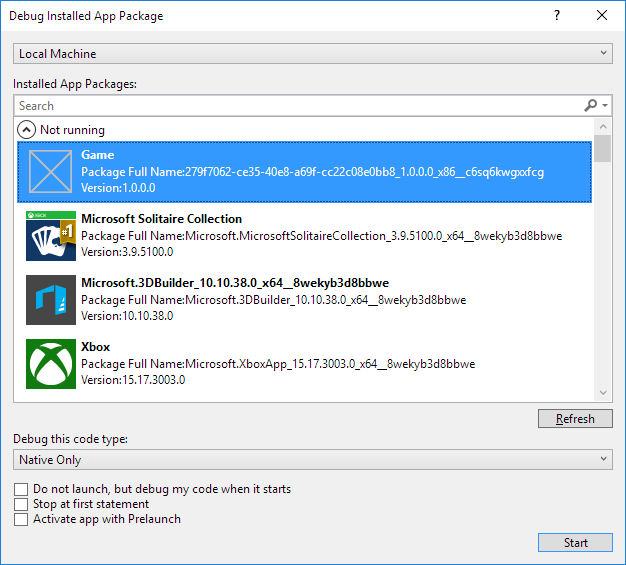
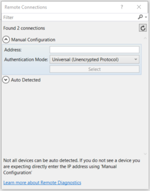
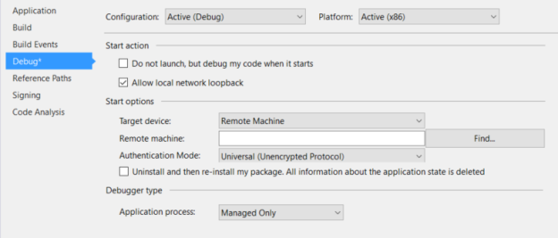
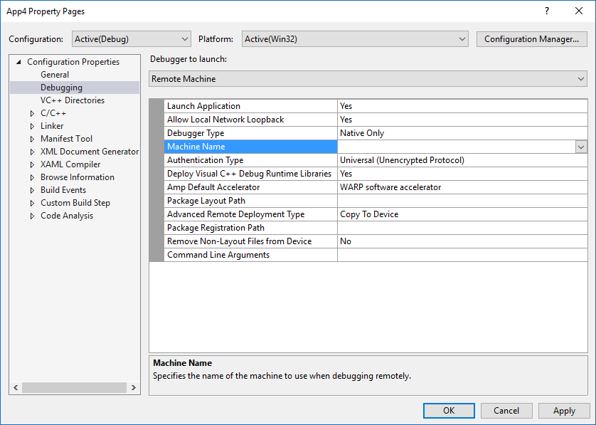
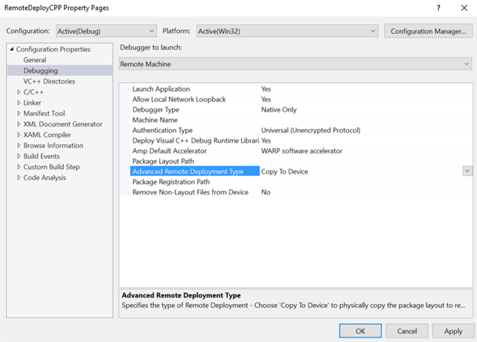

# Deploying and debugging UWP apps

This article guides you through the steps to target various deployment and debugging targets.

Microsoft Visual Studio allows you to deploy and debug your Universal Windows Platform (UWP) apps on a variety of Windows 10 devices. Visual Studio will handle the process of building and registering the app on the target device.

## Picking a deployment target

To pick a target, go to the debug target drop-down next to the **Start Debugging** button and choose which target you want to deploy your app to. After the target is selected, select **Start Debugging (F5)** to deploy and debug on that target, or select **Ctrl+F5** to just deploy to that target.


- **Simulator** will deploy the app to a simulated environment on your current development machine. This option is only available if your app's **Target Platform Min. Version** is less than or equal to the operating system on your development machine.
- **Local Machine** will deploy the app to your current development machine. This option is only available if your app's **Target Platform Min. Version** is less than or equal to the operating system on your development machine.
- **Remote Machine** will let you specify a remote target to deploy the app. More information about deploying to a remote machine can be found in [Specifying a remote device](#specifying-a-remote-device).
- **Device** will deploy the app to a USB connected device. The device must be developer unlocked and have the screen unlocked.
- An **Emulator** target will boot up and deploy the app to an emulator with the configuration specified in the name. Emulators are only available on Hyper-V enabled machines running Windows 8.1 or beyond.

## Debugging deployed apps

Visual Studio can also attach to any running UWP app process by selecting **Debug**, and then **Attach to Process**. Attaching to a running process doesn’t require the original Visual Studio project, but loading the process's [symbols](#symbols) will help significantly when debugging a process that you don't have the original code for.  

In addition, any installed app package can be attached and debugged by selecting **Debug**, **Other**, and then **Debug Installed App Packages**.



Selecting **Do not launch, but debug my code when it starts** will cause the Visual Studio debugger to attach to your UWP app when you launch it at a custom time. This is an effective way to debug control paths from [different launch methods](../xbox-apps/automate-launching-uwp-apps.md), such as protocol activation with custom parameters.  

UWP apps can be developed and compiled on Windows 8.1 or later, but require Windows 10 to run. If you are developing a UWP app on a Windows 8.1 PC, you can remotely debug a UWP app running on another Windows 10 device, provided that both the host and target computer are on the same LAN. To do this, download and install the [Remote Tools for Visual Studio](https://visualstudio.microsoft.com/downloads/) on both machines. The installed version must match the existing version of Visual Studio that you have installed, and the architecture you select (x86, x64) must also match that of your target app.

## Package layout

As of Visual Studio 2015 Update 3, we have added the option for developers to specify the layout path for their UWP apps. This determines where the package layout is copied to on disk when you build your app. By default, this property is set relative to the project’s root directory. If you do not modify this property, the behavior will remain the same as it has for previous versions of Visual Studio.

This property can be modified in the project's **Debug** properties.

If you want to include all layout files in your package when you create a package for your app, you must add the project property `<IncludeLayoutFilesInPackage>true</IncludeLayoutFilesInPackage>`.

To add this property:

1. Right-click the project, and then select **Unload Project**.
2. Right-click the project, and then select **Edit [projectname].xxproj** (.xxproj will change depending on project language).
3. Add the property, and then reload the project.

## Specifying a remote device

### C# and Microsoft Visual Basic

To specify a remote machine for C# or Microsoft Visual Basic apps, select **Remote Machine** in the debug target drop-down. The **Remote Connections** dialog will appear, which will let you specify an IP address or select a discovered device. By default, the **Universal** authentication mode is selected. To determine which authentication mode to use, see [Authentication modes](#authentication-modes).



To return to this dialog, you can open project properties and go to the **Debug** tab. From there, select **Find** next to **Remote machine:**



To deploy an app to a pre-Creators Update remote PC, you will also need to download and install the Visual Studio Remote Tools on the target PC. For full instructions, see [Remote PC instructions](#remote-pc-instructions).  However, as of the Creators Update PC also supports remote deployment.  

### C++ and JavaScript

To specify a remote machine target for a C++ or JavaScript UWP app:

1. In the **Solution Explorer**, right-click the project, and then click **Properties**.
2. Go to **Debugging** settings, and under **Debugger to launch**, select **Remote Machine**.
3. Enter the **Machine Name** (or click **Locate** to find one), and then set the **Authentication Type** property.



After the machine is specified, you can select **Remote Machine** in the debug target drop-down to return to that specified machine. Only one remote machine can be selected at a time.

### Remote PC instructions

> [!NOTE]
> These instructions are only required for older versions of Windows 10.  As of the Creators Update, a PC can be treated like an Xbox.  That is, by enabling Device Discovery in the PC's Developer Mode menu and using Universal Authentication to PIN pair and connect with the PC.

To deploy to a pre-Creators Update remote PC, the target PC must have the Visual Studio Remote Tools installed. The remote PC must also be running a version of Windows that is greater than or equal to your apps **Target Platform Min. Version** property. After you have installed the remote tools, you must launch the remote debugger on the target PC.

To do this, search for **Remote Debugger** in the **Start** menu, open it, and if prompted, allow the debugger to configure your firewall settings. By default, the debugger launches with Windows authentication. This will require user credentials if the signed-in user is not the same on both PCs.

To change it to **no authentication**, in the **Remote Debugger**, go to **Tools** -&gt; **Options**, and then set it to **No Authentication**. After the remote debugger is set up, you must also ensure that you have set the host device to [Developer Mode](../get-started/enable-your-device-for-development.md). After that, you can deploy from your development machine.

For more information, see the [Visual studio Download Center](https://visualstudio.microsoft.com/downloads/) page.

## Passing command line debug arguments

In Visual Studio 2019, you can pass command line debug arguments when you start debugging UWP applications. You can access the command line debug arguments from the *args* parameter in the **OnLaunched** method of the [**Application**](/uwp/api/windows.ui.xaml.application) class. To specify command line debug arguments, open the project's properties and navigate to the **Debug** tab.

> [!NOTE]
> This is available in Visual Studio 2017 (version 15.1) for C#, VB, and C++. JavaScript is available in later versions. Command line debug arguments are available for all deployment types except for the Simulator.

For C# and VB UWP projects, you will see a **Command line arguments:** field under **Start options**.


For C++ and JS UWP projects, you will see **Command Line Arguments** as a field in the **Debugging Properties**.


Once you specify the command line arguments, you can access the value of the argument in the App's **OnLaunched** method. The [**LaunchActivatedEventArgs**](/uwp/api/windows.applicationmodel.activation.launchactivatedeventargs) object *args* will have an **Arguments** property with the value set to the text in the **Command Line Arguments** field.


## Authentication modes

There are three authentication modes for remote machine deployment:

- **Universal (Unencrypted Protocol)**: Use this authentication mode whenever you are deploying to a remote device. Currently, this is for IoT devices, Xbox devices, and HoloLens devices, as well as Creators Update or newer PCs. Universal (Unencrypted Protocol) should only be used on trusted networks. The debugging connection is vulnerable to malicious users who could intercept and change data being passed between the development and remote machine.
- **Windows**: This authentication mode is only intended to be used for a remote PC (desktop or laptop) running the Visual Studio Remote Tools. Use this authentication mode when you have access to the credentials of the signed-in user of the target machine. This is the most secure channel for remote deployment.
- **None**: This authentication mode is only intended to be used for a remote PC (desktop or laptop) running the Visual Studio Remote Tools. Use this authentication mode when you have a test machine set up in an environment that has a test account signed in and you cannot enter the credentials. Ensure that the remote debugger settings are set to accept no authentication.

## Advanced remote deployment options

As of the release of Visual Studio 2015 Update 3, and the Windows 10 Anniversary Update, there are new advanced remote deployment options for certain Windows 10 devices. The advanced remote deployment options can be found on the **Debug** menu for project properties.

The new properties include:

- Deployment type
- Package registration path
- Keep all files on device – even those that are no longer a part of your layout

### Requirements

To utilize the advanced remote deployment options, you must satisfy the following requirements:

- Have Visual Studio 2015 Update 3 or some later Visual Studio release installed with Windows 10 Tools 1.4.1 or later(which includes the Windows 10 Anniversary Update SDK) We recommend that you use the latest version of Visual Studio with updates to ensure you get all the newest development and security features.
- Target a Windows 10 Anniversary Update Xbox remote device or Windows 10 Creators Update PC
- Use Universal Authentication mode

### Properties pages

For a C# or Visual Basic UWP app, the properties page will look like the following.


For a C++ UWP app, the properties page will look like the following.



### Copy files to device

**Copy files to device** will physically transfer the files over the network to the remote device. It will copy and register the package layout that is built to the **Layout folder path**. Visual Studio will keep the files that are copied to the device in sync with the files in your Visual Studio project; however, there is an option to **keep all files on device – even those that are no longer a part of your layout**. Selecting this option means that any files that were previously copied to the remote device, but are no longer a part of your project, will remain on the remote device.

The **package registration path** specified when you **copy files to device** is the physical location on the remote device where the files are copied. This path can be specified as any relative path. The location where the files are deployed will be relative to a development files root that will vary depending on the target device. Specifying this path is useful for multiple developers sharing the same device and working on packages with some build variance.

> [!NOTE]
> **Copy files to device** is currently supported on Xbox running Windows 10 Anniversary Update and PCs running Windows 10 Creators Update .

On the remote device, the layout gets copied to the following default location:
  `\\MY-DEVKIT\DevelopmentFiles\PACKAGE-REGISTRATION-PATH`

### Register layout from network

When you choose to register the layout from the network, you can build your package layout to a network share and then register the layout on the remote device directly from the network. This requires that you specify a layout folder path (a network share) that is accessible from the remote device. The **Layout folder path** property is the path set relative to the PC running Visual Studio, while the **Package registration path** property is the same path, but specified relative to the remote device.

To successfully register the layout from the network, you must first make **Layout folder path** a shared network folder. To do this, right-click the folder in File Explorer, select **Share with > Specific people**, and then choose the users you would like to share the folder with. When you try to register the layout from the network, you will be prompted for credentials to ensure that you are registering as a user with access to the share.

For help with this, see the following examples:

- Example 1 (local layout folder, accessible as a network share):
  - **Layout folder path** = `D:\Layouts\App1`
  - **Package registration path** = `\\NETWORK-SHARE\Layouts\App1`

- Example 2 (network layout folder):
  - **Layout folder path** = `\\NETWORK-SHARE\Layouts\App1`
  - **Package registration path** = `\\NETWORK-SHARE\Layouts\App1`

When you first register the layout from the network, your credentials will be cached on the target device so you do not need to repeatedly sign in. To remove cached credentials, you can use the [WinAppDeployCmd.exe tool](https://docs.microsoft.com/windows/uwp/packaging/install-universal-windows-apps-with-the-winappdeploycmd-tool) from the Windows 10 SDK with the **deletecreds** command.

You cannot select **keep all files on device** when you register the layout from the network because no files are physically copied to the remote device.

> [!NOTE]
> **Register layout from network** is currently supported on Xbox running Windows 10 Anniversary Update and PCs running Windows 10 Creators Update.

On the remote device, the layout gets registered to the following default location depending on the device family:
  `Xbox: \\MY-DEVKIT\DevelopmentFiles\XrfsFiles` - this is a symlink to the **package registration path**
  PC does not use a symlink and instead directly registers the **package registration path**

## Debugging options

On Windows 10, the startup performance of UWP apps is improved by proactively launching and then suspending apps in a technique called [prelaunch](../launch-resume/handle-app-prelaunch.md). Many apps will not need to do anything special to work in this mode, but some apps may need to adjust their behavior. To help debug any issues in these code paths, you can start debugging the app from Visual Studio in prelaunch mode.

Debugging is supported both from a Visual Studio project (**Debug** -&gt; **Other Debug Targets** -&gt; **Debug Universal Windows App Prelaunch**), and for apps already installed on the machine (**Debug** -&gt; **Other Debug Targets** -&gt; **Debug Installed App Package** by selecting the **Activate app with Prelaunch** check box). For more information, see [Debug UWP Prelaunch](https://blogs.msdn.com/b/visualstudioalm/archive/2015/11/30/debug-uwp-prelaunch-with-vs2015.aspx).

You can set the following deployment options on the **Debug** property page of the startup project:

- **Allow local network loopback**

  For security reasons, a UWP app that is installed in the standard manner is not allowed to make network calls to the device it is installed on. By default, Visual Studio deployment creates an exemption from this rule for the deployed app. This exemption allows you to test communication procedures on a single machine. Before submitting your app to the Microsoft Store, you should test your app without the exemption.

  To remove the network loopback exemption from the app:

  - On the C# and Visual Basic **Debug** property page, clear the **Allow local network loopback** check box.
  - On the JavaScript and C++ **Debugging** property page, set the **Allow Local Network Loopback** value to **No**.

- **Do not launch, but debug my code when it starts / Launch Application**

  To configure the deployment to automatically start a debugging session when the app is launched:

  - On the C# and Visual Basic **Debug** property page, select the **Do not launch, but debug my code when it starts** check box.
  - On the JavaScript and C++ **Debugging** property page, set the **Launch Application** value to **Yes**.

## Symbols

Symbol files contain a variety of very useful data when debugging code, such as variables, function names, and entry point addresses, allowing you to better understand exceptions and callstack execution order. Symbols for most variants of Windows are available through the [Microsoft Symbol Server](https://msdl.microsoft.com/download/symbols) or can be downloaded for faster, offline lookups at [Download Windows Symbol Packages](/windows-hardware/drivers/debugger/debugger-download-symbols).

To set symbol options for Visual Studio, select **Tools > Options**, and then go to **Debugging > Symbols** in the dialog window.


To load symbols in a debugging session with [WinDbg](#windbg), set the **sympath** variable to the symbol package location. For example, running the following command will load symbols from the Microsoft Symbol Server, and then cache them in the C:\Symbols directory:

```cmd
.sympath SRV*C:\Symbols*http://msdl.microsoft.com/download/symbols
.reload
```

You can add more paths by using the `‘;’` delimiter, or use the `.sympath+` command. For more advanced symbol operations that use WinDbg, see [Public and Private Symbols](/windows-hardware/drivers/debugger/public-and-private-symbols).

## WinDbg

WinDbg is a powerful debugger that is shipped as part of the Debugging Tools for Windows suite, which is included in the [Windows SDK](https://developer.microsoft.com/). The Windows SDK installation allows you to install Debugging Tools for Windows as a standalone product. While highly useful for debugging native code, we don’t recommend WinDbg for apps written in managed code or HTML5.

To use WinDbg with UWP apps, you will need to first disable Process Lifetime Management (PLM) for your app package by using PLMDebug, as described in [Testing and debugging tools for Process Lifetime Management (PLM)](testing-debugging-plm.md).

```cmd
plmdebug /enableDebug [PackageFullName] ""C:\Program Files\Debugging Tools for Windows (x64)\WinDbg.exe\" -server npipe:pipe=test"
```

In contrast to Visual Studio, most of the core functionality of WinDbg relies on providing commands to the command window. The provided commands allow you to view execution state, investigate user mode crash dumps, and debug in a variety of modes.

One of the most popular commands in WinDbg is `!analyze -v`, which is used to retrieve a verbose amount of information about the current exception, including:

- FAULTING_IP: instruction pointer at the time of fault
- EXCEPTION_RECORD: address, code, and flags of the current exception
- STACK_TEXT: stack trace prior to exception

For a complete list of all WinDbg commands, see [Debugger Commands](/windows-hardware/drivers/debugger/debugger-commands).

## Related topics

- [Testing and debugging tools for Process Lifetime Management (PLM)](testing-debugging-plm.md)
- [Debugging, testing, and performance](index.md)