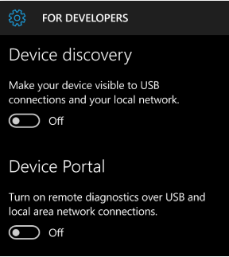
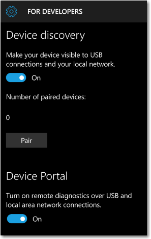

# Device Portal for Mobile

Starting in Windows 10, Version 1511, additional developer features are available for the mobile device family. These features are available only when Developer mode is enabled on the device.

For info about how to enable Developer mode, see [Enable your device for development](../get-started/enable-your-device-for-development.md).

## Set up Device Portal on Windows Phone

### Turn on device discovery and pairing

To connect to Device Portal, you must enable Device discovery and Device Portal in your phone's settings. This lets you pair your phone with a PC or other Windows 10 device. Both devices must be connected to the same subnet of the network by a wired or wireless connection, or they must be connected by USB.

The first time you connect to Device Portal, you are asked for a case-sensitive, 6 character security code. This ensures that you have access to the phone, and keeps you safe from attackers. Press the Pair button on your phone to generate and display the code, then enter the 6 characters into the text box in the browser.

You can choose from 3 ways to connect to Device Portal: USB, local host, and over the local network (including VPN and tethering).

**To connect to Device Portal**

1. In your browser, enter the address shown here for the connection type you're using.

    - USB: `http://127.0.0.1:10080`

    Use this address when the phone is connected to a PC via a USB connection. Both devices must have Windows 10, Version 1511 or later.
    
    - Localhost: `http://127.0.0.1`

    Use this address to view Device Portal locally on the phone in Microsoft Edge for Windows 10 Mobile.
    
    - Local Network: `https://<The IP address or hostname of the phone>`

    Use this address to connect over a local network.

    The IP address of the phone is shown in the Device Portal settings on the phone. HTTPS is required for authentication and secure communication. The hostname (editable in Settings > System > About) can also be used to access Device Portal on the local network (for example, http://Phone360), which is useful for devices that may change networks or IP addresses frequently, or need to be shared. 

2. Press the Pair button on your phone to generate and display the required security code

3. Enter the 6 character security code into the Device Portal password box in your browser.

4. (Optional) Check the Remember my computer box in your browser to remember this pairing in the future.

Here's the Device Portal section of the developer settings page on Windows Phone.

If you are using Device Portal in a protected environment, like a test lab, where you trust everyone on your local network, have no personal information on the device, and have unique requirements, you can disable authentication. This enables unencrypted communication, and allows anyone with the IP address of your phone to control it.

## Tool Notes

## Device Portal pages
### Processes

The ability to terminate arbitrary processes is not included in the Windows Mobile Device Portal. 

Device Portal on mobile devices provides the standard set of pages. For detailed descriptions, see [Windows Device Portal overview](device-portal.md).

- App Manager
- App File Explorer (Isolated Storage Explorer)
- Processes
- Performance charts
- Event Tracing for Windows (ETW)
- Performance tracing (WPR) 
- Devices
- Networking

## See also

* [Windows Device Portal overview](device-portal.md)
* [Device Portal core API reference](./device-portal-api-core.md)