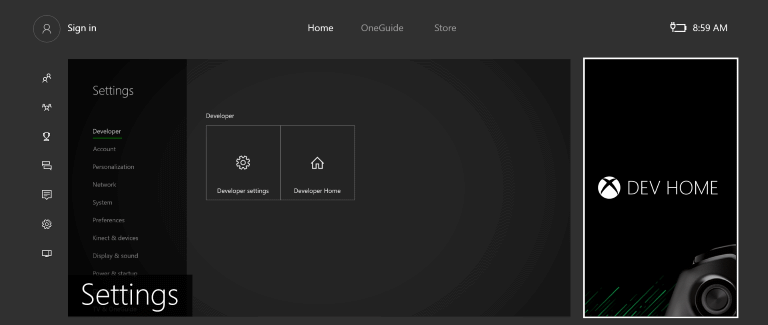
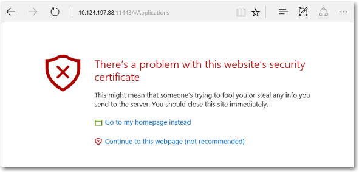

# Device Portal for Xbox

## Set up Device Portal on Xbox

### Enable Device Portal

**To enable Device Portal**

1. Select the Dev Home tile on the home screen (see image)  

2. Within Dev Home, navigate to the **Remote Management** tool 

3. Select **Manage Windows Device Portal** and press **A**
4. Check the **Enable Windows Device Portal** setting
5. Enter a Username and Password to use to authenticate access to your devkit from a browser, and save them.
6. Close the settings page and note the URL listed on the Remote Management tool to connect.
7. Enter the URL in your browser, and then sign in with the credentials you configured.
8. You will receive a warning about the Certificate that was provided, similar to that pictured below. You should click on **Continue to this website** to access Windows Device Portal in the preview.

## Device Portal pages

Device Portal on Xbox provides a set of standard pages. For detailed descriptions, see [Windows Device Portal overview](device-portal.md).

- Apps
- Performance
- Networking
