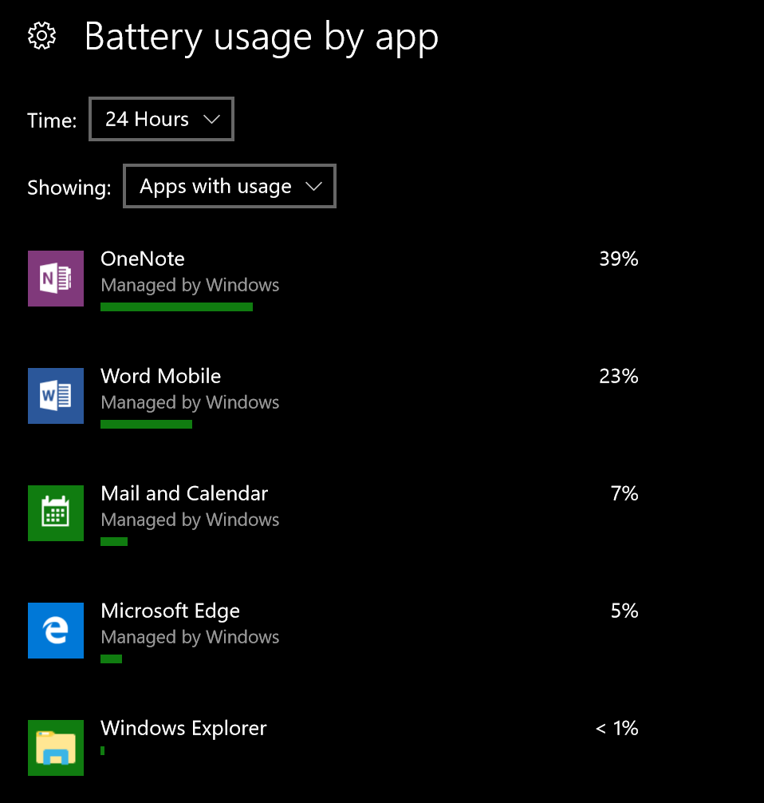
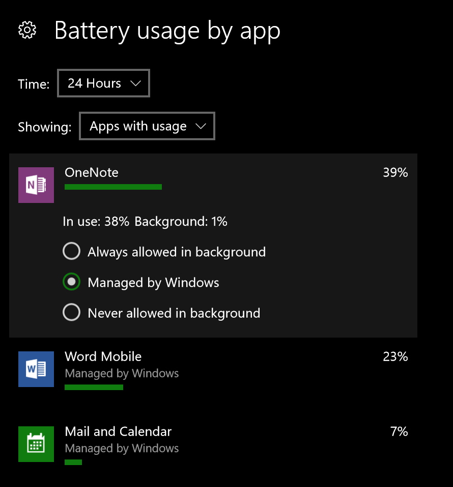
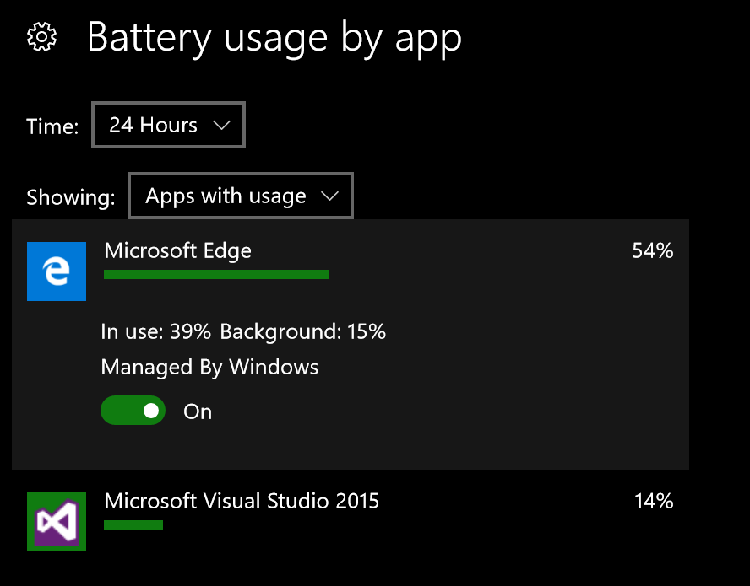
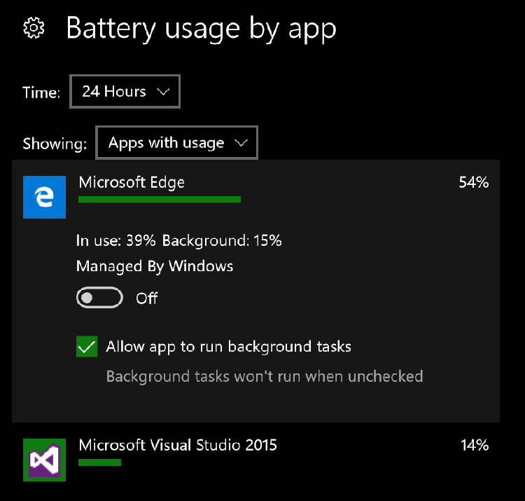

# Optimize background activity

Universal Windows apps should perform consistently well across all device families. On battery-powered devices, power consumption is a critical factor in the user's overall experience with your app. All-day battery life is a desirable feature to every user, but it requires efficiency from all of the software installed on the device, including your own. 

Background task behavior is arguably the most important factor in the total energy cost of an app. A background task is any program activity that has been registered with the system to run without the app being open. See [Create and register an out-of-process background task](../launch-resume/create-and-register-a-background-task.md) for more information.

## Background activity permissions

On desktop and mobile devices running Windows 10, version 1607 or later, users can view their "Battery usage by app" in the Battery section of the Settings app. Here they will see a list of apps and the percentage of battery life that each app has consumed (out of the amount of battery life that has been used since the last charge). For UWP apps on this list, users can select the app to open up controls related to background activity.

### Background permissions on mobile

On mobile devices, users will see a list of radio buttons that specify the background task permission setting for that app. Background activity can be set to "Always allowed," "Never allowed," or "Managed by Windows," which means the app's background activity is regulated by the system according to a number of factors. 

### Background permissions on desktop

On desktop devices, the "Managed by Windows" setting is presented as a toggle switch, set to **On** by default. If the user switches  to **Off**, they are presented with a checkbox with which they can manually define the background activity permissions. When the box is checked, the app will be allowed to run background tasks at all times. When the box is unchecked, the background activity will be disabled.

In your app, you can use the [**BackgroundAccessStatus**](/uwp/api/windows.applicationmodel.background.backgroundaccessstatus) enum value returned by a call to the [**BackgroundExecutionManager.RequestAccessAsync()**](/uwp/api/windows.applicationmodel.background.backgroundexecutionmanager.requestaccessasync) method to determine its current background activity permission setting.

All this is to say that if your app doesn't implement responsible background activity management, the user may deny background permissions to your app altogether, which is not desirable for either party. If your app has been denied permission to run in the background but requires background activity to complete an action for the user, you can notify the user and point them to the Settings app. This can be accomplished by [Launching the Settings App](../launch-resume/launch-settings-app.md) to the Background Apps or Battery Usage Details page.

## Work with the Battery Saver feature
Battery Saver is a system-level feature that users can configure in Settings. It cuts off all background activity of all apps when the battery level drops below a user-defined threshold, *except* for the background activity of apps that have been set to "Always allowed."

Check the status of Battery Saver mode from within your app by referencing the [**PowerManager.EnergySaverStatus**](/uwp/api/windows.system.power.energysaverstatus) property. It is an enum value: either **EnergySaverStatus.Disabled**, **EnergySaverStatus.Off** or **EnergySaverStatus.On**. If your app requires background activity and is not set to "Always allowed" then it should handle **EnergySaverStatus.On** by notifying the user that the given background task(s) will not run until Battery Saver is off. While background activity management is the primary purpose of the Battery Saver feature, your app can make additional adjustments to further conserve energy when Battery Saver is on.  In the case where Battery Saver is on, your app could reduce its use of animations, stop location polling, or delay syncs and backups. 

## Further optimize background tasks
The following are additional steps you can take when registering your background tasks to make them more battery-aware.

### Use a maintenance trigger 
A [**MaintenanceTrigger**](/uwp/api/windows.applicationmodel.background.maintenancetrigger) object can be used instead of a [**SystemTrigger**](/uwp/api/windows.applicationmodel.background.systemtrigger) object to determine when a background task starts. Tasks that use maintenance triggers will only run when the device is connected to AC power, and they are allowed to run for longer. See [Use a maintenance trigger](../launch-resume/use-a-maintenance-trigger.md) for instructions.

### Use the **BackgroundWorkCostNotHigh** system condition type
System conditions must be met in order for background tasks to run (see [Set conditions for running a background task](../launch-resume/set-conditions-for-running-a-background-task.md) for more). The background work cost is a measurement that denotes the *relative* energy impact of running the background task. A task running when the device is plugged into AC power would be marked as **low** (little/no impact on battery). A task running when the device is on battery power with the screen off is marked as **high** because there is presumably little program activity running on the device at the time, so the background task would have a greater relative cost. A task running when the device is on battery power with the screen *on* is marked as **medium**, because there is presumably already some program activity running, and the background task would add a bit more to the energy cost. The **BackgroundWorkCostNotHigh** system condition simply delays your task's ability to run until either the screen is on or the device is connected to AC power.

## Test battery efficiency

Be sure to test your app on real devices for any high-power-consumption scenarios. It's a good idea to test your app on many different devices, with Battery Saver on and off, and in environments of varying network strength.

## Related topics

* [Create and register an out-of-process background task](../launch-resume/create-and-register-a-background-task.md)  
* [Planning for performance](./planning-and-measuring-performance.md)