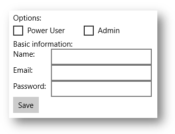

# Optimize your XAML layout


**Important APIs**

-   [**Panel**](/uwp/api/Windows.UI.Xaml.Controls.Panel)

Layout is the process of defining the visual structure for your UI. The primary mechanism for describing layout in XAML is through panels, which are container objects that enable you to position and arrange the UI elements within them. Layout can be an expensive part of a XAML app—both in CPU usage and memory overhead. Here are some simple steps you can take to improve the layout performance of your XAML app.

## Reduce layout structure

The biggest gain in layout performance comes from simplifying the hierarchical structure of the tree of UI elements. Panels exist in the visual tree, but they are structural elements, not *pixel producing elements* like a [**Button**](/uwp/api/Windows.UI.Xaml.Controls.Button) or a [**Rectangle**](/uwp/api/Windows.UI.Xaml.Shapes.Rectangle). Simplifying the tree by reducing the number of non-pixel-producing elements typically provides a significant performance increase.

Many UIs are implemented by nesting panels which results in deep, complex trees of panels and elements. It is convenient to nest panels, but in many cases the same UI can be achieved with a more complex single panel. Using a single panel provides better performance.

### When to reduce layout structure

Reducing layout structure in a trivial way—for example, reducing one nested panel from your top-level page—does not have a noticeable effect.

The largest performance gains come from reducing layout structure that's repeated in the UI, like in a [**ListView**](/uwp/api/Windows.UI.Xaml.Controls.ListView) or [**GridView**](/uwp/api/Windows.UI.Xaml.Controls.GridView). These [**ItemsControl**](/uwp/api/Windows.UI.Xaml.Controls.ItemsControl) elements use a [**DataTemplate**](/uwp/api/Windows.UI.Xaml.DataTemplate), which defines a subtree of UI elements that is instantiated many times. When the same subtree is being duplicated many times in your app, any improvements to the performance of that subtree has a multiplicative effect on the overall performance of your app.

### Examples

Consider the following UI.



These examples shows 3 ways of implementing the same UI. Each implementation choice results in nearly identical pixels on the screen, but differs substantially in the implementation details.

Option1: Nested [**StackPanel**](/uwp/api/Windows.UI.Xaml.Controls.StackPanel) elements

Although this is the simplest model, it uses 5 panel elements and results in significant overhead.

```xml
  <StackPanel>
  <TextBlock Text="Options:" />
  <StackPanel Orientation="Horizontal">
      <CheckBox Content="Power User" />
      <CheckBox Content="Admin" Margin="20,0,0,0" />
  </StackPanel>
  <TextBlock Text="Basic information:" />
  <StackPanel Orientation="Horizontal">
      <TextBlock Text="Name:" Width="75" />
      <TextBox Width="200" />
  </StackPanel>
  <StackPanel Orientation="Horizontal">
      <TextBlock Text="Email:" Width="75" />
      <TextBox Width="200" />
  </StackPanel>
  <StackPanel Orientation="Horizontal">
      <TextBlock Text="Password:" Width="75" />
      <TextBox Width="200" />
  </StackPanel>
  <Button Content="Save" />
</StackPanel>
```

Option 2: A single [**Grid**](/uwp/api/Windows.UI.Xaml.Controls.Grid)

The [**Grid**](/uwp/api/Windows.UI.Xaml.Controls.Grid) adds some complexity, but uses only a single panel element.

```xml
<Grid>
  <Grid.RowDefinitions>
      <RowDefinition Height="Auto" />
      <RowDefinition Height="Auto" />
      <RowDefinition Height="Auto" />
      <RowDefinition Height="Auto" />
      <RowDefinition Height="Auto" />
      <RowDefinition Height="Auto" />
      <RowDefinition Height="Auto" />
  </Grid.RowDefinitions>
  <Grid.ColumnDefinitions>
      <ColumnDefinition Width="Auto" />
      <ColumnDefinition Width="Auto" />
  </Grid.ColumnDefinitions>
  <TextBlock Text="Options:" Grid.ColumnSpan="2" />
  <CheckBox Content="Power User" Grid.Row="1" Grid.ColumnSpan="2" />
  <CheckBox Content="Admin" Margin="150,0,0,0" Grid.Row="1" Grid.ColumnSpan="2" />
  <TextBlock Text="Basic information:" Grid.Row="2" Grid.ColumnSpan="2" />
  <TextBlock Text="Name:" Width="75" Grid.Row="3" />
  <TextBox Width="200" Grid.Row="3" Grid.Column="1" />
  <TextBlock Text="Email:" Width="75" Grid.Row="4" />
  <TextBox Width="200" Grid.Row="4" Grid.Column="1" />
  <TextBlock Text="Password:" Width="75" Grid.Row="5" />
  <TextBox Width="200" Grid.Row="5" Grid.Column="1" />
  <Button Content="Save" Grid.Row="6" />
</Grid>
```

Option 3: A single [**RelativePanel**](/uwp/api/Windows.UI.Xaml.Controls.RelativePanel):

This single panel is also a bit more complex than using nested panels, but may be easier to understand and maintain than a [**Grid**](/uwp/api/Windows.UI.Xaml.Controls.Grid).

```xml
<RelativePanel>
  <TextBlock Text="Options:" x:Name="Options" />
  <CheckBox Content="Power User" x:Name="PowerUser" RelativePanel.Below="Options" />
  <CheckBox Content="Admin" Margin="20,0,0,0" 
            RelativePanel.RightOf="PowerUser" RelativePanel.Below="Options" />
  <TextBlock Text="Basic information:" x:Name="BasicInformation"
           RelativePanel.Below="PowerUser" />
  <TextBlock Text="Name:" RelativePanel.AlignVerticalCenterWith="NameBox" />
  <TextBox Width="200" Margin="75,0,0,0" x:Name="NameBox"               
           RelativePanel.Below="BasicInformation" />
  <TextBlock Text="Email:"  RelativePanel.AlignVerticalCenterWith="EmailBox" />
  <TextBox Width="200" Margin="75,0,0,0" x:Name="EmailBox"
           RelativePanel.Below="NameBox" />
  <TextBlock Text="Password:" RelativePanel.AlignVerticalCenterWith="PasswordBox" />
  <TextBox Width="200" Margin="75,0,0,0" x:Name="PasswordBox"
           RelativePanel.Below="EmailBox" />
  <Button Content="Save" RelativePanel.Below="PasswordBox" />
</RelativePanel>
```

As these examples show, there are many ways of achieving the same UI. You should choose by carefully considering all the tradeoffs, including performance, readability, and maintainability.

## Use single-cell grids for overlapping UI

A common UI requirement is to have a layout where elements overlap each other. Typically padding, margins, alignments, and transforms are used to position the elements this way. The XAML [**Grid**](/uwp/api/Windows.UI.Xaml.Controls.Grid) control is optimized to improve layout performance for elements that overlap.

**Important**  To see the improvement, use a single-cell [**Grid**](/uwp/api/Windows.UI.Xaml.Controls.Grid). Do not define [**RowDefinitions**](/uwp/api/windows.ui.xaml.controls.grid.rowdefinitions) or [**ColumnDefinitions**](/uwp/api/windows.ui.xaml.controls.grid.columndefinitions).

### Examples

```xml
<Grid>
    <Ellipse Fill="Red" Width="200" Height="200" />
    <TextBlock Text="Test" 
               HorizontalAlignment="Center" 
               VerticalAlignment="Center" />
</Grid>
```


```xml
<Grid Width="200" BorderBrush="Black" BorderThickness="1">
    <TextBlock Text="Test1" HorizontalAlignment="Left" />
    <TextBlock Text="Test2" HorizontalAlignment="Right" />
</Grid>
```


## Use a panel's built-in border properties

[**Grid**](/uwp/api/Windows.UI.Xaml.Controls.Grid), [**StackPanel**](/uwp/api/Windows.UI.Xaml.Controls.StackPanel), [**RelativePanel**](/uwp/api/Windows.UI.Xaml.Controls.RelativePanel), and [**ContentPresenter**](/uwp/api/Windows.UI.Xaml.Controls.ContentPresenter) controls have built-in border properties that let you draw a border around them without adding an additional [**Border**](/uwp/api/Windows.UI.Xaml.Controls.Border) element to your XAML. The new properties that support the built-in border are: **BorderBrush**, **BorderThickness**, **CornerRadius**, and **Padding**. Each of these is a [**DependencyProperty**](/uwp/api/Windows.UI.Xaml.DependencyProperty), so you can use them with bindings and animations. They’re designed to be a full replacement for a separate **Border** element.

If your UI has [**Border**](/uwp/api/Windows.UI.Xaml.Controls.Border) elements around these panels, use the built-in border instead, which saves an extra element in the layout structure of your app. As mentioned previously, this can be a significant savings, especially in the case of repeated UI.

### Examples

```xml
<RelativePanel BorderBrush="Red" BorderThickness="2" CornerRadius="10" Padding="12">
    <TextBox x:Name="textBox1" RelativePanel.AlignLeftWithPanel="True"/>
    <Button Content="Submit" RelativePanel.Below="textBox1"/>
</RelativePanel>
```

## Use **SizeChanged** events to respond to layout changes

The [**FrameworkElement**](/uwp/api/Windows.UI.Xaml.FrameworkElement) class exposes two similar events for responding to layout changes: [**LayoutUpdated**](/uwp/api/windows.ui.xaml.frameworkelement.layoutupdated) and [**SizeChanged**](/uwp/api/windows.ui.xaml.frameworkelement.sizechanged). You might be using one of these events to receive notification when an element is resized during layout. The semantics of the two events are different, and there are important performance considerations in choosing between them.

For good performance, [**SizeChanged**](/uwp/api/windows.ui.xaml.frameworkelement.sizechanged) is almost always the right choice. **SizeChanged** has intuitive semantics. It is raised during layout when the size of the [**FrameworkElement**](/uwp/api/Windows.UI.Xaml.FrameworkElement) has been updated.

[**LayoutUpdated**](/uwp/api/windows.ui.xaml.frameworkelement.layoutupdated) is also raised during layout, but it has global semantics—it is raised on every element whenever any element is updated. It is typical to only do local processing in the event handler, in which case the code is run more often than needed. Use **LayoutUpdated** only if you need to know when an element is repositioned without changing size (which is uncommon).

## Choosing between panels

Performance is typically not a consideration when choosing between individual panels. That choice is typically made by considering which panel provides the layout behavior that is closest to the UI you’re implementing. For example, if you’re choosing between [**Grid**](/uwp/api/Windows.UI.Xaml.Controls.Grid), [**StackPanel**](/uwp/api/Windows.UI.Xaml.Controls.StackPanel) , and [**RelativePanel**](/uwp/api/Windows.UI.Xaml.Controls.RelativePanel), you should choose the panel that provides the closest mapping to your mental model of the implementation.

Every XAML panel is optimized for good performance, and all the panels provide similar performance for similar UI.