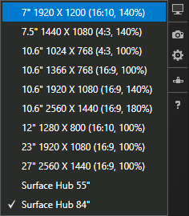

# Test Surface Hub apps using Visual Studio
The Visual Studio simulator provides an environment where you can design, develop, debug, and test Universal Windows Platform (UWP) apps, including apps that you have built for Microsoft Surface Hub. The simulator does not use the same user interface as Surface Hub, but it is useful for testing how your app looks and behaves with the Surface Hub's screen size and resolution.

For more information on the simulator tool in general, see [Run UWP apps in the simulator](/visualstudio/debugger/run-windows-store-apps-in-the-simulator).

## Add Surface Hub resolutions to the simulator
To add Surface Hub resolutions to the simulator:

1. Create a configuration for the 55" Surface Hub by saving the following XML code into a file named *HardwareConfigurations-SurfaceHub55.xml*.  

    ```xml
    <?xml version="1.0" encoding="UTF-8"?>
    <ArrayOfHardwareConfiguration xmlns:xsd="http://www.w3.org/2001/XMLSchema"
                                  xmlns:xsi="http://www.w3.org/2001/XMLSchema-instance">
        <HardwareConfiguration>
            <Name>SurfaceHub55</Name>
            <DisplayName>Surface Hub 55"</DisplayName>
            <Resolution>
                <Height>1080</Height>
                <Width>1920</Width>
            </Resolution>
            <DeviceSize>55</DeviceSize>
            <DeviceScaleFactor>100</DeviceScaleFactor>
        </HardwareConfiguration>
    </ArrayOfHardwareConfiguration>
    ```

2. Create a configuration for the 84" Surface Hub by saving the following XML code into a file named  *HardwareConfigurations-SurfaceHub84.xml*.

    ```xml
    <?xml version="1.0" encoding="UTF-8"?>
    <ArrayOfHardwareConfiguration xmlns:xsd="http://www.w3.org/2001/XMLSchema"
                                  xmlns:xsi="http://www.w3.org/2001/XMLSchema-instance">
        <HardwareConfiguration>
            <Name>SurfaceHub84</Name>
            <DisplayName>Surface Hub 84"</DisplayName>
            <Resolution>
                <Height>2160</Height>
                <Width>3840</Width>
            </Resolution>
            <DeviceSize>84</DeviceSize>
            <DeviceScaleFactor>150</DeviceScaleFactor>
        </HardwareConfiguration>
    </ArrayOfHardwareConfiguration>
    ```

3. Copy the two XML files into *C:\Program Files (x86)\Common Files\Microsoft Shared\Windows Simulator\\&lt;version number&gt;\HardwareConfigurations*.

   > [!NOTE]
   > Administrative privileges are required to save files into this folder.

4. Run your app in the Visual Studio simulator. Click the **Change Resolution** button on the palette and select a Surface Hub configuration from the list.

    

   > [!TIP]
   > [Turn on Tablet mode](https://support.microsoft.com/help/17210/windows-10-use-your-pc-like-a-tablet) to better simulate the experience of a Surface Hub.

## Deploy apps to a Surface Hub device from Visual Studio
Manually deploying an app to a Surface Hub is a simple process.

### Enable developer mode
By default, Surface Hub only installs apps from the Microsoft Store. To install apps signed by other sources, you must enable developer mode.

> [!NOTE]
> After developer mode has been enabled, you will need to reset the Surface Hub if you wish to disable it again. Resetting the device removes all local user files and configurations and then reinstalls Windows.

1. From the Surface Hub's **Start** menu, open the Settings app.

   > [!NOTE]
   > Administrative privileges are required to access the Settings app on Surface Hub.

2. Navigate to **Update & security \> For developers**.

3. Choose **Developer mode** and accept the warning prompt.

### Deploy your app from Visual Studio
For more information on the deployment process in general, see [Deploying and debugging UWP apps](./deploying-and-debugging-uwp-apps.md).

   > [!NOTE]
   > This feature requires Visual Studio 2015 Update 1 or later, however we recommend that you use the latest most up to date version of Visual Studio. An up to date Visual Studio instance will gibe you all the latest development and security updates.

1. Navigate to the debug target dropdown next to the **Start Debugging** button and select **Remote Machine**.

    <!--lcap: in your screenshot, you have local machine selected-->

   

2. Enter the Surface Hub's IP address. Ensure that the **Universal** authentication mode is selected.

   > [!TIP] 
   > After you have enabled developer mode, you can find the Surface Hub's IP address on the welcome screen.

3. Select **Start Debugging (F5)** to deploy and debug your app on the Surface Hub, or press Ctrl+F5 to just deploy your app.

   > [!TIP]
   > If the Surface Hub is displaying the welcome screen, dismiss it by choosing any button.