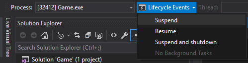
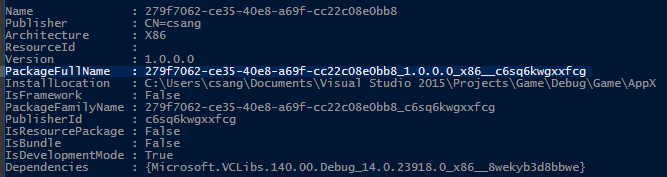

# Testing and debugging tools for Process Lifetime Management (PLM)

One of the key differences between UWP apps and traditional desktop applications is that UWP titles reside in an app container subject to Process Lifecycle Management (PLM). UWP apps can be suspended, resumed, or terminated across all platforms by the Runtime Broker service, and there are dedicated tools for you to use to force those transitions when you are testing or debugging the code that handles them.

## Features in Visual Studio 2015

The built-in debugger in Visual Studio 2015 can help you investigate potential issues when using UWP-exclusive features. You can force your application into different PLM states by using the **Lifecycle Events** toolbar, which becomes visible when you run and debug your title.



## The PLMDebug tool

PLMDebug.exe is a command-line tool that allows you to control the PLM state of an application package, and is shipped as part of the Windows SDK. After it is installed, the tool resides in *C:\Program Files (x86)\Windows Kits\10\Debuggers\x64* by default.

PLMDebug also allows you to disable PLM for any installed app package, which is necessary for some debuggers. Disabling PLM prevents the Runtime Broker service from terminating your app before you have a chance to debug. To disable PLM, use the **/enableDebug** switch, followed by the *full package name* of your UWP app (the short name, package family name, or AUMID of a package will not work):

```cmd
plmdebug /enableDebug [PackageFullName]
```

After deploying your UWP app from Visual Studio, the full package name is displayed in the output window. Alternatively, you can also retrieve the full package name by running **Get-AppxPackage** in a PowerShell console.



Optionally, you can specify an absolute path to a debugger that will automatically launch when your app package is activated. If you wish to do this using Visual Studio, you’ll need to specify VSJITDebugger.exe as the debugger. However, VSJITDebugger.exe requires that you specify the “-p” switch, along with the process ID (PID) of the UWP app. Because it’s not possible to know the PID of your UWP app beforehand, this scenario is not possible out of the box.

You can work around this limitation by writing a script or tool that identifies your game’s process, and then the shell runs VSJITDebugger.exe, passing in the PID of your UWP app. The following C# code sample illustrates a straightforward approach to accomplish this.

```cs
using System.Diagnostics;

namespace VSJITLauncher
{
    class Program
    {
        static void Main(string[] args)
        {
            // Name of UWP process, which can be retrieved via Task Manager.
            Process[] processes = Process.GetProcessesByName(args[0]);

            // Get PID of most recent instance
            // Note the highest PID is arbitrary. Windows may recycle or wrap the PID at any time.
            int highestId = 0;
            foreach (Process detectedProcess in processes)
            {
                if (detectedProcess.Id > highestId)
                    highestId = detectedProcess.Id;
            }

            // Launch VSJITDebugger.exe, which resides in C:\Windows\System32
            ProcessStartInfo startInfo = new ProcessStartInfo("vsjitdebugger.exe", "-p " + highestId);
            startInfo.UseShellExecute = true;

            Process process = new Process();
            process.StartInfo = startInfo;
            process.Start();
        }
    }
}
```

Example usage of this in conjunction with PLMDebug:

```cmd
plmdebug /enableDebug 279f7062-ce35-40e8-a69f-cc22c08e0bb8_1.0.0.0_x86__c6sq6kwgxxfcg "\"C:\VSJITLauncher.exe\" Game"
```

where `Game` is the process name, and `279f7062-ce35-40e8-a69f-cc22c08e0bb8_1.0.0.0_x86__c6sq6kwgxxfcg` is the full package name of the example UWP app package.

Note that every call to **/enableDebug** must be later coupled to another PLMDebug call with the **/disableDebug** switch. Furthermore, the path to a debugger must be absolute (relative paths are not supported).

## Related topics

- [Deploying and debugging UWP apps](deploying-and-debugging-uwp-apps.md)
- [Debugging, testing, and performance](index.md)
