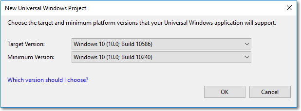

# Version adaptive apps: Use new APIs while maintaining compatibility with previous versions

Each release of the Windows 10 SDK adds exciting new functionality that you'll want to take advantage of. However, not all your customers will update their devices to the latest version of Windows 10 at the same time, and you want to make sure your app works on the broadest possible range of devices. Here, we show you how to design your app so that it runs on earlier versions of Windows 10, but also takes advantage of new features whenever your app runs on a device with the latest update installed.

There are 3 steps to take to make sure your app supports the broadest range of Windows 10 devices.

- First, configure your Visual Studio project to target the latest APIs. This affects what happens when you compile your app.
- Second, perform runtime checks to ensure that you only call APIs that are present on the device your app is running on.
- Third, test your app on the Minimum Version and the Target Version of Windows 10.

## Configure your Visual Studio project

The first step in supporting multiple Windows 10 versions is to specify the *Target* and *Minimum* supported OS/SDK versions in your Visual Studio project.

- *Target*: The SDK version that Visual Studio compiles your app code and run all tools against. All APIs and resources in this SDK version are available in your app code at compile time.
- *Minimum*: The SDK version that supports the earliest OS version that your app can run on (and will be deployed to by the store) and the version that Visual Studio compiles your app markup code against. 

During runtime your app will run against the OS version that it is deployed to, so your app will throw exceptions if you use resources or call APIs that are not available in that version. We show you how to use runtime checks to call the correct APIs later in this article.

The Target and Minimum settings specify the ends of a range of OS/SDK versions. However, if you test your app on the minimum version, you can be sure it will run on any versions between the Minimum and Target.

> [!TIP]
> Visual Studio does not warn you about API compatibility. It is your responsibility to test and ensure that your app performs as expected on all OS versions between and including the Minimum and Target.

When you create a new project in Visual Studio 2015, Update 2 or later, you are prompted to set the Target and Minimum versions that your app supports. By default, the Target Version is the highest installed SDK version, and the Minimum Version is the lowest installed SDK version. You can choose Target and Minimum only from SDK versions that are installed on your machine. 



We typically recommend that you leave the defaults. However, if you have a Preview version of the SDK installed and you are writing production code, you should change the Target Version from the Preview SDK to the latest official SDK version. 

To change the Minimum and Target version for a project that has already been created in Visual Studio, go to Project -> Properties -> Application tab -> Targeting.


For reference, the following table shows the build numbers for each SDK.

| Friendly name | Version | OS/SDK build |
| ---- | ---- | ---- |
| RTM | 1507 | 10240 |
| November Update | 1511 | 10586 |
| Anniversary Update | 1607 | 14393 |
| Creators Update | 1703 | 15063 |
| Fall Creators Update | 1709 | 16299 |
| April 2018 Update | 1803 | 17134 |
| October 2018 Update | 1809 | 17763 |
| May 2019 Update | 1903 | 18362 |

You can download any released version of the SDK from the [Windows SDK and emulator archive](https://developer.microsoft.com/windows/downloads/sdk-archive). You can download the latest Windows Insider Preview SDK from the developer section of the [Windows Insider](https://insider.windows.com/for-developers/) site.

 For more info about Windows 10 updates, see [Windows 10 release information](https://www.microsoft.com/itpro/windows-10/release-information). For important information about the Windows 10 support lifecycle, see the [Windows lifecycle fact sheet](https://support.microsoft.com/help/13853/windows-lifecycle-fact-sheet).

## Perform API checks

The key to version adaptive apps is the combination of API contracts and the [ApiInformation](/uwp/api/windows.foundation.metadata.apiinformation) class. This class lets you detect whether a specified API contract, type, or member is present so that you can safely make API calls across a variety of devices and OS versions.

### API contracts

The set of APIs within a device family is broken down into subdivisions known as API contracts. You can use the **ApiInformation.IsApiContractPresent** method to test for the presence of an API contract. This is useful if you want to test for the presence of many APIs that all exist in the same version of an API contract.

```csharp
    bool isScannerDeviceContract_1_Present =
        Windows.Foundation.Metadata.ApiInformation.IsApiContractPresent
            ("Windows.Devices.Scanners.ScannerDeviceContract", 1);
```

What’s an API contract? Essentially, an API contract represents a feature – a set of related APIs that together deliver some particular functionality. A hypothetical API contract could represent a set of APIs containing two classes, five interfaces, one structure, two enums, and so on.

Logically related types are grouped into an API contract, and starting with Windows 10, every Windows Runtime API is a member of some API contract. With API Contracts, you are checking for the availability of a specific feature or API on the device, effectively checking a device’s capabilities rather than checking for a specific device or OS. A platform that implements any API in an API contract is required to implement every API in that API contract. This means you can test whether the running OS supports a particular API contract and, if it does, call any of the APIs in that API contract without checking each one individually.

The largest and most commonly used API contract is the **Windows.Foundation.UniversalApiContract**. It contains the majority of the APIs in the Universal Windows Platform. The [Device family extension SDKs and API contracts](/uwp/extension-sdks/) documentation describes the variety of API contracts available. You’ll see that most of them represent a set of functionally related APIs.

> [!NOTE]
> If you have a preview Windows Software Development Kit (SDK) installed that isn’t documented yet, you can also find information about API contract support in the ‘Platform.xml’ file located in the SDK installation folder at ‘\(Program Files (x86))\Windows Kits\10\Platforms\<platform>\<SDK version>\Platform.xml’.

### Version adaptive code and conditional XAML

In all versions of Windows 10, you can use the ApiInformation class in a condition in your code to test for the presence of the API you want to call. In your adaptive code, you can use various methods of the class, such as IsTypePresent, IsEventPresent, IsMethodPresent, and IsPropertyPresent, to test for APIs at the granularity you need.

For more info and examples, see **[Version adaptive code](version-adaptive-code.md)**.

If your apps Minimum Version is build 15063 (Creators Update) or later, you can use *conditional XAML* to set properties and instantiate objects in markup without needing to use code behind. Conditional XAML provides a way to use the ApiInformation.IsApiContractPresent method in markup.

For more info and examples, see **[Conditional XAML](conditional-xaml.md)**.

## Test your version adaptive app

When you use version adaptive code or conditional XAML to write a version adaptive app, you need to test it on a device running the Minimum Version and on a device running the Target Version of Windows 10.

You can't test all conditional code paths on a single device. To ensure that all code paths are tested, you need to deploy and test your app on a remote device (or virtual machine) running the minimum supported OS version.
For more info about remote debugging, see [Deploying and debugging UWP apps](deploying-and-debugging-uwp-apps.md).

## Related articles

- [What's a UWP app](../get-started/universal-application-platform-guide.md)
- [Dynamically detecting features with API contracts](https://blogs.windows.com/buildingapps/2015/09/15/dynamically-detecting-features-with-api-contracts-10-by-10/)
- [API Contracts](https://channel9.msdn.com/Events/Build/2015/3-733) (Build 2015 video)