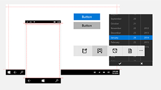
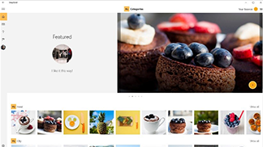

---
description: Get the latest downloads and tools for UWP apps user interface layout and controls designs.
keywords: uwp app layout, UI, user interface designs, downloads, uwp tools
title: Design downloads for UWP apps - Windows app development
author: mijacobs
ms.author: mijacobs
ms.date: 02/08/2017
ms.topic: article
ms.prod: windows
ms.technology: uwp
ms.assetid: 88da6d1a-379c-4173-a56d-d8b9a4eab5da
---
# Design downloads for UWP apps
<link rel="stylesheet" href="https://az835927.vo.msecnd.net/sites/uwp/Resources/css/custom.css"> 

This section contains design and UI-related downloads for UWP apps. For additional tools, such as Visual Studio, see [our main downloads page](https://developer.microsoft.com/downloads). 


## Design templates



  

    
<b>PowerPoint</b> 
    This deck has everything you need to quickly mock up wireframes for UWP apps, including controls and layouts. [Download the design templates for PowerPoint](https://go.microsoft.com/fwlink/p/?LinkId=534632)

  

  


  






  

            
<b>Adobe Illustrator</b> 
            These Adobe Illustrator templates provide controls and layouts for designing UWP apps. [Download the design templates for Adobe Illustrator](https://go.microsoft.com/fwlink/p/?LinkId=534634)
    
  

  


  






  

            
<b>Adobe Photoshop</b> 
            Controls and layouts for designing UWP apps in Adobe Photoshop. [Download the design templates for Adobe Photoshop](http://go.microsoft.com/fwlink/p/?LinkId=626453)
    
  

  


  




## Tools



  

            
<b>Tile and icon generator for Adobe Photoshop</b> 
            This set of actions for Adobe Photoshop generates the 68 recommended tile and icon assets from just 7 files.  [Download the tile and icon generator](http://go.microsoft.com/fwlink/p/?LinkId=760394)
    
  

  


  





## Samples



  

            
<b>Photo sharing app</b>  
            This sample app demonstrates photo sharing with real-world social media. It demonstrates responsive design, in-app purchase, Azure services, push notifications, and more.  [Download the Photo sharing app sample](http://go.microsoft.com/fwlink/p/?LinkId=760402) [Read more about PhotoSharingApp](http://go.microsoft.com/fwlink/p/?LinkId=760401)
    
  

  


  






  

            
<b>Hue Lights </b> 
            This sample integrates Windows features with intelligent home automation. Specifically, it shows how you can use Cortana and Bluetooth Low Energy (Bluetooth LE) to create an interactive experience with the Phillips Hue Lights (a Wi-Fi enabled lighting system).  [Download the Hue Lights sample](https://github.com/Microsoft/Windows-appsample-huelightcontroller/archive/master.zip) [Read more about the Hue Lights sample](https://github.com/Microsoft/Windows-appsample-huelightcontroller)
    
  

  


  



<b>Want more code?</b> Check out the Windows sample page for complete list of all our UWP app samples. [Go to the samples portal](https://developer.microsoft.com/samples)