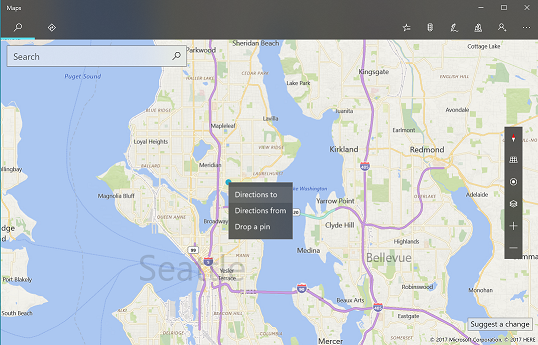
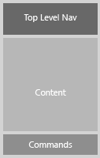
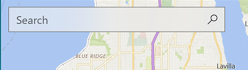
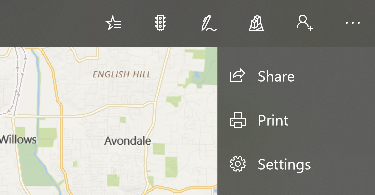
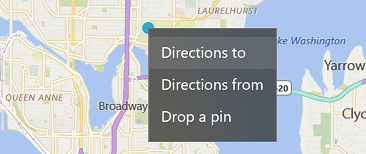
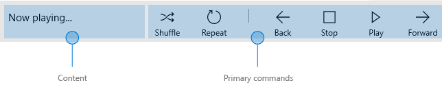

#  Command design basics for UWP apps

In a Universal Windows Platform (UWP) app, *command elements* are interactive UI elements that enable users to perform actions, such as sending an email, deleting an item, or submitting a form. 

This article describes common command elements, the interactions they support, and the command surfaces for hosting them.

Above, see examples of command elements in the Maps app.

## Provide the right type of interactions

When designing a command interface, the most important decision is choosing what users should be able to do. To plan the right type of interactions, focus on your app - consider the user experiences you want to enable, and what steps users will need to take. Once you decide what you want users to accomplish, then you can provide them the tools to do so.

Some interactions you might want to provide your app include:

- Sending or submiting information 
- Selecting settings and choices
- Searching and filtering content
- Opening, saving, and deleting files
- Editing or creating content

## Use the right command element for the interaction

Using the right elements to enable command interactions can make the difference between an intuitive, easy-to-use app and a difficult, confusing app. The Universal Windows Platform (UWP) provides a large set of command elements that you can use in your app. Here's a list of some of the most common controls and a summary of the interactions they can enable.

<table>
<thead>
<tr class="header">
<th align="left">Category</th>
<th align="left">Elements</th>
<th align="left">Interaction</th>
</tr>
</thead>
<tbody>
<tr class="odd">
<td align="left">Buttons  
	</td>
<td align="left">[Button](../controls-and-patterns/buttons.md)</td>
<td align="left">Triggers an immediate action. Examples include sending an email, submitting form data, or confirming an action in a dialog.</td>
</tr>
<tr class="even">
<td align="left">Lists  
	</td>
<td align="left">[drop-down list, list box, list view and grid view](../controls-and-patterns/lists.md)</td>
<td align="left">Presents items in a interactive list or a grid. Usually used for many options or display items.</td>
</tr>
<tr class="odd">
<td align="left">Selection controls  
	</td>
<td align="left">[check box](../controls-and-patterns/checkbox.md), [radio button](../controls-and-patterns/radio-button.md), [toggle switch](../controls-and-patterns/toggles.md)</td>
<td align="left">Lets users choose from a few options, such as when completing a survey or configuring app settings.</td>
</tr>
<tr class="even">
<td align="left">Date and time pickers  
	</td>
<td align="left">[calendar date picker, calendar view, date picker, time picker](../controls-and-patterns/date-and-time.md)</td>
<td align="left">Enables users to view and modify date and time info, such as when creating an event or setting an alarm.</td>
</tr>
<tr class="odd">
<td align="left">Predictive text entry  
	</td>
<td align="left">[Auto-suggest box](../controls-and-patterns/auto-suggest-box.md)</td>
<td align="left">Provides suggestions as users type, such as when entering data or performing queries.</td>
</tr>
</tbody>
</table>

For a complete list, see [Controls and UI elements](https://dev.windows.com/design/controls-patterns)

##  Place commands on the right surface
You can place command elements on a number of surfaces in your app, including the app canvas or special command containers, such as command bars, menus, dialogs, and flyouts.

Note that, whenever possible, you should allow users to manipulate content directly rather than use commands that act on the content. For example, allow users to rearrange lists by dragging and dropping list items, rather than using up and down command buttons.
  
Otherwise, if users can't manipulate content directly, then place command elements on a command surface in your app:

<table class="uwpd-top-aligned-table">

<tr class="header">
<th align="left">Surface</th>
<th align="left">Description</th>
<th align="left">Example</th>
</tr>

<tr class="odd">
<td align="left" style="vertical-align: top">App canvas (content area)

</td>

<td align="left" style="vertical-align: top;">If a command is constantly needed for users to complete core scenarios, put it on the canvas. Because you can put commands near (or on) the objects they affect, putting commands on the canvas makes them easy and obvious to use.

However, choose the commands you put on the canvas carefully. Too many commands on the app canvas take up valuable screen space and can overwhelm the user. If the command won't be frequently used, consider putting it in another command surface.
 
</td><td>
An autosuggest box on the Maps app canvas.
  
  
</td>
</tr>

<tr class="even">
<td align="left" style="vertical-align: top;">[Command bar](../controls-and-patterns/app-bars.md)

</td>
<td align="left" style="vertical-align: top;"> Command bars help organize commands and make them easy to access. Command bars can be placed at the top of the screen, at the bottom of the screen, or at both the top and bottom of the screen. 
</td>
<td>
A command bar at the top of the Maps app.
  

</td>
</tr>

<tr class="odd">
<td align="left" style="vertical-align: top;">[Menus and context menus](../controls-and-patterns/menus.md)

</td>
<td align="left" style="vertical-align: top;">Sometimes it is more efficient to group multiple commands into a command menu to save space. Menus and context menus display a list of commands or options when the user requests them.

Context menus can provide shortcuts to commonly-used actions and provide access to secondary commands that are only relevant in certain contexts, such as clipboard or custom commands. Context menus are usually prompted by a user right-clicking.

</td><td>
A context menu appears when users right-click in the Maps app.
  
  
</td>
</tr>
</table>

## Provide feedback for interactions

Feedback communicates the results of commands and allows users to understand what they've done, and what they can do next. Ideally, feedback should be integrated naturally in your UI, so users don't have to be interrupted, or take additional action unless absolutely necessary. 

Here are some ways to provide feedback in your app.

<table class="uwpd-top-aligned-table">

<tr class="header">
<th align="left">Surface</th>
<th align="left">Description</th>
</tr>

<tr class="odd">
<td align="left" style="vertical-align: top;"> [Command bar](../controls-and-patterns/app-bars.md)

</td>
<td align="left" style="vertical-align: top;"> The content area of the command bar is an intuative place to communicate status to users if they'd like to see feedback.

  
  

</td>
</tr>

<tr class="even">
<td align="left" style="vertical-align: top;">[Flyout](../controls-and-patterns/dialogs.md)

</td>
<td align="left" style="vertical-align: top;">
A lightweight contextual popup that can be dismissed by tapping or clicking somewhere outside the flyout.

  
  

</td>
</tr>

<tr class="odd">
<td align="left" style="vertical-align: top;">[Dialog controls](../controls-and-patterns/dialogs.md)

</td>
<td align="left" style="vertical-align: top;">Dialogs are modal UI overlays that provide contextual app information. In most cases, dialogs block interactions with the app window until being explicitly dismissed, and often request some kind of action from the user.

Dialogs can be disruptive and should only be used in certain situations. For more info, see the [When to confirm or undo actions](#when-to-confirm-or-undo-actions) section.

  

</td>
</tr>

</table>

> [!TIP]
> Be careful of how much your app uses confirmation dialogs; they can be very helpful when the user makes a mistake, but they are a hindrance whenever the user is trying to perform an action intentionally.

### When to confirm or undo actions

No matter how well-designed the user interface is and no matter how careful the user is, at some point, all users will perform an action they wish they hadn't. Your app can help in these situations by requiring the user to confirm an action, or by providing a way of undoing recent actions.

-   For actions that can't be undone and have major consequences, we recommend using a confirmation dialog. Examples of such actions include:
    -   Overwriting a file
    -   Not saving a file before closing
    -   Confirming permanent deletion of a file or data
    -   Making a purchase (unless the user opts out of requiring a confirmation)
    -   Submitting a form, such as signing up for something
-   For actions that can be undone, offering a simple undo command is usually enough. Examples of such actions include:
    -   Deleting a file
    -   Deleting an email (not permanently)
    -   Modifying content or editing text
    -   Renaming a file

##  Optimize for specific input types

See the [Interaction primer](../input/index.md) for more detail on optimizing user experiences around a specific input type or device.