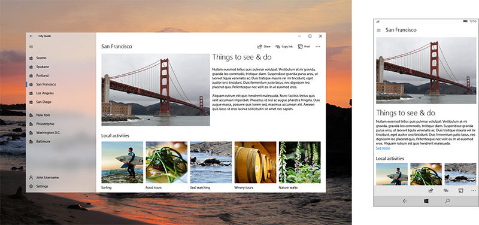

#  Content design basics for UWP apps

 

The main purpose of any app is to provide access to content: in a photo-editing app, the photo is the content; in a travel app, maps and info about travel destinations is the content; and so on. Navigation elements provide access to content; command elements enable the user to interact with content; content elements display the actual content.

This article provides content design recommendations for the three content scenarios.

## Design for the right content scenario

There are three main content scenarios:

-   **Consumption**: A primarily one-way experience where content is consumed. It includes tasks like reading, listening to music, watching videos, and photo and image viewing.
-   **Creation**: A primarily one-way experience where the focus is creating new content. It can be broken down into making things from scratch, like shooting a photo or video, creating a new image in a painting app, or opening a fresh document.
-   **Interactive**: A two-way content experience that includes consuming, creating, and revising content.

## Consumption-focused apps

Content elements receive the highest priority in a consumption-focused app, followed by the [navigation elements](navigation-basics.md) needed to help users find the content they want. Examples of consumption-focused apps include movie players, reading apps, music apps, and photo viewers.

General recommendations for consumption-focused apps:

-   Consider creating dedicated [navigation](navigation-basics.md) pages and content-viewing pages, so that when users find the content they are looking for, they can view it on a dedicated page free of distractions.
-   Consider creating a full-screen view option that expands the content to fill the entire screen and hides all other UI elements.

## Creation-focused apps

Content and [command](commanding-basics.md) elements are the most import UI elements in a creation-focused app: command elements enable the user to create new content. Examples include painting apps, photo editing apps, video editing apps, and word processing apps.

As an example, here's a design for a photo app that uses command bars to provide access to tools and photo manipulation options. Because all the commands are in the command bar, the app can devote most of its screen space to its content, the photo being edited.

General recommendations for creation-focused apps:

-   Minimize the use of [navigation](navigation-basics.md) elements.
-   [Command](commanding-basics.md) elements are especially important in creation-focused apps. Since users will be executing a lot of commands, we recommend providing a command history/undo functionality.

## Apps with interactive content

In an app with interactive content, users create, view, and edit content; many apps fit into this category. Examples of these types of apps include line of business apps, inventory management apps, cooking apps that enable the user to create or modify recipes.

These sort of apps need to balance all three UI elements:

-   [Navigation](navigation-basics.md) elements help users find and view content. If viewing and finding content is the most important scenario, prioritize navigation elements, filtering and sorting, and search.
-   [Command](commanding-basics.md) elements let the user create, edit, and manipulate content.

General recommendations for apps with interactive content:

-   It can be difficult to balance navigation, content, and command elements when all three are important. If possible, consider creating separate screens for browsing, creating, and editing content, or providing mode switches.

## Commonly used content elements

Here are some UI elements commonly used to display content. (For a complete list of UI elements, see [Controls and UI elements](https://msdn.microsoft.com/library/windows/apps/dn611856).)

<table>
<colgroup>
<col width="33%" />
<col width="33%" />
<col width="33%" />
</colgroup>
<thead>
<tr class="header">
<th align="left">Category</th>
<th align="left">Elements</th>
<th align="left">Description</th>
</tr>
</thead>
<tbody>
<tr class="odd">
<td align="left">Audio and video</td>
<td align="left">[Media playback and transport controls](../controls-and-patterns/media-playback.md)</td>
<td align="left">Plays audio and video.</td>
</tr>
<tr class="even">
<td align="left">Image viewers</td>
<td align="left">[Flip view](../controls-and-patterns/flipview.md), [image](../controls-and-patterns/images-imagebrushes.md)</td>
<td align="left">Displays images. The flip view displays images in a collection, such as photos in an album or items in a product details page, one image at a time.</td>
</tr>
<tr class="odd">
<td align="left">Lists</td>
<td align="left">[drop-down list, list box, list view and grid view](../controls-and-patterns/lists.md)</td>
<td align="left">Presents items in an interactive list or a grid. Use these elements to let users select a movie from a list of new releases or manage an inventory.</td>
</tr>
<tr class="even">
<td align="left">Text and text input</td>
<td align="left">
[Text block](../controls-and-patterns/text-block.md), [text box](../controls-and-patterns/text-box.md), [rich edit box](../controls-and-patterns/rich-edit-box.md)

</td>
<td align="left">Displays text. Some elements enable the user to edit text. For more info, see [Text controls](../controls-and-patterns/text-controls.md)</td>
</tr>
</tbody>
</table>

 

 

