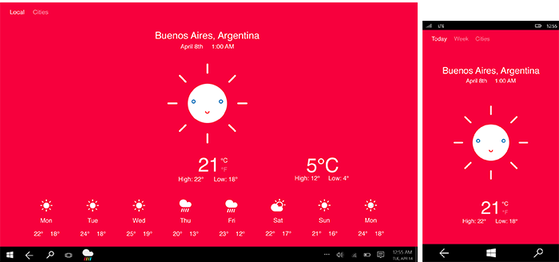
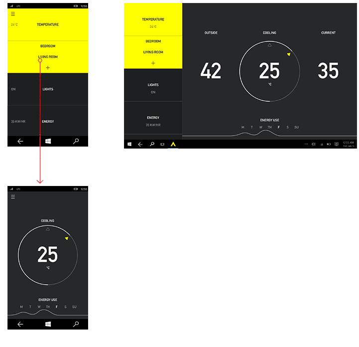

#  Introduction to UWP app design

A Universal Windows Platform (UWP) app can run on any Windows-based device, from your phone to your tablet or PC. 

Designing an app that looks good on such a wide variety of devices can be a big challenge. Fortunately, the Universal Windows Platform (UWP) provides a set of built-in features and universal building blocks that help you create a UX that works well with a variety of devices, screens, and input methods. This articles describes the UI features and benefits of UWP apps and provides some high-level design guidance for creating your first UWP app. 

## Video summary

> [!VIDEO https://channel9.msdn.com/Blogs/One-Dev-Minute/Designing-Universal-Windows-Platform-apps/player]

<!--

-->

<!--

-->

## UWP features

Let's start by taking a look at some of the features that you get when you create a UWP app.

### Effective pixels and scaling

UWP apps automatically adjust the size of controls, fonts, and other UI elements so that they are legible and easy to interact with on all devices.

When your app runs on a device, the system uses an algorithm to normalize the way UI elements display on the screen. This scaling algorithm takes into account viewing distance and screen density (pixels per inch) to optimize for perceived size (rather than physical size). The scaling algorithm ensures that a 24 px font on Surface Hub 10 feet away is just as legible to the user as a 24 px font on 5" phone that's a few inches away.

Because of how the scaling system works, when you design your UWP app, you're designing in *effective pixels*, not actual physical pixels. So, how does that impact the way you design your app?

-   You can ignore the pixel density and the actual screen resolution when designing. Instead, design for the effective resolution (the resolution in effective pixels) for a size class (for details, see the [Screen sizes and breakpoints article](../layout/screen-sizes-and-breakpoints-for-responsive-design.md)).

-   When the system scales your UI, it does so by multiples of 4. To ensure a crisp appearance, snap your designs to the 4x4 pixel grid: make margins, sizes, and the positions of UI elements a multiple of 4 effective pixels. Note that text doesn't have this requirement; the text can have any size and position. 

This illustration shows design elements that map to the 4x4 pixel grid. The design element will always have crisp, sharp edges.

> [!TIP]
> When creating screen mockups in image editing programs, set the DPI to 72 and set the image dimensions to the effective resolution for the size class you're targeting. For a list of size classes and effective resolutions, see the [Screen sizes and breakpoints article](../layout/screen-sizes-and-breakpoints-for-responsive-design.md).

### Universal input and smart interactions

Another built-in capability of the UWP is universal input enabled via smart interactions. Although you can design your apps for specific input modes and devices, you aren’t required to. That’s because Universal Windows apps by default rely on smart interactions. That means you can design around a click interaction without having to know or define whether the click comes from an actual mouse click or the tap of a finger.

### Universal controls and styles

The UWP also provides some useful building blocks that make it easier to design apps for multiple device families.

-   **Universal controls**

    The UWP provides a set of universal controls that are guaranteed to work well on all Windows-powered devices. This set of universal controls includes everything from common form controls like radio button and text box to sophisticated controls like grid view and list view that can generate lists of items from a stream of data and a template. These controls are input-aware and deploy with the proper set of input affordances, event states, and overall functionality for each device family.

    For a complete list of these controls and the patterns you can make from them, see the [Controls and patterns](https://dev.windows.com/design/controls-patterns) section.

-   **Universal styles**

    Your UWP app automatically gets a default set of styles that gives you these features:

    -   A set of styles that automatically gives your app a light or dark theme (your choice) and can incorporate the user's accent color preference.

        

    -   A Segoe-based type ramp that ensures that app text looks crisp on all devices.
    -   Default animations for interactions.
    -   Automatic support for high-contrast modes. Our styles were designed with high-contrast in mind, so when your app runs on a device in high-contrast mode, it will display properly.
    -   Automatic support for other languages. Our default styles automatically select the correct font for every language that Windows supports. You can even use multiple languages in the same app and they'll be displayed properly.
    -   Built-in support for RTL reading order.

    You can customize these default styles to give your app a personal touch, or you can completely replace them with your own to create a unique visual experience. For example, here's a design for a weather app with a unique visual style:

    

## UWP and the Fluent Design System

 The Fluent Design System helps you create modern, clean UI that incorporates light, depth, motion, material, and scale. Fluent Design is being applied across Windows 10 devices and apps to create beautiful, engaging, and intuitive experiences. 
 
 How can you incorporate Fluent Design into your app? We're continually adding new controls and features that make it easy. Here's a list of current Fluent Design features for UWP:  

* [Acrylic](../style/acrylic.md) is a type of brush that creates semi-transparent surfaces.
* [Parallax](../motion/parallax.md) adds three-dimensional perspective, depth, and movement to scrolling content, such as lists.
* [Reveal](../style/reveal.md) uses light to create a hover effect that illuminates interactive UI elements. 
* [Connected animations](../motion/connected-animation.md) provide graceful scene transitions that improve usability by maintaining context and providing continuity. 

This video shows some of these features in action:
> [!VIDEO https://channel9.msdn.com/Blogs/One-Dev-Minute/Fluent-Design-features-for-Fall-Creators-Update/player]

We've also updated our [design guidelines](https://developer.microsoft.com/windows/apps/design) (which you're currently reading) so they're based on Fluent Design principles.

## The anatomy of a typical UWP app

Now that we've described the building blocks of UWP apps, let's take a look at how to put them together to create a UI.

A modern user interface is a complex thing, made up of text, shapes, colors, and animations which are ultimately made up out of individual pixels of the screen of the device you're using. When you start designing a user interface, the sheer number of choices can be overwhelming.

To make things simpler, let's define the anatomy of an app from a design perspective. Let's say that an app is made up of screens and pages. Each page has a user interface, made up of three types of UI elements: navigation, commanding, and content elements.

<table class="uwpd-noborder" >
<colgroup>
<col width="50%" />
<col width="50%" />
</colgroup>
<tbody>
<tr class="odd">
<td align="left">

</td>
<td align="left"><strong>Navigation elements</strong>

Navigation elements help users choose the content they want to display. Examples of navigation elements include [tabs and pivots](../controls-and-patterns/tabs-pivot.md), [hyperlinks](../controls-and-patterns/hyperlinks.md), and [nav panes](../controls-and-patterns/navigationview.md).

Navigation elements are covered in detail in the [Navigation design basics](navigation-basics.md) article.

<strong>Command elements</strong>

Command elements initiate actions, such as manipulating, saving, or sharing content. Examples of command elements include [button](../controls-and-patterns/buttons.md) and the [command bar](../controls-and-patterns/app-bars.md). Command elements can also include keyboard shortcuts that aren't actually visible on the screen.

Command elements are covered in detail in the [Command design basics](commanding-basics.md) article.

<strong>Content elements</strong>

Content elements display the app's content. For a painting app, the content might be a drawing; for a news app, the content might be a news article.

Content elements are covered in detail in the [Content design basics](content-basics.md) article.
</td>
</tr>
</tbody>
</table>

 

At a minimum, an app has a splash screen and a home page that defines the user interface. A typical app will have multiple pages and screens, and navigation, command, and content elements might change from page to page.

When deciding on the right UI elements for your app, you might also consider the devices and the screen sizes your app will run on.

## Tailoring your app for specific devices and screen sizes.

UWP apps use effective pixels to guarantee that your design elements will be legible and usable on all Windows-powered devices. So, why would you ever want to customize your app's UI for a specific device family?

**Note**  
Before we go any further, Windows doesn't provide a way for your app to detect the specific device your app is running on. It can tell you the device family (mobile, desktop, etc) the app is running on, the effective resolution, and the amount of screen space available to the app (the size of the app's window).

 

-   **To make the most effective use of space and reduce the need to navigate**

    If you design an app to look good on a device that has a small screen, such as a phone, the app will be usable on a PC with a much bigger display, but there will probably be some wasted space. You can customize the app to display more content when the screen is above a certain size. For example, a shopping app might display one merchandise category at a time on a phone, but show multiple categories and products simultaneously on a PC or laptop.

    By putting more content on the screen, you reduce the amount of navigation that the user needs to perform.

-   **To take advantage of devices' capabilities**

    Certain devices are more likely to have certain device capabilities. For example, phones are likely to have a location sensor and a camera, while a PC might not have either. Your app can detect which capabilities are available and enable features that use them.

-   **To optimize for input**

    The universal control library works with all input types (touch, pen, keyboard, mouse), but you can still optimize for certain input types by re-arranging your UI elements. For example, if you place navigation elements at the bottom of the screen, they'll be easier for phone users to access—but most PC users expect to see navigation elements toward the top of the screen.

## Responsive design techniques

When you optimize your app's UI for specific screen widths, we say that you're creating a responsive design. Here are six responsive design techniques you can use to customize your app's UI.

### Reposition

You can alter the location and position of app UI elements to get the most out of each device. In this example, the portrait view on phone or phablet necessitates a scrolling UI because only one full frame is visible at a time. When the app translates to a device that allows two full on-screen frames, whether in portrait or landscape orientation, frame B can occupy a dedicated space. If you're using a grid for positioning, you can stick to the same grid when UI elements are repositioned.

In this example design for a photo app, the photo app repositions its content on larger screens.

### Resize

You can optimize the frame size by adjusting the margins and size of UI elements. This could allow you, as the example here shows, to augment the reading experience on a larger screen by simply growing the content frame.

### Reflow

By changing the flow of UI elements based on device and orientation, your app can offer an optimal display of content. For instance, when going to a larger screen, it might make sense to switch larger containers, add columns, and generate list items in a different way.

This example shows how a single column of vertically scrolling content on phone or phablet can be reflowed on a larger screen to display two columns of text.

### Show/hide

You can show or hide UI elements based on screen real estate, or when the device supports additional functionality, specific situations, or preferred screen orientations.

In this example with tabs, the middle tab with the camera icon might be specific to the app on phone or phablet and not be applicable on larger devices, which is why it's revealed in the device on the right. Another common example of revealing or hiding UI applies to media player controls, where the button set is reduced on smaller devices and expanded on larger devices. The media player on PC, for instance, can handle far more on-screen functionality than it can on a phone.

Part of the reveal-or-hide technique includes choosing when to display more metadata. When real estate is at a premium, such as with a phone or phablet, it's best to show a minimal amount of metadata. With a laptop or desktop PC, a significant amount of metadata can be surfaced. Some examples of how to handle showing or hiding metadata include:

-   In an email app, you can display the user's avatar.
-   In a music app, you can display more info about an album or artist.
-   In a video app, you can display more info about a film or a show, such as showing cast and crew details.
-   In any app, you can break apart columns and reveal more details.
-   In any app, you can take something that's vertically stacked and lay it out horizontally. When going from phone or phablet to larger devices, stacked list items can change to reveal rows of list items and columns of metadata.

### Replace

This technique lets you switch the user interface for a specific device size-class or orientation. In this example, the nav pane and its compact, transient UI works well for a smaller device, but on a larger device tabs might be a better choice.

###  Re-architect

You can collapse or fork the architecture of your app to better target specific devices. In this example, going from the left device to the right device demonstrates the joining of pages.

Here's an example of this technique applied to the design for a smart home app.

## Tools and design toolkits

We provide a variety of tools to help you design you UWP app. See our [Design toolkits page](../downloads/index.md) for XD, Illustrator, Photoshop, Framer, and Sketch toolkits, as well as additional design tools and font downloads. 

To get your machine set up to actually code UWP apps, see our [Get started &gt; Get set up](../../get-started/get-set-up.md) article. 

## Related articles

- [Screen sizes and breakpoints](../layout/screen-sizes-and-breakpoints-for-responsive-design.md)
- [What's a UWP app?](https://msdn.microsoft.com/library/windows/apps/dn726767.aspx)
- [Design toolkits](../downloads/index.md)

 
