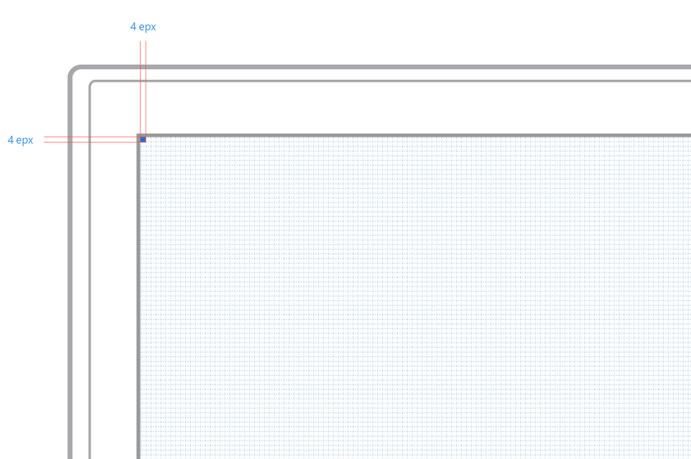
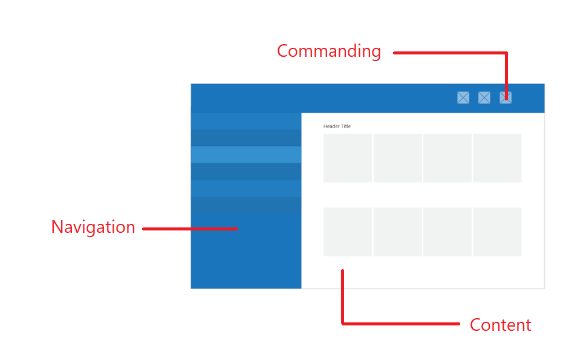
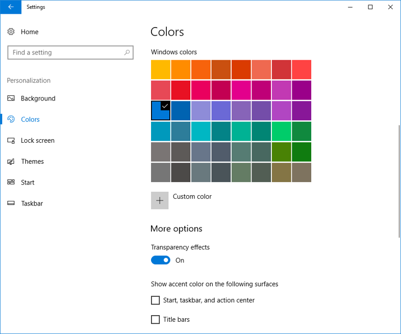
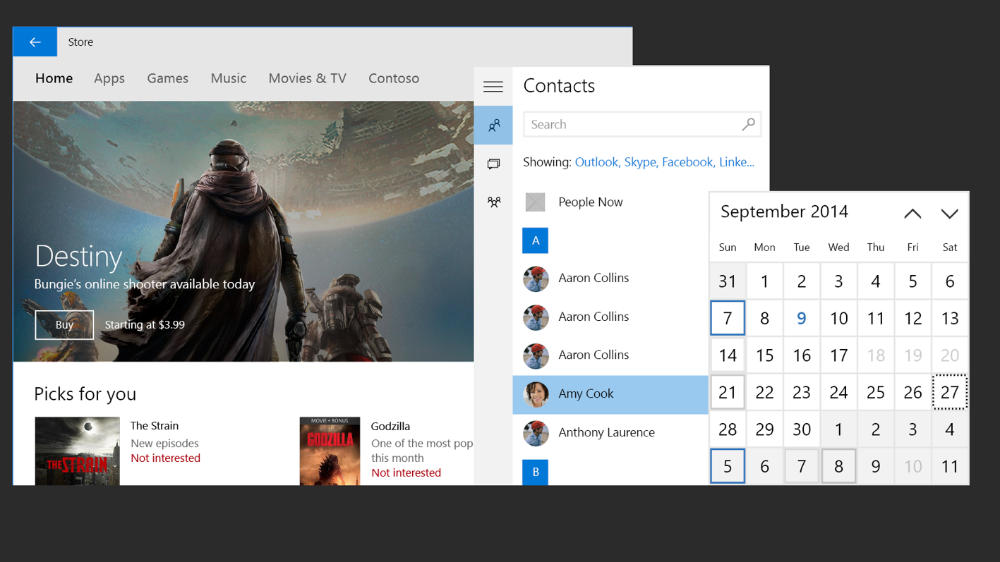
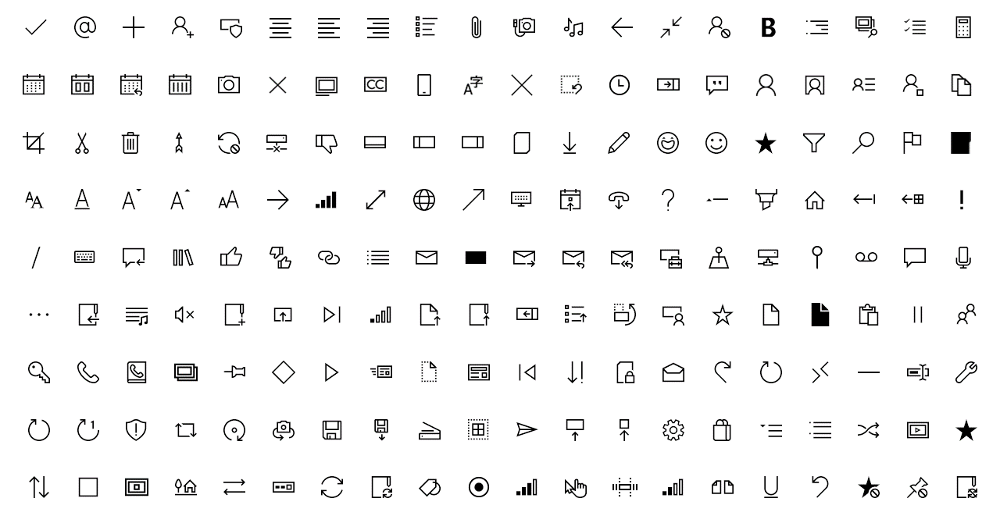
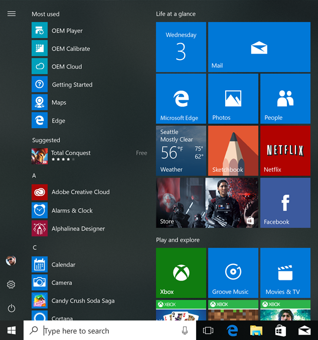

#  Introduction to UWP app design

The Universal Windows Platform (UWP) design guidance is a resource to help you design and build beautiful, polished apps.

It's not a list of prescriptive rules - it's a living document, designed to adapt to our evolving [Fluent Design System](../fluent-design-system/index.md) as well as the needs of our app-building community.

This introduction provides an overview of the universal design features that are included in every UWP app, helping you build user interfaces (UI) that scale beautifully across a range of devices.

## Video summary

> [!VIDEO https://channel9.msdn.com/Blogs/One-Dev-Minute/Designing-Universal-Windows-Platform-apps/player]

## Effective pixels and scaling

UWP apps automatically adjust the size of controls, fonts, and other UI elements so that they are legible and easy to interact with on [all devices that support UWP apps](../devices/index.md).

When your app runs on a device, the system uses an algorithm to normalize the way UI elements display on the screen. This scaling algorithm takes into account viewing distance and screen density (pixels per inch) to optimize for perceived size (rather than physical size). The scaling algorithm ensures that a 24 px font on Surface Hub 10 feet away is just as legible to the user as a 24 px font on 5" phone that's a few inches away.

Because of how the scaling system works, when you design your UWP app, you're designing in effective pixels, not actual physical pixels. Effective pixels (epx) are a virtual unit of measurement, and they're used to express layout dimensions and spacing, independent of screen density. (In our guidelines, epx, ep, and px are used interchangeably.)

You can ignore the pixel density and the actual screen resolution when designing. Instead, design for the effective resolution (the resolution in effective pixels) for a size class (for details, see the [Screen sizes and breakpoints article](../layout/screen-sizes-and-breakpoints-for-responsive-design.md)).

> [!TIP]
> When creating screen mockups in image editing programs, set the DPI to 72 and set the image dimensions to the effective resolution for the size class you're targeting. For a list of size classes and effective resolutions, see the [Screen sizes and breakpoints article](../layout/screen-sizes-and-breakpoints-for-responsive-design.md).

## Layout

### Margins, spacing, and positioning 

When the system scales your app's UI, it does so by multiples of 4.

As a result, the sizes, margins, and positions of **UI elements should always be in multiples of 4 epx**. This results in the best rendering by aligning with whole pixels. It also ensures that UI elements have crisp, sharp edges. 

Note that text doesn't have this requirement; text can have any size and position. For guidance on how to align text with other UI elements, see the [UWP Typography Guide](../style/typography.md#hanging-text-alignment).

### Layout patterns

The user interface is made up of three types of elements: 
1. **Navigation elements** help users choose the content they want to display. See [navigation basics](navigation-basics.md).
2. **Command  elements** initiate actions, such as manipulating, saving, or sharing content. See [command basics](commanding-basics.md).
3. **Content elements** display the app's content. See [content basics](content-basics.md).

### Adaptive behavior

While your app's UI will be legible and usable on all Windows-powered devices, you might want to customize your app's UI for specific devices and screen sizes. For more specific guidance, see [screen sizes and breakpoints](../layout/screen-sizes-and-breakpoints-for-responsive-design.md) and [responsive design techniques](../layout/responsive-design.md).

## Type

By default, UWP apps use the **Segoe UI** font, and the UWP type ramp includes seven classes of typography, striving for the most efficient approach across all display sizes. 

For details on the type ramp, see the [UWP Typography Guide](../style/typography.md). To learn how to use the different levels of the UWP type ramp in your app, see [theme resources](../controls-and-patterns/xaml-theme-resources.md#the-xaml-type-ramp).

## Color

Color provides an intuitive way of communicating information to users. It can be used to signal interactivity, give feedback to user actions, convey state information, and give your interface a sense of visual continuity. 

Windows 10 provides a shared universal color palette of 48 colors, which is applied across the shell and UWP apps. 

The system automatically applies color to your UWP app with the system accent color. When users choose an accent color from the color palette in their Settings, the color appears as part of their system theme. Depending on user preferences, the system accent color can also show on Start, Start Tiles, taskbar, and title bars. 

Within your UWP app, hyperlinks and selected states within common controls will reflect the system accent color.

UWP apps can override the system accent color from displaying in controls by using [lightweight styling](../controls-and-patterns/xaml-styles.md#lightweight-styling) or by creating [custom controls](../controls-and-patterns/control-templates.md).

For additional guidance on using color in your UWP app, see the [Color](../style/color.md) article.

### Themes

Users can choose between a light, dark, or high contrast theme. You can choose to alter the look of your app based on the user’s theme preference, or to opt out.

The light theme is best suited to productivity tasks and reading.

The dark theme allows for more visible contrasts in media-centric apps and scenarios that include an abundance of videos or imagery. In these scenarios, the primary task is more likely to be movie-watching than reading, and to take place under low-light ambient conditions.

The high contrast theme uses a small palette of contrasting colors that makes the interface easier to see.

For more information about using themes and the UWP color ramp in your app, see [theme resources](../controls-and-patterns/xaml-theme-resources.md).

## Icons

Icons are a type of visual language that have become engrained in our everyday lives. They let us express concepts and actions in a visually compelling way, save screen space, and serve as a way of navigating our digital life. 

All UWP apps have access to the icons in the [Segoe MDL2 font](../style/segoe-ui-symbol-font.md). These icons rely on established forms that are familiar and easily identifiable to everyone, but they're also modernized to make them feel like they were drawn by one hand.

If you'd like to create your own icons, see [Icons for UWP apps](../style/icons.md).

## Tiles

Tiles are displayed in the Start menu, and they provide a glimpse of what's going on in your app. Their power comes from the content behind them, and the intelligence and craft with which they're offered up. 

UWP apps have four tile sizes (small, medium, wide, and large) that can be customized with the app's icon and identity. For guidance on designing tiles for your UWP app, see [Guidelines for tile and icon assets](../shell/tiles-and-notifications/app-assets.md).

## Controls

UWP provides a set of common controls that are guaranteed to work well on all Windows-powered devices. These controls include everything from simple controls, like buttons and text elements, to sophisticated controls that can generate lists from a set of data and a template.

UWP controls automatically relect the system theme and accent color, work with all input types, and scale to all devices. And they're highly customizable, too--you can change the foreground color of a control or completely customize it's appearance. 

For a complete list of UWP controls and the patterns you can make from them, see the [controls and patterns section](../controls-and-patterns/index.md).

## Input

UWP apps rely on smart interactions. You can design around a click interaction without having to know or define whether the click comes from a mouse, a stylus, or a tap of a finger. However, you can also design your apps for [specific input modes and devices](../input/input-primer.md).

## Accessibility

Last but not least, accessibility is about making your app's experience open to all users. It's relevant to everyone, not just those with disabilities. Everyone can benefit from truly inclusive user experiences - see [usability for UWP apps](../usability/index.md) to see how to make your app easy to use for everyone. You might also want to consider [accessibility features](../accessibility/accessibility-overview.md) for users with limited sight, hearing, and mobility. 

If accessibility is built into your design from the start, then [making your app accessible](../accessibility/accessibility-in-the-store.md) should take very little extra time and effort.

## Tools and design toolkits
Now that you know about the basic design features, how about getting started with designing your UWP app?

We provide a variety of tools to help your design process:

* See our [Design toolkits page](../downloads/index.md) for XD, Illustrator, Photoshop, Framer, and Sketch toolkits, as well as additional design tools and font downloads. 

* To get your machine set up to write code for UWP apps, see our [Get started &gt; Get set up](../../get-started/get-set-up.md) article. 

* For inspiration on how to implement UI for UWP, take a look at our end-to-end [sample UWP apps](https://developer.microsoft.com/windows/samples).

## Next: Fluent Design System
If you'd like to learn about the principles behind Fluent Design (Microsoft's design system) and see more features you can incorporate into your UWP app, continue on to [Fluent Design System](../fluent-design-system/index.md).