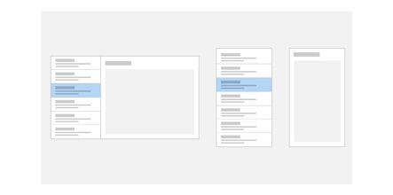
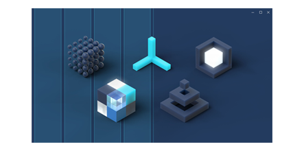

# Design basics for UWP apps

<ul class="panelContent cardsH" style="margin-left: 1px">
    <li>
        

            

                

                    

                        

                        
                        

                    
 
                    

                        <h3>[Introduction to UWP app design](design-and-ui-intro.md)</h3>
                        
An introduction to the UI features included in every UWP app and an overview of our documentation.

                    

                

            

        

    </li>
    <li>
        

            

                

                    

                        

                        
                        

                    

                    

                        <h3>[Fluent Design System overview](../fluent-design-system/index.md)</h3>
                        
The Fluent Design System is a set of innovative UWP features combined with best practices for creating apps that perform beautifully on all types of Windows-powered devices.

                    

                

            

        

    </li>
</ul>

<h2>App structure</h2>
<ul class="panelContent cardsH" style="margin-left: 1px">
    <li>
        

            

                

                    <!-- 

                        

                        
                        

                    
  -->
                    

                        <h3>[Navigation basics](navigation-basics.md)</h3>
                        
Navigation in UWP apps is based on a flexible model of navigation structures, navigation elements, and system-level features. This article introduces you to these components and shows you how to use them together to create a good navigation experience.

                    

                

            

        

    </li>
    <li>
        

            

                

                    <!-- 

                        

                        
                        

                    
  -->
                    

                        <h3>[Command basics](commanding-basics.md)</h3>
                        
Command elements are the interactive UI elements that enable the user to perform actions, such as sending an email, deleting an item, or submitting a form. This article describes the command elements, such as buttons and check boxes, the interactions they support, and the command surfaces (such as command bars and context menus) for hosting them.

                    

                

            

        

    </li>
    <li>
        

            

                

                    <!-- 

                        

                        
                        

                    
  -->
                    

                        <h3>[Content basics](content-basics.md)</h3>
                        
The main purpose of any app is to provide access to content: in a photo-editing app, the photo is the content; in a travel app, maps and info about travel destinations is the content; and so on. This article provides content design recommendations for the three content scenarios: consumption, creation, and interaction.

                    

                

            

        

    </li>
</ul>

<h2>Photo lab tutorials</h2>

Learn how to create a basic photo-editing application in XAML and C#.

<ul class="panelContent cardsH" style="margin-left: 1px">
    <li>
        

            

                

                    <!-- 

                        

                        
                        

                    
  -->
                    

                        <h3>[1. Create a basic UI](xaml-basics-ui.md)</h3>
                        
Use XAML to create a basic user interface.
 
                    

                

            

        

    </li>
    <li>
        

            

                

                    <!-- 

                        

                        
                        

                    
  -->
                    

                        <h3>[2. Create an adaptive layout](xaml-basics-adaptive-layout.md)</h3>
                        
Give the photo-editing application an adaptive layout.
 
                    

                

            

        

    </li>
    <li>
        

            

                

                    <!-- 

                        

                        
                        

                    
  -->
                    

                        <h3>[3. Create custom styles](xaml-basics-style.md)</h3>
                        
Give our UWP controls your own look and feel by creating custom styles.
  
                    

                

            

        

    </li>    
</ul>

