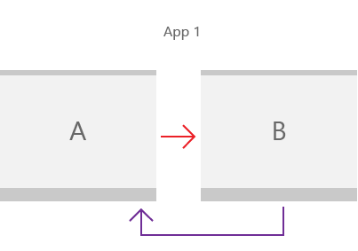

# Implement navigation between two pages

Learn how to use a frame and pages to enable basic peer-to-peer navigation in your app. 

> **Important APIs**: [**Windows.UI.Xaml.Controls.Frame**](/uwp/api/Windows.UI.Xaml.Controls.Frame) class, [**Windows.UI.Xaml.Controls.Page**](/uwp/api/Windows.UI.Xaml.Controls.Page) class, [**Windows.UI.Xaml.Navigation**](/uwp/api/Windows.UI.Xaml.Navigation) namespace



## 1. Create a blank app

1.  On the Microsoft Visual Studio menu, choose **File** > **New Project**.
2.  In the left pane of the **New Project** dialog box, choose the **Visual C#** > **Windows** > **Universal** or the **Visual C++** > **Windows** > **Universal** node.
3.  In the center pane, choose **Blank App**.
4.  In the **Name** box, enter **NavApp1**, and then choose the **OK** button.
    The solution is created, and the project files appear in **Solution Explorer**.
5.  To run the program, choose **Debug** > **Start Debugging** from the menu, or press F5.
    A blank page is displayed.
6.  To stop debugging and return to Visual Studio, exit the app, or click **Stop Debugging** from the menu.

## 2. Add basic pages

Next, add two pages to the project.

1.  In **Solution Explorer**, right-click the **BlankApp** project node to open the shortcut menu.
2.  Choose **Add** > **New Item** from the shortcut menu.
3.  In the **Add New Item** dialog box, choose **Blank Page** in the middle pane.
4.  In the **Name** box, enter **Page1** (or **Page2**) and press the **Add** button.
5. Repeat steps 1-4 to add the second page.

Now, these files should be listed as part of your NavApp1 project.

<table>
<thead>
<tr class="header">
<th align="left">C#</th>
<th align="left">C++</th>
</tr>
</thead>
<tbody>
<tr class="odd">
<td style="vertical-align:top;"><ul>
<li>Page1.xaml</li>
<li>Page1.xaml.cs</li>
<li>Page2.xaml</li>
<li>Page2.xaml.cs</li>
</ul></td>
<td style="vertical-align:top;"><ul>
<li>Page1.xaml</li>
<li>Page1.xaml.cpp</li>
<li>Page1.xaml.h</li>
<li>Page2.xaml</li>
<li>Page2.xaml.cpp</li>
<li>Page2.xaml.h

</li>
</ul></td>
</tr>
</tbody>
</table>

In Page1.xaml, add the following content:

-   A [**TextBlock**](/uwp/api/Windows.UI.Xaml.Controls.TextBlock) element named `pageTitle` as a child element of the root [**Grid**](/uwp/api/Windows.UI.Xaml.Controls.Grid). Change the [**Text**](/uwp/api/windows.ui.xaml.controls.textblock.text) property to `Page 1`.
```xaml
<TextBlock x:Name="pageTitle" Text="Page 1" />
```

-   A [**HyperlinkButton**](/uwp/api/Windows.UI.Xaml.Controls.HyperlinkButton) element as a child element of the root [**Grid**](/uwp/api/Windows.UI.Xaml.Controls.Grid) and after the `pageTitle` [**TextBlock**](/uwp/api/Windows.UI.Xaml.Controls.TextBlock) element.
```xaml
<HyperlinkButton Content="Click to go to page 2"
                 Click="HyperlinkButton_Click"
                 HorizontalAlignment="Center"/>
```

In the Page1.xaml code-behind file, add the following code to handle the `Click` event of the [**HyperlinkButton**](/uwp/api/Windows.UI.Xaml.Controls.HyperlinkButton) you added to navigate to Page2.xaml.

```csharp
private void HyperlinkButton_Click(object sender, RoutedEventArgs e)
{
    this.Frame.Navigate(typeof(Page2));
}
```

```cppwinrt
void Page1::HyperlinkButton_Click(Windows::Foundation::IInspectable const& sender, Windows::UI::Xaml::RoutedEventArgs const& args)
{
    Frame().Navigate(winrt::xaml_typename<NavApp1::Page2>());
}
```

```cpp
void Page1::HyperlinkButton_Click(Platform::Object^ sender, RoutedEventArgs^ e)
{
    this->Frame->Navigate(Windows::UI::Xaml::Interop::TypeName(Page2::typeid));
}
```

In Page2.xaml, add the following content:

-   A [**TextBlock**](/uwp/api/Windows.UI.Xaml.Controls.TextBlock) element named `pageTitle` as a child element of the root [**Grid**](/uwp/api/Windows.UI.Xaml.Controls.Grid). Change the value of the [**Text**](/uwp/api/windows.ui.xaml.controls.textblock.text) property to `Page 2`.
```xaml
<TextBlock x:Name="pageTitle" Text="Page 2" />
```

-   A [**HyperlinkButton**](/uwp/api/Windows.UI.Xaml.Controls.HyperlinkButton) element as a child element of the root [**Grid**](/uwp/api/Windows.UI.Xaml.Controls.Grid) and after the `pageTitle` [**TextBlock**](/uwp/api/Windows.UI.Xaml.Controls.TextBlock) element.
```xaml
<HyperlinkButton Content="Click to go to page 1" 
                 Click="HyperlinkButton_Click"
                 HorizontalAlignment="Center"/>
```

In the Page2.xaml code-behind file, add the following code to handle the `Click` event of the [**HyperlinkButton**](/uwp/api/Windows.UI.Xaml.Controls.HyperlinkButton) to navigate to Page1.xaml.

```csharp
private void HyperlinkButton_Click(object sender, RoutedEventArgs e)
{
    this.Frame.Navigate(typeof(Page1));
}
```

```cppwinrt
void Page2::HyperlinkButton_Click(Windows::Foundation::IInspectable const& sender, Windows::UI::Xaml::RoutedEventArgs const& args)
{
    Frame().Navigate(winrt::xaml_typename<NavApp1::Page1>());
}
```

```cpp
void Page2::HyperlinkButton_Click(Platform::Object^ sender, RoutedEventArgs^ e)
{
    this->Frame->Navigate(Windows::UI::Xaml::Interop::TypeName(Page1::typeid));
}
```

> [!NOTE]
> For C++ projects, you must add a `#include` directive in the header file of each page that references another page. For the inter-page navigation example presented here, page1.xaml.h file contains `#include "Page2.xaml.h"`, in turn, page2.xaml.h contains `#include "Page1.xaml.h"`.

Now that we've prepared the pages, we need to make Page1.xaml display when the app starts.

Open the App.xaml code-behind file and change the `OnLaunched` handler.

Here, we specify `Page1` in the call to [**Frame.Navigate**](/uwp/api/windows.ui.xaml.controls.frame.navigate) instead of `MainPage`.

```csharp
protected override void OnLaunched(LaunchActivatedEventArgs e)
{
    Frame rootFrame = Window.Current.Content as Frame;
 
    // Do not repeat app initialization when the Window already has content,
    // just ensure that the window is active
    if (rootFrame == null)
    {
        // Create a Frame to act as the navigation context and navigate to the first page
        rootFrame = new Frame();
        rootFrame.NavigationFailed += OnNavigationFailed;
 
        if (e.PreviousExecutionState == ApplicationExecutionState.Terminated)
        {
            //TODO: Load state from previously suspended application
        }
 
        // Place the frame in the current Window
        Window.Current.Content = rootFrame;
    }
 
    if (rootFrame.Content == null)
    {
        // When the navigation stack isn't restored navigate to the first page,
        // configuring the new page by passing required information as a navigation
        // parameter
        rootFrame.Navigate(typeof(Page1), e.Arguments);
    }
    // Ensure the current window is active
    Window.Current.Activate();
}
```

```cppwinrt
void App::OnLaunched(LaunchActivatedEventArgs const& e)
{
    Frame rootFrame{ nullptr };
    auto content = Window::Current().Content();
    if (content)
    {
        rootFrame = content.try_as<Frame>();
    }

    // Do not repeat app initialization when the Window already has content,
    // just ensure that the window is active
    if (rootFrame == nullptr)
    {
        // Create a Frame to act as the navigation context and associate it with
        // a SuspensionManager key
        rootFrame = Frame();

        rootFrame.NavigationFailed({ this, &App::OnNavigationFailed });

        if (e.PreviousExecutionState() == ApplicationExecutionState::Terminated)
        {
            // Restore the saved session state only when appropriate, scheduling the
            // final launch steps after the restore is complete
        }

        if (e.PrelaunchActivated() == false)
        {
            if (rootFrame.Content() == nullptr)
            {
                // When the navigation stack isn't restored navigate to the first page,
                // configuring the new page by passing required information as a navigation
                // parameter
                rootFrame.Navigate(xaml_typename<NavApp1::Page1>(), box_value(e.Arguments()));
            }
            // Place the frame in the current Window
            Window::Current().Content(rootFrame);
            // Ensure the current window is active
            Window::Current().Activate();
        }
    }
    else
    {
        if (e.PrelaunchActivated() == false)
        {
            if (rootFrame.Content() == nullptr)
            {
                // When the navigation stack isn't restored navigate to the first page,
                // configuring the new page by passing required information as a navigation
                // parameter
                rootFrame.Navigate(xaml_typename<NavApp1::Page1>(), box_value(e.Arguments()));
            }
            // Ensure the current window is active
            Window::Current().Activate();
        }
    }
}
```

```cpp
void App::OnLaunched(Windows::ApplicationModel::Activation::LaunchActivatedEventArgs^ e)
{
    auto rootFrame = dynamic_cast<Frame^>(Window::Current->Content);

    // Do not repeat app initialization when the Window already has content,
    // just ensure that the window is active
    if (rootFrame == nullptr)
    {
        // Create a Frame to act as the navigation context and associate it with
        // a SuspensionManager key
        rootFrame = ref new Frame();

        rootFrame->NavigationFailed += 
            ref new Windows::UI::Xaml::Navigation::NavigationFailedEventHandler(
                this, &App::OnNavigationFailed);

        if (e->PreviousExecutionState == ApplicationExecutionState::Terminated)
        {
            // TODO: Load state from previously suspended application
        }
        
        // Place the frame in the current Window
        Window::Current->Content = rootFrame;
    }

    if (rootFrame->Content == nullptr)
    {
        // When the navigation stack isn't restored navigate to the first page,
        // configuring the new page by passing required information as a navigation
        // parameter
        rootFrame->Navigate(Windows::UI::Xaml::Interop::TypeName(Page1::typeid), e->Arguments);
    }

    // Ensure the current window is active
    Window::Current->Activate();
}
```

> [!NOTE]
> The code here uses the return value of [**Navigate**](/uwp/api/windows.ui.xaml.controls.frame.navigate) to throw an app exception if the navigation to the app's initial window frame fails. When **Navigate** returns **true**, the navigation happens.

Now, build and run the app. Click the link that says "Click to go to page 2". The second page that says "Page 2" at the top should be loaded and displayed in the frame.

### About the Frame and Page classes

Before we add more functionality to our app, let's look at how the pages we added provide navigation within our app.

First, a [**Frame**](/uwp/api/Windows.UI.Xaml.Controls.Frame) called `rootFrame` is created for the app in the `App.OnLaunched` method in the App.xaml code-behind file. The **Frame** class supports various navigation methods such as [**Navigate**](/uwp/api/windows.ui.xaml.controls.frame.navigate), [**GoBack**](/uwp/api/windows.ui.xaml.controls.frame.goback), and [**GoForward**](/uwp/api/windows.ui.xaml.controls.frame.goforward), and properties such as [**BackStack**](/uwp/api/windows.ui.xaml.controls.frame.backstack), [**ForwardStack**](/uwp/api/windows.ui.xaml.controls.frame.forwardstack), and [**BackStackDepth**](/uwp/api/windows.ui.xaml.controls.frame.backstackdepth).
 
The [**Navigate**](/uwp/api/windows.ui.xaml.controls.frame.navigate) method is used to display content in this **Frame**. By default, this method loads MainPage.xaml. In our example, `Page1` is passed to the **Navigate** method, so the method loads `Page1` in the **Frame**. 

`Page1` is a subclass of the [**Page**](/uwp/api/Windows.UI.Xaml.Controls.Page) class. The **Page** class has a read-only **Frame** property that gets the **Frame** containing the **Page**. When the **Click** event handler of the **HyperlinkButton** in `Page1` calls `this.Frame.Navigate(typeof(Page2))`, the **Frame** displays the content of Page2.xaml.

Finally, whenever a page is loaded into the frame, that page is added as a [**PageStackEntry**](/uwp/api/Windows.UI.Xaml.Navigation.PageStackEntry) to the [**BackStack**](/uwp/api/windows.ui.xaml.controls.frame.backstack) or [**ForwardStack**](/uwp/api/windows.ui.xaml.controls.frame.forwardstack) of the [**Frame**](/uwp/api/windows.ui.xaml.controls.page.frame), allowing for [history and backwards navigation](navigation-history-and-backwards-navigation.md).

## 3. Pass information between pages

Our app navigates between two pages, but it really doesn't do anything interesting yet. Often, when an app has multiple pages, the pages need to share information. Let's pass some information from the first page to the second page.

In Page1.xaml, replace the **HyperlinkButton** you added earlier with the following [**StackPanel**](/uwp/api/Windows.UI.Xaml.Controls.StackPanel).

Here, we add a [**TextBlock**](/uwp/api/Windows.UI.Xaml.Controls.TextBlock) label and a [**TextBox**](/uwp/api/Windows.UI.Xaml.Controls.TextBox) `name` for entering a text string.

```xaml
<StackPanel>
    <TextBlock HorizontalAlignment="Center" Text="Enter your name"/>
    <TextBox HorizontalAlignment="Center" Width="200" Name="name"/>
    <HyperlinkButton Content="Click to go to page 2" 
                     Click="HyperlinkButton_Click"
                     HorizontalAlignment="Center"/>
</StackPanel>
```

In the `HyperlinkButton_Click` event handler of the Page1.xaml code-behind file, add a parameter referencing the `Text` property of the `name` **TextBox** to the `Navigate` method.

```csharp
private void HyperlinkButton_Click(object sender, RoutedEventArgs e)
{
    this.Frame.Navigate(typeof(Page2), name.Text);
}
```

```cppwinrt
void Page1::HyperlinkButton_Click(Windows::Foundation::IInspectable const& sender, Windows::UI::Xaml::RoutedEventArgs const& args)
{
    Frame().Navigate(winrt::xaml_typename<NavApp1::Page2>(), winrt::box_value(name().Text()));
}
```

```cpp
void Page1::HyperlinkButton_Click(Platform::Object^ sender, RoutedEventArgs^ e)
{
    this->Frame->Navigate(Windows::UI::Xaml::Interop::TypeName(Page2::typeid), name->Text);
}
```

In Page2.xaml, replace the **HyperlinkButton** you added earlier with the following **StackPanel**.

Here, we add a [**TextBlock**](/uwp/api/Windows.UI.Xaml.Controls.TextBlock) for displaying the text string passed from Page1.

```xaml
<StackPanel>
    <TextBlock HorizontalAlignment="Center" Name="greeting"/>
    <HyperlinkButton Content="Click to go to page 1" 
                     Click="HyperlinkButton_Click"
                     HorizontalAlignment="Center"/>
</StackPanel>
```

In the Page2.xaml code-behind file, add the following to override the `OnNavigatedTo` method:

```csharp
protected override void OnNavigatedTo(NavigationEventArgs e)
{
    if (e.Parameter is string && !string.IsNullOrWhiteSpace((string)e.Parameter))
    {
        greeting.Text = $"Hi, {e.Parameter.ToString()}";
    }
    else
    {
        greeting.Text = "Hi!";
    }
    base.OnNavigatedTo(e);
}
```

```cppwinrt
void Page2::OnNavigatedTo(Windows::UI::Xaml::Navigation::NavigationEventArgs const& e)
{
    auto propertyValue{ e.Parameter().as<Windows::Foundation::IPropertyValue>() };
    if (propertyValue.Type() == Windows::Foundation::PropertyType::String)
    {
        greeting().Text(L"Hi, " + winrt::unbox_value<winrt::hstring>(e.Parameter()));
    }
    else
    {
        greeting().Text(L"Hi!");
    }
    __super::OnNavigatedTo(e);
}
```

```cpp
void Page2::OnNavigatedTo(NavigationEventArgs^ e)
{
    if (dynamic_cast<Platform::String^>(e->Parameter) != nullptr)
    {
        greeting->Text = "Hi, " + e->Parameter->ToString();
    }
    else
    {
        greeting->Text = "Hi!";
    }
    ::Windows::UI::Xaml::Controls::Page::OnNavigatedTo(e);
}
```

Run the app, type your name in the text box, and then click the link that says **Click to go to page 2**. 

When the **Click** event of the **HyperlinkButton** in `Page1` calls `this.Frame.Navigate(typeof(Page2), name.Text)`, the `name.Text` property is passed to `Page2`, and the value from the event data is used for the message displayed on the page.

## 4. Cache a page

Page content and state is not cached by default, so if you'd like to cache information, you must enable it in each page of your app.

In our basic peer-to-peer example, there is no back button (we demonstrate back navigation in [backwards navigation](navigation-history-and-backwards-navigation.md)), but if you did click a back button on `Page2`, the **TextBox** (and any other field) on `Page1` would be set to its default state. One way to work around this is to use the [**NavigationCacheMode**](/uwp/api/windows.ui.xaml.controls.page.navigationcachemode) property to specify that a page be added to the frame's page cache. 

In the constructor of `Page1`, you can set **NavigationCacheMode** to **Enabled** to retains all content and state values for the page until the page cache for the frame is exceeded. Set [**NavigationCacheMode**](/uwp/api/windows.ui.xaml.controls.page.navigationcachemode) to [**Required**](/uwp/api/Windows.UI.Xaml.Navigation.NavigationCacheMode) if you want to ignore [**CacheSize**](/uwp/api/windows.ui.xaml.controls.frame.cachesize) limits, which specify the number of pages in the navigation history that can be cached for the frame. However, keep in mind that cache size limits might be crucial, depending on the memory limits of a device.

```csharp
public Page1()
{
    this.InitializeComponent();
    this.NavigationCacheMode = Windows.UI.Xaml.Navigation.NavigationCacheMode.Enabled;
}
```

```cppwinrt
Page1::Page1()
{
    InitializeComponent();
    NavigationCacheMode(Windows::UI::Xaml::Navigation::NavigationCacheMode::Enabled);
}
```

```cpp
Page1::Page1()
{
    this->InitializeComponent();
    this->NavigationCacheMode = Windows::UI::Xaml::Navigation::NavigationCacheMode::Enabled;
}
```

## Related articles
* [Navigation design basics for Windows apps](./navigation-basics.md)
* [Pivot](../controls-and-patterns/pivot.md)
* [Navigation view](../controls-and-patterns/navigationview.md)