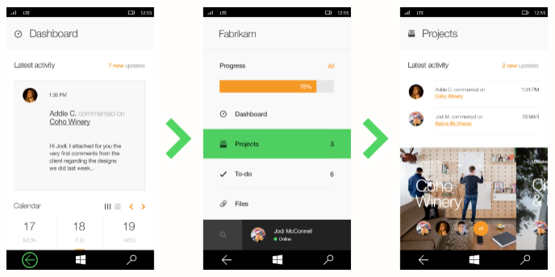
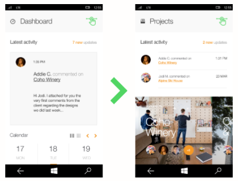
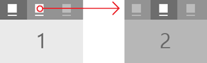
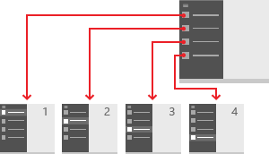

# Navigation design basics for UWP apps

If you think of an app as a collection of pages, the term *navigation* describes the act of moving between pages and within the page. It's the starting point of the user experience. It's how users find the content and features they're interested in. It's very important, and it can be difficult to get right. 

> **Important APIs**: [Frame](https://docs.microsoft.com/en-us/uwp/api/Windows.UI.Xaml.Controls.Frame), [Pivot class](https://docs.microsoft.com/en-us/uwp/api/Windows.UI.Xaml.Controls.Pivot), [NavigationView class](https://docs.microsoft.com/en-us/uwp/api/Windows.UI.Xaml.Controls.NavigationView)

Part of the reason it's difficult to get right is that, as app designers, we have a huge number of choices to make. If we were designing a book, our choices would be simple: what order do the chapters go in. With an app, we can create a navigation experience that mimics a book, requiring the user to go through a series of pages in order. Or we could provide a menu that lets the user jump directly to any page he or she wants--but if we have too many pages, we might overwhelm the user with choices. Or we could put everything on a single page and provide filtering mechanisms for viewing content. 

While there's no single navigation design that works for every app, there are a set of principles and guidelines you can follow to help you figure out the right design for your app. 

## Principles of good design 
Let's start with the basic principles that research has shown form the foundation of good navigation design: 

* Be consistent: Meet user expectations.
* Keep it simple: Don't do more than you need to.
* Keep it clean: Don't let navigation features get in the user's way.

### Be consistent 
Navigation should be consistent with user expectations, leaning on standard conventions  for icons, location and styling. 

For example, in the following illustration, you can see the spots where users will typically expect to find functionality, like the navigation pane and command bar. Different device families have their own conventions for navigational elements. For example,  the navigation pane typically appears on the left side of the screen for tablets, but up top for mobile devices.

<figure class="wdg-figure">
  
  <figcaption>Users expect to find certain UI elements in standard locations.</figcaption>
</figure> 

### Keep it simple
Another important factor in navigation design is the Hick-Hyman Law, often cited in relation to navigational options. This law encourages us to add fewer options to the menu. The more options there are, the slower user interactions with them will be, particularly when users are exploring a new app. 

<figure class="wdg-figure">
  
  <figcaption> On the left, notice there are fewer options for the  user to select, whereas on the right, there are several. The  Hick-Hyman Law indicates that the menu on the left will be  easier for users to understand and utilize.
</figcaption>
</figure> 

### Keep it clean
The final key characteristic of navigation is clean interaction, which refers to the physical way that users interact with navigation across a variety of contexts. This is one area where putting yourself in the users position will inform your design. Try to understand your user and their behaviors. For example, if you're designing a cooking app, you might consider providing easy access to a shopping list and a timer. 

## Three general rules
Now lets take our design principles--consistency, simplicity, and clean interaction--and use them to come up with some general rules. As with any rule of thumb, use them as starting points and tweak as needed. 

1. Avoid deep navigational hierarchies. How many levels of navigation are best for your users? A top-level navigation and one level beneath it is usually plenty. If you go beyond three levels of navigation, then you break the principle of simplicity. Even worse, you risk stranding your user in a deep hierarchy that they will have difficulty leaving.

2. Avoid too many navigational options. Three to six navigation elements per level are most common. If your navigation needs more than this, especially at the top level of your hierarchy, then you might consider splitting your app into multiple apps, since you may be trying to do too much in one place. Too many navigation elements in an app usually lead to inconsistent and unrelated objectives.

3. Avoid "pogo-sticking." Pogo-sticking occurs when there is related content, but navigating to it requires the user to go up a level and then down again. Pogo-sticking violates the principle of clean interaction by requiring unnecessary clicks or interactions to achieve an obvious goal—in this case, looking at related content in a series. (The exception to this rule is in search and browse, where pogo-sticking may be the only way to provide the diversity and depth required.)
<figure class="wdg-figure">
  
  <figcaption> Pogo-sticking to navigate through an app—the user has to go back (green back arrow)  to the main page in order to navigate to the “Projects” tab.
</figcaption>
</figure> 
<figure class="wdg-figure">
  
  <figcaption>You can resolve some pogo-sticking issues with an icon (note the swipe gesture in green).
</figcaption>
</figure> 

## Use the right structure 
Now that you're familiar with general navigation principles and rules, it's time to make the most important of all navigation decisions: how should you structure your app? There are two general structures: flat and hierarchal. 

### Flat/lateral
In a flat/lateral structure, pages exist side-by-side. You can go from on page to another in any order. 
<figure class="wdg-figure">
  
<figcaption>Pages arranged in a flat structure</figcaption>
</figure> 

Flat structures have many benefits: they're simple and they're easy to understand, and they let the user jump directly to a specific page without having to wade through intermediary pages.  In general, flat structures are great--but they don't work for every app. If your app has a lot of pages, a flat list can be overwhelming. If pages need to be viewed in a particular order, a flat structure doesn't work. 

We recommend using a flat structure when: 
<ul>
<li>The pages can be viewed in any order.</li>
<li>The pages are clearly distinct from each other and don't have an obvious parent/child relationship.</li>
<li>There are fewer than 8 pages in the group. 
When there are more than 7 pages in the group, it might be difficult for users to understand how the pages are unique or to understand their current location within the group. If you don't think that's an issue for your app, go ahead and make the pages peers. Otherwise, consider using a hierarchical structure to break the pages into two or more smaller groups. (A hub control can help you group pages into categories.)</li>
</ul>

### Hierarchical

In a hierarchical structure, pages are organized into a tree-like structure. Each child page has only one parent, but a parent can have one or more child pages. To reach a child page, you travel through the parent.

<figure class="wdg-figure">
  
<figcaption>Pages arranged in a hierarchy</figcaption>
</figure>

Hierarchical structures are good for organizing complex content that spans lots of pages or when pages should be viewed in a particular order. The downside is that hierarchical pages introduce some navigation overhead: the deeper the structure, the more clicks it takes for users to get from page to page. 

We recommend a hiearchical structure when: 
<ul>
<li>You expect the user to traverse the pages in a specific order. Arrange the hierarchy to enforce that order.</li>
<li>There is a clear parent-child relationship between one of the pages and the other pages in the group.</li>
<li>There are more than 7 pages in the group. 
When there are more than 7 pages in the group, it might be difficult for users to understand how the pages are unique or to understand their current location within the group. If you don't think that's an issue for your app, go ahead and make the pages peers. Otherwise, consider using a hierarchical structure to break the pages into two or more smaller groups. (A hub control can help you group pages into categories.)</li>
</ul>

### Combining structures
You don't have choose one structure or the other; many well-design apps use both flat and hierarchical structures:

These apps use flat structures for top-level pages that can be viewed in any order, and hierarchical structures for pages that have more complex relationships. 

If your navigation structure has multiple levels, we recommend that peer-to-peer navigation elements only link to the peers within their current subtree. Consider the following illustration, which shows a navigation structure that has three levels:

-   For level 1, the peer-to-peer navigation element should provide access to pages A, B, C, and D.
-   At level 2, the peer-to-peer navigation elements for the A2 pages should only link to the other A2 pages. They should not link to level 2 pages in the C subtree.

 

## Use the right controls

Once you've decided on a page structure, you need to decide how users navigate through those pages. UWP provides a variety of navigation controls to help you. Because these controls are available to every UWP app, using them helps ensure a consistent and reliable navigation experience. 

<table>
<tr>
	<th>Control</th>
	<th>Description</th>
</tr>
<tr>
	<td>[Frame](https://docs.microsoft.com/en-us/uwp/api/Windows.UI.Xaml.Controls.Frame)</td>
	<td>With few exceptions, any app that has multiple pages uses the frame. In a typical setup, the app has a main page that contains the frame and a primary navigation element, such as a navigation view control. When the user selects a page, the frame loads and displays it.</td>
</tr>
<tr>
	<td>[Tabs and pivot](../controls-and-patterns/tabs-pivot.md)  
	</td>
	<td>Displays a list of links to pages at the same level.

Use tabs/pivots when:

<ul>
<li>
There are 2-5 pages.

(You can use tabs/pivots when there are more than 5 pages, but it might be difficult to fit all the tabs/pivots on the screen.)
</li>
<li>You expect users to switch between pages frequently.</li>
</ul></td>
</tr>
<tr>
	<td>[Nav view](../controls-and-patterns/navigationview.md)  
	</td>
	<td>Displays a list of links to top-level pages.

Use a navigation pane when:

<ul>
<li>You don't expect users to switch between pages frequently.</li>
<li>You want to conserve space at the expense of slowing down navigation operations.</li>
<li>The pages exist at the top level.</li>
</ul></td>
</tr>
<tr>
<td>[Master/details](../controls-and-patterns/master-details.md)  
</td>
<td>Displays a list (master view) of item summaries. Selecting an item displays its corresponding items page in the details section.

Use the Master/details element when:

<ul>
<li>You expect users to switch between child items frequently.</li>
<li>You want to enable the user to perform high-level operations, such as deleting or sorting, on individual items or groups of items, and also want to enable the user to view or update the details for each item.</li>
</ul>

Master/details elements are well suited for email inboxes, contact lists, and data entry.

</td>
</tr>
<tr>
<td s>[Back](navigation-history-and-backwards-navigation.md)</td>
<td style="vertical-align:top;">Lets the user traverse the navigation history within an app and, depending on the device, from app to app. For more info, see the [Navigation history and backwards navigation article](navigation-history-and-backwards-navigation.md).</td>
</tr>
<tr class="odd">
<td>Hyperlinks and buttons</td>
<td>Content-embedded navigation elements appear in a page's content. Unlike other navigation elements, which should be consistent across the page's group or subtree, content-embedded navigation elements are unique from page to page.</td>
</tr>
</table>

## Next: Add navigation code to your app
The next article, [Implement basic navigation](navigate-between-two-pages.md), shows the XAML and code required to use a Frame control to enable basic navigation in your app. 

<!--
## History and the back button
UWP provides a back button and a system for traversing the user's navigation hsitory within an app. This system does most of the work for you, but there are a few APIs you need to call so that it works properly. For more info and instructions, see [History and backwards navigation](navigation-history-and-backwards-navigation.md). 
-->

