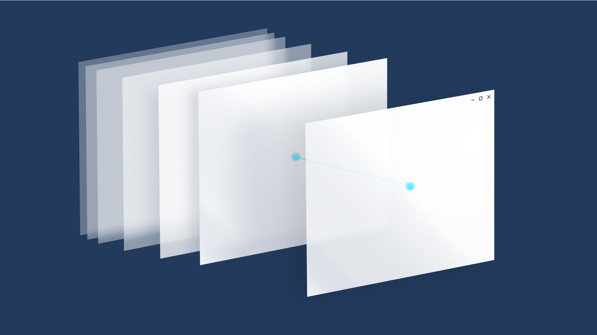
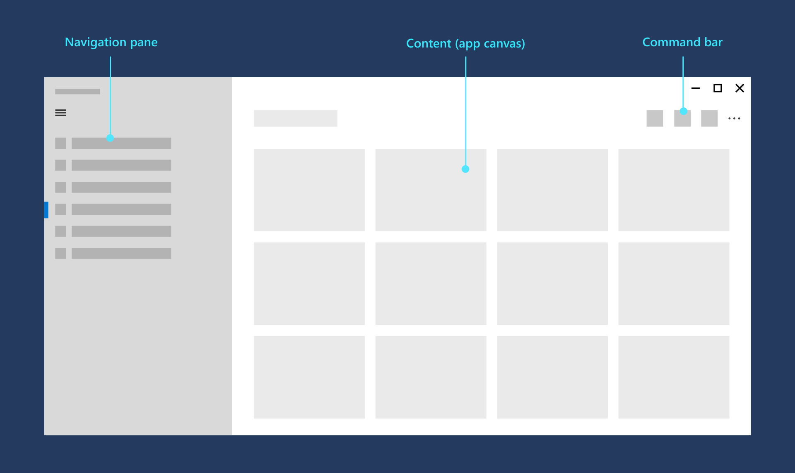
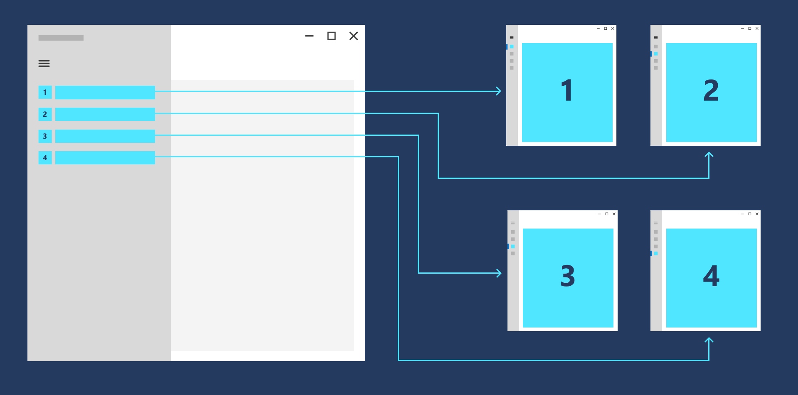
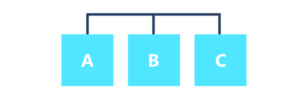

# Navigation design basics for Windows apps

If you think of an app as a collection of pages, *navigation* describes the act of moving between pages and within a page. It's the starting point of the user experience, and it's how users find the content and features they're interested in. It's very important, and it can be difficult to get right.

We have a huge number of choices to make for navigation. We could:

:::row:::
    :::column:::
        

Require users to go through a series of pages in order.
    :::column-end:::
	:::column:::
        

Provide a menu that allows users to jump directly to any page.
	:::column-end:::
	:::column:::
		

Place everything on a single page and provide filtering mechanisms for viewing content.
    :::column-end:::
:::row-end:::

While there's no single navigation design that works for every app, there are principles and guidelines to help you decide the right design for your app.

## Principles of good navigation

Let's start with the basic principles of good navigation design:

- **Consistency:** Meet user expectations.
- **Simplicity:** Don't do more than you need to.
- **Clarity:** Provide clear paths and options.

### Consistency

Navigation should be consistent with user expectations. Using [standard controls](#use-the-right-controls) that users are familiar with and following standard conventions for icons, location, and styling will make navigation predictable and intuitive for users.

> Users expect to find certain UI elements in standard locations.

### Simplicity

Fewer navigation items simplify decision making for users. Providing easy access to important destinations and hiding less important items will help users get where they want, faster.

:::row:::
    :::column:::
        

		

Present navigation items in a familiar navigation menu.
    :::column-end:::
	:::column:::
        

		

Overwhelm users with many navigation options.
	:::column-end:::
:::row-end:::

### Clarity

Clear paths allow for logical navigation for users. Making navigation options obvious and clarifying relationships between pages should prevent users from getting lost.

> Destinations are clearly labeled so users know where they are.

## General recommendations

Now, let's take our design principles--consistency, simplicity, and clarity--and use them to come up with some general recommendations.

1. Think about your users. Trace out typical paths they might take through your app, and for each page, think about why the user is there and where they might want to go.

2. Avoid deep navigation hierarchies. If you go beyond three levels of navigation, you risk stranding your user in a deep hierarchy that they will have difficulty leaving.

3. Avoid "pogo-sticking." Pogo-sticking occurs when there is related content, but navigating to it requires the user to go up a level and then down again.

## Use the right structure

Now that you're familiar with general navigation principles, how should you structure your app? There are two general structures: flat and hierarchal.

:::row:::
    :::column:::
        
    :::column-end:::
	:::column span="2":::
        ### Flat/lateral

In a flat/lateral structure, pages exist side-by-side. You can go from one page to another in any order.

We recommend using a flat structure when:

- The pages can be viewed in any order.
- The pages are clearly distinct from each other and don't have an obvious parent/child relationship.
- There are less than 8 pages in the group.  
(When there are more pages, it might be difficult for users to understand how the pages are unique or to understand their current location within the group. If you don't think that's an issue for your app, go ahead and make the pages peers. Otherwise, consider using a hierarchical structure to break the pages into two or more smaller groups.)

    :::column-end:::
:::row-end:::

:::row:::
    :::column:::
        
    :::column-end:::
	:::column span="2":::
        ### Hierarchical

In a hierarchical structure, pages are organized into a tree-like structure. Each child page has one parent, but a parent can have one or more child pages. To reach a child page, you travel through the parent.

Hierarchical structures are good for organizing complex content that spans lots of pages. The downside is some navigation overhead: the deeper the structure, the more clicks it takes to get from page to page.

We recommend a hierarchical structure when:
		
- Pages should be traversed in a specific order.
- There is a clear parent-child relationship between pages.
- There are more than 7 pages in the group.
		
    :::column-end:::
:::row-end:::

:::row:::
    :::column:::
        
    :::column-end:::
	:::column span="2":::
        ### Combining structures

You don't have to choose one structure or the other; many well-design apps use both. An app can use flat structures for top-level pages that can be viewed in any order, and hierarchical structures for pages that have more complex relationships.

If your navigation structure has multiple levels, we recommend that peer-to-peer navigation elements only link to the peers within their current subtree. Consider the adjacent illustration, which shows a navigation structure that has two levels:

- At level 1, the peer-to-peer navigation element should provide access to pages A, B, C, and D.
- At level 2, the peer-to-peer navigation elements for the A2 pages should only link to the other A2 pages. They should not link to level 2 pages in the C subtree.
    :::column-end:::
:::row-end:::

## Use the right controls

Once you've decided on a page structure, you need to decide how users navigate through those pages. UWP provides a variety of navigation controls to help ensure a consistent, reliable navigation experience in your app.

:::row:::
    :::column:::
        
    :::column-end:::
	:::column span="2":::
        [**Frame**](/uwp/api/Windows.UI.Xaml.Controls.Frame)

With few exceptions, any app that has multiple pages uses a frame. Typically, an app has a main page that contains the frame and a primary navigation element, such as a navigation view control. When the user selects a page, the frame loads and displays it.
:::row-end:::

:::row:::
    :::column:::
        
    :::column-end:::
	:::column span="2":::
        [**Top navigation**](../controls-and-patterns/navigationview.md)

Displays a horizontal list of links to pages at the same level. The [NavigationView](../controls-and-patterns/navigationview.md) control implements the top navigation pattern.
        
Use top navigation when:

- You want to show all navigation options on the screen.
- You desire more space for your app's content.
- Icons cannot clearly describe your navigation categories.

:::row-end:::

:::row:::
    :::column:::
        
    :::column-end:::
	:::column span="2":::
        [**Tabs**](../controls-and-patterns/tab-view.md)

Displays a horizontal set of tabs and their respective content. The [TabView](../controls-and-patterns/tab-view.md) control is useful for displaying several pages (or documents) while giving the user the capability to rearrange, open, or close tabs.
	
Use tabs when:

- You want users to be able to dynamically open, close, or rearrange tabs.
- You expect that there might be a large number of tabs open at once.
- You expect users to be able to easily move tabs between windows in your application that use tabs, similar to web browsers like Microsoft Edge.

:::row-end:::

:::row:::
    :::column:::
         
    :::column-end:::
        :::column span="2":::
	[**Pivot**](../controls-and-patterns/pivot.md)
	
Similar to [Navigation View](../controls-and-patterns/navigationview.md), but with additional support for touch and slightly different navigation behavior.
	
Use a pivot when:
- You want your app to allow touch-swiping between categories
- You want navigation options to carousel infintely
- You do not need extensive control over navigation behavior between categories

:::row-end:::

:::row:::
    :::column:::
        
    :::column-end:::
	:::column span="2":::
        [**Left navigation**](../controls-and-patterns/navigationview.md)

Displays a vertical list of links to top-level pages. Use when:
		
- The pages exist at the top level.
- There are many navigation items (more than 5)
- You don't expect users to switch between pages frequently.

:::row-end:::
		
:::row:::
    :::column:::
        
    :::column-end:::
	:::column span="2":::
        [**Master/details**](../controls-and-patterns/master-details.md)

Displays a list (master view) of items. Selecting an item displays its corresponding page in the details section. Use when:
		
- You expect users to switch between child items frequently.
- You want to enable the user to perform high-level operations, such as deleting or sorting, on individual items or groups of items, and also want to enable the user to view or update the details for each item.

Master/details is well suited for email inboxes, contact lists, and data entry.
:::row-end:::

:::row:::
    :::column:::
        
    :::column-end:::
	:::column span="2":::
        [**Hyperlinks**](../controls-and-patterns/hyperlinks.md)

Embedded navigation elements can appear in a page's content. Unlike other navigation elements, which should be consistent across the pages, content-embedded navigation elements are unique from page to page.
:::row-end:::

## Next: Add navigation code to your app

The next article, [Implement basic navigation](navigate-between-two-pages.md), shows the code required to use a Frame control to enable basic navigation between two pages in your app.