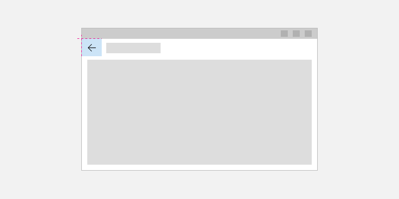
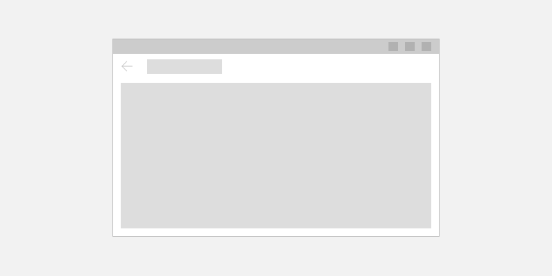

# Navigation history and backwards navigation for Windows apps

> **Important APIs**: [BackRequested event](/uwp/api/Windows.UI.Core.SystemNavigationManager.BackRequested), [SystemNavigationManager class](/uwp/api/Windows.UI.Core.SystemNavigationManager), [OnNavigatedTo](/uwp/api/windows.ui.xaml.controls.page.onnavigatedto#Windows_UI_Xaml_Controls_Page_OnNavigatedTo_Windows_UI_Xaml_Navigation_NavigationEventArgs_)

The Windows app provides a consistent back navigation system for traversing the user's navigation history within an app and, depending on the device, from app to app.

To implement backwards navigation in your app, place a [back button](#back-button) at the top left corner of your app's UI. If your app uses the [NavigationView](../controls-and-patterns/navigationview.md) control, then you can use [NavigationView's built-in back button](../controls-and-patterns/navigationview.md#backwards-navigation).

The user expects the back button to navigate to the previous location in the app's navigation history. Note that it's up to you to decide which navigation actions to add to the navigation history and how to respond to the back button press.

## Back button

To create a back button, use the [Button](../controls-and-patterns/buttons.md) control with the `NavigationBackButtonNormalStyle` style, and place the button at the top left hand corner of your app's UI (for details, see the XAML code examples below).



```xaml
<Page>
    <Grid>
        <Grid.RowDefinitions>
            <RowDefinition Height="Auto"/>
            <RowDefinition Height="*"/>
        </Grid.RowDefinitions>

        <Button Style="{StaticResource NavigationBackButtonNormalStyle}"/>

    </Grid>
</Page>
```

If your app has a top [CommandBar](../controls-and-patterns/app-bars.md), the Button control that is 44px in height will not align with 48px AppBarButtons very nicely. However, to avoid inconsistency, align the top of the Button control inside the 48px bounds.


```xaml
<Page>
    <Grid>
        <Grid.RowDefinitions>
            <RowDefinition Height="Auto"/>
            <RowDefinition Height="*"/>
        </Grid.RowDefinitions>
        
        <CommandBar>
            <CommandBar.Content>
                <Button Style="{StaticResource NavigationBackButtonNormalStyle}" VerticalAlignment="Top"/>
            </CommandBar.Content>
	    
            <AppBarButton Icon="Delete" Label="Delete"/>
            <AppBarButton Icon="Save" Label="Save"/>
        </CommandBar>
    </Grid>
</Page>
```

In order to minimize UI elements moving around in your app, show a disabled back button when there is nothing in the backstack (see code example below). However, if you expect your app will never have a backstack, you don’t need to display the back button at all.



## Code example

The following code example demonstrates how to implement backwards navigation behavior with a back button. The code responds to the Button [**Click**](/uwp/api/windows.ui.xaml.controls.primitives.buttonbase.Click) event and disables/enables the button visibility in [**OnNavigatedTo**](/uwp/api/windows.ui.xaml.controls.page.onnavigatedto#Windows_UI_Xaml_Controls_Page_OnNavigatedTo_Windows_UI_Xaml_Navigation_NavigationEventArgs_), which is called when navigating to a new page. The code example also handles inputs from hardware and software system back keys by registering a listener for the [**BackRequested**](/uwp/api/windows.ui.core.systemnavigationmanager.BackRequested) event.

```xaml
<!-- MainPage.xaml -->
<Page x:Class="AppName.MainPage">
...
<Button x:Name="BackButton" Click="Back_Click" Style="{StaticResource NavigationBackButtonNormalStyle}"/>
...
<Page/>
```

Code-behind:

```csharp
// MainPage.xaml.cs
public MainPage()
{
    KeyboardAccelerator GoBack = new KeyboardAccelerator();
    GoBack.Key = VirtualKey.GoBack;
    GoBack.Invoked += BackInvoked;
    KeyboardAccelerator AltLeft = new KeyboardAccelerator();
    AltLeft.Key = VirtualKey.Left;
    AltLeft.Invoked += BackInvoked;
    this.KeyboardAccelerators.Add(GoBack);
    this.KeyboardAccelerators.Add(AltLeft);
    // ALT routes here
    AltLeft.Modifiers = VirtualKeyModifiers.Menu;
}

protected override void OnNavigatedTo(NavigationEventArgs e)
{
    BackButton.IsEnabled = this.Frame.CanGoBack;
}

private void Back_Click(object sender, RoutedEventArgs e)
{
    On_BackRequested();
}

// Handles system-level BackRequested events and page-level back button Click events
private bool On_BackRequested()
{
    if (this.Frame.CanGoBack)
    {
        this.Frame.GoBack();
        return true;
    }
    return false;
}

private void BackInvoked (KeyboardAccelerator sender, KeyboardAcceleratorInvokedEventArgs args)
{
    On_BackRequested();
    args.Handled = true;
}
```

```cppwinrt
// MainPage.cpp
#include "pch.h"
#include "MainPage.h"

#include "winrt/Windows.System.h"
#include "winrt/Windows.UI.Xaml.Controls.h"
#include "winrt/Windows.UI.Xaml.Input.h"
#include "winrt/Windows.UI.Xaml.Navigation.h"

using namespace winrt;
using namespace Windows::Foundation;
using namespace Windows::UI::Xaml;

namespace winrt::PageNavTest::implementation
{
    MainPage::MainPage()
    {
        InitializeComponent();

        Windows::UI::Xaml::Input::KeyboardAccelerator goBack;
        goBack.Key(Windows::System::VirtualKey::GoBack);
        goBack.Invoked({ this, &MainPage::BackInvoked });
        Windows::UI::Xaml::Input::KeyboardAccelerator altLeft;
        altLeft.Key(Windows::System::VirtualKey::Left);
        altLeft.Invoked({ this, &MainPage::BackInvoked });
        KeyboardAccelerators().Append(goBack);
        KeyboardAccelerators().Append(altLeft);
        // ALT routes here.
        altLeft.Modifiers(Windows::System::VirtualKeyModifiers::Menu);
    }

    void MainPage::OnNavigatedTo(Windows::UI::Xaml::Navigation::NavigationEventArgs const& e)
    {
        BackButton().IsEnabled(Frame().CanGoBack());
    }

    void MainPage::Back_Click(IInspectable const&, RoutedEventArgs const&)
    {
        On_BackRequested();
    }

    // Handles system-level BackRequested events and page-level back button Click events.
    bool MainPage::On_BackRequested()
    {
        if (Frame().CanGoBack())
        {
            Frame().GoBack();
            return true;
        }
        return false;
    }

    void MainPage::BackInvoked(Windows::UI::Xaml::Input::KeyboardAccelerator const& sender,
	    Windows::UI::Xaml::Input::KeyboardAcceleratorInvokedEventArgs const& args)
    {
        args.Handled(On_BackRequested());
    }
}
```

Above, we handle backwards navigation for a single page. You can handle navigation in each page if you want to exclude specific pages from back navigation, or you want to execute page-level code before displaying the page.

To handle backwards navigation for an entire app, you'll register a global listener for the [**BackRequested**](/uwp/api/windows.ui.core.systemnavigationmanager.BackRequested) event in the `App.xaml` code-behind file.

App.xaml code-behind:

```csharp
// App.xaml.cs
Windows.UI.Core.SystemNavigationManager.GetForCurrentView().BackRequested += App_BackRequested;
Frame rootFrame = Window.Current.Content as Frame;
rootFrame.PointerPressed += On_PointerPressed;

private void App_BackRequested(object sender, Windows.UI.Core.BackRequestedEventArgs e)
{
    e.Handled = On_BackRequested();
}

private void On_PointerPressed(object sender, PointerRoutedEventArgs e)
{
    bool isXButton1Pressed =
	    e.GetCurrentPoint(sender as UIElement).Properties.PointerUpdateKind == PointerUpdateKind.XButton1Pressed;

    if (isXButton1Pressed)
    {
        e.Handled = On_BackRequested();
    }
}

private bool On_BackRequested()
{
    Frame rootFrame = Window.Current.Content as Frame;
    if (rootFrame.CanGoBack)
    {
        rootFrame.GoBack();
        return true;
    }
    return false;
}
```

```cppwinrt
// App.cpp
#include <winrt/Windows.UI.Core.h>
#include "winrt/Windows.UI.Input.h"
#include "winrt/Windows.UI.Xaml.Input.h"

#include "App.h"
#include "MainPage.h"

using namespace winrt;
...

    Windows::UI::Core::SystemNavigationManager::GetForCurrentView().BackRequested({ this, &App::App_BackRequested });
    Frame rootFrame{ nullptr };
    auto content = Window::Current().Content();
    if (content)
    {
        rootFrame = content.try_as<Frame>();
    }
    rootFrame.PointerPressed({ this, &App::On_PointerPressed });
...

void App::App_BackRequested(IInspectable const& /* sender */, Windows::UI::Core::BackRequestedEventArgs const& e)
{
    e.Handled(On_BackRequested());
}

void App::On_PointerPressed(IInspectable const& sender, Windows::UI::Xaml::Input::PointerRoutedEventArgs const& e)
{
    bool isXButton1Pressed =
	    e.GetCurrentPoint(sender.as<UIElement>()).Properties().PointerUpdateKind() == Windows::UI::Input::PointerUpdateKind::XButton1Pressed;

    if (isXButton1Pressed)
    {
        e.Handled(On_BackRequested());
    }
}

// Handles system-level BackRequested events.
bool App::On_BackRequested()
{
    if (Frame().CanGoBack())
    {
        Frame().GoBack();
        return true;
    }
    return false;
}
```

## Optimizing for different device and form factors

This backwards navigation design guidance is applicable to all devices, but different device and form factors may benefit from optimization. This also depends on the hardware back button supported by different shells.

- **Phone/Tablet**: A hardware or software back button is always present on mobile and tablet, but we recommend drawing an in-app back button for clarity.
- **Desktop/Hub**: Draw the in-app back button on the top left corner of your app's UI.
- **Xbox/TV**: Do not draw a back button, for it will add unnecessary UI clutter. Instead, rely on the Gamepad B button to navigate backwards.

If your app will run on multiple devices, [create a custom visual trigger for Xbox](../devices/designing-for-tv.md#custom-visual-state-trigger-for-xbox) to toggle the visibility of button. The NavigationView control will automatically toggle the back button's visibility if your app is running on Xbox. 

We recommend supporting the following inputs for back navigation. (Note that some of these inputs are not supported by the system BackRequested and must be handled by separate events.)

| Input | Event |
| --- | --- |
| Windows-Backspace key | BackRequested |
| Hardware back button | BackRequested |
| Shell tablet mode back button | BackRequested |
| VirtualKey.XButton1 | PointerPressed |
| VirtualKey.GoBack | KeyboardAccelerator.BackInvoked |
| Alt+LeftArrow key | KeyboardAccelerator.BackInvoked |

The code examples provided above demonstrate how to handle all of these inputs.

## System back behavior for backward compatibilities

Previously, UWP apps used [AppViewBackButtonVisibility](/uwp/api/windows.ui.core.appviewbackbuttonvisibility) for backwards navigation. The API will continue to be supported to ensure backward compatibility, but we no longer recommend relying on [AppViewBackButtonVisibility](/uwp/api/windows.ui.core.appviewbackbuttonvisibility). Instead, your app should draw its own in-app back button.

If your app continues using [AppViewBackButtonVisibility](/uwp/api/windows.ui.core.appviewbackbuttonvisibility), then the system UI will render the system back button inside the title bar. (The appearance and user interactions for the back button are unchanged from previous builds.)


## Guidelines for custom back navigation behavior

If you choose to provide your own back stack navigation, the experience should be consistent with other apps. We recommend that you follow the following patterns for navigation actions:

<div class="mx-responsive-img">
<table>
<thead>
<tr class="header">
<th align="left">Navigation action</th>
<th align="left">Add to navigation history?</th>
</tr>
</thead>
<tbody>
<tr class="odd">
<td style="vertical-align:top;"><strong>Page to page, different peer groups</strong></td>
<td style="vertical-align:top;"><strong>Yes</strong>
<p>In this illustration, the user navigates from level 1 of the app to level 2, crossing peer groups, so the navigation is added to the navigation history.</p>
<p></p>
<p>In the next illustration, the user navigates between two peer groups at the same level, again crossing peer groups, so the navigation is added to the navigation history.</p>
<p></p></td>
</tr>
<tr class="even">
<td style="vertical-align:top;"><strong>Page to page, same peer group, no on-screen navigation element</strong>
<p>The user navigates from one page to another with the same peer group. There is no on-screen navigation element (such as <a href="https://docs.microsoft.com/windows/uwp/design/controls-and-patterns/navigationview">NavigationView</a>) that provides direct navigation to both pages.</p></td>
<td style="vertical-align:top;"><strong>Yes</strong>
<p>In the following illustration, the user navigates between two pages in the same peer group, and the navigation should be added to the navigation history.</p>
<p></p></td>
</tr>
<tr class="odd">
<td style="vertical-align:top;"><strong>Page to page, same peer group, with an on-screen navigation element</strong>
<p>The user navigates from one page to another in the same peer group. Both pages are shown in the same navigation element, such as <a href="https://docs.microsoft.com/windows/uwp/design/controls-and-patterns/navigationview">NavigationView</a>.</p></td>
<td style="vertical-align:top;"><strong>It depends</strong>
<p>Yes, add to the navigation history, with two notable exceptions. If you expect users of your app to switch between pages in the peer group frequently, or if you wish to preserve the navigational hierarchy, then do not add to the navigation history. In this case, when the user presses back, go back to the last page before the user navigated to the current peer group. </p>
<p></p></td>
</tr>
<tr class="even">
<td style="vertical-align:top;"><strong>Show a transient UI</strong>
<p>The app displays a pop-up or child window, such as a dialog, splash screen, or on-screen keyboard, or the app enters a special mode, such as multiple selection mode.</p></td>
<td style="vertical-align:top;"><strong>No</strong>
<p>When the user presses the back button, dismiss the transient UI (hide the on-screen keyboard, cancel the dialog, etc) and return to the page that spawned the transient UI.</p>
<p></p></td>
</tr>
<tr class="odd">
<td style="vertical-align:top;"><strong>Enumerate items</strong>
<p>The app displays content for an on-screen item, such as the details for the selected item in master/details list.</p></td>
<td style="vertical-align:top;"><strong>No</strong>
<p>Enumerating items is similar to navigating within a peer group. When the user presses back, navigate to the page that preceded the current page that has the item enumeration.</p>
<p></p></td>
</tr>
</tbody>
</table>
</div>

### Resuming

When the user switches to another app and returns to your app, we recommend returning to the last page in the navigation history.

## Related articles

- [Navigation basics](navigation-basics.md)